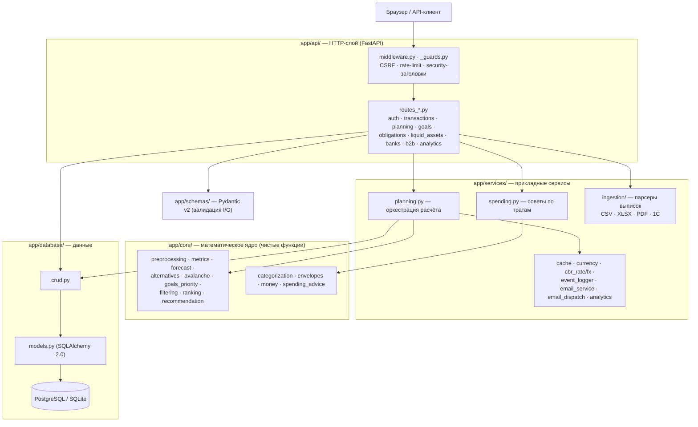
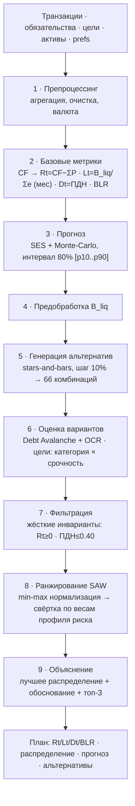

# FINPILOT — СППР для персональных финансов

[](https://github.com/vevdokimovm/personal-finance-dss/actions/workflows/ci.yml)


**FINPILOT** — система поддержки принятия решений (СППР), которая отвечает на один вопрос,
с которым человек остаётся один на один каждый месяц: **«у меня освободились деньги — куда
их направить?»** Гасить долг? Откладывать в резерв? Вкладывать в цель? Приложение
распределяет свободный денежный поток между этими направлениями **обоснованно** — на
многокритериальной оптимизации, а не на интуиции.

Ключевой принцип — **объяснимость**. Каждая рекомендация сопровождается человеческим
«почему», без формул и жаргона. А если денег на безопасное распределение не хватает —
алгоритм честно отказывается советовать (fail-loud), а не подгоняет красивую цифру.

> **Зачем это вообще.** Распределение свободных денег — классическая задача с конфликтом
> критериев: погасить дорогой долг выгодно по процентам, но опасно без подушки; копить на
> цель приятно, но бессмысленно, когда сверху висит кредитка под 25%. Человек решает это
> «на ощущения». FINPILOT решает это как **алгоритм многокритериального выбора** — и
> показывает свою работу.

---

## Содержание

- [Демо за 30 секунд](#демо-за-30-секунд)
- [Как это работает](#как-это-работает)
- [Возможности](#возможности)
- [История версий](#история-версий)
- [Технологии](#технологии)
- [Быстрый старт](#быстрый-старт)
- [Тестирование и качество](#тестирование-и-качество)
- [API](#api)
- [Безопасность](#безопасность)
- [Структура проекта](#структура-проекта)
- [Документация](#документация)
- [Лицензия](#лицензия)

---

## Демо за 30 секунд

Запустите проект ([Быстрый старт](#быстрый-старт)) и в боковой панели выберите один из
**шести готовых портретов пользователей** — от студента с микрозаймом до семьи 56 лет с
ипотекой. Данные не зашиты: они пересчитываются **реальным движком** в реальном времени, и
вы сразу видите распределение, прогноз и обоснование под конкретную ситуацию.

Это самый быстрый способ понять продукт: один клик — и перед вами полный расчётный цикл на
живых данных.

---

## Как это работает

### Архитектура: слоистый монолит с однонаправленными зависимостями

HTTP → сервисы → ядро/БД. Ядро (`app/core/`) не знает ни про веб, ни про базу — это чистые
функции над переданными данными. Именно поэтому его можно тестировать изолированно и
переиспользовать (тот же движок обслуживает и веб-UI, и B2B-API).



### Алгоритм: стек именованных методов, а не одна формула

Рекомендация — это не «магическая функция», а **девятишаговый конвейер** прозрачных
методов. Каждый шаг отвечает за свою часть: учёт → прогноз → выбор → объяснение.



**Что под капотом ядра:**

- **SAW (Simple Additive Weighting)** — многокритериальное ранжирование 66 альтернатив
  распределения (шаг дискретизации 10%) по 5 профилям риска: каждый профиль — свой вектор
  весов критериев (ресурс, ликвидность, долговая нагрузка, прогресс целей).
- **Debt Avalanche + opportunity-cost rate** — фильтр досрочного погашения: гасить имеет
  смысл только долг, чья ставка выше альтернативной доходности резерва (динамический
  `r_bench` = ключевая ставка ЦБ × (1 − НДФЛ)).
- **Stock-based ликвидность** `Lt = B_liq / Σe` — месяцы автономии (сколько продержишься
  без дохода), ортогональна потоковому ресурсу `Rt`.
- **SES + Monte-Carlo** — прогноз баланса и свободных денег с доверительным интервалом 80%
  (p10–p90) и алертом прогнозного дефицита.
- **Жёсткие инварианты** — `Rt ≥ 0` (нельзя уйти в минус по потоку) и `ПДН ≤ 0.40`
  (показатель долговой нагрузки), которые отсекают опасные варианты до ранжирования.

Полный разбор: [`docs/math_model_v3_0_0.md`](docs/math_model_v3_0_0.md) (каноническая модель,
источник истины по параметрам), [`docs/algorithm_stack.md`](docs/algorithm_stack.md) (как это
работает по шагам в коде), [`docs/diagrams.md`](docs/diagrams.md) (8 диаграмм: слои, ER,
конвейер ядра, поток `/calculate`, развёртывание, middleware, аутентификация, карта фронта).

---

## Возможности

- **Рекомендация распределения** свободного денежного потока с ранжированием альтернатив
  (SAW, 5 профилей риска) и человеческим объяснением выбора.
- **Прогноз** баланса и свободных денег на горизонт (SES + Monte-Carlo) с алертом дефицита.
- **Импорт выписок** — CSV, XLSX, PDF (Тинькофф, Сбер, ВТБ, Райффайзен, Альфа),
  `1CClientBankExchange` — с автокатегоризацией и надёжной пакетной загрузкой больших файлов.
- **Категоризация транзакций** — детерминированный rules-engine (13 категорий, ключевые
  слова + MCC), без ML.
- **Категорийные бюджеты** (план-факт), разрез расходов по категориям и мерчантам,
  временны́е тренды и goal-aware советы (связь экономии с дедлайнами целей).
- **Сценарии «что если»** — пересчёт рекомендации под гипотетические доход/расходы.
- **История планов** — снапшоты рассчитанных рекомендаций с возможностью вернуться.
- **Экспорт** — финансовый отчёт в PDF (кириллица), операции и план в CSV/XLSX.
- **Мультивалюта** — суммы в своей валюте, приведение к базовой через курсы ЦБ РФ.
- **Светлая и тёмная темы**, адаптивный интерфейс, доступность по WCAG 2.1 AA.

---

## История версий

Проект прошёл четыре крупные эпохи — от математического MVP до production-ready SaaS:

### v1.x.x — ядро СППР (фундамент)

Однопользовательский MVP, в котором родилась суть продукта: **математическое ядро**
многокритериальной оптимизации (SAW + Debt Avalanche + Monte-Carlo), 5 профилей риска,
генерация и ранжирование альтернатив распределения, базовый веб-интерфейс на Jinja2.
Здесь же — чистое разделение ядра и веба, которое держится до сих пор.

### v2.x.x — продуктовое дозревание (single-user)

Слой вокруг ядра, превращающий движок в пользуемый продукт: импорт банковских выписок и
автокатегоризация, категорийные бюджеты (план-факт), прогноз по тратам, конверты
ликвидности, светлая/тёмная темы, симметричный undo («Вернуть») на всех сущностях,
cache-busting статики и совместимость 204-ответов с WebKit.

### v3.x.x — международный / многопользовательский режим (MAJOR — 3.0.0)

Ломающий релиз, открывший дорогу к SaaS. Ядро СППР **не тронуто** — обвязка вокруг него
переписана под мультипользовательскую модель:

- **Аутентификация** (JWT + bcrypt) и **изоляция данных** по пользователю; при первом входе
  данные анонимного режима «усыновляются» — переход single→multi без потери.
- **Мультивалюта** — суммы в своей валюте, приведение к базовой через таблицу курсов (USD-пивот).
- **Денежная точность** — все суммы на `Decimal`/`numeric(14,2)`, ставки `numeric(6,4)`;
  никаких ошибок округления `float`.
- **Provider-agnostic ingestion** — каноническая модель `FinancialSnapshot` развязывает
  движок от источника данных (`FinanceEngine` Protocol): новая страна = новый провайдер,
  ядро не меняется.
- **Open Banking (Plaid)** для US/CA и **B2B API** `/v1/analyze` — партнёр присылает снимок
  финансов, получает рекомендацию. Опционально, по умолчанию выключены.

### v4.x.x — production-hardening (текущая эпоха)

Подготовка к коммерческому запуску — закрытие блокеров безопасности, права и надёжности до
уровня серьёзного финпродукта:

- **Юридический блок** — юрлицо, политика конфиденциальности, согласие на ПДн,
  пользовательское соглашение, дисклеймеры (152-ФЗ / 39-ФЗ).
- **Безопасность** — блокировка аккаунта после неудачных входов, fail-loud валидация
  прод-конфигурации (старт падает при дефолтных секретах), восстановление пароля по токену.
- **Приватность** — шифрование чувствительных полей (Fernet), аудит доступа к PII, полное
  удаление данных пользователя (152-ФЗ).
- **Наблюдаемость** — `/health`, JSON-логи, request_id, Sentry.
- **Надёжность данных** — production-контейнеризация, бэкапы + verify-restore,
  PostgreSQL-матрица в CI, история планов (снапшоты).
- **Качество** — трёхкатегорийная система тестов (fast/full/deep), property-based тесты на
  инварианты ядра, browser-E2E на критичные флоу, доступность WCAG AA в обеих темах.
- **Прочее** — живые курсы ЦБ РФ с кэшем, экспорт PDF/XLSX, кэш расчётов, продуктовая
  аналитика, рефералы, фундамент i18n.

> Читаемая история по вехам — в [`docs/RELEASES.md`](docs/RELEASES.md). Подробная история по каждой
> версии — в [`CHANGELOG.md`](CHANGELOG.md). «Где мы сейчас» и резюме точки разработки — в
> [`docs/WATCHLOG.md`](docs/WATCHLOG.md).

---

## Технологии

| Слой | Стек |
|---|---|
| Backend | FastAPI, SQLAlchemy 2.0, Pydantic v2, Alembic |
| База данных | SQLite (локально) / PostgreSQL 16 (Docker / прод) |
| Frontend | Server-side Jinja2 + vanilla HTML/CSS/JS (без SPA-фреймворка) |
| Математика | NumPy/чистый Python — SAW, Monte-Carlo, Theil-Sen, stars-and-bars |
| Прод-запуск | Gunicorn + uvicorn-воркеры, nginx (TLS Let's Encrypt) |
| Инфраструктура | Docker (multi-stage), docker compose, GitHub Actions CI |
| Тесты | pytest, hypothesis (property-based), Playwright (E2E), locust (нагрузка) |
| Качество | ruff, mypy, bandit, pip-audit, coverage (гейт 90%) |

Python 3.12. Около 10 600 строк кода приложения, 14 модулей ядра, 19 миграций Alembic.

---

## Быстрый старт

### Через Docker (рекомендуется)

Поднимает приложение вместе с PostgreSQL одной командой:

```bash
docker compose up --build
```

Приложение будет доступно на `http://localhost:8000/dashboard`.

### Локально (macOS / Linux)

1. Создать и активировать виртуальное окружение:
   ```bash
   python3 -m venv venv
   source venv/bin/activate
   ```
2. Установить зависимости:
   ```bash
   pip install -r requirements.txt -r requirements-dev.txt
   ```
3. Применить миграции:
   ```bash
   alembic upgrade head
   ```
4. Запустить сервер:
   ```bash
   python3 -m uvicorn app.main:app --reload --port 8000
   ```
5. Открыть `http://127.0.0.1:8000/dashboard` (при обновлении статики — жёсткое обновление
   `Cmd/Ctrl+Shift+R`).

Для быстрого знакомства загрузите демо-данные: в боковой панели выберите один из шести
портретов пользователей — данные пересчитываются реальным движком.

### Переменные окружения

Скопируйте `.env.example` в `.env` и при необходимости отредактируйте. Ключевые:

| Переменная | По умолчанию | Назначение |
|---|---|---|
| `ENVIRONMENT` | `development` | `development` \| `production` (влияет на reload, HSTS) |
| `DATABASE_URL` | `sqlite:///./finpilot.db` | строка подключения к БД |
| `JWT_SECRET` | dev-заглушка | секрет подписи JWT — **обязательно сменить в проде** |
| `DEFAULT_BASE_CURRENCY` | `RUB` | базовая валюта новых пользователей |
| `B2B_API_KEYS` | пусто | ключи партнёров для `/v1/analyze` (пусто = выключено) |
| `PLAID_CLIENT_ID` / `PLAID_SECRET` | пусто | Plaid open banking (пусто = выключено) |

Полный список — в [`.env.example`](.env.example). Секреты передаются только через `.env` и
никогда не хранятся в коде.

---

## Тестирование и качество

Тесты разведены по скорости и частоте — разработка не должна тормозить из-за тяжёлых
проверок. Отбор — pytest-маркерами.

| Категория | Когда | Что входит |
|---|---|---|
| **fast** | каждый push/PR | unit + integration + property + e2e-smoke, гейт покрытия 90%, матрица SQLite + PostgreSQL |
| **full** | перед релизом / по тегу | мультибраузерные E2E (chromium + firefox + webkit) + визуальная регрессия + live-a11y + security + нагрузочный smoke |
| **deep** | по cron / вручную | стресс-property (тысячи примеров) + мутационное тестирование ядра |

```bash
make test-fast        # быстрый набор перед коммитом
make test-full        # полный прогон перед релизом
make e2e              # браузерные сквозные (chromium)
make security         # bandit + pip-audit
```

> Запускайте через `python3 -m pytest` (не голый `pytest`): голая команда может подхватить
> системный pytest вне venv.

**Что важно в подходе:**

- **Property-based тесты** (`hypothesis`) проверяют не «несколько кейсов», а математические
  инварианты ядра на тысячах случайных входов: `Rt ≥ 0`, `ПДН ≤ 0.40`, сумма долей = 1,
  `|A| ≤ 66`, рекомендация = argmax. Самый дешёвый способ поймать математическую регрессию.
- **PostgreSQL-матрица обязательна.** SQLite молча игнорирует нарушения внешних ключей —
  любое схемное изменение проверяется и на PG.
- **Browser-E2E на критичных флоу.** Юнит проверяет функцию, E2E — что пользователь реально
  может выполнить действие через UI (урок: удаление обязательства было сломано версиями при
  зелёных юнит-тестах — юнит не ловит разрыв между UI и API).

Покрытие — блокирующий гейт **90%** (последний аудит — 91.6% TOTAL, ядро `U(a)` 90–100%).
Полная карта тестовой инфраструктуры — [`docs/testing_infrastructure.md`](docs/testing_infrastructure.md).

---

## API

**Регистрация и вход** возвращают JWT (в теле ответа и в httpOnly-cookie). Для API-клиентов
токен передаётся заголовком `Authorization: Bearer <token>`.

```bash
# Регистрация
curl -X POST http://127.0.0.1:8000/api/auth/register \
  -H "Content-Type: application/json" \
  -d '{"email":"you@example.com","password":"strongpass1","display_name":"Имя"}'

# Запрос с токеном
curl http://127.0.0.1:8000/api/transactions \
  -H "Authorization: Bearer <ВАШ_ТОКЕН>"
```

**Изоляция данных:** без токена работает анонимный режим (видит только данные без
владельца). Первый зарегистрированный пользователь усыновляет анонимные данные; дальше
каждый пользователь изолирован.

**B2B `/v1/analyze`** (включается заданием `B2B_API_KEYS`): принимает снимок финансов в
канонической модели `FinancialSnapshot`, возвращает рекомендацию. Авторизация — заголовок
`X-API-Key`.

```bash
curl -X POST http://127.0.0.1:8000/v1/analyze \
  -H "X-API-Key: <КЛЮЧ_ПАРТНЁРА>" -H "Content-Type: application/json" \
  -d '{"base_currency":"RUB","risk_profile":3,
       "transactions":[{"transaction_id":"t1","amount":180000,"type":1,"date":"2026-06-01T00:00:00"},
                        {"transaction_id":"t2","amount":78000,"type":2,"date":"2026-06-02T00:00:00"}],
       "debts":[{"debt_id":"d1","name":"Кредитка","balance":200000,"monthly_payment":25000,"interest_rate":0.249,"term_months":24}]}'
```

Полная интерактивная документация API — `http://127.0.0.1:8000/docs` (Swagger UI).

---

## Безопасность

OWASP-минимум по реальному коду: ORM (нет SQL-инъекций), экранирование шаблонов, валидация
Pydantic, CSRF-защита, security-заголовки, rate-limit на чувствительных эндпоинтах,
блокировка аккаунта после неудачных входов, bcrypt-хеши паролей, Fernet-шифрование
чувствительных полей в покое, fail-loud старт при дефолтных секретах в проде.

Подробности — [`SECURITY.md`](SECURITY.md) и [`docs/security.md`](docs/security.md).

---

## Структура проекта

```
app/
  api/          роуты FastAPI (+ auth, fx, plaid, b2b, analytics)
  core/         математическое ядро (метрики, альтернативы, прогноз, категоризация) — 14 модулей
  ingestion/    провайдер-агностик слой: канон FinancialSnapshot, FinanceEngine
                Protocol, адаптер ядра, провайдеры (manual, plaid)
  services/     оркестрация, логирование, безопасность (JWT/bcrypt/Fernet), валюты, парсеры выписок
  database/     модели SQLAlchemy 2.0, CRUD
  schemas/      Pydantic v2 схемы (валидация I/O)
  config.py     настройки (pydantic-settings)
  main.py       сборка приложения, middleware, lifespan
alembic/        миграции (0001–0019)
frontend/       шаблоны Jinja2 и статика (app.js, auth.js, styles.css)
tests/          pytest: unit/integration + property + e2e/ + full/ + deep/
loadtest/       нагрузочный сценарий locust
docs/           каноническая документация (см. ниже)
deploy/ nginx/  прод-инфраструктура (TLS, systemd timers, бэкапы)
Dockerfile, docker-compose.yml, gunicorn_conf.py
```

---

## Документация

Вся каноническая теория живёт в репозитории — `docs/` самодостаточен для входа в проект:

| Документ | О чём |
|---|---|
| [`docs/RELEASES.md`](docs/RELEASES.md) | Читаемая история развития продукта по вехам (эпохи v1→v4) |
| [`docs/pitfalls.md`](docs/pitfalls.md) | Реестр частых ошибок воркфлоу (третий тип рядом с инцидентами/расследованиями) |
| [`docs/report_types.md`](docs/report_types.md) | Роутер: какой тип разбора писать (инцидент / расследование / баг / pitfall) |
| [`docs/incident_postmortem_guide.md`](docs/incident_postmortem_guide.md) | Практический шаблон/метод инцидента (post-mortem, SEV, RCA) |
| [`docs/documentation_methodology.md`](docs/documentation_methodology.md) | Общая теория документирования: blameless, RCA, runbook, ADR/RFC, SLO/error budget |
| [`docs/math_model_v3_0_0.md`](docs/math_model_v3_0_0.md) | Каноническая математическая модель (источник истины по параметрам) |
| [`docs/algorithm_stack.md`](docs/algorithm_stack.md) | Девятишаговый конвейер ядра по шагам в коде |
| [`docs/diagrams.md`](docs/diagrams.md) | 8 диаграмм: слои, ER, конвейер, потоки, развёртывание, auth, фронт |
| [`docs/testing_infrastructure.md`](docs/testing_infrastructure.md) | Карта тестов: уровни, три категории, PG-матрица, E2E |
| [`docs/security.md`](docs/security.md) | Срез безопасности по реальному коду |
| [`docs/DEPLOY.md`](docs/DEPLOY.md) | Пошаговый деплой на VPS |
| [`docs/CONTRIBUTING.md`](docs/CONTRIBUTING.md) | Процесс: TDD-цикл, PG для схемы, Definition of Done |
| [`docs/GLOSSARY.md`](docs/GLOSSARY.md) | Термины и обозначения (Rt, Lt, Dt, BLR, Sn…) |
| [`docs/incidents_summary.md`](docs/incidents_summary.md) · [`docs/investigations_summary.md`](docs/investigations_summary.md) | Реестры инцидентов и расследований |

---

## Лицензия

[MIT](LICENSE) © 2025 Vasilii Evdokimov
