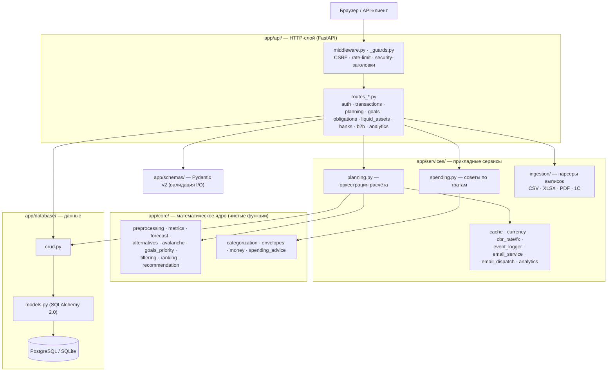
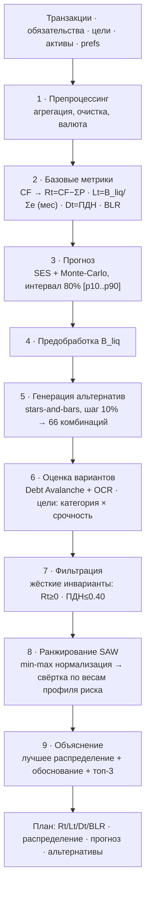

# FINPILOT — СППР для персональных финансов

<!-- STATUS -->
> **Сейчас:** `v9.2.0` · 2026-09-06 · веха 9 открыта, идёт предподготовка к деплою:
> обе причины падения CI закрыты гейтами, сквозной гейт по персональным данным,
> второй фактор дожат — токен сгорает после пяти неверных кодов.
> Где стоим — [`WATCHLOG.md`](WATCHLOG.md) §0.
<!-- /STATUS -->

[](https://github.com/vevdokimovm/personal-finance-dss/actions/workflows/ci.yml)


**FINPILOT** — система поддержки принятия решений (СППР), которая отвечает на один вопрос,
с которым человек остаётся один на один каждый месяц: **«у меня освободились деньги — куда
их направить?»** Гасить долг? Откладывать в резерв? Вкладывать в цель? Приложение
распределяет свободный денежный поток между этими направлениями **обоснованно** — на
многокритериальной оптимизации, а не на интуиции.

Ключевой принцип — **объяснимость**. Каждая рекомендация сопровождается человеческим
«почему», без формул и жаргона. А если денег на безопасное распределение не хватает —
алгоритм честно отказывается советовать (fail-loud), а не подгоняет красивую цифру.

> **Зачем это вообще.** Распределение свободных денег — классическая задача с конфликтом
> критериев: погасить дорогой долг выгодно по процентам, но опасно без подушки; копить на
> цель приятно, но бессмысленно, когда сверху висит кредитка под 25%. Человек решает это
> «на ощущения». FINPILOT решает это как **алгоритм многокритериального выбора** — и
> показывает свою работу.

---

## Текущее состояние (v9.1.0, сентябрь 2026)

| | |
|---|---|
| **Матмодель** | канон **v3.9.0**, пять раундов независимой экспертной сертификации, оценка по десяти шкалам — **87.2 / 100** |
| **Тесты** | бэкенд **2005** на SQLite и матрице PostgreSQL, фронт Vitest **567**, e2e **201** в трёх браузерах (Chromium, Firefox, WebKit), axe-core **24** (две темы), гейт покрытия 90%, flake8 = 0, ревизионный гейт docs↔code |
| **Вехи** | 1–8 закрыты (веха 8 — v8.55.0). **9 (деплой) идёт: предподготовка.** React 19 SPA заменил Jinja2 на основных экранах (дашборд, планирование, операции, обязательства, цели, банки, профиль, семейный доступ); §8.2 «вынести на фронт всё, что висит только в API» закрыт (последним приехали советы по расходам, v8.54.0); CRUD-паритет закрыт полностью (5/5): обязательства, ликвидные активы, операции, цели (мягкое удаление с отменой; у целей — отдельное действие «внести прогресс», не общий edit) и бюджеты (upsert по категории). Прод-деплой пайплайн (Docker + nginx) проверен на изолированном стенде |
| **Юрблок** | шесть требований из десяти закрыты кодом и покрыты тестами; экраны согласия/cookie-баннер на фронте — открытый шаг Э6 |
| **Веха 6** | тестирование матмодели закрыто по исчерпанию информативности метода, не по идеальности — условия возобновления зафиксированы |

Подробно: `docs/reports/audits/full_revision_before_frontend.md` (ревизия и оценка
готовности) · `docs/model/model_quality_scorecard.md` (качество модели по осям) ·
`docs/WATCHLOG.md` (состояние и передача работы).

---

## Содержание

- [Демо за 30 секунд](#демо-за-30-секунд)
- [Как это работает](#как-это-работает)
- [Возможности](#возможности)
- [История версий](#история-версий)
- [Технологии](#технологии)
- [Быстрый старт](#быстрый-старт)
- [Тестирование и качество](#тестирование-и-качество)
- [API](#api)
- [Безопасность](#безопасность)
- [Структура проекта](#структура-проекта)
- [Документация](#документация)
- [Лицензия](#лицензия)

---

## Демо за 30 секунд

Запустите проект ([Быстрый старт](#быстрый-старт)) и в боковой панели выберите один из
**десяти готовых портретов пользователей** — от студента с микрозаймом до семьи 56 лет с
ипотекой. Данные не зашиты: они пересчитываются **реальным движком** в реальном времени, и
вы сразу видите распределение, прогноз и обоснование под конкретную ситуацию.

Это самый быстрый способ понять продукт: один клик — и перед вами полный расчётный цикл на
живых данных. На экранах «Обязательства» и «Банки» данные из демо-портрета можно тут же
редактировать — добавить кредит, поправить сумму, удалить с возможностью отменить.

---

## Как это работает

### Архитектура: слоистый монолит с однонаправленными зависимостями

HTTP → сервисы → ядро/БД. Ядро (`app/core/`) не знает ни про веб, ни про базу — это чистые
функции над переданными данными. Именно поэтому его можно тестировать изолированно и
переиспользовать (тот же движок обслуживает и веб-UI, и B2B-API).


```mermaid
flowchart TD
    Client["Браузер / API-клиент"]

    subgraph HTTP["app/api/ — HTTP-слой (FastAPI)"]
        Routes["routes_*.py<br/>auth · transactions · planning · goals ·<br/>obligations · liquid_assets · banks · b2b · analytics"]
        MW["middleware.py · _guards.py<br/>CSRF · rate-limit · security-заголовки"]
    end

    subgraph SVC["app/services/ — прикладные сервисы"]
        Planning["planning.py — оркестрация расчёта"]
        Spending["spending.py — советы по тратам"]
        Ingestion["ingestion/ — парсеры выписок<br/>CSV · XLSX · PDF · 1C"]
        Infra["cache · currency · cbr_rate/fx ·<br/>event_logger · email_service · email_dispatch · analytics"]
    end

    subgraph CORE["app/core/ — математическое ядро (чистые функции)"]
        direction LR
        Pipeline["preprocessing · metrics · forecast ·<br/>alternatives · avalanche · goals_priority ·<br/>filtering · ranking · recommendation"]
        Support["categorization · envelopes · money · spending_advice"]
    end

    subgraph DATA["app/database/ — данные"]
        CRUD["crud.py"]
        Models["models.py (SQLAlchemy 2.0)"]
        DB[("PostgreSQL / SQLite")]
    end

    Schemas["app/schemas/ — Pydantic v2 (валидация I/O)"]

    Client --> MW --> Routes
    Routes --> Schemas
    Routes --> Planning
    Routes --> Spending
    Routes --> Ingestion
    Routes --> CRUD
    Planning --> Pipeline
    Planning --> CRUD
    Planning --> Infra
    Spending --> Support
    CRUD --> Models --> DB
```

### Алгоритм: стек именованных методов, а не одна формула

Рекомендация — это не «магическая функция», а **девятишаговый конвейер** прозрачных
методов. Каждый шаг отвечает за свою часть: учёт → прогноз → выбор → объяснение.


```mermaid
flowchart TD
    In["Транзакции · обязательства · цели · активы · prefs"]

    S1["1 · Препроцессинг<br/>агрегация, очистка, валюта"]
    S2["2 · Базовые метрики<br/>CF → Rt=CF−ΣP · Lt=B_liq/Σe (мес) · Dt=ПДН · BLR"]
    S3["3 · Прогноз<br/>SES + Monte-Carlo, интервал 80% [p10..p90]"]
    S4["4 · Предобработка B_liq"]
    S5["5 · Генерация альтернатив<br/>stars-and-bars, шаг 10% → 66 комбинаций"]
    S6["6 · Оценка вариантов<br/>Debt Avalanche + OCR · цели: категория × срочность"]
    S7["7 · Фильтрация<br/>жёсткие инварианты: Rt≥0 · ПДН≤0.40"]
    S8["8 · Ранжирование SAW<br/>min-max нормализация → свёртка по весам профиля риска"]
    S9["9 · Объяснение<br/>лучшее распределение + обоснование + топ-3"]
    Out["План: Rt/Lt/Dt/BLR · распределение · прогноз · альтернативы"]

    In --> S1 --> S2 --> S3 --> S4 --> S5 --> S6 --> S7 --> S8 --> S9 --> Out
```

**Что под капотом ядра:**

- **SAW (Simple Additive Weighting)** — многокритериальное ранжирование 66 альтернатив
  распределения (шаг дискретизации 10%) по 5 профилям риска: каждый профиль — свой вектор
  весов критериев (ресурс, ликвидность, долговая нагрузка, прогресс целей).
- **Debt Avalanche + opportunity-cost rate** — фильтр досрочного погашения: гасить имеет
  смысл только долг, чья ставка выше альтернативной доходности резерва (динамический
  `r_bench` = ключевая ставка ЦБ × (1 − НДФЛ)).
- **Stock-based ликвидность** `Lt = B_liq / Σe` — месяцы автономии (сколько продержишься
  без дохода), ортогональна потоковому ресурсу `Rt`.
- **SES + Monte-Carlo** — прогноз баланса и свободных денег с доверительным интервалом 80%
  (p10–p90) и алертом прогнозного дефицита.
- **Жёсткие инварианты** — `Rt ≥ 0` (нельзя уйти в минус по потоку) и `ПДН ≤ 0.40`
  (показатель долговой нагрузки), которые отсекают опасные варианты до ранжирования.

Полный разбор: [`docs/math_model.md`](docs/math_model.md) (каноническая модель,
источник истины по параметрам), [`docs/algorithm_stack.md`](docs/algorithm_stack.md) (как это
работает по шагам в коде), [`docs/diagrams.md`](docs/diagrams.md) (8 диаграмм: слои, ER,
конвейер ядра, поток `/calculate`, развёртывание, middleware, аутентификация, карта фронта).

---

## Возможности

- **Рекомендация распределения** свободного денежного потока с ранжированием альтернатив
  (SAW, 5 профилей риска) и человеческим объяснением выбора.
- **Прогноз** баланса и свободных денег на горизонт (SES + Monte-Carlo) с алертом дефицита.
- **Импорт выписок** — CSV, XLSX, PDF (Тинькофф, Сбер, ВТБ, Райффайзен, Альфа),
  `1CClientBankExchange` — с автокатегоризацией и надёжной пакетной загрузкой больших файлов.
- **Категоризация транзакций** — детерминированный rules-engine (13 категорий, ключевые
  слова + MCC), без ML.
- **Категорийные бюджеты** (план-факт), разрез расходов по категориям и мерчантам,
  временны́е тренды и goal-aware советы (связь экономии с дедлайнами целей).
- **Сценарии «что если»** — пересчёт рекомендации под гипотетические доход/расходы.
- **История планов** — снапшоты рассчитанных рекомендаций с возможностью вернуться.
- **Экспорт** — финансовый отчёт в PDF (кириллица), операции и план в CSV/XLSX.
- **Мультивалюта** — суммы в своей валюте, приведение к базовой через курсы ЦБ РФ.
- **Светлая и тёмная темы**, адаптивный интерфейс, доступность по WCAG 2.1 AA.

---

## История версий

Проект прошёл семь крупных эпох — от математического MVP до production-ready SaaS:

### v1.x.x — ядро СППР (фундамент)

Однопользовательский MVP, в котором родилась суть продукта: **математическое ядро**
многокритериальной оптимизации (SAW + Debt Avalanche + Monte-Carlo), 5 профилей риска,
генерация и ранжирование альтернатив распределения, базовый веб-интерфейс на Jinja2.
Здесь же — чистое разделение ядра и веба, которое держится до сих пор.

### v2.x.x — продуктовое дозревание (single-user)

Слой вокруг ядра, превращающий движок в пользуемый продукт: импорт банковских выписок и
автокатегоризация, категорийные бюджеты (план-факт), прогноз по тратам, конверты
ликвидности, светлая/тёмная темы, симметричный undo («Вернуть») на всех сущностях,
cache-busting статики и совместимость 204-ответов с WebKit.

### v3.x.x — международный / многопользовательский режим (MAJOR — 3.0.0)

Ломающий релиз, открывший дорогу к SaaS. Ядро СППР **не тронуто** — обвязка вокруг него
переписана под мультипользовательскую модель:

- **Аутентификация** (JWT + bcrypt) и **изоляция данных** по пользователю; при первом входе
  данные анонимного режима «усыновляются» — переход single→multi без потери.
- **Мультивалюта** — суммы в своей валюте, приведение к базовой через таблицу курсов (USD-пивот).
- **Денежная точность** — все суммы на `Decimal`/`numeric(14,2)`, ставки `numeric(6,4)`;
  никаких ошибок округления `float`.
- **Provider-agnostic ingestion** — каноническая модель `FinancialSnapshot` развязывает
  движок от источника данных (`FinanceEngine` Protocol): новая страна = новый провайдер,
  ядро не меняется.
- **Open Banking (Plaid)** для US/CA и **B2B API** `/v1/analyze` — партнёр присылает снимок
  финансов, получает рекомендацию. Опционально, по умолчанию выключены.

### v4.x.x — production-hardening

Подготовка к коммерческому запуску — закрытие блокеров безопасности, права и надёжности до
уровня серьёзного финпродукта:

- **Юридический блок** — юрлицо, политика конфиденциальности, согласие на ПДн,
  пользовательское соглашение, дисклеймеры (152-ФЗ / 39-ФЗ).
- **Безопасность** — блокировка аккаунта после неудачных входов, fail-loud валидация
  прод-конфигурации (старт падает при дефолтных секретах), восстановление пароля по токену.
- **Приватность** — шифрование чувствительных полей (Fernet), аудит доступа к PII, полное
  удаление данных пользователя (152-ФЗ).
- **Наблюдаемость** — `/health`, JSON-логи, request_id, Sentry.
- **Надёжность данных** — production-контейнеризация, бэкапы + verify-restore,
  PostgreSQL-матрица в CI, история планов (снапшоты).
- **Качество** — трёхкатегорийная система тестов (fast/full/deep), property-based тесты на
  инварианты ядра, browser-E2E на критичные флоу, доступность WCAG AA в обеих темах.
- **Прочее** — живые курсы ЦБ РФ с кэшем, экспорт PDF/XLSX, кэш расчётов, продуктовая
  аналитика, рефералы, фундамент i18n.

### v5.x.x — организация знания

Веха, в которой репозиторий стал самодостаточным: вся теория, стандарты и методички
переехали внутрь продукта. Канон — **«один архив = полный контекст»**: следующая сессия
получает не пересказ, а дерево. Отсюда же вахтенный журнал `docs/WATCHLOG.md` как контракт
передачи работы между сессиями и публичное зеркало проекта.

### v6.x.x — сертификация математического ядра

Пять раундов независимой экспертной оценки: по четыре эксперта в изолированных сессиях,
12 000 синтетических портретов на раунд, предрегистрация гипотез до просмотра данных.
Согласие модели с консенсусом выросло **51.9% → 78.63%** и держится у верхней границы
коридора разногласий самих экспертов — потолка, выше которого рост означал бы копирование
конкретной панели, а не правоту.

Главный результат раунда 5 — отрицательный и потому ценный: полоса тонкой подушки, четыре
раунда считавшаяся слабым местом модели, оказалась **зоной отсутствия профессионального
консенсуса** (четыре эксперта дали три разных ответа с амплитудой 66 пунктов, модель — ровно
посередине). Калибровки в раунде нет: подтверждать было нечего. Канон остался **v3.5.0**.

Оценка модели по десяти шкалам — **85.7 / 100** (`docs/model/model_quality_scorecard.md`),
практический потолок — ≈91 (`docs/model/model_completion_plan.md`).

### v7.x.x — юридическая готовность

Шесть документов и UI-тексты, переведённые в инженерные требования с адресами в коде.
Ключевое здесь — не тексты, а то, что согласие **перестало быть декоративным**: раздельные
согласия на обработку ПДн, финансовых данных и рассылку пишутся с моментом времени и
редакцией текста, а обработка финансового портрета закрыта гейтом на уровне роутеров.
Отзыв согласия работает, удаление аккаунта чистит данные, ПДн не попадают в логи.

Отсюда же дисциплина процесса: предполётная проверка блокирующим job'ом CI, реестр рецидивов
с эскалацией контрмеры по числу повторов и опознавательные знаки репозитория.

### v8.x.x — фронтенд (React SPA, идёт)

Перенос интерфейса с server-side Jinja2 на React 19 + TypeScript SPA (Vite, TanStack
Router/Query, Zustand, Radix UI, Recharts + visx, KaTeX), API не меняется — тот же бэкенд
обслуживает оба интерфейса. Основные экраны (дашборд, планирование, операции, обязательства,
цели, банки, профиль) на React; экраны входа/регистрации/сброса пароля построены с нуля
(в Jinja-версии их не было вообще). Прод-деплой: nginx собирает SPA внутри Docker и разводит
маршруты SPA/FastAPI.

Домены раскрыты (шкалы с зонами, формулы по клику, горизонт и ставка прогноза «что если»),
юр-контур входа/регистрации закрыт. Текущий шаг — **CRUD-паритет**: до v8.24 React-экраны
пяти финансовых сущностей (операции, обязательства, цели, активы, бюджеты) были read-only,
Jinja оставался единственным способом что-то ввести или изменить. Обязательства и ликвидные
активы уже получили полноценные создание/правку/удаление (мягкое удаление с отменой,
`@radix-ui/react-dialog`) — операции/цели/бюджеты следующими партиями, после чего
Jinja-версии этих шести экранов можно будет снести. Дальше — юр-контур согласий на всём
фронте (Э6) и security/perf-гейты (CSP, security-заголовки, Э7). План —
`docs/frontend_milestone8_plan.md`, статус — `docs/WATCHLOG.md`.

> Читаемая история по вехам — в [`docs/RELEASES.md`](docs/RELEASES.md). Подробная история по каждой
> версии — в [`CHANGELOG.md`](CHANGELOG.md). «Где мы сейчас» и резюме точки разработки — в
> [`docs/WATCHLOG.md`](docs/WATCHLOG.md).

---

## Технологии

| Слой | Стек |
|---|---|
| Backend | FastAPI, SQLAlchemy 2.0, Pydantic v2, Alembic |
| База данных | SQLite (локально) / PostgreSQL 16 (Docker / прод) |
| Frontend | React 19 + TypeScript SPA (Vite) — TanStack Router/Query, Zustand, Radix UI/shadcn, Recharts + visx, KaTeX. Юр-документы и контакты — по-прежнему FastAPI/Jinja2 (не перенесены, отдельный охват) |
| Математика | NumPy/чистый Python — SAW, Monte-Carlo, Theil-Sen, stars-and-bars |
| Прод-запуск | Gunicorn + uvicorn-воркеры; nginx собирает и отдаёт SPA (multi-stage Docker-сборка) + TLS (Let's Encrypt) + reverse-proxy на FastAPI |
| Инфраструктура | Docker (multi-stage), docker compose, GitHub Actions CI |
| Тесты | pytest, hypothesis (property-based) — бэкенд; Vitest + Playwright — фронтенд; locust (нагрузка) |
| Качество | ruff, mypy, bandit, pip-audit, coverage (гейт 90%); фронт — eslint, prettier, tsc, Lighthouse CI (веха 8, шаг Э7) |

Python 3.13. Около 16 700 строк кода бэкенда, 20 модулей ядра, 34 миграции Alembic.

---

## Быстрый старт

Веха 8 идёт: основные экраны (дашборд, планирование, операции, обязательства, цели, банки,
профиль) и весь цикл входа/регистрации — на React SPA; контакты и юр-документы остаются на
FastAPI/Jinja2 (отдельный охват). **Смотреть текущий React-фронт локально нужно через
Vite dev-сервер, не через `docker compose up`** — dev-compose поднимает только бэкенд.

### Бэкенд (обязателен в любом случае)

**Через Docker (проще всего):**
```bash
docker compose up --build
```
Backend будет доступен на `http://localhost:8000` (Jinja-страницы — на `/dashboard` и т.д.,
API — на `/api/*`, Swagger — на `/docs`).

**Или локально без Docker (macOS / Linux):**
```bash
python3 -m venv venv && source venv/bin/activate
pip install -r requirements.txt -r requirements-dev.txt
alembic upgrade head
python3 -m uvicorn app.main:app --reload --port 8000
```

**Или локально без Docker (Windows, PowerShell):**
```powershell
python -m venv venv
venv\Scripts\Activate.ps1
pip install -r requirements.txt -r requirements-dev.txt
alembic upgrade head
python -m uvicorn app.main:app --reload --port 8000
```
Если `Activate.ps1` блокируется политикой выполнения скриптов — один раз
разрешить для текущего пользователя: `Set-ExecutionPolicy -Scope
CurrentUser RemoteSigned`. В `cmd.exe` (не PowerShell) активация —
`venv\Scripts\activate.bat`, остальные команды те же.

### Фронтенд — React SPA (чтобы увидеть текущее состояние вехи 8)

В отдельном терминале, пока бэкенд крутится на :8000:
```bash
cd frontend
npm install
npm run dev
```
Открыть `http://localhost:5173` — это и есть текущий React-интерфейс (не :8000!). Vite сам
проксирует `/api` на `127.0.0.1:8000`, отдельная настройка CORS не нужна.

Для быстрого знакомства с движком без регистрации — гостевой режим и один из десяти демо-
портретов пользователей в боковой панели: данные пересчитываются реальным движком, не
захардкожены.

### Прод-сборка (проверить именно то, что уедет на сервер)

`docker-compose.prod.yml` собирает SPA внутри Docker (`nginx/Dockerfile`, multi-stage) и
отдаёт готовую сборку через nginx — ближе к реальному деплою, но требует `.env` с секретами
(см. `docs/DEPLOY.md`). Для повседневной разработки/просмотра — вариант выше проще и быстрее.

### Переменные окружения

Скопируйте `.env.example` в `.env` и при необходимости отредактируйте. Ключевые:

| Переменная | По умолчанию | Назначение |
|---|---|---|
| `ENVIRONMENT` | `development` | `development` \| `production` (влияет на reload, HSTS) |
| `DATABASE_URL` | `sqlite:///./finpilot.db` | строка подключения к БД |
| `JWT_SECRET` | dev-заглушка | секрет подписи JWT — **обязательно сменить в проде** |
| `DEFAULT_BASE_CURRENCY` | `RUB` | базовая валюта новых пользователей |
| `B2B_API_KEYS` | пусто | ключи партнёров для `/v1/analyze` (пусто = выключено) |
| `PLAID_CLIENT_ID` / `PLAID_SECRET` | пусто | Plaid open banking (пусто = выключено) |

Полный список — в [`.env.example`](.env.example). Секреты передаются только через `.env` и
никогда не хранятся в коде.

---

## Тестирование и качество

Тесты разведены по скорости и частоте — разработка не должна тормозить из-за тяжёлых
проверок. Отбор — pytest-маркерами.

| Категория | Когда | Что входит |
|---|---|---|
| **fast** | каждый push/PR | unit + integration + property + e2e-smoke, гейт покрытия 90%, матрица SQLite + PostgreSQL |
| **full** | перед релизом / по тегу | мультибраузерные E2E (chromium + firefox + webkit) + визуальная регрессия + live-a11y + security + нагрузочный smoke |
| **deep** | по cron / вручную | стресс-property (тысячи примеров) + мутационное тестирование ядра |

```bash
make test-fast        # быстрый набор перед коммитом (бэкенд)
make test-full        # полный прогон перед релизом (бэкенд)
make e2e              # браузерные сквозные, бэкенд (chromium)
make security         # bandit + pip-audit
```

Фронтенд (в `frontend/`): `npm run test` (Vitest, 187 тестов), `npm run test:e2e` (Playwright,
25 тестов, chromium/firefox/webkit), `npm run lint` / `typecheck` / `format:check`.

> Запускайте через `python3 -m pytest` (не голый `pytest`): голая команда может подхватить
> системный pytest вне venv.

**Что важно в подходе:**

- **Property-based тесты** (`hypothesis`) проверяют не «несколько кейсов», а математические
  инварианты ядра на тысячах случайных входов: `Rt ≥ 0`, `ПДН ≤ 0.40`, сумма долей = 1,
  `|A| ≤ 66`, рекомендация = argmax. Самый дешёвый способ поймать математическую регрессию.
- **PostgreSQL-матрица обязательна.** SQLite молча игнорирует нарушения внешних ключей —
  любое схемное изменение проверяется и на PG.
- **Browser-E2E на критичных флоу.** Юнит проверяет функцию, E2E — что пользователь реально
  может выполнить действие через UI (урок: удаление обязательства было сломано версиями при
  зелёных юнит-тестах — юнит не ловит разрыв между UI и API).

Покрытие — блокирующий гейт **90%** (последний аудит — 91.6% TOTAL, ядро `U(a)` 90–100%).
Полная карта тестовой инфраструктуры — [`docs/testing_infrastructure.md`](docs/testing_infrastructure.md).

---

## API

**Регистрация и вход** возвращают JWT (в теле ответа и в httpOnly-cookie). Для API-клиентов
токен передаётся заголовком `Authorization: Bearer <token>`.

```bash
# Регистрация
curl -X POST http://127.0.0.1:8000/api/auth/register \
  -H "Content-Type: application/json" \
  -d '{"email":"you@example.com","password":"strongpass1","display_name":"Имя"}'

# Запрос с токеном
curl http://127.0.0.1:8000/api/transactions \
  -H "Authorization: Bearer <ВАШ_ТОКЕН>"
```

**Изоляция данных:** без токена работает анонимный режим (видит только данные без
владельца). Первый зарегистрированный пользователь усыновляет анонимные данные; дальше
каждый пользователь изолирован.

**B2B `/v1/analyze`** (включается заданием `B2B_API_KEYS`): принимает снимок финансов в
канонической модели `FinancialSnapshot`, возвращает рекомендацию. Авторизация — заголовок
`X-API-Key`.

```bash
curl -X POST http://127.0.0.1:8000/v1/analyze \
  -H "X-API-Key: <КЛЮЧ_ПАРТНЁРА>" -H "Content-Type: application/json" \
  -d '{"base_currency":"RUB","risk_profile":3,
       "transactions":[{"transaction_id":"t1","amount":180000,"type":1,"date":"2026-06-01T00:00:00"},
                        {"transaction_id":"t2","amount":78000,"type":2,"date":"2026-06-02T00:00:00"}],
       "debts":[{"debt_id":"d1","name":"Кредитка","balance":200000,"monthly_payment":25000,"interest_rate":0.249,"term_months":24}]}'
```

Полная интерактивная документация API — `http://127.0.0.1:8000/docs` (Swagger UI).

---

## Безопасность

OWASP-минимум по реальному коду: ORM (нет SQL-инъекций), экранирование шаблонов, валидация
Pydantic, CSRF-защита, security-заголовки, rate-limit на чувствительных эндпоинтах,
блокировка аккаунта после неудачных входов, bcrypt-хеши паролей, Fernet-шифрование
чувствительных полей в покое, fail-loud старт при дефолтных секретах в проде.

Подробности — [`SECURITY.md`](SECURITY.md).

---

## Что здесь можно узнать

- **app/** — Fonts
- **frontend/** — entities/
- **knowledge/** — knowledge/ — база знаний проекта FINPILOT
- **loadtest/** — FINPILOT — Нагрузочное тестирование (P0.4)
- **tools/** — tools/ — вспомогательные скрипты и программы

_Собрано из заголовков самих документов — это и есть вопросы, на которые они отвечают._

## Структура проекта

```
app/
  api/          роуты FastAPI (+ auth, fx, plaid, b2b, analytics)
  core/         математическое ядро (метрики, альтернативы, прогноз, категоризация) — 14 модулей
  ingestion/    провайдер-агностик слой: канон FinancialSnapshot, FinanceEngine
                Protocol, адаптер ядра, провайдеры (manual, plaid)
  services/     оркестрация, логирование, безопасность (JWT/bcrypt/Fernet), валюты, парсеры выписок
  database/     модели SQLAlchemy 2.0, CRUD
  schemas/      Pydantic v2 схемы (валидация I/O)
  config.py     настройки (pydantic-settings)
  main.py       сборка приложения, middleware, lifespan
alembic/        миграции (0001–0034)
frontend/       React 19 SPA (src/, package.json, Vitest + Playwright e2e/) —
                И одновременно старые Jinja-шаблоны/статика (templates/, static/) для
                второстепенных страниц (контакты, юр-документы, восстановление пароля)
tests/          pytest: unit/integration + property + e2e/ + full/ + deep/
loadtest/       нагрузочный сценарий locust
docs/           каноническая документация (см. ниже)
deploy/ nginx/  прод-инфраструктура (TLS, systemd timers, бэкапы)
Dockerfile, docker-compose.yml, gunicorn_conf.py
```

---

## Документация

Вся каноническая теория живёт в репозитории — `docs/` самодостаточен для входа в проект:

| Документ | О чём |
|---|---|
| [`docs/RELEASES.md`](docs/RELEASES.md) | Читаемая история развития продукта по вехам (эпохи v1→v4) |
| [`docs/pitfalls.md`](docs/pitfalls.md) | Реестр частых ошибок воркфлоу (третий тип рядом с инцидентами/расследованиями) |
| [`docs/reports/report_types.md`](docs/reports/report_types.md) | Роутер: какой тип разбора писать (инцидент / расследование / баг / pitfall) |
| [`docs/reports/incident_postmortem_guide.md`](docs/reports/incident_postmortem_guide.md) | Практический шаблон/метод инцидента (post-mortem, SEV, RCA) |
| [`docs/documentation_methodology.md`](docs/documentation_methodology.md) | Общая теория документирования: blameless, RCA, runbook, ADR/RFC, SLO/error budget |
| [`docs/math_model.md`](docs/math_model.md) | Каноническая математическая модель (источник истины по параметрам) |
| [`docs/algorithm_stack.md`](docs/algorithm_stack.md) | Девятишаговый конвейер ядра по шагам в коде |
| [`docs/diagrams.md`](docs/diagrams.md) | 8 диаграмм: слои, ER, конвейер, потоки, развёртывание, auth, фронт |
| [`docs/testing_infrastructure.md`](docs/testing_infrastructure.md) | Карта тестов: уровни, три категории, PG-матрица, E2E |
| [`docs/frontend_milestone8_plan.md`](docs/frontend_milestone8_plan.md) | Активный план вехи 8 (фронтенд): этапы Э0–Э8, что сделано, что дальше |
| [`SECURITY.md`](SECURITY.md) | Единый security-док: меры (ссылки на код), что осталось, домены ревью, план реагирования |
| [`docs/DEPLOY.md`](docs/DEPLOY.md) | Пошаговый деплой на VPS |
| [`docs/CONTRIBUTING.md`](docs/CONTRIBUTING.md) | Процесс: TDD-цикл, PG для схемы, Definition of Done |
| [`docs/glossary.md`](docs/glossary.md) | Термины и обозначения (Rt, Lt, Dt, BLR, Sn…) |
| [`docs/reports/incidents_summary.md`](docs/reports/incidents_summary.md) · [`docs/reports/investigations_summary.md`](docs/reports/investigations_summary.md) | Реестры инцидентов и расследований |

---

**Ревизия и качество**

| Документ | О чём |
|---|---|
| `docs/reports/audits/full_revision_before_frontend.md` | сквозная ревизия перед вехой 8, оценка готовности по осям |
| `docs/model/model_quality_scorecard.md` | качество матмодели по десяти шкалам с рубриками |
| `docs/model/model_completion_plan.md` | сколько ещё нужно до потолка качества и в каких ресурсах |
| `docs/reports/recurrence_ledger.md` | лидерборд повторяющихся ошибок и правило эскалации контрмер |
| `docs/legal/README.md` | юрблок в переводе на инженерные требования (L1–L10) |
| `docs/legal/compliance_register.md` | обязательства владельца (O1–O7) и гейт запуска |
| `knowledge/roles/CATALOG.md` | библиотека ролей команды: какую брать под задачу |

## Лицензия

[MIT](LICENSE) © 2025 Vasilii Evdokimov

## Структура

<!-- STRUCTURE:AUTO:START -->
| Папка | Файлов | Что внутри по существу |
|---|---|---|
| [`alembic/`](alembic/) | 36 | _описания нет — ни в `MANIFEST.md` §3, ни в заголовках файлов_ |
| [`app/`](app/) | 137 | Fonts · Эталонные шаблоны банковских выписок · raiffeisen — выжимка · sber — выжимка |
| [`deploy/`](deploy/) | 8 | _описания нет — ни в `MANIFEST.md` §3, ни в заголовках файлов_ |
| [`docs/`](docs/) | 524 | Как разрабатывать FINPILOT (CONTRIBUTING) · FINPILOT — деплой на VPS (production) · QA-регламент FINPILOT · FINPILOT — Документация и стандарты проекта |
| [`frontend/`](frontend/) | 242 | entities/ · features/ · pages/ · widgets/ |
| [`knowledge/`](knowledge/) | 300 | knowledge/ — база знаний проекта FINPILOT · FINPILOT — Logo Generation Spec (v1) · FINPILOT — Паспорт логотипа (Logo Guideline) v3.0 · FINPILOT → Android: пайплайн вывода веб-приложения в Google Play |
| [`loadtest/`](loadtest/) | 2 | FINPILOT — Нагрузочное тестирование (P0.4) |
| [`nginx/`](nginx/) | 3 | _описания нет — ни в `MANIFEST.md` §3, ни в заголовках файлов_ |
| [`reports/`](reports/) | 1 | _описания нет — ни в `MANIFEST.md` §3, ни в заголовках файлов_ |
| [`scripts/`](scripts/) | 8 | scripts/ |
| [`tools/`](tools/) | 68 | tools/ — вспомогательные скрипты и программы · Публичные release notes зеркала `finpilot` (private-only источник) |

_Столбец «что внутри» собран из `MANIFEST.md` §3, где он есть, иначе из заголовков самих файлов. Ничего не сочинено: где описания нет — так и написано._
<!-- STRUCTURE:AUTO:END -->
