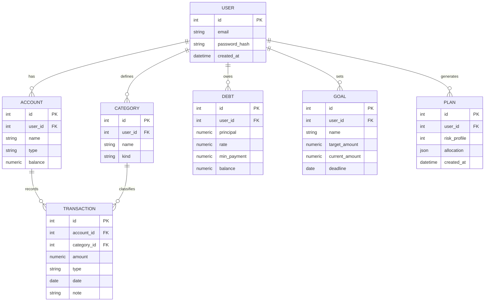

# data-model.md — модель предметной области

> Описание сущностей, полей, связей и ER-диаграмма. Пишется **до кода** — из него растут SQL-таблицы и Pydantic-модели. Пример наполнен под финансовый DSS (FINPILOT); для нового проекта — заменить сущности своими.

---

## Сущности (FINPILOT)

| Сущность | Назначение | Ключевые поля |
|----------|-----------|---------------|
| **User** | Пользователь | `id`, `email`, `password_hash`, `created_at` |
| **Account** | Счёт/кошелёк | `id`, `user_id` → User, `name`, `type` (cash/card/deposit), `balance` |
| **Transaction** | Операция | `id`, `account_id` → Account, `category_id` → Category, `amount`, `type` (income/expense), `date`, `note` |
| **Category** | Категория | `id`, `user_id` → User, `name`, `kind` (income/expense) |
| **Debt** | Долг/кредит | `id`, `user_id` → User, `principal`, `rate`, `min_payment`, `balance` |
| **Goal** | Финансовая цель | `id`, `user_id` → User, `name`, `target_amount`, `current_amount`, `deadline` |
| **Plan** | Результат расчёта СППР | `id`, `user_id` → User, `risk_profile`, `allocation` (JSON), `created_at` |

---

## Связи

- User **1—N** Account, Category, Debt, Goal, Plan
- Account **1—N** Transaction
- Category **1—N** Transaction
- Plan агрегирует распределение по Debt/Goal/Reserve (снимок расчёта)

---

## ER-диаграмма

---

## Правила
- Денежные поля — `numeric`/`Decimal`, никогда `float`.
- Каждая пользовательская сущность привязана к `user_id` (изоляция данных, 152-ФЗ).
- Раздельные Pydantic-схемы `*Create` (вход) и `*Response` (выход) на каждую сущность.
- Из этой модели генерируются: миграции Alembic + схемы Pydantic + репозитории.
