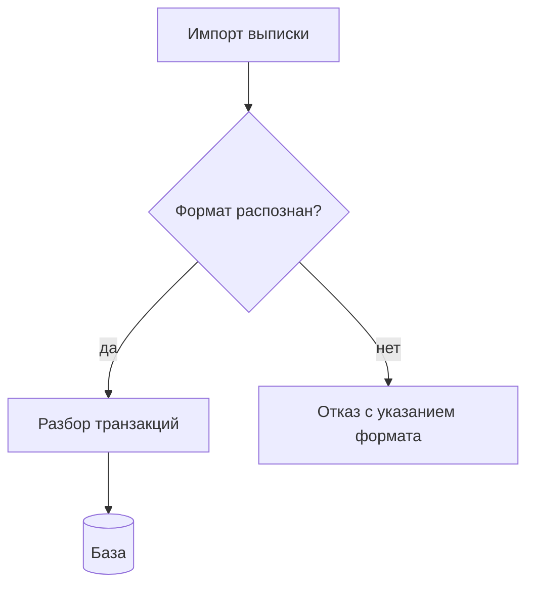

# Диаграммы и визуал с нуля — код, а не картинка

> **Заказ владельца 04.09.2026 01:50, дословно:** *«кит по созданию изображений
> с нуля. То есть разных диаграмм, древ и т.д. У нас есть кит по презентациям —
> вот там и картинки с нуля, генерация должна быть, диаграммы разные и что нужно,
> любой визуал делать по запросу, по промпту. В finpilot есть примеры неплохих
> диаграмм, можно взять пока для примера, но конечно далеки от идеала и красоты.
> И вроде где-то ещё пытались делать, но не очень часто, потому что ты очень
> плохо делал диаграммы с нуля. Именно фотки. У тебя неплохо получалось код
> писать и потом в drawio закидывать, и он их рисовал, но сам ты делал херню.
> Поэтому я и завёл этот кит — обучаться»*.

---

## §0. 🔴 Наблюдение владельца — верное, и вот чем оно подтверждается

Владелец сформулировал границу способности точнее, чем это обычно записывают:

> **«Код писать получалось. Сам рисовал — херню».**

Замер по `personal-finance-dss/docs/diagrams/` (04.09.2026):

| Что лежит | Сколько | Чем сделано |
|---|---:|---|
| `.drawio` | **21** | XML, написанный как код |
| блоки ```` ```mermaid ```` в `diagrams.md` | **9** | текст |
| `.png` / `.svg` | 11 + 1 | **экспорт** из первых двух |
| растр, нарисованный моделью | **0** | — |

**Всё, что в системе получилось, сделано кодом.** Ни одной работающей
диаграммы-картинки нет — не потому, что не пробовали, а потому что не выходило.

### Почему так, а не «модель ленится»

| | диаграмма-код | диаграмма-картинка |
|---|---|---|
| что производится | текст с явной структурой | сетка пикселей |
| ошибка видна | сразу, при рендере | только глазом человека |
| правка | одна строка | заново целиком |
| версионируется | 🟢 `git diff` по существу | 🔴 бинарник, каждая правка — новая копия |
| текст на схеме | ровно тот, что написан | 🔴 модель искажает буквы |

🔴 **Ключевое — последняя строка.** Генератор изображений рисует *похожее
на текст*, а не текст: подписи на схеме получаются с искажёнными буквами.
Для диаграммы, где подпись и есть содержание, это не косметический дефект,
а отказ.

**Отсюда правило кита, а не предпочтение:**

> **Диаграмма пишется кодом и рендерится инструментом. Растровая генерация
> применяется там, где нет текста и нет точной структуры, — то есть почти
> нигде из того, что нужно этой системе.**

---

## §1. Чем что делать — выбор по задаче, не по привычке

| Нужно | Формат | Где рендерится |
|---|---|---|
| схема **в документе репы**, чтобы видел GitHub | ```` ```mermaid ```` в `.md` | 🟢 **GitHub рендерит нативно** (`13` §2) |
| схема, которую владелец будет **править мышкой** | `.drawio` (XML) | draw.io / app.diagrams.net |
| граф зависимостей, дерево | Graphviz DOT | `dot -Tsvg` 🟢 **установлен, проверен** |
| точный макет, свои пропорции | **SVG руками** | всё |
| слайд с диаграммой | mermaid → PNG → в Gamma/Canva | §4 |
| иллюстрация без текста, атмосферная | генерация изображения | 🔴 см. §5 |

### Почему mermaid — умолчание для репы

**GitHub рендерит его без единого файла-картинки.** Диаграмма живёт
в том же `.md`, что и текст: не расходится с ним, не теряется при переносе,
диффится построчно. Это ровно то, ради чего система держит текст, а не бинарники
(`13` §4.7: «лучший ответ — не хранить большие бинарники вообще»).

### Почему `.drawio` — когда правит владелец

`.drawio` — **XML, который можно написать кодом и открыть мышкой**. Это
единственный формат из списка, где обе стороны работают со своей сильной
стороной: модель пишет структуру, человек двигает блоки.

Именно так сделаны все 21 диаграмма finpilot — и владелец назвал этот путь
работающим раньше, чем он был записан правилом.

---

## §2. Что делать до первой строки кода

🔴 **Три вопроса, без которых диаграмма выйдет красивой и бесполезной.**

1. **Что читатель должен понять, чего не понимает сейчас?** Если ответа нет —
   диаграмма не нужна, нужен абзац текста.
2. **Это структура, процесс или величины?** Структура → блок-схема
   или C4; процесс → sequence, state machine; величины → **график, не схема**.
3. **Сколько на ней узлов?** Больше 12 — читатель не удержит. Значит либо
   уровень выше, либо две диаграммы.

**Ошибка, которую делают чаще всего:** рисуют то, что легко нарисовать,
а не то, что трудно объяснить. Диаграмма оправдана там, где текст требует
трёх абзацев и всё равно не даёт увидеть целое.

---

## §3. Как писать mermaid, чтобы вышло читаемо



**Правила, выведенные из чужих неудач, а не из вкуса:**

| Правило | Почему |
|---|---|
| **направление `TD` для процессов, `LR` для конвейеров** | вертикаль читается как шаги, горизонталь — как поток |
| **подписи на рёбрах у каждой развилки** | ромб без подписей «да/нет» не читается вовсе |
| **форма несёт смысл**: `[]` действие, `{}` решение, `[()]` хранилище | иначе схема — набор прямоугольников |
| **имена — существительные для узлов, глаголы для рёбер** | «Импорт выписки» → «разбирает» → «Транзакции» |
| 🔴 **не больше 12 узлов** | выше этого схема не читается, а «выглядит серьёзно» |

**Чего mermaid не умеет и не надо пытаться:** точное позиционирование,
свои цвета для каждого блока, сложные вложенные группы. Нужно это — берём
`.drawio` или SVG, а не воюем с раскладчиком.

---

## §4. Диаграмма на слайд

Слайд не рендерит mermaid. Порядок:

```bash
# 1. mermaid → PNG. 🔴 mmdc НЕ УСТАНОВЛЕН на этой машине (проверено 04.09.2026),
#    поэтому через npx — ставится на лету, отдельной установки не требует:
npx -y @mermaid-js/mermaid-cli -i schema.mmd -o schema.png -b transparent -w 2400

# 2. PNG → в Gamma/Canva как изображение
```

🔴 **Проверено, что есть на машине, а что обещано:**

| Инструмент | Состояние 04.09.2026 |
|---|---|
| `dot` (Graphviz) | 🟢 **есть**, версия 14.0.0 — проверено рендером SVG |
| `mmdc` (mermaid-cli) | 🔴 **нет** — только через `npx`, первый запуск качает пакет |
| `npx`, `node` | 🟢 есть |

**Почему это записано таблицей, а не «установите нужное».** Документ,
обещающий команду, которой на машине нет, ломается ровно в тот момент,
когда им пользуются впервые, — и выглядит при этом как ошибка пользователя,
а не как дефект документа (`examples_check.py` ловит несуществующие флаги,
но не несуществующие программы).

🔴 **Ширина 2400, а не 800.** Проектор и Retina растянут картинку; схема,
собранная под ширину экрана ноутбука, на слайде рассыплется. Прозрачный фон —
чтобы тема слайда не спорила с белым прямоугольником.

**Правила §3 кита презентаций действуют:** контраст 4,5 : 1, шрифт от 24 пунктов
в пересчёте на слайд. На диаграмме это значит **не больше 7 узлов** — то, что
читается в документе, на слайде уже мелко.

---

## §5. Генерация изображений — где она уместна

Подключены как MCP: **Gamma** (`generate_image`) и **Canva**
(`generate-design`), плюс Artifact для веб-страниц.

| Уместно | 🔴 Не уместно |
|---|---|
| фон, атмосферная иллюстрация | **любая схема** |
| иконка без текста | **что угодно с подписями** |
| обложка, заставка | точные пропорции, повторяемость |

**Почему граница проходит по тексту.** Генератор рисует похожее на буквы,
а не буквы. Проверить это дёшево: попросить картинку с подписью и прочитать
подпись. Пока результат не читается — правило действует.

🔴 **Повторяемости нет по построению.** Тот же промпт даёт другую картинку.
Для иллюстрации это неважно, для диаграммы, которую придётся править, —
смертельно: правка означает генерацию заново и потерю всего остального.

---

## §5а. 🔴 Изображения по запросу — то, чем это заменяется

**Заказ владельца:** *«а изображения? с ними проблема, нужно их научиться
делать по запросу»*. Отвечаю прямо: **научиться рисовать растр нельзя** —
это свойство инструмента, а не навыка. Но задача владельца при этом решается,
и вот чем.

### Проверено запуском 04.09.2026, не по памяти

| Инструмент | Есть на машине | Проверено |
|---|---|---|
| `rsvg-convert` | 🟢 **да**, 2.61.1 | SVG → PNG, **кириллица точная** |
| `dot` (Graphviz) | 🟢 да, 14.0.0 | DOT → SVG |
| `ffmpeg` | 🟢 да, 8.1.2 | см. §5б |
| `npx` mermaid-cli | 🟢 через npx | mermaid → PNG, 23 597 байт |
| ImageMagick, Pillow | 🔴 **нет** | — |
| Gamma MCP | 🔴 **отключён** в этой сессии | генерацию проверить не удалось |

### Ответ: изображение пишется как SVG и рендерится локально

**Пример из `examples/pipeline.svg` — 851 байт исходника:**

```bash
rsvg-convert -w 1200 pipeline.svg -o pipeline.png
```

| | SVG-код | генерация растра |
|---|---|---|
| текст на картинке | 🟢 **ровно тот, что написан** | 🔴 похожий на текст |
| правка | одна строка | заново целиком |
| повторяемость | побайтово та же | 🔴 другая каждый раз |
| сеть | не нужна | нужна |
| вес | 851 байт | сотни КБ |

🔴 **Это и есть «изображения по запросу».** Запрос — словами; ответ —
SVG-код и отрендеренный PNG рядом. Владелец получает картинку, а не отказ;
разница только в том, что она сделана кодом и потому правится.

### 🔴 Ошибка, допущенная при первом же примере, — и она типична

Первый вариант `pipeline.svg` дал **стрелку без наконечника**: две связи
были записаны одним путём `d="M160 100 H230 M370 100 H440"`, а `marker-end`
ставится **в конце всего пути**, не каждого подпути.

**Найдено просмотром результата, а не чтением кода.** Отсюда правило:

> **SVG всегда рендерится и просматривается глазами перед отдачей.**
> Ошибка в разметке выглядит как валидный XML и молча даёт неверную картинку.

Чинится разбиением на два `<path>` — по одному `marker-end` на каждый.

### Где генерация растра всё-таки уместна

Фон, атмосферная иллюстрация, иконка **без текста**, обложка. Признак один:
**нет подписей и не нужна повторяемость**. Всё остальное — SVG.

---

## §5б. Гифки — да, и они собираются целиком локально

**Вопрос владельца:** *«гифки ты вроде можешь делать? видео вроде нет, но
гифки да?»* — **да, и проверено запуском.**

### Цепочка: SVG-кадры → PNG → GIF

```bash
# 1. кадры пишутся как SVG (по одному на состояние)
# 2. каждый рендерится
for f in f*.svg; do rsvg-convert -w 1200 "$f" -o "${f%.svg}.png"; done

# 3. сборка с палитрой — без неё GIF получается грязным
ffmpeg -y -framerate 1 -i f%02d.png \
  -vf "scale=800:-1:flags=lanczos,split[a][b];[a]palettegen[p];[b][p]paletteuse" \
  demo.gif
```

**Результат:** `examples/progress.gif` — 3 кадра, **6 040 байт**. Кадр
`examples/progress-frame.svg` лежит рядом как исходник.

🔴 **`palettegen`/`paletteuse` обязательны.** GIF держит 256 цветов;
без построения палитры под конкретные кадры `ffmpeg` берёт стандартную,
и градиенты с антиалиасингом текста рассыпаются в грязь. Строка длиннее,
но разница видна сразу.

### Что гифкой делать стоит, а что нет

| Стоит | 🔴 Не стоит |
|---|---|
| показать **процесс по шагам**: было → стало | длинную демонстрацию — это видео |
| подсветить, что меняется в интерфейсе | текст, который надо читать: кадр мелькает |
| анимировать схему из §1–§3 | всё, что можно показать одной картинкой |

**Про видео — см. §5в: делаю, и это проверено.** Здесь сказано было
«не делаю»; вопрос владельца заставил проверить, и утверждение оказалось
неверным.

🔴 **Вес растёт быстро.** 3 кадра — 6 КБ; 30 кадров той же ширины дадут
десятки–сотни КБ, а порог картинки в репе — **0.5 МБ**
(`06-volume-compression.md`). Длинную гифку либо резать, либо не класть в репу.

---

## §5в. Видео и звук — 🔴 проверено, и прежний ответ был неверен

**Вопросы владельца:** *«а видео ты можешь делать тогда мб?»* и *«звук,
аудио?»*.

### Сначала — поправка

Часом раньше в этом же документе стояло: **«про видео честно: не делаю»**.
Утверждение было написано **по рассуждению**, а не по проверке: «видео
требует монтажа, значит не выйдет».

Проверка запуском заняла три минуты и показала обратное. Ошибка ровно того
класса, против которого весь этот кит и написан: **суждение о состоянии
без команды, которая это состояние показала**.

### Что проверено 04.09.2026, каждое — запуском

| Что | Команда | Результат |
|---|---|---|
| **видео из кадров** | `ffmpeg -framerate 2 -i f%02d.png -c:v libx264` | 🟢 MP4, 3 245 байт, 1.5 с |
| **синтез звука** | `ffmpeg -f lavfi -i "sine=frequency=440:duration=2"` | 🟢 WAV, 176 КБ |
| **русская речь** | `say -v Milena -o speech.aiff "…"` | 🟢 AIFF, 2.48 с |
| **видео + речь** | `ffmpeg -i out.mp4 -i speech.aiff -c:a aac -shortest` | 🟢 `examples/narrated.mp4`, 16 843 байт |

**Русский голос в системе один — `Milena` (`ru_RU`)**, проверено
`say -v '?'`. Мужского русского нет.

### Полная цепочка: от текста до озвученного видео

```bash
# 1. кадры — SVG-кодом (§5а)
for f in f*.svg; do rsvg-convert -w 1200 "$f" -o "${f%.svg}.png"; done

# 2. видеоряд
ffmpeg -y -framerate 2 -i f%02d.png -c:v libx264 -pix_fmt yuv420p \
  -vf "scale=800:-2" out.mp4

# 3. дикторский текст → аудио (macOS, локально, без сети)
say -v Milena -o speech.aiff "Шаг три из трёх. Импорт завершён."

# 4. сборка
ffmpeg -y -i out.mp4 -i speech.aiff -c:v copy -c:a aac -shortest final.mp4
```

🔴 **`-pix_fmt yuv420p` обязателен.** Без него QuickTime и часть плееров
покажут чёрный экран: `libx264` по умолчанию берёт формат, который они
не понимают. Файл при этом собирается без ошибки — дефект молчаливый.

🔴 **`scale=800:-2`, а не `-1`.** `libx264` требует чётных сторон; `-1` даст
нечётную высоту и падение кодирования на части входов.

### Что этим стоит делать, а что нет

| Стоит | 🔴 Не стоит |
|---|---|
| **скринкаст-объяснение из схем**: шаги с закадровым текстом | съёмку реальности — камеры нет |
| короткий ролик «было → стало» с подписью голосом | «сгенерировать видео по описанию» — такого инструмента здесь нет |
| озвучить готовую презентацию | музыку и звуковой дизайн — `sine` это тон, а не музыка |

**Граница честная и она та же, что у изображений:** я собираю видео
**из того, что сделано кодом** — кадры, титры, синтезированная речь.
Генерации видеоряда «по описанию» на этой машине нет вовсе, и MCP такого
тоже не подключено.

### Цена

`examples/narrated.mp4` — **16 843 байта** на 1.5 секунды с речью.
Минута того же качества — порядка 700 КБ, то есть **выше порога картинки
в репе** (0.5 МБ, `06-volume-compression.md`). Видео в репу кладётся
осознанно и редко; обычное место — отдельная выдача владельцу.

---

## §6. Чего этот кит НЕ даёт

- **не делает вкуса.** Владелец сказал прямо: примеры finpilot *«далеки
  от идеала и красоты»*. Кит даёт **читаемость и воспроизводимость** —
  красота требует ревью человеком, и это честнее обещания;
- **не заменяет решение, нужна ли диаграмма** (§2 вопрос 1);
- **не покрывает графики данных** — это `dataviz`, другой предмет:
  там вопрос не «как нарисовать», а «какой график не соврёт»;
- 🔴 **не обещает, что модель нарисует картинку.** Это и есть главное
  содержание кита: **не пытаться**, а писать код;
- 🔴 **не генерирует видеоряд по описанию.** Видео собирается **из кадров,
  сделанных кодом** (§5в) — это не то же самое, и разница принципиальная.

---

## §7. Что взять из finpilot как образец

`personal-finance-dss/docs/diagrams/` — 21 диаграмма, пронумерованы
и названы по типу. Полезны как **каталог типов**, а не как образец стиля:

| Файл | Тип, применимый где угодно |
|---|---|
| `04_c4_context`, `05_c4_container`, `06_c4_component` | **C4** — три уровня одной системы, от внешнего к внутреннему |
| `07_sequence_planning`, `08_sequence_import` | последовательность: кто кого вызывает и в каком порядке |
| `09_state_machine` | состояния и переходы — 🔴 то же, чем описан обрыв батча в `06-autonomous-mode-kit/STANDARD.md` |
| `10_er_database` | сущности и связи |
| `14_dependency_graph` | граф зависимостей |
| `12_idef0`, `16_pdca`, `19_vsm` | процессные нотации |

**Нумерация в именах — приём, который стоит перенять:** `01_`, `02_` задают
порядок чтения. Каталог диаграмм без порядка читается как свалка, даже если
каждая хороша.

**Связки:** `README.md` этого кита (структура защиты, вес, сдача) ·
`10-frontend-design-kit` (контраст, анти-дефолт) ·
`00-infrastructure/13-github-limits-and-rendering.md` §2 (что рендерит GitHub) ·
`00-infrastructure/06-volume-compression.md` (картинка в репе ≤ 0.5 МБ).
