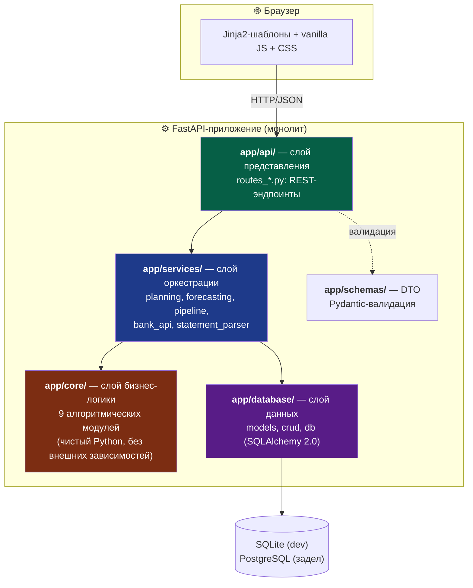
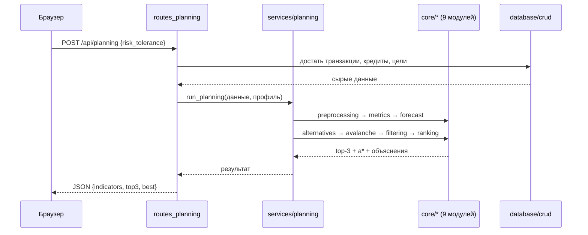
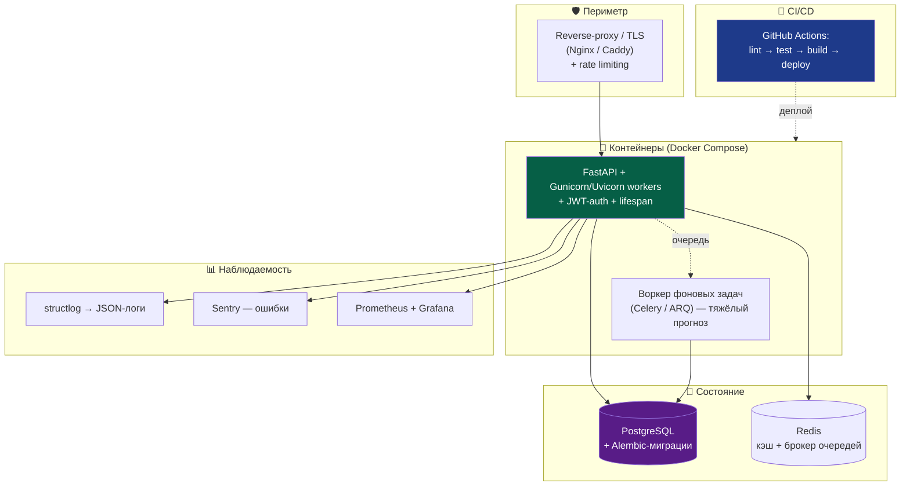

# 🏗️ FINPILOT — IT-стек: текущий и production-целевой

> **Что это.** Разбор технологического стека FINPILOT: что используется **сейчас** и почему, какие пробелы есть, и к чему стоит прийти, чтобы получился качественный **production-продукт**. Везде — аргументация, сравнения, плюсы/минусы и рекомендации.
>
> **Для кого.** Для тебя — чтобы довести проект до «hireable»-уровня и уверенно защищать решения. В конце — отдельный раздел **«Как подавать проект на собесе»**.
>
> **Принцип.** Сначала честно фиксируем «as is» по реальному коду, потом — обоснованный «to be». Не «модно/немодно», а «нужно/не нужно для этой задачи».

---

## 1. Текущая архитектура (as is)

FINPILOT — это **монолитное FastAPI-приложение** со слоистой (layered) архитектурой и server-side рендерингом. Чистое разделение ответственности по слоям — главная сильная сторона текущего кода.

**Почему слоистость — это правильно.** Запрос идёт строго `routes → services → core/db`. Алгоритмы (`core/`) **не знают** ни про HTTP, ни про БД — они принимают числа и списки, возвращают числа. Это значит: ядро можно тестировать изолированно, переиспользовать вне веба, и менять БД/фреймворк не трогая математику. Прямо соответствует требованию «независимость компонентов» из твоего ВКР (раздел 4.4).

### Поток одного запроса (на примере `/api/planning`)

---

## 2. Разбор стека «как сейчас»

Каждая технология — с обоснованием выбора и честными плюсами/минусами **для этого проекта**.

### 2.1. Python 3.12 + FastAPI 0.110

| | |
|---|---|
| **Почему выбран** | FastAPI — современный async-фреймворк с автогенерацией OpenAPI-доков, нативной интеграцией с Pydantic и type hints. Для проекта с REST API + аналитикой — почти идеален |
| **Плюсы для проекта** | Автодока `/docs` из коробки; валидация запросов через Pydantic бесплатно; type hints = меньше багов; быстрый старт; огромное комьюнити (= легко гуглить и нанимаемо) |
| **Минусы / риски** | Легко скатиться в «толстые роуты» с логикой внутри (здесь этого избежали — логика в services/core ✅); async-преимущество **не используется** — все эндпоинты и БД синхронные |
| **Вердикт** | ✅ Оставить. Правильный выбор, претензий нет |

### 2.2. Uvicorn 0.29 (ASGI-сервер)

| | |
|---|---|
| **Почему выбран** | Стандартный ASGI-сервер для FastAPI. `run.py` запускает с `reload=True` для разработки |
| **Плюсы** | Быстрый, простой, hot-reload в dev |
| **Минусы / риски** | `reload=True` и один воркер — это **только для разработки**. В проде так нельзя: нет параллелизма, падение процесса = падение сервиса |
| **Вердикт** | ⚠️ Для dev — ок. Для прода нужен менеджер процессов (см. §4) |

### 2.3. SQLAlchemy 2.0.30 (ORM)

| | |
|---|---|
| **Почему выбран** | Самый зрелый Python ORM. Важно: используется **новый стиль 2.0** (`Mapped`, `mapped_column`, `DeclarativeBase`) — это современно и выглядит профессионально |
| **Плюсы** | Типизированные модели; абстракция над БД (SQLite↔PostgreSQL без переписывания); `pool_pre_ping=True` уже стоит (защита от «протухших» коннектов) |
| **Минусы / риски** | Сессии **синхронные** (`Session`, не `AsyncSession`); `expire_on_commit=False` — удобно, но надо понимать последствия для свежести данных |
| **Вердикт** | ✅ Оставить. Современный и грамотный слой данных |

### 2.4. Pydantic 2.7 + pydantic-settings

| | |
|---|---|
| **Почему выбран** | Валидация DTO (`schemas/`) и типобезопасная загрузка конфига из `.env`. Pydantic 2 (на Rust-ядре) — быстрый |
| **Плюсы** | Конфиг через `Settings(BaseSettings)` — чисто, типизированно, секреты из `.env` (✅ совпадает с твоим правилом «секреты только через .env») |
| **Минусы** | Практически нет для этого масштаба |
| **Вердикт** | ✅ Оставить. Образцовая работа с конфигом |

### 2.5. Jinja2 + vanilla JS + CSS (фронтенд)

| | |
|---|---|
| **Почему выбран** | Server-side рендеринг страниц + клиентская логика на чистом JS. Без фронтенд-фреймворка |
| **Плюсы** | Нет сборки/npm/webpack — просто работает; быстрый старт; SEO-дружелюбно; одна кодовая база |
| **Минусы / риски** | `app.js` уже **63 КБ** — без модульности и фреймворка такой объём JS тяжело поддерживать; состояние UI и DOM-манипуляции вручную → растёт риск багов и дублирования |
| **Вердикт** | 🤔 Развилка (см. §5.2): рефакторинг vanilla / переход на HTMX / React |

### 2.6. SQLite (БД по умолчанию)

| | |
|---|---|
| **Почему выбран** | Ноль настройки — файл на диске. Идеально для прототипа и демо ВКР |
| **Плюсы** | Запускается где угодно без сервера БД; отлично для разработки и демонстрации |
| **Минусы / риски** | Слабая параллельная запись (блокировки на запись); нет сетевого доступа; не для многопользовательского прода. Заметь — в `db.py` уже есть **задел под PostgreSQL** (нормализация `postgres://` → `postgresql+psycopg://`) |
| **Вердикт** | ✅ Dev — ок. Прод — PostgreSQL (см. §4.1). Задел уже есть — отличное решение |

### 2.7. Прочее

- **python-multipart** — приём файлов (загрузка банковских выписок). Нужен, ок.
- **Mock банк-интеграция** (`bank_api.py`) — архитектура **адаптеров** с заглушками. Грамотно: интерфейс готов, реальные API подключаются позже без переписывания.
- **CSV-парсеры** (`statement_parser.py`) на stdlib `csv` — без pandas. Для парсинга выписок этого достаточно.
- **Матан на чистом Python** — без numpy/scipy. 🤔 Развилка (§5.3).

> ⚠️ **Расхождение с ВКР.** В таблице 10 диплома заявлены `pandas, numpy` как средства обработки данных — но в коде их **нет**, всё на стандартной библиотеке. На защите: *«в финальной реализации отказался от pandas/numpy — для текущего объёма данных хватает stdlib, это убирает тяжёлые зависимости»*. Честно и в плюс.

---

## 3. Честный аудит пробелов

То, чего в проде быть **обязано**, но в проекте пока нет. Это не критика — это нормальное состояние дипломного прототипа. Важно их видеть и иметь план.

| Что отсутствует | Чем грозит в проде | Приоритет |
|-----------------|--------------------|:---------:|
| **Тесты** (`tests/` пуст) | Любая правка может тихо сломать расчёт; нельзя рефакторить с уверенностью; **первое, что спросят на собесе** | 🔴 P1 |
| **Миграции БД** (нет Alembic) | Схема ведётся вручную через `init_db` с дозаливкой колонок — хрупко, не версионируется, не откатывается | 🔴 P1 |
| **Docker** | Запуск завязан на локальный Python 3.12 + venv (README весь про это); «у меня не работает» на чужой машине | 🔴 P1 |
| **Прод-сервер** (только uvicorn reload) | Один воркер, нет параллелизма, падение = даунтайм | 🟡 P2 |
| **Аутентификация** (single-user, `UserPrefs id=1`) | Любой видит чужие данные; нельзя выпускать многопользовательски | 🟡 P2 |
| **CORS = `["*"]`** | Открыт всем доменам — небезопасно для прода | 🟡 P2 |
| **`@app.on_event("startup")`** | Deprecated в новых FastAPI → перейти на `lifespan` | 🟡 P2 |
| **CI/CD** | Нет автопроверки качества при коммите | 🟡 P2 |
| **Логирование/мониторинг** | В проде «слепой полёт» — не видно ошибок и нагрузки | 🟢 P3 |
| **Rate limiting** | Уязвимость к перегрузке/абьюзу | 🟢 P3 |
| **Реальные банк-интеграции** | Сейчас только mock-данные | 🟢 P3 |

---

## 4. Целевая production-архитектура (to be)

### 4.1. По слоям: что добавить и почему

**База данных → PostgreSQL + Alembic.**
PostgreSQL — параллельная запись, сетевой доступ, многопользовательский режим, продвинутые типы. Задел в `db.py` уже есть — менять код почти не придётся, только `DATABASE_URL` и драйвер (`psycopg`). **Alembic** заменяет ручной `init_db`: версионирование схемы, миграции вперёд/назад, безопасные изменения в проде. *Резонирует с твоими growth-целями (БД-оптимизация) и тем, что PostgreSQL ты уже знаешь.*

**Сервер → Gunicorn + Uvicorn workers** (или `uvicorn --workers N`). Несколько процессов = параллелизм и устойчивость к падениям. `reload` только в dev.

**Аутентификация → OAuth2 + JWT** (FastAPI поддерживает нативно через `OAuth2PasswordBearer`). Добавить модель `User`, привязать `transactions/goals/...` к `user_id`, заменить хардкод `id=1`. Хеширование паролей — `passlib[bcrypt]`. *Закрывает твою growth-цель «security best practices».*

**Контейнеризация → Docker + docker-compose.** Multi-stage Dockerfile (сборка → лёгкий runtime-образ), compose поднимает `web + postgres + redis` одной командой. *Ты уже работаешь с Docker — это самый лёгкий и заметный апгрейд для портфолио.*

**Безопасность.** Сузить CORS до конкретных доменов; `lifespan` вместо `on_event`; rate limiting (`slowapi`); security-заголовки; HTTPS на проксе; секреты — `.env` локально, secret manager в проде.

**Наблюдаемость.** `structlog` (структурные JSON-логи) + Sentry (трекинг ошибок) + Prometheus/Grafana (метрики). В проде без этого не видно, что происходит. *Закрывает growth-цель DevOps.*

**Кэш и очереди (по мере роста).** Redis — кэш тяжёлых расчётов и сессий. Celery/ARQ — вынос Monte-Carlo в фон, если он начнёт тормозить ответ (сейчас ~мс, но при росте N или числа целей пригодится).

**CI/CD → GitHub Actions.** Pipeline `lint (ruff) → test (pytest) → build (docker) → deploy`. *Прямое попадание в твою growth-цель CI/CD и сильный сигнал для работодателя.*

---

## 5. Спорные развилки (2–3 варианта с трейдофами)

Здесь нет единственно верного ответа — выбор зависит от целей. Формат: варианты + что выбрать.

### 5.1. Синхронный vs асинхронный стек

| Вариант | Плюсы | Минусы | Когда брать |
|---------|-------|--------|-------------|
| **Sync (как сейчас)** | Проще писать и отлаживать; меньше подводных камней; для single-user/локально хватает с запасом | Не держит много одновременных I/O-запросов | Текущий масштаб, портфолио, демо |
| **Async** (`AsyncSession`, `asyncpg`) | Высокий throughput на I/O-bound нагрузке | Переписывание слоя данных; async «заразен» (всё вверх по стеку); сложнее дебажить | Реальный многопользовательский прод с сетевыми вызовами к банкам |

> **Рекомендация:** **оставить sync.** Async для текущей задачи — преждевременная оптимизация, которая усложнит код без выгоды. Это сильная позиция на собесе («не тащу async ради хайпа, понимаю когда он нужен»).

### 5.2. Фронтенд: vanilla JS / HTMX / React

| Вариант | Плюсы | Минусы | Когда брать |
|---------|-------|--------|-------------|
| **Рефакторинг vanilla JS** | Без новых зависимостей; разбить 63 КБ на модули | Всё равно ручной DOM, потолок поддерживаемости близко | Минимальные усилия, сохранить как есть |
| **HTMX** | Интерактивность через HTML-атрибуты, почти без JS; идеально для «формы + дашборд»; остаёшься в Jinja2/Python | Меньше подходит для сложных SPA-сценариев | **Твой случай** — server-side продукт с формами |
| **React/Vue** | Мощно для сложного интерактивного UI; очень нанимаемо | Целая экосистема (npm, сборка, состояние); overkill для этого продукта; раздувает scope | Если целишься в fullstack-позиции и хочешь SPA |

> **Рекомендация:** для самого продукта — **HTMX** (естественное развитие server-side подхода, малый порог). Но если карьерная цель — *fullstack/frontend-вакансии*, то **React** оправдан как обучающая инвестиция, даже если для FINPILOT это избыточно. Реши по тому, какие вакансии целишь.

### 5.3. Матан: чистый Python vs numpy/scipy/statsmodels

| Вариант | Плюсы | Минусы | Когда брать |
|---------|-------|--------|-------------|
| **Чистый Python (как сейчас)** | Ноль тяжёлых зависимостей; код прозрачен, **видно каждую формулу** (плюс для защиты!); для N=1000 быстро | Медленно при росте N/пользователей; «переизобретение» стандартных методов | Текущий масштаб; учебная ценность |
| **numpy** | Векторизация Monte-Carlo (10–100× быстрее); меньше кода | +зависимость; теряется «ручная» наглядность | Когда N или нагрузка вырастут |
| **statsmodels** | «Честный» Holt-Winters/SES из коробки, доверительные интервалы | Тяжёлая зависимость ради одной функции | Если прогноз станет сложнее (сезонность, тренды) |

> **Рекомендация:** **оставить чистый Python сейчас** — это даже преимущество на защите (демонстрирует, что понимаешь математику, а не просто зовёшь библиотеку). Заложить переход на numpy как «оптимизацию при росте». Честный инженерный трейдофф.

---

## 6. Дорожная карта (что делать в каком порядке)

Приоритезация под цель «**сделать портфолио hireable**» — максимум сигнала работодателю за минимум усилий.

```mermaid
flowchart LR
    subgraph P1["🔴 P1 — сделать первым (быстро + высокий эффект)"]
        T["pytest:<br/>тесты на core/*"]
        D["Docker +<br/>docker-compose"]
        A["Alembic-<br/>миграции"]
        SEC["Фиксы безопасности:<br/>CORS, lifespan"]
    end
    subgraph P2["🟡 P2 — закрепить продакшн"]
        PG["PostgreSQL<br/>по умолчанию"]
        CI["GitHub Actions:<br/>lint + test"]
        AUTH["JWT-auth<br/>(multi-user)"]
        LOG["structlog"]
    end
    subgraph P3["🟢 P3 — зрелость / рост"]
        OBS["Sentry +<br/>Prometheus"]
        REDIS["Redis-кэш"]
        BANK["Реальные<br/>банк-API"]
    end
    P1 --> P2 --> P3
    style P1 fill:#7f1d1d,color:#fff
    style P2 fill:#78350f,color:#fff
    style P3 fill:#14532d,color:#fff
```

**Почему такой порядок:**

1. **P1 — тесты + Docker + Alembic + security.** Это то, что рекрутер/тимлид проверяет в первую очередь и что показывает инженерную зрелость. Дёшево по времени, огромный сигнал. Тесты на `core/` особенно легки — модули чистые, без зависимостей.
2. **P2 — PostgreSQL + CI + auth + логи.** Превращает «прототип» в «маленький, но настоящий продукт». CI/CD и auth — прямые галочки в твоих growth-целях.
3. **P3 — observability + Redis + реальные банки.** Зрелость и масштаб. Делать, когда P1–P2 закрыты.

> **Правило:** не прыгай в P3 (модные Redis/очереди), пока не закрыт P1 (тесты/Docker). На собесе «есть тесты и Docker, нет Redis» выглядит в разы лучше, чем наоборот.

---

## 7. 🎤 Как подавать проект на собесе

Этот раздел — практический. FINPILOT — сильный портфолий-проект (named-алгоритмы, чистая архитектура, реальная предметная область). Задача — подать его так, чтобы это считывалось.

### 7.1. Elevator pitch (30 секунд)

> «FINPILOT — это система поддержки принятия решений по личным финансам. Она берёт доходы, расходы, кредиты и цели пользователя, прогнозирует денежный поток и через многокритериальную оптимизацию рекомендует, как распределить свободные деньги между погашением долга, резервом и целями — и **объясняет почему**. Backend на FastAPI + SQLAlchemy, ядро — девять алгоритмов из теории принятия решений, каждый с научным обоснованием. Главная фишка — в отличие от трекеров, система не просто считает, а советует обоснованное действие.»

Запомни три якоря: **прогноз + многокритериальный выбор + объяснимость**. Это то, чего нет у конкурентов, и это твоя дифференциация.

### 7.2. Что акцентировать (сильные стороны)

| Сильная сторона | Как подать |
|-----------------|------------|
| **Слоистая архитектура** | «Алгоритмы в `core/` не знают про HTTP и БД — принимают числа, возвращают числа. Поэтому их можно тестировать изолированно и переиспользовать. Слои: routes → services → core/db» |
| **Named-алгоритмы с источниками** | «Это не самописные эвристики — SAW (Fishburn), Avalanche (Bach), SES (Brown), Monte-Carlo, min-max нормализация. Каждое число обосновано: ПДН от ЦБ РФ, нормы ликвидности от Greninger, веса целей от теории человеческого капитала Беккера» |
| **Современный стек** | «SQLAlchemy 2.0 в новом стиле (`Mapped`, `DeclarativeBase`), Pydantic 2, типизированный конфиг через pydantic-settings, секреты только в `.env`» |
| **Объяснимость как дизайн** | «Намеренно выбрал template-based NLG, а не LLM — для финрекомендаций важнее детерминизм и отсутствие галлюцинаций, чем красноречие» |
| **Инженерные трейдоффы** | «Async не тащил — для текущего масштаба это преждевременная оптимизация. numpy не тащил — для N=1000 хватает stdlib, зато код прозрачен» |

> Демонстрация трейдоффов = главный признак инженера, а не кодера. Работодатель ценит «почему НЕ сделал X» не меньше, чем «сделал Y».

### 7.3. Вероятные вопросы и как отвечать

**«Почему FastAPI, а не Django/Flask?»**
> «Нужен был REST API с валидацией и автодокой. FastAPI даёт OpenAPI из коробки, нативную Pydantic-валидацию и type hints. Django был бы избыточен (мне не нужна его admin/ORM-связка), Flask потребовал бы больше ручной обвязки для того же результата.»

**«Почему SQLite? Это же не для прода.»**
> «SQLite — осознанно для прототипа и демо: ноль настройки. Но слой данных уже готов к PostgreSQL — в `db.py` есть нормализация URL `postgres://` → `postgresql+psycopg://`. Переход — это смена `DATABASE_URL` и драйвера, код не меняется. В проде взял бы PostgreSQL за параллельную запись и многопользовательский режим.»
> *(Показываешь, что понимаешь ограничения и заранее заложил миграцию — это сильно.)*

**«А где тесты?»** ⚠️ *самый вероятный вопрос*
> «Тесты — мой ближайший следующий шаг, и архитектура под них уже готова: модули в `core/` чистые, без зависимостей от БД и HTTP, поэтому юнит-тесты пишутся тривиально. План: pytest на `core/` (метрики, Avalanche, ранжирование на эталонных сценариях из ВКР), потом интеграционные на эндпоинты через TestClient.»
> *(Честность + конкретный план + понимание, ПОЧЕМУ архитектура упрощает тесты = превращает слабость в демонстрацию зрелости.)*

**«Как бы ты это масштабировал?»**
> «По слоям. БД → PostgreSQL + Alembic. Сервер → Gunicorn с несколькими uvicorn-воркерами. Тяжёлый Monte-Carlo → в фон через Celery/ARQ. Кэш частых расчётов → Redis. Многопользовательский режим → JWT-auth и привязка данных к user_id. Но я бы не делал это всё сразу — сначала тесты и Docker, потом уже инфраструктуру.»

**«Почему матан на чистом Python, а не numpy?»**
> «Для N=1000 итераций Monte-Carlo чистый Python отрабатывает за миллисекунды — numpy не нужен, а зависимость лишняя. Плюс код остаётся прозрачным: видно каждую формулу. Когда N или число пользователей вырастут — векторизую через numpy, это заложено как оптимизация.»

**«Объясни архитектуру проекта.»**
> Рисуешь слои: `api/` (роуты, тонкие — только приём/отдача) → `services/` (оркестраторы, собирают pipeline) → `core/` (алгоритмы, чистая логика) + `database/` (модели + CRUD) + `schemas/` (Pydantic DTO). Подчёркиваешь: зависимости идут в одну сторону, ядро ни от чего не зависит.

**«Что было самым сложным?»**
> Хороший честный ответ — про математику: «Свести многокритериальную задачу к одному числу так, чтобы результат был объяснимым. Нормализация разнородных критериев (рубли, доли, месяцы) к [0,1] и подбор весов профилей риска — здесь пришлось разбираться в теории принятия решений, а не просто кодить.»

**«Что бы ты улучшил / переделал?»** ⚠️ *классика — проверка зрелости*
> «Три вещи в порядке приоритета: тесты, Docker, миграции через Alembic. Плюс убрал бы хардкод single-user — добавил бы auth. И откалибровал бы веса профилей риска на данных моего опроса 385 респондентов, сейчас они заданы экспертно.»
> *(Готовый roadmap = ты видишь свой проект критически и системно.)*

**«CORS у тебя `["*"]` — это безопасно?»** *(если посмотрят код)*
> «Нет, это для разработки. В проде сузил бы до конкретных доменов фронтенда. Это в моём списке security-фиксов вместе с переходом на `lifespan` вместо deprecated `on_event` и добавлением rate limiting.»
> *(Сам признал проблему до того, как на неё надавили = честность и внимание к деталям.)*

### 7.4. Что открыть в коде на собесе

Если попросят показать код — веди их по этому маршруту (от сильного к сильному):

1. **`app/core/ranking.py`** — SAW + профили риска. Чистая логика, named-метод, обоснованные веса. Главный «вау-файл».
2. **`app/core/avalanche.py`** — Avalanche + OCR-фильтр. Показывает, что понимаешь финансовую логику (почему дешёвый долг гасить не надо).
3. **`app/services/planning.py`** — оркестратор. Показывает архитектурное мышление: как 9 модулей собираются в pipeline.
4. **`app/database/db.py`** — задел под PostgreSQL. Показывает, что думал о масштабировании заранее.
5. **`app/config.py`** — типизированный конфиг, секреты через `.env`. Аккуратность.

> Не показывай `app.js` (63 КБ vanilla) первым — это слабое место. Если спросят про фронт — честно: «server-side на Jinja2, JS пока ванильный, в планах рефакторинг или HTMX».

### 7.5. Превращение слабостей в силу

Универсальная формула ответа про любой пробел:

> **Признать прямо → объяснить, почему так вышло (осознанный выбор для прототипа) → показать, что знаешь правильное решение → назвать место в roadmap.**

| Слабость | Формула ответа |
|----------|----------------|
| Нет тестов | «Следующий шаг; архитектура готова — core/ чистый» |
| SQLite | «Для демо; задел под PostgreSQL уже в коде» |
| Нет Docker | «В P1 моего roadmap; я работаю с Docker, добавлю compose с web+postgres» |
| Single-user | «Прототип под одного; auth через JWT — в плане» |
| CORS `*` | «Dev-настройка; сужу в проде» |
| Vanilla JS | «Server-side подход; рефакторинг/HTMX в планах» |

**Главное:** никогда не оправдывайся и не извиняйся. Это **прототип ВКР**, у него правильное состояние для своей стадии. Ты не «не доделал» — ты «осознанно ограничил scope под задачу и видишь путь дальше». Это позиция инженера.

### 7.6. Чек-лист перед собесом

- [ ] Могу за 30 сек объяснить, что делает продукт и в чём фишка (прогноз+выбор+объяснимость)
- [ ] Могу нарисовать слоистую архитектуру на бумаге
- [ ] Знаю обоснование 3–4 ключевых чисел (D_max=ПДН ЦБ, веса целей=Беккер, α=0.3, 21 альтернатива)
- [ ] Готов ответ «где тесты» и «что улучшил бы»
- [ ] Знаю, какие 5 файлов показывать и в каком порядке
- [ ] Если успею до собеса — закрыл хотя бы P1 (тесты + Docker): это меняет разговор кардинально

---

## 📌 Итоговая сводка

**Текущий стек (as is):** Python 3.12 · FastAPI · Uvicorn · SQLAlchemy 2.0 (sync) · Pydantic 2 · Jinja2 + vanilla JS · SQLite. Слоистая архитектура, чистое ядро, современные версии. Грамотный прототип.

**Целевой стек (to be):** + PostgreSQL/Alembic · Gunicorn-воркеры · JWT-auth · Docker/compose · GitHub Actions CI · structlog/Sentry · (Redis/очереди по росту). Тот же код, обвешанный продакшн-инфраструктурой.

**Что делать первым:** тесты → Docker → Alembic → security-фиксы (P1). Это даёт максимум «hireable»-сигнала за минимум времени.

**Философия выбора, которую стоит держать:** брать технологию под задачу, а не под хайп. Async, React, Redis — мощные инструменты, но в FINPILOT они пока решение несуществующей проблемы. Умение это видеть — то, что отличает инженера от собирателя модных слов.
