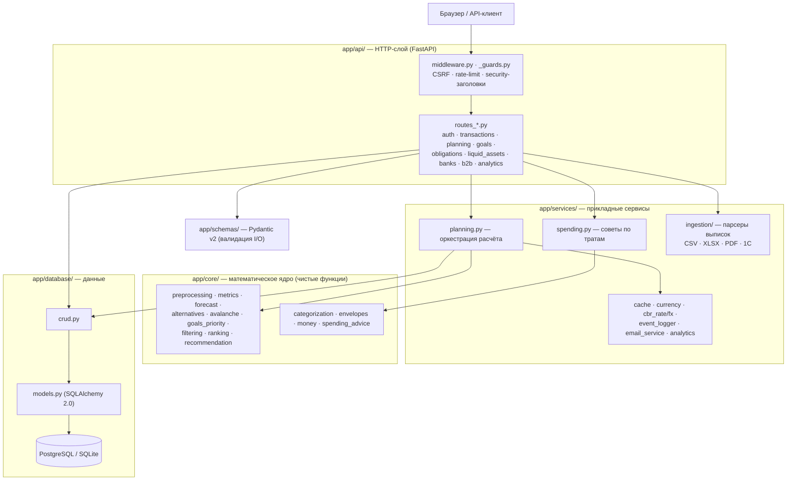
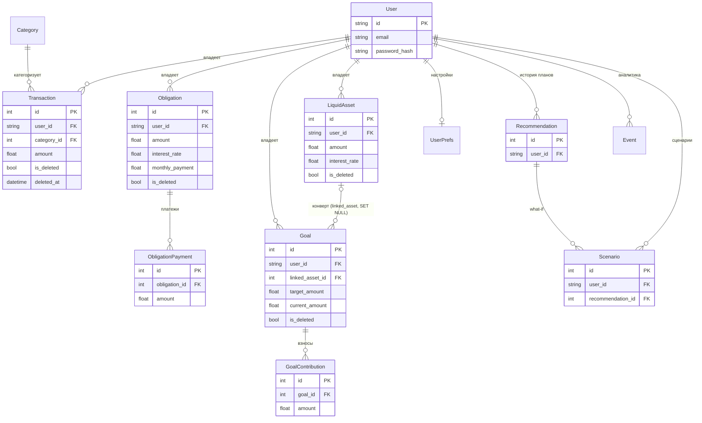
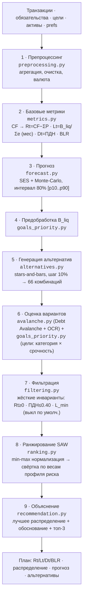
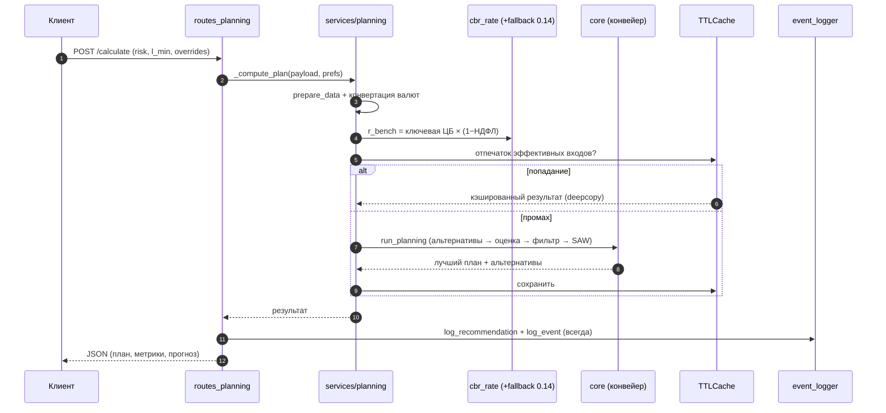

# FINPILOT — Архитектурные диаграммы

> Стабильные диаграммы, отражающие фундамент системы: слои приложения, модель данных
> и математический конвейер ядра. Это «медленные» вещи — математика зафиксирована в
> `Математическая_модель_v3_0_0.md` (v3.0.0), структура сущностей и слоёв устоялась.
> Диаграммы построены **по коду** (`app/`), а не по намерению. Формат — Mermaid (рендерится
> в GitHub и большинстве IDE). При изменении кода, влияющего на схему, диаграмму обновляем
> в том же батче.
>
> Содержание: [1. Архитектура слоёв](#1-архитектура-слоёв) ·
> [2. Модель данных (ER)](#2-модель-данных-er) ·
> [3. Конвейер ядра (9 шагов)](#3-конвейер-ядра-9-шагов) ·
> [4. Поток запроса `/calculate`](#4-поток-запроса-apiplanningcalculate)

---

## 1. Архитектура слоёв

Однонаправленная зависимость: HTTP → сервисы → ядро/БД. Ядро (`app/core/`) не знает о
вебе и не ходит в БД — чистые функции над переданными данными (это и делает его
тестируемым и переиспользуемым).

---

## 2. Модель данных (ER)

Финансовое ядро. `User` — корень владения (почти у всех таблиц есть `user_id`; гостевой
режим = `user_id IS NULL`). `Transaction`, `Obligation`, `Goal`, `LiquidAsset` несут
soft-delete (`is_deleted` / `deleted_at`). Историю несут дочерние `ObligationPayment` и
`GoalContribution`. `Recommendation` — снимки выданных планов, `Event` — аналитика воронки.

> Второстепенные таблицы (вне ядра планирования) на схеме опущены для читаемости:
> `Budget`, `FxRate`, `PlaidToken`, `ManualSnapshot`, `NotificationLog`, `Category`-справочник.

---

## 3. Конвейер ядра (9 шагов)

Главный алгоритм — **стек именованных методов**, а не одна формула (подробно по шагам:
`algorithm_stack.md`; параметры — `Математическая_модель_v3_0_0.md`). Шаги 1–2 — учёт,
3 — прогноз, 4–8 — выбор, 9 — объяснение.

---

## 4. Поток запроса `/api/planning/calculate`

Как HTTP-запрос проходит слои до ядра и обратно. `run_planning` (шаги 5–8 конвейера) обёрнут
TTL-кэшем по отпечатку эффективных входов; логирование воронки выполняется **на каждый**
вызов, даже при попадании в кэш (поэтому кэш — вокруг расчёта, не вокруг роута).

