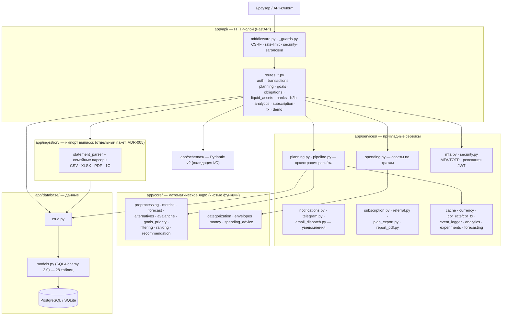
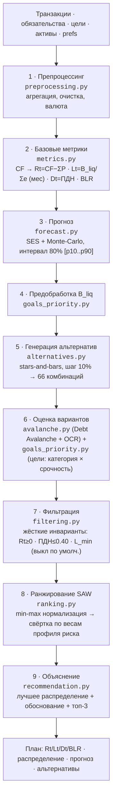
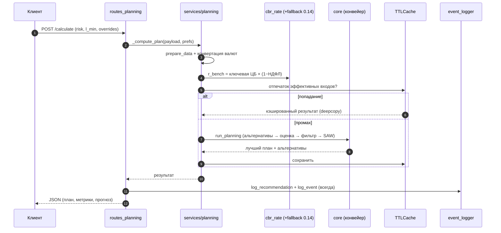
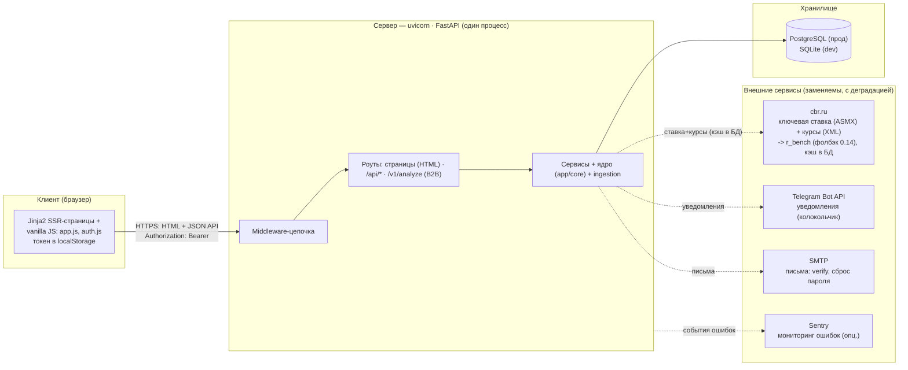
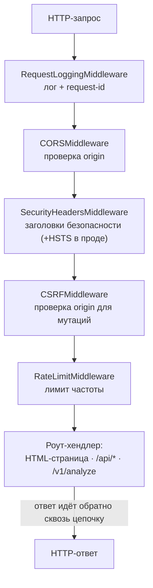
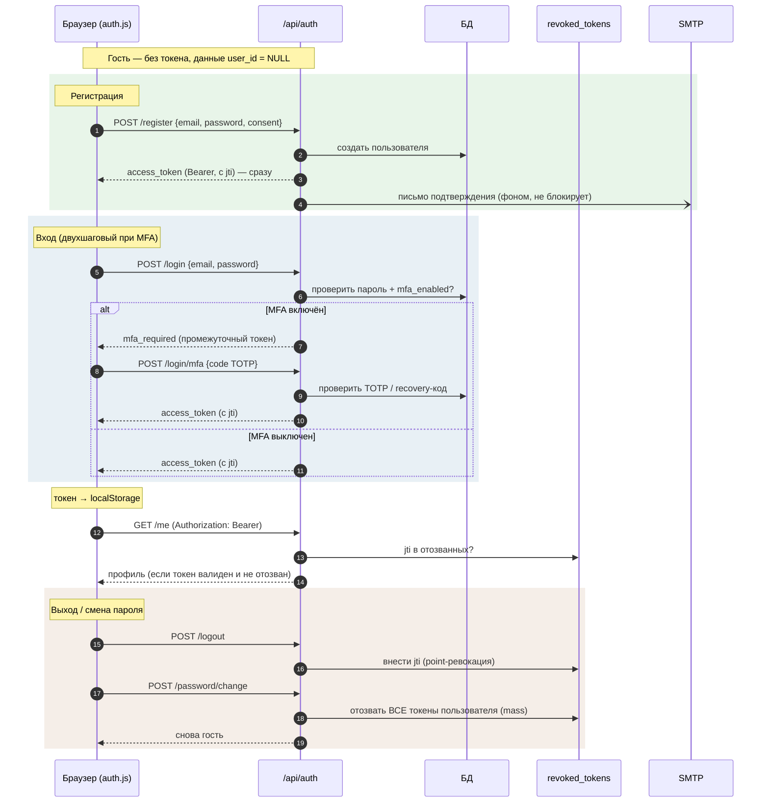
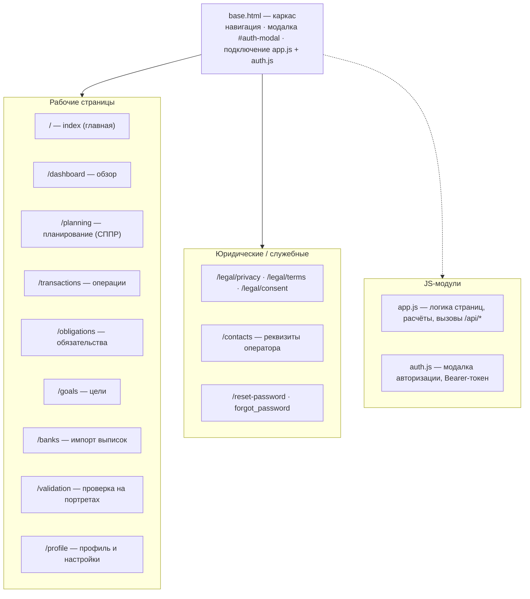
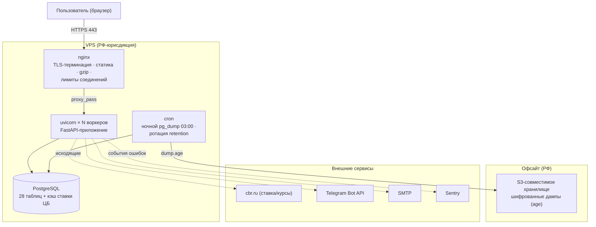

# FINPILOT — Архитектурные диаграммы

> Стабильные диаграммы, отражающие фундамент системы: слои приложения, модель данных,
> математический конвейер ядра, развёртывание и связи компонентов, жизненный цикл запроса,
> аутентификацию и карту фронта. Это «медленные» вещи — математика зафиксирована в
> `math_model.md` (v3.5.0), структура сущностей и слоёв устоялась.
> Диаграммы построены **по коду** (`app/`), а не по намерению. Формат — Mermaid (рендерится
> в GitHub и большинстве IDE). При изменении кода, влияющего на схему, диаграмму обновляем
> в том же батче. **Синхронизировано с кодом: v5.12.0 (2026-07-02) — 28 таблиц, MFA, ingestion-пакет, cbr.ru.**
>
> Содержание: [1. Архитектура слоёв](#1-архитектура-слоёв) ·
> [2. Модель данных (ER)](#2-модель-данных-er) ·
> [3. Конвейер ядра (9 шагов)](#3-конвейер-ядра-9-шагов) ·
> [4. Поток запроса `/calculate`](#4-поток-запроса-apiplanningcalculate) ·
> [5. Развёртывание и компоненты](#5-развёртывание-и-компоненты) ·
> [6. Жизненный цикл запроса](#6-жизненный-цикл-запроса-middleware-конвейер) ·
> [7. Аутентификация и сессия](#7-аутентификация-и-сессия) ·
> [8. Карта фронта](#8-карта-фронта-страницы-и-навигация)

---

## 1. Архитектура слоёв

Однонаправленная зависимость: HTTP -> сервисы -> ядро/БД. Ядро (`app/core/`) не знает о
вебе и не ходит в БД - чистые функции над переданными данными (это и делает его
тестируемым и переиспользуемым). Импорт выписок вынесен в отдельный пакет `app/ingestion/`
(ADR-005), а не в сервисы.

```mermaid
flowchart TD
    Client["Браузер / API-клиент"]

    subgraph HTTP["app/api/ — HTTP-слой (FastAPI)"]
        Routes["routes_*.py<br/>auth · transactions · planning · goals · obligations ·<br/>liquid_assets · banks · b2b · analytics · subscription · fx · demo"]
        MW["middleware.py · _guards.py<br/>CSRF · rate-limit · security-заголовки"]
    end

    subgraph SVC["app/services/ — прикладные сервисы"]
        Planning["planning.py · pipeline.py — оркестрация расчёта"]
        Spending["spending.py — советы по тратам"]
        AuthSvc["mfa.py · security.py<br/>MFA/TOTP · ревокация JWT"]
        Notif["notifications.py · telegram.py ·<br/>email_dispatch.py — уведомления"]
        Money["subscription.py · referral.py ·<br/>plan_export.py · report_pdf.py"]
        Infra["cache · currency · cbr_rate/cbr_fx ·<br/>event_logger · analytics · experiments · forecasting"]
    end

    subgraph ING["app/ingestion/ — импорт выписок (отдельный пакет, ADR-005)"]
        Parsers["statement_parser + семейные парсеры<br/>CSV · XLSX · PDF · 1C"]
    end

    subgraph CORE["app/core/ — математическое ядро (чистые функции)"]
        direction LR
        Pipeline["preprocessing · metrics · forecast ·<br/>alternatives · avalanche · goals_priority ·<br/>filtering · ranking · recommendation"]
        Support["categorization · envelopes · money · spending_advice"]
    end

    subgraph DATA["app/database/ — данные"]
        CRUD["crud.py"]
        Models["models.py (SQLAlchemy 2.0) — 28 таблиц"]
        DB[("PostgreSQL / SQLite")]
    end

    Schemas["app/schemas/ — Pydantic v2 (валидация I/O)"]

    Client --> MW --> Routes
    Routes --> Schemas
    Routes --> Planning
    Routes --> Spending
    Routes --> AuthSvc
    Routes --> ING
    Routes --> CRUD
    Planning --> Pipeline
    Planning --> CRUD
    Planning --> Infra
    Spending --> Support
    ING --> CRUD
    CRUD --> Models --> DB
```

---

## 2. Модель данных (ER) — 28 таблиц

Полная схема (все 28 таблиц из `app/database/models.py`). Два хаба владения: `users`
(почти у всех таблиц `user_id`; гость = `user_id IS NULL`) и `households` (семейные бюджеты,
общий `household_id`). `transactions`/`obligations`/`goals`/`liquid_assets` несут soft-delete.
Историю несут `obligation_payments`/`goal_contributions`. Инфраструктурные таблицы
(`fx_rates`, `cbr_key_rate_cache`, `revoked_tokens`, `events`, `notifications*`) — без FK,
живут сами по себе.

```mermaid
erDiagram
    %% --- владение: users ---
    users ||--o{ transactions : "владеет"
    users ||--o{ obligations : "владеет"
    users ||--o{ goals : "владеет"
    users ||--o{ liquid_assets : "владеет"
    users ||--o{ budgets : "бюджеты"
    users ||--o{ scenarios : "сценарии"
    users ||--o| user_prefs : "настройки"
    users ||--o{ plan_snapshots : "история планов"
    users ||--o{ recommendations : "рекомендации"
    users ||--o{ user_category_rules : "правила"
    users ||--o{ mfa_recovery_codes : "MFA-коды"
    users ||--o{ plaid_tokens : "Open Banking"
    users ||--o{ households : "владеет (owner)"
    users ||--o{ household_memberships : "участие"

    %% --- семья: households ---
    households ||--o{ household_memberships : "состав"
    households ||--o{ household_invites : "приглашения"
    households |o--o{ transactions : "семейн."
    households |o--o{ obligations : "семейн."
    households |o--o{ goals : "семейн."
    households |o--o{ liquid_assets : "семейн."
    households |o--o{ budgets : "семейн."
    households |o--o{ scenarios : "семейн."
    households |o--o{ plan_snapshots : "семейн."

    %% --- локальные родители ---
    categories ||--o{ transactions : "категоризует"
    categories ||--o{ user_category_rules : "правило"
    liquid_assets |o--o{ goals : "конверт (linked_asset, SET NULL)"
    obligations ||--o{ obligation_payments : "платежи"
    goals ||--o{ goal_contributions : "взносы"
    recommendations ||--o{ scenarios : "what-if"
    experiments ||--o{ experiment_assignments : "A/B"

    users {
        string id PK
        string email UK
        string password_hash
        bool is_verified
        bool mfa_enabled
    }
    households {
        int id PK
        string owner_id FK
        string name
    }
    household_memberships {
        int id PK
        int household_id FK
        string user_id FK
        string role
    }
    household_invites {
        int id PK
        int household_id FK
        string created_by FK
        string accepted_by FK
        string token UK
    }
    transactions {
        int id PK
        string user_id FK
        int household_id FK
        int category_id FK
        float amount
        bool is_deleted
    }
    obligations {
        int id PK
        string user_id FK
        int household_id FK
        float amount
        float interest_rate
        float monthly_payment
    }
    obligation_payments {
        int id PK
        int obligation_id FK
        float amount
        date paid_at
    }
    goals {
        int id PK
        string user_id FK
        int household_id FK
        int linked_asset_id FK
        float target_amount
        float current_amount
    }
    goal_contributions {
        int id PK
        int goal_id FK
        float amount
        date contributed_at
    }
    liquid_assets {
        int id PK
        string user_id FK
        int household_id FK
        float amount
        float interest_rate
    }
    budgets {
        int id PK
        string user_id FK
        int household_id FK
        int category_id FK
        float limit_amount
    }
    scenarios {
        int id PK
        string user_id FK
        int household_id FK
        int recommendation_id FK
        json overrides
    }
    recommendations {
        int id PK
        string user_id FK
        json allocation
        datetime created_at
    }
    plan_snapshots {
        int id PK
        string user_id FK
        int household_id FK
        json plan
        datetime created_at
    }
    categories {
        int id PK
        string name
        string kind
    }
    user_category_rules {
        int id PK
        string user_id FK
        int category_id FK
        string pattern
    }
    user_prefs {
        int id PK
        string user_id FK
        int risk_profile
        string base_currency
    }
    manual_snapshots {
        int id PK
        string user_id FK
        json data
    }
    plaid_tokens {
        int id PK
        string user_id FK
        string access_token
    }
    mfa_recovery_codes {
        int id PK
        string user_id FK
        string code_hash
        bool used
    }
    revoked_tokens {
        int id PK
        string jti UK
        datetime revoked_at
    }
    notifications {
        int id PK
        string user_id
        string type
        bool is_read
    }
    notification_log {
        int id PK
        string user_id
        string channel
        datetime sent_at
    }
    events {
        int id PK
        string name
        string user_id
        datetime created_at
    }
    experiments {
        int id PK
        string key UK
        bool active
    }
    experiment_assignments {
        int id PK
        int experiment_id FK
        string user_id
        string variant
    }
    fx_rates {
        int id PK
        string pair
        float rate
        date as_of
    }
    cbr_key_rate_cache {
        int id PK
        float rate
        date as_of
    }
```

> ER построена по `app/database/models.py` (28 `__tablename__`). Доменные dataclass'ы
> `app/ingestion/models.py` (Account, Debt, Goal, Snapshot...) — это DTO пайплайна импорта,
> НЕ таблицы, поэтому на ER их нет.

---

## 3. Конвейер ядра (9 шагов)

Главный алгоритм — **стек именованных методов**, а не одна формула (подробно по шагам:
`algorithm_stack.md`; параметры — `math_model.md`). Шаги 1–2 — учёт,
3 — прогноз, 4–8 — выбор, 9 — объяснение.

```mermaid
flowchart TD
    In["Транзакции · обязательства · цели · активы · prefs"]

    S1["1 · Препроцессинг<br/><code>preprocessing.py</code><br/>агрегация, очистка, валюта"]
    S2["2 · Базовые метрики<br/><code>metrics.py</code><br/>CF → Rt=CF−ΣP · Lt=B_liq/Σe (мес) · Dt=ПДН · BLR"]
    S3["3 · Прогноз<br/><code>forecast.py</code><br/>SES + Monte-Carlo, интервал 80% [p10..p90]"]
    S4["4 · Предобработка B_liq<br/><code>goals_priority.py</code>"]
    S5["5 · Генерация альтернатив<br/><code>alternatives.py</code><br/>stars-and-bars, шаг 10% → 66 комбинаций"]
    S6["6 · Оценка вариантов<br/><code>avalanche.py</code> (Debt Avalanche + OCR) +<br/><code>goals_priority.py</code> (цели: категория × срочность)"]
    S7["7 · Фильтрация<br/><code>filtering.py</code><br/>жёсткие инварианты: Rt≥0 · ПДН≤0.40 · L_min (выкл по умолч.)"]
    S8["8 · Ранжирование SAW<br/><code>ranking.py</code><br/>min-max нормализация → свёртка по весам профиля риска"]
    S9["9 · Объяснение<br/><code>recommendation.py</code><br/>лучшее распределение + обоснование + топ-3"]
    Out["План: Rt/Lt/Dt/BLR · распределение · прогноз · альтернативы"]

    In --> S1 --> S2 --> S3 --> S4 --> S5 --> S6 --> S7 --> S8 --> S9 --> Out
```

---

## 4. Поток запроса `/api/planning/calculate`

Как HTTP-запрос проходит слои до ядра и обратно. `run_planning` (шаги 5–8 конвейера) обёрнут
TTL-кэшем по отпечатку эффективных входов; логирование воронки выполняется **на каждый**
вызов, даже при попадании в кэш (поэтому кэш — вокруг расчёта, не вокруг роута).

```mermaid
sequenceDiagram
    autonumber
    participant C as Клиент
    participant R as routes_planning
    participant P as services/planning
    participant Rate as cbr_rate (+fallback 0.14)
    participant Core as core (конвейер)
    participant Cache as TTLCache
    participant Log as event_logger

    C->>R: POST /calculate (risk, l_min, overrides)
    R->>P: _compute_plan(payload, prefs)
    P->>P: prepare_data + конвертация валют
    P->>Rate: r_bench = ключевая ЦБ × (1−НДФЛ)
    P->>Cache: отпечаток эффективных входов?
    alt попадание
        Cache-->>P: кэшированный результат (deepcopy)
    else промах
        P->>Core: run_planning (альтернативы → оценка → фильтр → SAW)
        Core-->>P: лучший план + альтернативы
        P->>Cache: сохранить
    end
    P-->>R: результат
    R->>Log: log_recommendation + log_event (всегда)
    R-->>C: JSON (план, метрики, прогноз)
```

---

## 5. Развёртывание и компоненты

Как части системы связаны в проде. Сервер - единый процесс FastAPI под uvicorn (SSR-шаблоны
+ статика + API в одном приложении). Внешние зависимости немногочисленны и заменяемы; их
недоступность не роняет приложение (ставка ЦБ имеет фолбэк и кэш в БД, письма/уведомления/
мониторинг - опциональны).

```mermaid
flowchart LR
    subgraph Client["Клиент (браузер)"]
        UI["Jinja2 SSR-страницы +<br/>vanilla JS: app.js, auth.js<br/>токен в localStorage"]
    end

    subgraph Server["Сервер — uvicorn · FastAPI (один процесс)"]
        MW["Middleware-цепочка"]
        Routes["Роуты: страницы (HTML) · /api/* · /v1/analyze (B2B)"]
        Svc["Сервисы + ядро (app/core) + ingestion"]
    end

    subgraph Data["Хранилище"]
        DB[("PostgreSQL (прод)<br/>SQLite (dev)")]
    end

    subgraph Ext["Внешние сервисы (заменяемы, с деградацией)"]
        CBR["cbr.ru<br/>ключевая ставка (ASMX) + курсы (XML)<br/>-> r_bench (фолбэк 0.14), кэш в БД"]
        TG["Telegram Bot API<br/>уведомления (колокольчик)"]
        SMTP["SMTP<br/>письма: verify, сброс пароля"]
        Sentry["Sentry<br/>мониторинг ошибок (опц.)"]
    end

    UI -->|"HTTPS: HTML + JSON API<br/>Authorization: Bearer"| MW
    MW --> Routes --> Svc
    Svc --> DB
    Svc -. "ставка+курсы (кэш в БД)" .-> CBR
    Svc -. "уведомления" .-> TG
    Svc -. "письма" .-> SMTP
    Server -. "события ошибок" .-> Sentry
```

---

## 6. Жизненный цикл запроса (middleware-конвейер)

Любой HTTP-запрос проходит сквозь цепочку middleware до роута и обратно. Порядок —
обратный регистрации в `main.py` (последний `add_middleware` оборачивает снаружи). Это
стабильный инфраструктурный слой, общий для страниц и API.

```mermaid
flowchart TD
    Req["HTTP-запрос"]
    L1["RequestLoggingMiddleware<br/>лог + request-id"]
    L2["CORSMiddleware<br/>проверка origin"]
    L3["SecurityHeadersMiddleware<br/>заголовки безопасности (+HSTS в проде)"]
    L4["CSRFMiddleware<br/>проверка origin для мутаций"]
    L5["RateLimitMiddleware<br/>лимит частоты"]
    Router["Роут-хендлер:<br/>HTML-страница · /api/* · /v1/analyze"]
    Resp["HTTP-ответ"]

    Req --> L1 --> L2 --> L3 --> L4 --> L5 --> Router
    Router -->|"ответ идёт обратно сквозь цепочку"| Resp
```

---

## 7. Аутентификация и сессия

Гостевой режим - первоклассный: без токена приложение работает с данными `user_id IS NULL`.
Регистрация возвращает Bearer сразу; вход - **двухшаговый при включённом MFA** (пароль ->
TOTP-челлендж). Токены отзываемы на сервере: у каждого JWT есть `jti`, при выходе он попадает в
`revoked_tokens`; смена/сброс пароля отзывает ВСЕ токены пользователя (mass-ревокация). Токен
хранится в localStorage и подставляется в `Authorization`.

```mermaid
sequenceDiagram
    autonumber
    participant U as Браузер (auth.js)
    participant API as /api/auth
    participant DB as БД
    participant Rev as revoked_tokens
    participant Mail as SMTP

    Note over U,API: Гость — без токена, данные user_id = NULL

    rect rgb(232, 245, 233)
    Note over U: Регистрация
    U->>API: POST /register {email, password, consent}
    API->>DB: создать пользователя
    API-->>U: access_token (Bearer, с jti) — сразу
    API-)Mail: письмо подтверждения (фоном, не блокирует)
    end

    rect rgb(232, 240, 245)
    Note over U: Вход (двухшаговый при MFA)
    U->>API: POST /login {email, password}
    API->>DB: проверить пароль + mfa_enabled?
    alt MFA включён
        API-->>U: mfa_required (промежуточный токен)
        U->>API: POST /login/mfa {code TOTP}
        API->>DB: проверить TOTP / recovery-код
        API-->>U: access_token (с jti)
    else MFA выключен
        API-->>U: access_token (с jti)
    end
    end

    Note over U: токен → localStorage

    U->>API: GET /me (Authorization: Bearer)
    API->>Rev: jti в отозванных?
    API-->>U: профиль (если токен валиден и не отозван)

    rect rgb(245, 238, 232)
    Note over U: Выход / смена пароля
    U->>API: POST /logout
    API->>Rev: внести jti (point-ревокация)
    U->>API: POST /password/change
    API->>Rev: отозвать ВСЕ токены пользователя (mass)
    API-->>U: снова гость
    end
```

---

## 8. Карта фронта (страницы и навигация)

Тонкий SSR-фронт: один каркас `base.html` (навигация + модалка авторизации + подключение JS),
от которого наследуются все страницы. Логика — два модуля: `app.js` (страницы, расчёты,
CRUD-вызовы API) и `auth.js` (модалка входа/регистрации). Набор страниц давно стабилен.

```mermaid
flowchart TD
    Base["base.html — каркас<br/>навигация · модалка #auth-modal · подключение app.js + auth.js"]

    subgraph Core["Рабочие страницы"]
        Index["/ — index (главная)"]
        Dash["/dashboard — обзор"]
        Plan["/planning — планирование (СППР)"]
        Tx["/transactions — операции"]
        Obl["/obligations — обязательства"]
        Goals["/goals — цели"]
        Banks["/banks — импорт выписок"]
        Val["/validation — проверка на портретах"]
        Profile["/profile — профиль и настройки"]
    end

    subgraph Legal["Юридические / служебные"]
        Privacy["/legal/privacy · /legal/terms · /legal/consent"]
        Contacts["/contacts — реквизиты оператора"]
        Reset["/reset-password · forgot_password"]
    end

    subgraph JS["JS-модули"]
        AppJs["app.js — логика страниц, расчёты, вызовы /api/*"]
        AuthJs["auth.js — модалка авторизации, Bearer-токен"]
    end

    Base --> Core
    Base --> Legal
    Base -.-> JS
```

## 9. Физическое развёртывание (целевое, веха 9)

Один VPS РФ-юрисдикции (152-ФЗ: локализация ПДн + бэкапы в РФ). nginx терминирует TLS и раздаёт
статику, uvicorn-workers за ним, PostgreSQL локально, ночные дампы + офсайт-копия. Подробности
процедур — `docs/DEPLOY.md`, `docs/backup_restore.md`; SLO — `docs/slo.md`.

```mermaid
flowchart TD
    U["Пользователь (браузер)"] -->|HTTPS 443| N

    subgraph VPS["VPS (РФ-юрисдикция)"]
        N["nginx<br/>TLS-терминация · статика · gzip ·<br/>лимиты соединений"]
        A["uvicorn × N воркеров<br/>FastAPI-приложение"]
        PG[("PostgreSQL<br/>28 таблиц + кэш ставки ЦБ")]
        CRON["cron<br/>ночной pg_dump 03:00 ·<br/>ротация retention"]
        N -->|proxy_pass| A
        A --> PG
        CRON --> PG
    end

    subgraph OFF["Офсайт (РФ)"]
        S3["S3-совместимое хранилище<br/>шифрованные дампы (age)"]
    end
    CRON -->|"dump.age"| S3

    subgraph EXT["Внешние сервисы"]
        CBR["cbr.ru (ставка/курсы)"]
        TG["Telegram Bot API"]
        MAIL["SMTP"]
        SEN["Sentry"]
    end
    A -. "исходящие" .-> CBR
    A -. " " .-> TG
    A -. " " .-> MAIL
    A -. "события ошибок" .-> SEN
```
