# FINPILOT — Полный комплект диаграмм и схем

> **Документ-комплект для ВКР.** Содержит 20 диаграмм по продукту FINPILOT (СППР в персональных финансах), разбитых по разделам выпускной работы. Для каждой диаграммы дан исходный код (Mermaid / PlantUML / DBML / Graphviz), указано **в какое приложение его вставить** для качественного рендера, и привязка к разделу ВКР.
>
> Все диаграммы построены **по реальному коду** из `app/` — не по абстрактному описанию.

---

## Как пользоваться

| Формат кода | Куда вставлять для рендера | Зачем |
|---|---|---|
| **Mermaid** | GitHub/GitLab README, Obsidian, Notion, [mermaid.live](https://mermaid.live), draw.io (Arrange → Insert → Advanced → Mermaid) | Быстро, версионируется, для черновика и README |
| **PlantUML** | [plantuml.com/plantuml](https://www.plantuml.com/plantuml), плагин PyCharm "PlantUML Integration", VS Code "PlantUML" | Серьёзные UML для ВКР (Use Case с include/extend, Class) |
| **DBML** | [dbdiagram.io](https://dbdiagram.io) → экспорт в PNG/PDF/SQL | Схема БД сразу в картинку И в SQL DDL |
| **Graphviz (DOT)** | [dreampuf.github.io/GraphvizOnline](https://dreampuf.github.io/GraphvizOnline) | Графы зависимостей |
| **draw.io (.drawio)** | [app.diagrams.net](https://app.diagrams.net) → File → Open | Готовые ГОСТ-блок-схемы в папке `drawio/` — открыл и сразу чистый вид |

**Для ВКР по 09.03.01 рекомендация:** ГОСТ-блок-схемы (раздел «Алгоритмическое обеспечение») открывай из готовых `.drawio` файлов — они уже оформлены по ГОСТ 19.701-90. Остальное рендери из Mermaid/PlantUML/DBML.

---

## Навигация

**Технические диаграммы (под разделы ВКР):**
1. [IDEF0 — функциональный контекст](#1-idef0--функциональный-контекст) · *анализ области*
2. [Use Case — диаграмма вариантов использования](#2-use-case--диаграмма-вариантов-использования) · *требования*
3. [C4 Level 1 — System Context](#3-c4-level-1--system-context) · *архитектура*
4. [C4 Level 2 — Containers](#4-c4-level-2--containers) · *архитектура*
5. [C4 Level 3 — Components](#5-c4-level-3--components) · *архитектура*
6. [ER-диаграмма базы данных](#6-er-диаграмма-базы-данных-dbml) · *данные*
7. [Sequence — полный цикл планирования](#7-sequence--полный-цикл-планирования) · *поведение*
8. [Sequence — импорт банковской выписки](#8-sequence--импорт-банковской-выписки) · *поведение*
9. [Блок-схема ГОСТ — главный pipeline](#9-блок-схема-гост--главный-pipeline-алгоритма) · *алгоритм ⭐*
10. [Блок-схема ГОСТ — Avalanche + OCR](#10-блок-схема-гост--avalanche--ocr-фильтр) · *алгоритм ⭐*
11. [Блок-схема ГОСТ — взвешенная Si](#11-блок-схема-гост--взвешенная-обеспеченность-целей-si) · *алгоритм ⭐*
12. [Блок-схема ГОСТ — SES + Monte-Carlo](#12-блок-схема-гост--прогноз-ses--monte-carlo) · *алгоритм ⭐*
13. [UML Class — диаграмма классов](#13-uml-class--диаграмма-классов) · *реализация*
14. [State Machine — жизненный цикл альтернативы](#14-state-machine--жизненный-цикл-альтернативы) · *поведение*
15. [Graphviz — граф зависимостей модулей](#15-graphviz--граф-зависимостей-модулей) · *реализация*

**Бизнес-методологии (из методички):**
16. [PDCA — цикл Деминга](#16-pdca--цикл-деминга) · *улучшение продукта*
17. [BPMN 2.0 — бизнес-процесс](#17-bpmn-20--бизнес-процесс-получения-рекомендации) · *процесс*
18. [EPC — событийная цепочка](#18-epc--событийная-цепочка-планирования) · *процесс*
19. [VSM — поток создания ценности](#19-vsm--поток-создания-ценности) · *Lean*
20. [DMAIC — цикл Six Sigma](#20-dmaic--цикл-снижения-дефектов-рекомендаций) · *качество*

---

# 1. IDEF0 — функциональный контекст

**Раздел ВКР:** анализ предметной области. **Нотация:** IDEF0 (функциональное моделирование).
**Что показывает:** систему как функцию A0 с входами/выходами/управлением/механизмами (ICOM).
**Рендер:** Mermaid → GitHub/Obsidian. Для строгого IDEF0 с туннелями — Ramus Educational или Bizagi (см. методичку, российские инструменты).

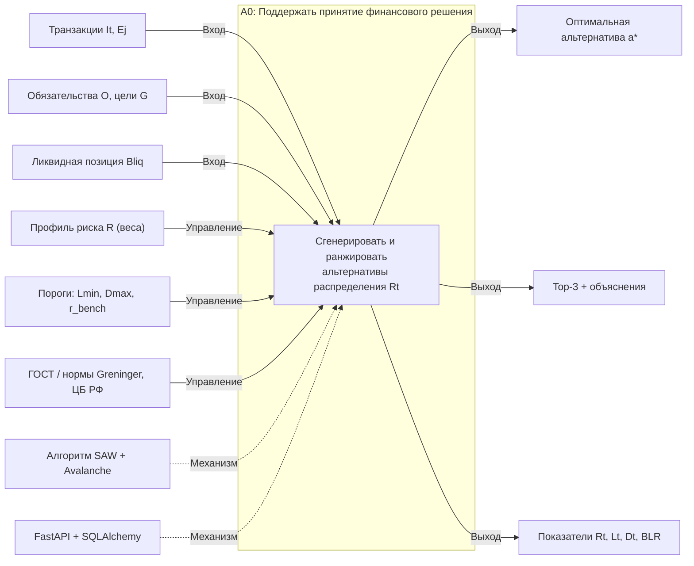

> **ICOM-расшифровка:** Inputs (слева) — данные пользователя; Controls (сверху) — профиль риска и пороговые ограничения, управляющие логикой; Outputs (справа) — рекомендация; Mechanisms (снизу) — чем реализуется.

---

# 2. Use Case — диаграмма вариантов использования

**Раздел ВКР:** постановка задачи / требования. **Нотация:** UML Use Case.
**Рендер:** **PlantUML** (нужны `include`/`extend`) → plantuml.com/plantuml или плагин PyCharm.

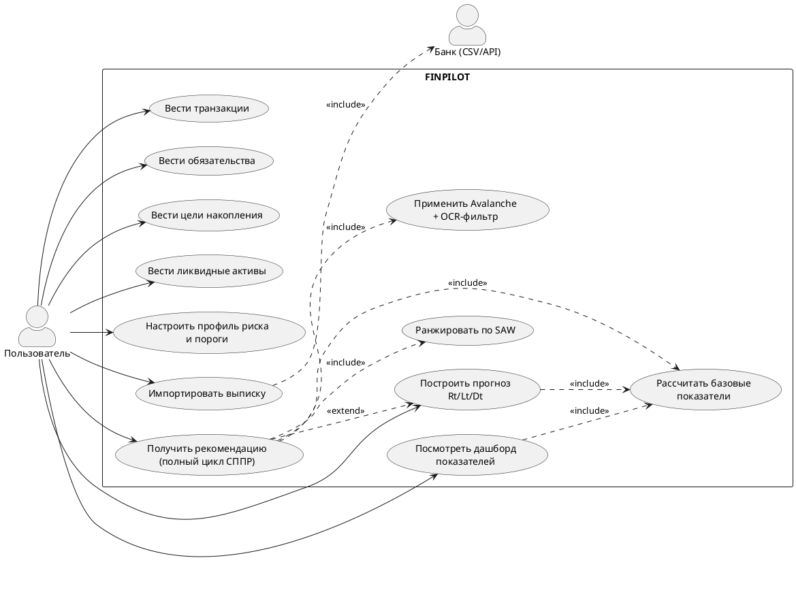

---

# 3. C4 Level 1 — System Context

**Раздел ВКР:** проектирование архитектуры. **Нотация:** C4 (Context).
**Что показывает:** систему целиком и её окружение — кто пользуется и с чем связана.
**Рендер:** Mermaid (поддерживает `C4Context`) → mermaid.live или GitHub.

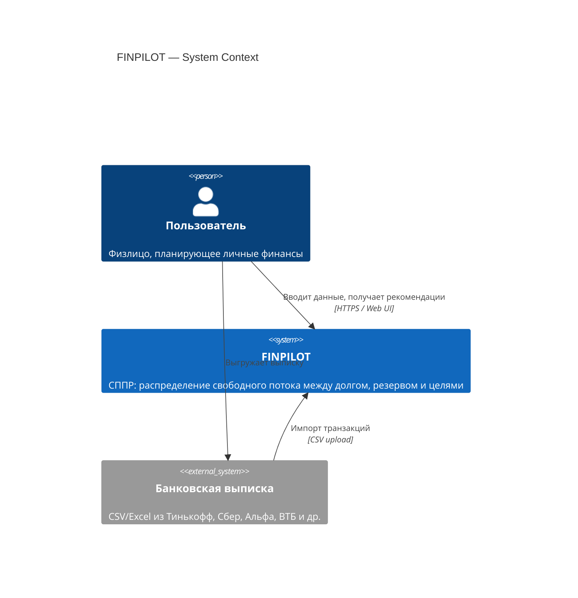

---

# 4. C4 Level 2 — Containers

**Раздел ВКР:** проектирование архитектуры. **Нотация:** C4 (Container).
**Что показывает:** из каких разворачиваемых блоков состоит система.
**Рендер:** Mermaid → mermaid.live. Для презентации красивее — D2 или draw.io.

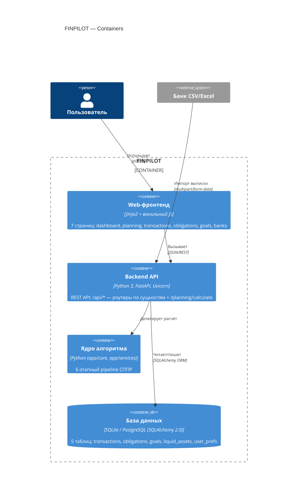

---

# 5. C4 Level 3 — Components

**Раздел ВКР:** проектирование архитектуры. **Нотация:** C4 (Component).
**Что показывает:** внутреннее устройство ядра — модули `app/core` и `app/services` и их связи.
**Рендер:** Mermaid → mermaid.live.

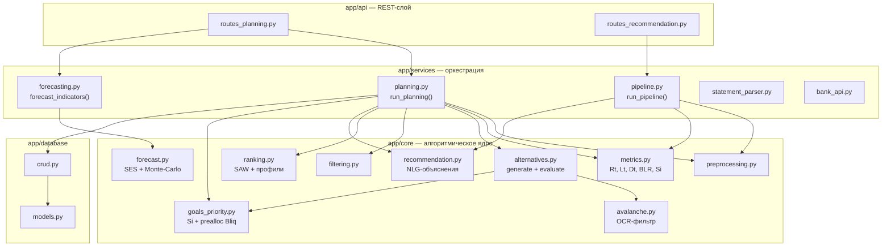

---

# 6. ER-диаграмма базы данных (DBML)

**Раздел ВКР:** проектирование данных. **Нотация:** ER + DBML.
**Что показывает:** 5 таблиц БД по `app/database/models.py`.
**Рендер:** **dbdiagram.io** — вставь код, получишь картинку + кнопка Export to PostgreSQL.

> ⚠️ В коде таблицы не связаны внешними ключами (модель «один пользователь = одна БД»). Ниже — концептуальная связь через `user_prefs` как единый контекст пользователя, для наглядности в ВКР.

```dbml
Table transactions {
  id integer [pk, increment]
  amount float [not null]
  category varchar(255) [not null]
  type varchar(20) [not null, note: 'income | expense']
  date datetime [not null]
  is_synced boolean [not null, default: false]
}

Table obligations {
  id integer [pk, increment]
  name varchar(255) [not null, default: 'Обязательство']
  amount float [not null, note: 'остаток тела долга']
  interest_rate float [not null, default: 0, note: 'годовая ставка rk']
  term integer [not null, default: 0, note: 'остаточный срок, мес']
  monthly_payment float [not null, note: 'аннуитетный платёж Pk']
  payment_day integer [not null, default: 1]
  comment text [null]
}

Table goals {
  id integer [pk, increment]
  name varchar(255) [not null]
  target_amount float [not null, note: 'целевая сумма']
  current_amount float [not null, default: 0]
  deadline datetime [not null]
  category varchar(32) [not null, default: 'material', note: 'income_growth | safety | material | emotional']
  comment text [null]
}

Table liquid_assets {
  id integer [pk, increment]
  name varchar(255) [not null, default: 'Депозит']
  amount float [not null, default: 0]
  interest_rate float [not null, default: 0]
  type varchar(32) [not null, default: 'deposit']
  comment text [null]
}

Table user_prefs {
  id integer [pk, default: 1]
  l_min float [not null, default: 0, note: 'минимальная Lt']
  risk_tolerance integer [not null, default: 3, note: 'профиль риска 1..5']
  horizon integer [not null, default: 12]
  r_bench float [not null, default: 0.14, note: 'OCR — порог Avalanche']
}
```

---

# 7. Sequence — полный цикл планирования

**Раздел ВКР:** проектирование поведения. **Нотация:** UML Sequence.
**Что показывает:** что происходит при `POST /api/planning/calculate` — от запроса до рекомендации.
**Рендер:** Mermaid → mermaid.live / GitHub.

```mermaid
sequenceDiagram
    actor U as Пользователь
    participant API as routes_planning
    participant DB as crud
    participant PR as preprocessing
    participant PL as planning.run_planning
    participant GP as goals_priority
    participant ALT as alternatives
    participant AV as avalanche
    participant F as filtering
    participant R as ranking
    participant REC as recommendation

    U->>API: POST /planning/calculate {risk, l_min, r_bench}
    API->>DB: get_user_prefs / transactions / obligations / goals / assets
    DB-->>API: данные
    API->>PR: prepare_data(...)
    PR-->>API: нормализованные данные + active_goals
    API->>PL: run_planning(income, expense, obls, goals, bliq, ...)

    PL->>GP: preallocate_from_bliq(bliq, goals)
    GP-->>PL: bliq_after, closed_goals, active_goals
    PL->>PL: расчёт Rt, Lt, Dt, BLR
    PL->>ALT: generate_alternatives(Rt+, ...)
    ALT-->>PL: 21 альтернатива

    loop для каждой альтернативы
        PL->>ALT: evaluate_alternative(a)
        ALT->>AV: allocate_obligations_avalanche(x_obl, obls, r_bench)
        AV-->>ALT: x_eff, new_obls, x_unused
        ALT->>GP: calculate_goals_si(x_goals, goals)
        GP-->>ALT: Si, allocation
        ALT-->>PL: a + {Rt', Lt', Dt', Si}
    end

    PL->>F: filter_alternatives(...)
    F-->>PL: admissible, rejected
    PL->>R: rank_alternatives(admissible, risk)
    R-->>PL: ranked (a* первый)
    PL->>REC: explain_alternative(top-3)
    REC-->>PL: gains / costs / insight
    PL-->>API: {indicators, top3, best, ranked, ...}
    API-->>U: JSON с рекомендацией
```

---

# 8. Sequence — импорт банковской выписки

**Раздел ВКР:** проектирование поведения. **Нотация:** UML Sequence.
**Что показывает:** загрузку CSV-выписки и её разбор в транзакции.
**Рендер:** Mermaid → mermaid.live / GitHub.

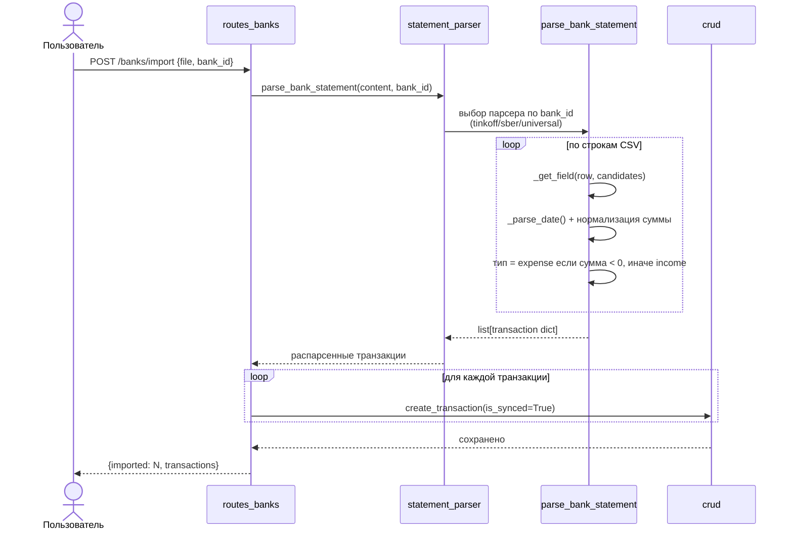

---

# 9. Блок-схема ГОСТ — главный pipeline алгоритма

**Раздел ВКР:** алгоритмическое обеспечение ⭐ (ядро работы). **Нотация:** ГОСТ 19.701-90.
**Что показывает:** все 6 этапов СППР от ввода данных до выбора `a*`.
**Рендер для ВКР:** открой готовый файл **`drawio/01_main_pipeline_GOST.drawio`** в [app.diagrams.net](https://app.diagrams.net) — уже оформлен ГОСТ-фигурами (терминатор, процесс, решение-ромб, параллелограмм ввода/вывода, предопределённый процесс). Ниже Mermaid — для README/черновика.

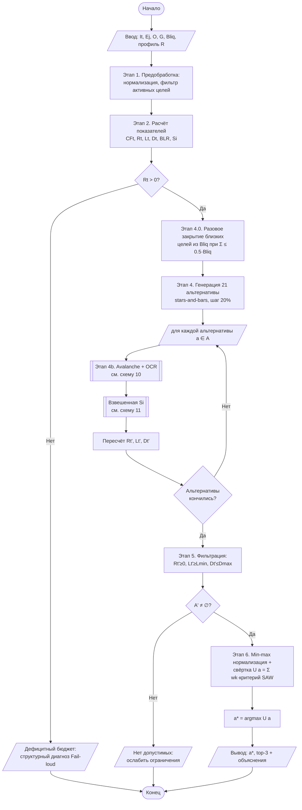

---

# 10. Блок-схема ГОСТ — Avalanche + OCR-фильтр

**Раздел ВКР:** алгоритмическое обеспечение ⭐. **Нотация:** ГОСТ 19.701-90.
**Что показывает:** распределение досрочки `x_obl` между кредитами по убыванию ставки с отсечением дешёвых долгов (NPV-правило).
**Рендер для ВКР:** **`drawio/02_avalanche_GOST.drawio`** в app.diagrams.net.

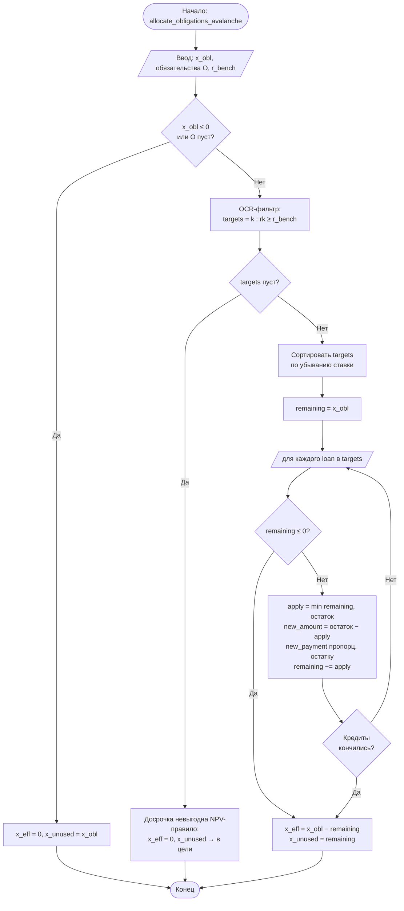

---

# 11. Блок-схема ГОСТ — взвешенная обеспеченность целей Si

**Раздел ВКР:** алгоритмическое обеспечение ⭐. **Нотация:** ГОСТ 19.701-90.
**Что показывает:** расчёт Si с учётом категории цели (вес) и срочности (близость дедлайна) + распределение `x_goals`.
**Рендер для ВКР:** **`drawio/03_goals_si_GOST.drawio`** в app.diagrams.net.

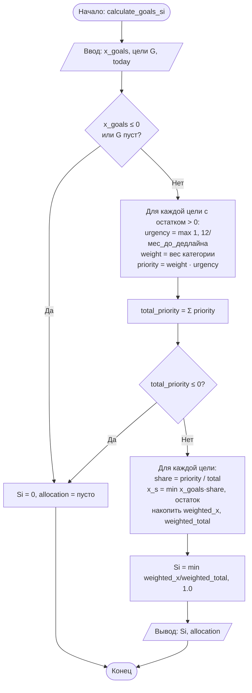

---

# 12. Блок-схема ГОСТ — прогноз SES + Monte-Carlo

**Раздел ВКР:** алгоритмическое обеспечение ⭐. **Нотация:** ГОСТ 19.701-90.
**Что показывает:** точечный прогноз через экспоненциальное сглаживание + доверительный интервал [p10..p90] методом Монте-Карло с растущей σ.
**Рендер:** Mermaid → mermaid.live (готового draw.io нет — при необходимости перерисуй по этому черновику в ГОСТ-вид).

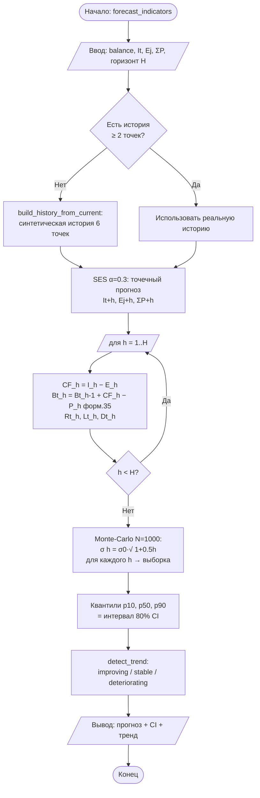

---

# 13. UML Class — диаграмма классов

**Раздел ВКР:** реализация. **Нотация:** UML Class.
**Что показывает:** ORM-модели (`models.py`) + ключевые функциональные модули ядра как «классы-сервисы».
**Рендер:** Mermaid → mermaid.live. Для строгого UML с видимостью — PlantUML.

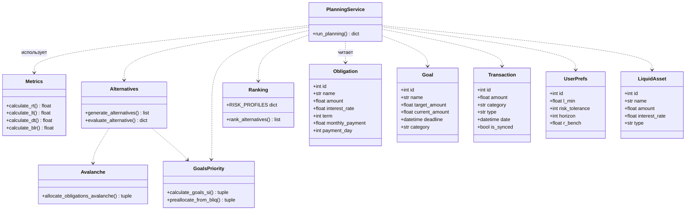

---

# 14. State Machine — жизненный цикл альтернативы

**Раздел ВКР:** проектирование поведения. **Нотация:** UML State Machine.
**Что показывает:** как одна альтернатива проходит этапы от генерации до статуса «рекомендована/отклонена».
**Рендер:** Mermaid → mermaid.live / GitHub.

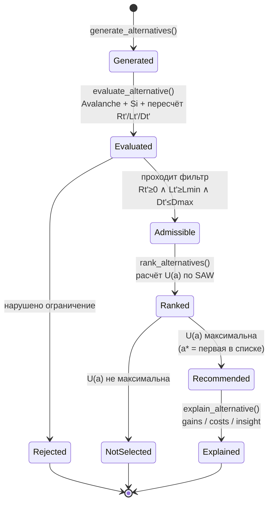

---

# 15. Graphviz — граф зависимостей модулей

**Раздел ВКР:** реализация (приложение). **Нотация:** Graphviz DOT.
**Что показывает:** направленный граф импортов между пакетами проекта.
**Рендер:** [dreampuf.github.io/GraphvizOnline](https://dreampuf.github.io/GraphvizOnline) — вставь, получишь PNG/SVG.

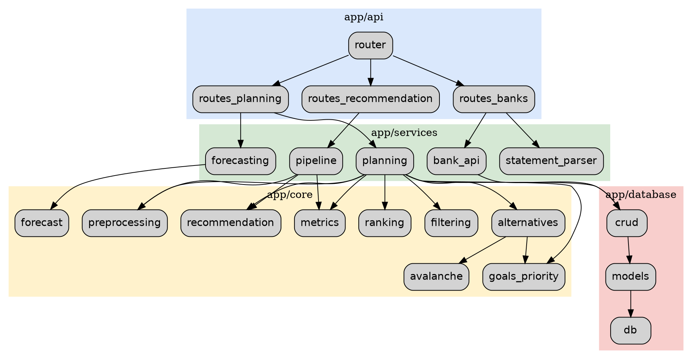

---

# 16. PDCA — цикл Деминга

**Методология:** PDCA (цикл непрерывного улучшения). **Раздел ВКР:** организация работ / улучшение продукта.
**Что показывает:** как итеративно улучшать качество рекомендаций FINPILOT.
**Рендер:** Mermaid → mermaid.live.

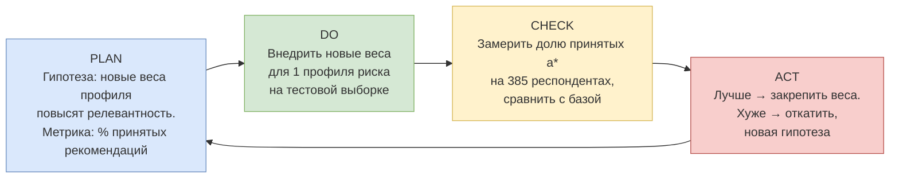

> **Привязка к FINPILOT:** параметры модели (`r_bench=0.14`, веса профилей, шаг дискретизации) — кандидаты на PDCA-итерации. Каждый прогон валидации на выборке респондентов = один виток Check.

---

# 17. BPMN 2.0 — бизнес-процесс получения рекомендации

**Методология:** BPMN 2.0 (= ISO/IEC 19510). **Раздел ВКР:** бизнес-процессы.
**Что показывает:** процесс «пользователь → рекомендация» с дорожками (кто что делает).
**Рендер для качества:** **Camunda Modeler** или **bpmn.io** (настоящие пулы и иконки). Mermaid ниже — упрощённо.

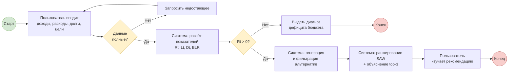

> **Для ВКР в BPMN-нотации:** перенеси в Camunda Modeler, раздели на 2 пула (Lane «Пользователь» и Lane «FINPILOT»), задачи пользователя пометь как User Task, системные — как Service Task. Шлюзы — эксклюзивные (X).

---

# 18. EPC — событийная цепочка планирования

**Методология:** EPC (ARIS, событийная цепочка процессов). **Раздел ВКР:** бизнес-процессы.
**Что показывает:** строгое чередование «событие → функция → событие». Распространена в SAP/корпоративном мире РФ.
**Рендер:** Mermaid → mermaid.live. Строгий EPC — в ARIS Express или Bizagi.

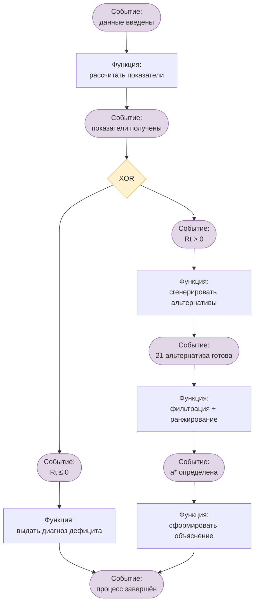

> **Нотация EPC:** шестиугольники-события (лиловые) и прямоугольники-функции (зелёные) строго чередуются. Оператор XOR = исключающее ветвление по знаку Rt.

---

# 19. VSM — поток создания ценности

**Методология:** Value Stream Mapping (Lean). **Раздел ВКР:** оптимизация процесса / Lean.
**Что показывает:** шаги обработки запроса + время каждого + где «потери» (ожидание).
**Рендер:** Mermaid → mermaid.live. Классический VSM с иконками — в Lucidchart/draw.io (шаблон VSM).

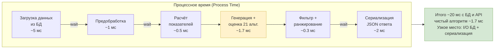

> **Вывод VSM:** ядро алгоритма (1.7 мс) — не узкое место. Основное время — на I/O базы и сериализацию. Точка оптимизации (Lean): кэширование запросов к БД, а не ускорение математики.

---

# 20. DMAIC — цикл снижения дефектов рекомендаций

**Методология:** DMAIC (Six Sigma). **Раздел ВКР:** управление качеством.
**Что показывает:** структурированный цикл устранения «дефектных» рекомендаций (отклонённых пользователем).
**Рендер:** Mermaid → mermaid.live.

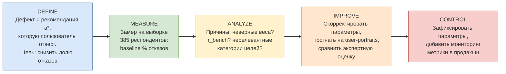

> **Привязка к FINPILOT:** в проекте уже есть артефакты для Measure/Analyze — `FINPILOT_6_User-Portraits_с_вычислениями` и `Экспертная_оценка_6_user-cases`. Это готовая база для DMAIC-цикла валидации алгоритма.

---

## Сводная таблица: диаграмма → раздел ВКР → инструмент

| № | Диаграмма | Нотация | Раздел ВКР | Инструмент рендера |
|---|---|---|---|---|
| 1 | Функциональный контекст | IDEF0 | Анализ области | Mermaid / Ramus |
| 2 | Варианты использования | UML Use Case | Требования | **PlantUML** |
| 3 | System Context | C4 L1 | Архитектура | Mermaid |
| 4 | Containers | C4 L2 | Архитектура | Mermaid |
| 5 | Components | C4 L3 | Архитектура | Mermaid |
| 6 | Схема БД | ER / DBML | Данные | **dbdiagram.io** |
| 7 | Цикл планирования | UML Sequence | Поведение | Mermaid |
| 8 | Импорт выписки | UML Sequence | Поведение | Mermaid |
| 9 | Главный pipeline ⭐ | ГОСТ 19.701-90 | Алгоритмы | **draw.io (файл)** |
| 10 | Avalanche + OCR ⭐ | ГОСТ 19.701-90 | Алгоритмы | **draw.io (файл)** |
| 11 | Взвешенная Si ⭐ | ГОСТ 19.701-90 | Алгоритмы | **draw.io (файл)** |
| 12 | SES + Monte-Carlo ⭐ | ГОСТ 19.701-90 | Алгоритмы | Mermaid |
| 13 | Классы | UML Class | Реализация | Mermaid / PlantUML |
| 14 | Жизненный цикл альтернативы | UML State Machine | Поведение | Mermaid |
| 15 | Граф зависимостей | Graphviz | Реализация | GraphvizOnline |
| 16 | PDCA | Цикл Деминга | Улучшение | Mermaid |
| 17 | Бизнес-процесс | BPMN 2.0 | Процессы | **Camunda/bpmn.io** |
| 18 | Событийная цепочка | EPC (ARIS) | Процессы | Mermaid / ARIS |
| 19 | Поток ценности | VSM (Lean) | Оптимизация | Mermaid / Lucidchart |
| 20 | Снижение дефектов | DMAIC (Six Sigma) | Качество | Mermaid |

---

## Файлы в комплекте

```
finpilot_diagrams/
├── FINPILOT_диаграммы.md          ← этот документ (все 20 диаграмм + код)
└── drawio/
    ├── 01_main_pipeline_GOST.drawio   ← открой в app.diagrams.net
    ├── 02_avalanche_GOST.drawio       ← открой в app.diagrams.net
    └── 03_goals_si_GOST.drawio        ← открой в app.diagrams.net
```

**Как открыть .drawio:** зайди на [app.diagrams.net](https://app.diagrams.net) → File → Open from → Device → выбери файл. Откроется готовая ГОСТ-схема, можно экспортировать в PNG/PDF/SVG (File → Export as) для вставки в ВКР.
