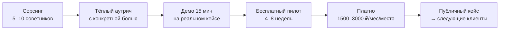
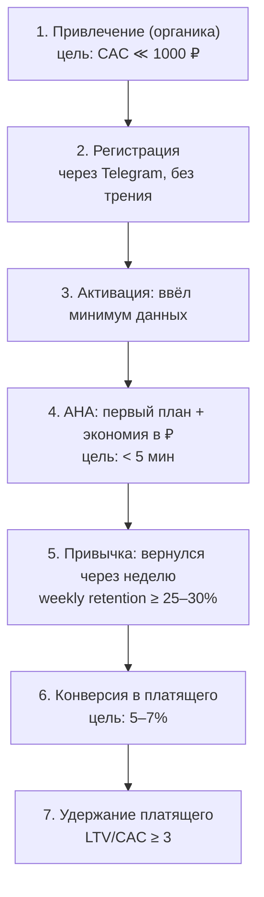
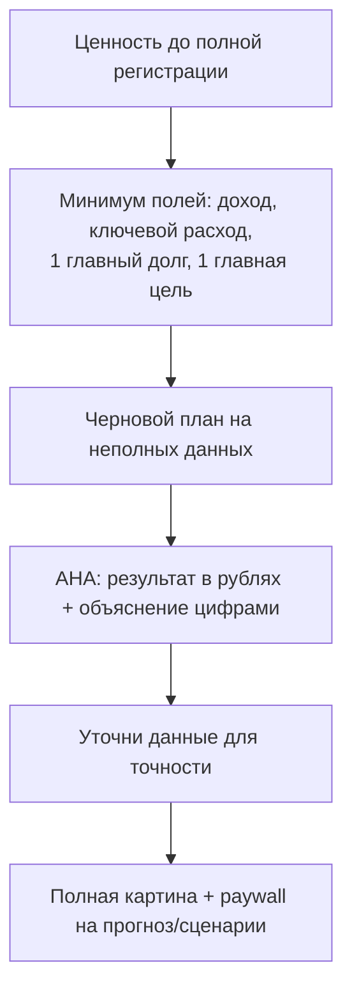

# FINPILOT — операционный плейбук

> Уровень исполнения (пара к стратегическому разбору). Два плейбука: **B2B-пилот с финсоветниками** и **B2C-воронка + онбординг до aha-момента**. Всё конкретно: кого искать, что показать, как упаковать API, какие цены, какие метрики.

---

# ПЛЕЙБУК 1 — B2B-пилот с финсоветниками

Цель пилота: **не выручка, а доказательство** — что независимый финсоветник реально пользуется движком в работе и готов за него платить. Один публичный кейс открывает дверь ко всем следующим.



## 1.1. Кого искать (ICP)

Не любой «финансист». Тебе нужен узкий профиль:

| Подходит | Не трать время |
|---|---|
| Независимый советник/коуч по **личным финансам** (долги, бюджет, цели, рефинанс) | Брокеры, УК, инвест-консультанты (своя регуляторка и системы) |
| Ведёт клиентов **вручную** (Excel/таблицы) | Корпорации с готовым софтом |
| Активен в соцсетях/Telegram (= доступен) | Те, кого не достать |
| Жалуется на рутину расчётов и «как объяснить клиенту» | — |

Признак идеального раннего клиента: **«я считаю это руками для каждого клиента и трачу кучу времени».**

## 1.2. Где искать (каналы сорсинга)

- Telegram-каналы и чаты финсоветников / финконсультантов.
- Маркетплейсы услуг (площадки, где консультанты берут клиентов).
- Инфлюенсеры финграмотности — у них часто есть «школы» и комьюнити советников.
- Ассоциации/сообщества финансовых консультантов.
- Тёплый аутрич в личку — **с конкретной болью**, не «давайте познакомимся».

Цель — **не 1000 лидов, а 5–10 заинтересованных**. Это ручная работа, а не маркетинг. (Сами площадки проверь на актуальность — рынок меняется.)

## 1.3. Ценность для советника (это B2B-оффер, не для конечника)

Ты продаёшь не «крутую математику», а решение его боли:

1. **Экономия времени** — расчёт «гасить/копить» для клиента за секунды, а не за час в Excel.
2. **Доверие его клиента** — советник показывает клиенту, *почему* именно так, с цифрами. Это поднимает его как профессионала.
3. **Удержание клиентов советника** — прогноз и сценарии = повод для регулярных встреч.

## 1.4. Демо-скрипт (15 минут)

| Время | Что делаешь |
|---|---|
| 0–2 мин | Боль: «Сколько времени уходит на план для одного клиента? Как объясняете, почему гасить, а не копить?» |
| 2–8 мин | Живое демо на **реальном (анонимном) кейсе его клиента**: вводим доходы/расходы/долги/цели → ранжированные стратегии + объяснение цифрами + прогноз с доверительным интервалом. Акцент: «вот это вы показываете клиенту — он видит ПОЧЕМУ». |
| 8–12 мин | Avalanche-триггер: «когда ставки изменятся — система сама подскажет пересмотр». Показать сценарную симуляцию «что если». |
| 12–15 мин | Оффер пилота: бесплатно 4–8 недель на N клиентов, взамен — обратная связь и (если зашло) отзыв/кейс. |

Правило демо: показывай **экономию его времени и доверие его клиента**, а не математику ради математики.

## 1.5. Как упаковать движок в API

Твой FastAPI-бэкенд = ядро. Оборачиваешь его в чистый публичный контракт, отделённый от UI. Минимальный набор:

| Endpoint | Метод | Назначение |
|---|---|---|
| `/v1/analyze` | POST | основной: распределение `x_d/x_r/x_g` + объяснение + метрики |
| `/v1/forecast` | POST | прогноз SES + Monte-Carlo (median + CI95) |
| `/v1/simulate` | POST | сценарий «что если» (Avalanche-триггеры) |
| `/v1/health` | GET | проверка |

Аутентификация — по API-key (на советника / на сервис). Версионирование у тебя уже в культуре проекта (`APP_VERSION`).

Контракт `/v1/analyze` (под твою же модель — метрики `CF, R, L, D, BLR, Sn` и доли `x_d/x_r/x_g`):

```json
// Запрос
{
  "income": 180000,
  "expenses": [{"category": "rent", "amount": 30000}],
  "debts": [{"name": "ипотека", "balance": 3070000, "rate": 0.085, "payment": 32000, "term": 96}],
  "goals": [{"name": "подушка", "target": 468000, "saved": 80000, "deadline": "2027-12", "category": "safety"}],
  "risk_profile": "balanced"
}

// Ответ
{
  "recommendations": [
    {"x_debt": 0.20, "x_reserve": 0.40, "x_goals": 0.40, "utility": 0.87, "amounts": {"debt": 7900, "reserve": 15800, "goals": 15800}}
  ],
  "explanation": {"text": "...", "weights": {"R": 0.25, "L": 0.30, "D": 0.25, "S": 0.20}},
  "forecast": {"median": 120000, "ci95": [95000, 145000]},
  "metrics": {"CF": 102000, "R": 39500, "L": 0.28, "D": 0.347, "BLR": 3.4, "Sn": 0.41}
}
```

Для советников поверх API — **тонкий веб-кабинет** (ввод клиента → результат → экспорт PDF для клиента). Это white-label-lite, не требует от советника никакой интеграции. С API-интеграцией заходят уже сервисы/банки, не советники.

## 1.6. Экономика лицензии

| Модель | Кому | Цена | Логика |
|---|---|---|---|
| **Per-seat** | советники | 1 500–3 000 ₽/мес/место | окупается с **одного** клиента советника |
| **Per-MAU** | сервисы | 20–40 ₽/активный/мес | платят за объём расчётов |
| **Platform + setup** | банки | 5–20+ млн ₽/год | индивидуальный контракт |

ROI для советника сделать **очевидным**: «экономишь N часов/мес × твоя ставка ≫ 2000 ₽». Твоя сторона: 50 советников × 2000 ₽ = **1,2 млн ₽/год** при низком churn (инструмент в рабочем процессе = липко) и почти нулевом переменном COGS (API-вызовы дёшевы).

## 1.7. Метрики успеха пилота

- ≥ 3 из 5–10 советников используют **еженедельно**.
- ≥ 1 готов **платить** или дать кейс/отзыв.
- Качественный сигнал: **«без этого теперь не могу»**.

## 1.8. Риски пилота → как смягчить

| Риск | Смягчение |
|---|---|
| Не отдают данные клиентов (приватность) | анонимный/локальный режим, не хранить лишнее |
| «Слишком сложно» | онбордить лично, сделать за советника первый кейс |
| Не встроено в рабочий процесс | начни с веб-кабинета, не требуй API-интеграции на старте |

---

# ПЛЕЙБУК 2 — B2C-воронка + онбординг до aha

Здесь всё начинается, потому что B2C — это витрина и топливо для B2B. Главная задача — **довести до aha быстро и удержать**.

## 2.1. Воронка целиком (с целевыми метриками)



| Этап | Главный риск отвала | Что делает этап |
|---|---|---|
| Привлечение | дорогой платный CAC | органика (см. 2.6) |
| Регистрация | трение формы | вход через Telegram в 1 тап |
| Активация | 62 поля ввода | прогрессивный минимум (2.3) |
| **Aha** | долго до ценности | моментальный план в ₽ |
| Привычка | нет повода вернуться | retention-петля (2.5) |
| Конверсия | не понял ценности | hook «экономия X ₽» |
| Удержание | плохой retention | месячный цикл + триггеры |

## 2.2. Что такое aha-момент (точно)

**Aha = пользователь видит конкретный план распределения СВОИХ свободных денег + сколько рублей он сэкономит или насколько быстрее достигнет цели.** Это «вау, оно реально посчитало за меня и объяснило почему».

Time-to-aha **< 5 минут** — критично. Главный враг — ручной ввод. Значит весь онбординг строится вокруг «дать магию на минимуме данных».

## 2.3. Онбординг шаг за шагом (минимум трения)



Принципы:
1. **Не проси регистрацию первой.** Раз мобайл = Telegram-бот, регистрация уже бесплатна и мгновенна.
2. **Прогрессивный ввод.** Спроси МИНИМУМ для первого результата — доход, главные расходы (или % сбережений), 1 долг, 1 цель. Не вываливай все 62 поля сразу.
3. **Моментальный черновой план** на неполных данных → aha → потом «уточни для точности».
4. **Шаблоны/пресеты** («зарплата + ипотека + подушка») — заполнить в 2 тапа.
5. **Результат сразу в рублях:** «направив X на досрочку, ты сэкономишь Z ₽ переплаты».
6. **Объяснение цифрами (XAI) видно сразу** — это твой дифференциатор, НЕ прячь его за paywall.

Главное правило: **ценность ПЕРЕД полнотой данных.** Покажи магию на минимуме, дозапрашивай по мере вовлечения.

## 2.4. Что бесплатно, что платно (paywall)

| Бесплатно (hook) | Платно (paywall) |
|---|---|
| учёт, базовая картина | прогноз с доверительным интервалом |
| **первый план + объяснение** (= aha бесплатно) | сценарии «что если» |
| | триггеры/пуши при изменении ставок |
| | мультицелевая оптимизация, история/динамика |

Логика: **aha бесплатно** (иначе не зацепишь), но **регулярная ценность** (прогноз, триггеры, сценарии) — платно. Paywall ставится ПОСЛЕ первого aha, когда ценность уже доказана.

Цена: 199–299 ₽/мес или 1490–2490 ₽/год. Hook конверсии — явная экономия в рублях («ARPPU < ценности»: берёшь 250 ₽, экономишь тысячи).

## 2.5. Повод возвращаться (retention-петля)


- **Месячный цикл** — естественный для финансов (в отличие от трекера, где смысл теряется за 2 недели).
- **Пуш-триггеры:** изменение ставок (Avalanche: «вклады упали ниже твоего кредита — пора гасить досрочно»), приближение дедлайна цели, «ты отстаёшь от плана».
- **Видимый прогресс к целям.**
- Цель: **weekly retention ≥ 25–30%** — без этого выручка не построится.

## 2.6. Органические каналы (платный CAC убийственен)

- **Контент** — тот же опросный канал + разборы «гасить или копить» (демонстрируешь движок в деле).
- **Виральность** — «поделись своим планом» (анонимно), результат как контент.
- **Комьюнити/вузы** — твоя естественная среда.
- **ASO** — когда будет приложение.
- **Партнёрства с финграм-блогерами** — бартер на старте.

Цель — **органический CAC ≪ 1000 ₽** (только так LTV/CAC ≥ 3).

## 2.7. Метрики воронки (целевые)

| Этап | Метрика | Цель |
|---|---|---|
| Активация | % дошедших до ввода данных | ≥ 60% от регистраций |
| Aha | time-to-aha | < 5 мин |
| Привычка | weekly retention | ≥ 25–30% |
| Конверсия | free → paid | ≥ 5–7% |
| Экономика | LTV / CAC | ≥ 3 |
| Рост | органический CAC | ≪ 1000 ₽ |

---

# Связь двух плейбуков

B2C даёт три вещи, которые продают B2B:
1. **PMF-доказательство** — «люди реально пользуются и платят».
2. **Данные** для калибровки движка (точность рекомендаций, поведение пользователей).
3. **Публичный кейс** — социальное доказательство для первого советника.

Поэтому **запускай оба параллельно, но в правильном порядке внимания:** B2C руками строишь сам (фаза 1–2), B2B-пилот с советниками щупаешь рано (фаза 2) — он покажет, там ли настоящие деньги, пока B2C набирает обороты.
