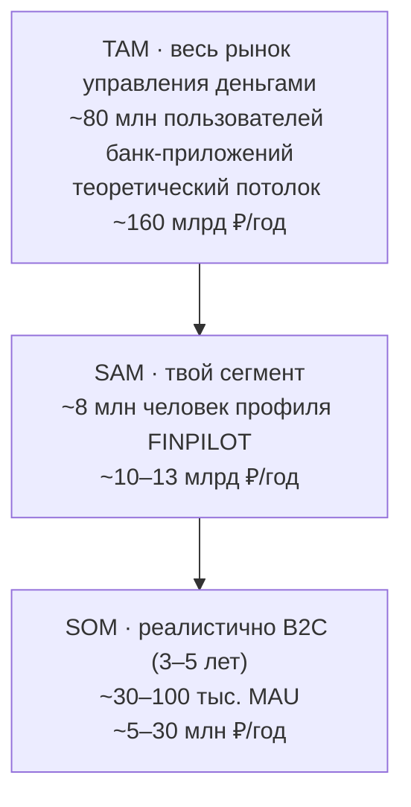
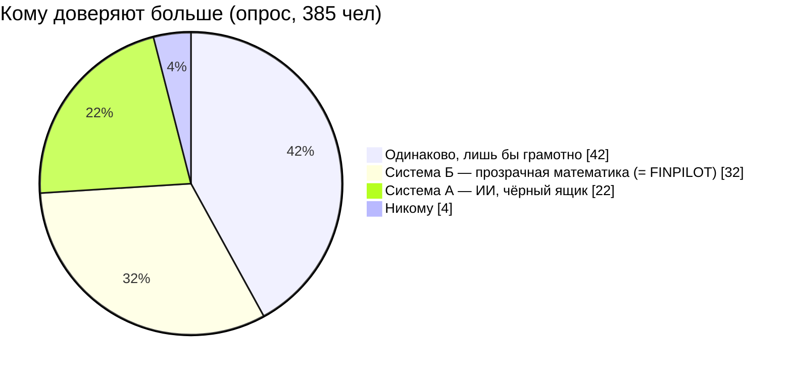
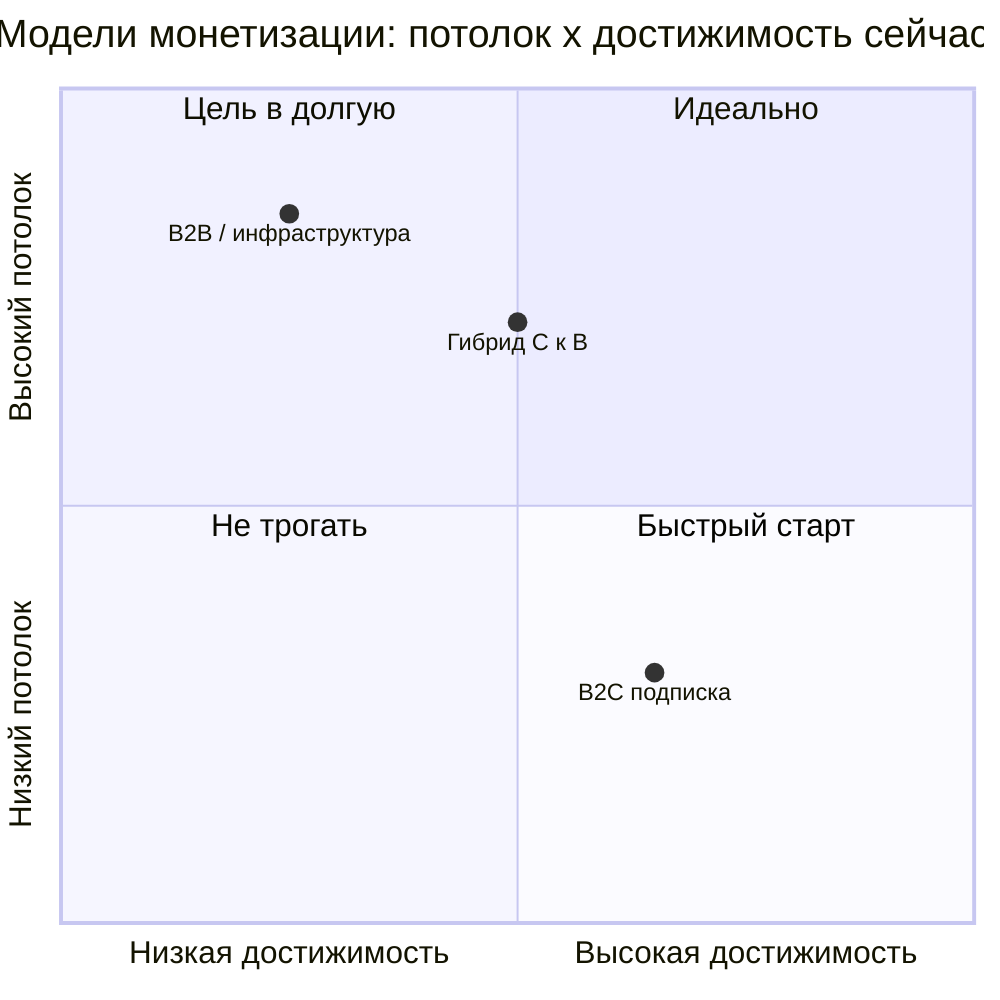
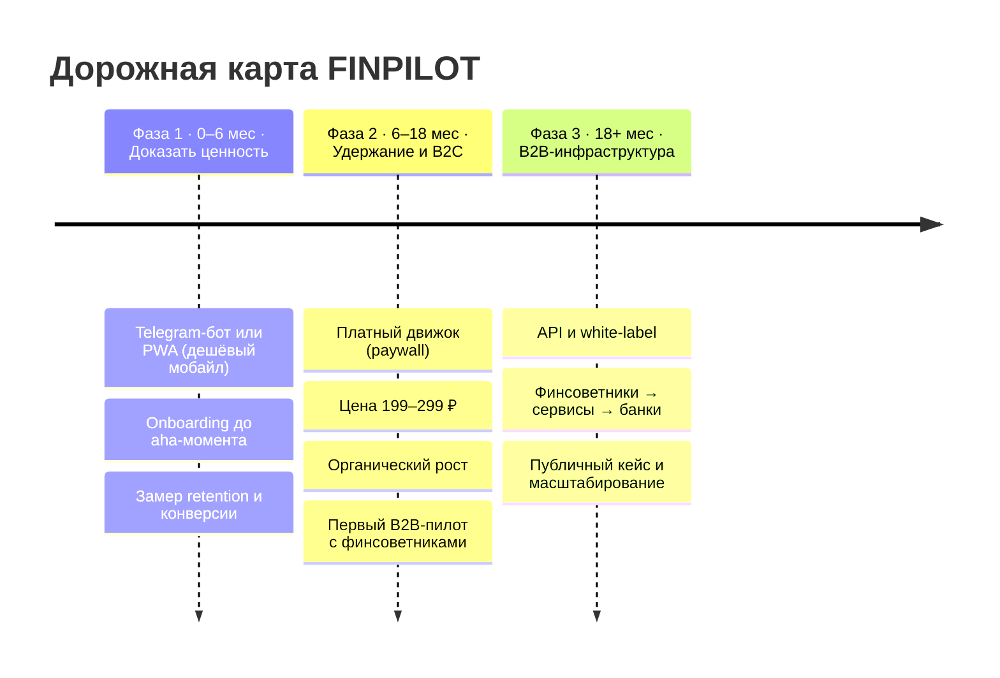
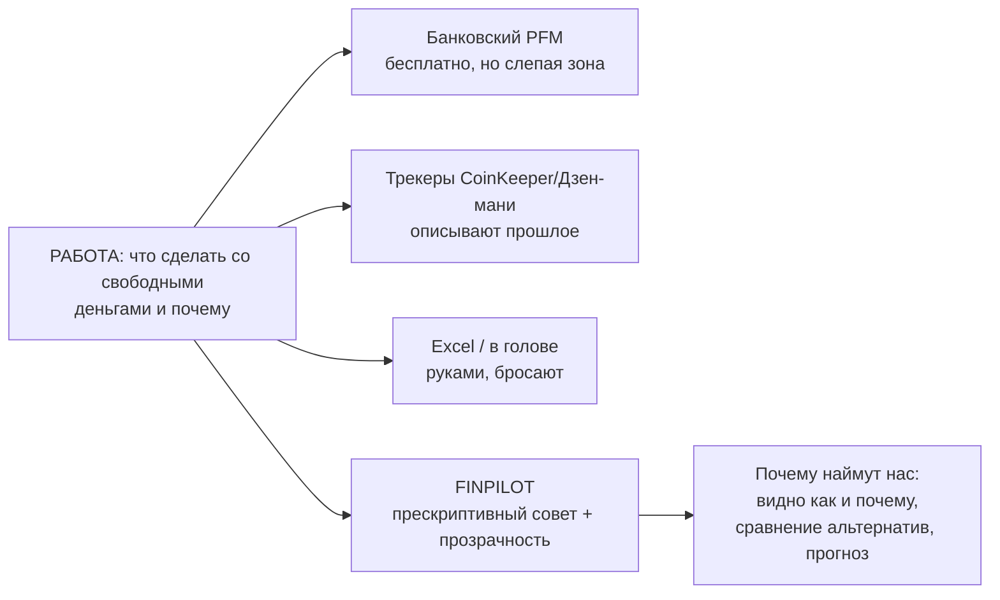

# FINPILOT — стратегический разбор бизнеса (в долгую)

> Объективный анализ продукта как стартапа: где деньги, где риск, какой это бизнес на самом деле, и куда расти. Все цифры по деньгам — оценки с явными допущениями (см. приложение), их можно крутить под себя.

---

## 0. Вердикт в трёх строках

1. **Продукт и проблема — подтверждены.** Дифференциатор (прескриптивный советник, а не трекер) — настоящий и редкий.
2. **Как чистая B2C-подписка** в России потолок — **lifestyle-бизнес** (единицы–десятки млн ₽/год), а не ракета. Категория — кладбище для инди.
3. **Реальный масштаб и защищённость — в развороте:** позиционирование «советник, а не трекер» + переход в **B2B / инфраструктуру**. Движок ценнее как технология для банков/сервисов/советников, чем как ещё одно приложение.

Всё решают три вещи, и ни одна — не фичи: **дистрибуция, удержание, модель монетизации.**

---

## 1. KPI-дашборд (по чему живём)

Это метрики, по которым меряется выживание бизнеса. Фичи — вторичны.

| Метрика | Что измеряет | Целевой порог | Почему критично |
|---|---|---|---|
| Weekly retention | возвращаемость | **≥ 25–30%** | в PFM удержание — это жизнь и смерть |
| Free → Paid | конверсия в платящих | **≥ 5–7%** | напрямую определяет выручку |
| LTV / CAC | юнит-экономика | **≥ 3** | можно ли масштабировать с прибылью |
| Органический CAC | стоимость роста | **≪ 1000 ₽** | платный CAC ~3000 ₽ убийственен |
| Time-to-aha | онбординг | **< 5 мин** | время до первой ценности (план в ₽) |
| MAU | масштаб | рост month-over-month | топливо для всего остального |

Правило: **пока weekly retention < 25% и LTV/CAC < 3 — расти платно НЕЛЬЗЯ**, только органика. Иначе жжёшь деньги в дырявое ведро.

---

## 2. Рынок: TAM / SAM / SOM

Как считалось (снизу, метод users × conversion × ARPU):
- **TAM:** взрослые с банковским приложением (~104 млн смартфонов × ~70% мобильного банкинга, минус несовершеннолетние). Источники: Statista/IT-World 2024, НАФИ 2025.
- **SAM:** ~20% готовы пользоваться *отдельным* финтулом (опрос: 18,7% уже используют) × ~50% попадают в профиль «знают основы, но в сложных решениях теряются» (опрос: 51,9%) → ~8 млн человек.
- **SOM:** реалистичный захват инди-продуктом за 3–5 лет. **Это lifestyle-уровень, а не венчур** — ключевой вывод раздела.

---

## 3. Активы и риски (объективно)

### Сильное — твои реальные активы

| Актив | Почему это сила |
|---|---|
| **Работающий продукт v2.0.2** | Большинство стартапов умирают на идее. Ты уже за этой чертой. Главный объективный актив. |
| **Настоящий дифференциатор** | Все конкуренты — описательные трекеры («куда ушли деньги»). Ты — прескриптивный советник («что сделать и почему»). Этого не делает никто. |
| **Спрос подтверждён опросом (385 чел)** | Топ-драйверы доверия людей = ровно твои фичи: сравнение альтернатив (61%), объяснение цифрами (59%), прозрачный алгоритм (54%). |
| **Сложнее скопировать, чем трекер** | SAW + Avalanche + Монте-Карло + объяснимость — это не UI на неделю. Не вечный ров, но фора. |

### Слабое — что может убить (без анестезии)

| Риск | Суть |
|---|---|
| **Категория — кладбище для инди-B2C** | Главный конкурент бесплатный и по умолчанию: ~70% уже в мобильном банке со встроенной аналитикой (НАФИ). Воюешь с «и так норм, бесплатно». |
| **Удержание в PFM катастрофическое** | Энтузиазм вести бюджет руками угасает за 14–20 дней (отраслевые данные). Для подписки retention — это всё. |
| **Юнит-экономика хрупкая** | На платном привлечении LTV/CAC ≈ 1.0 — рост с прибылью невозможен. Держится только на органике. |
| **Нет мобилки и банк-синка** | 76,7% хотят мобильное приложение (у тебя web); синхронизация — самая частая просьба. |
| **WTP завышена** | 54% сказали «заплачу» — реальная конверсия freemium 3–5%. |
| **Дистрибуция — главный убийца** | Финансовый CPI самый дорогой, бюджета нет, сторы фрагментированы (RuStore). |
| **Доверие + регуляторная тень** | Советы по бюджету/долгам — пока вне реестра ЦБ, но рекомендации конкретных продуктов поднимут вопрос ответственности. *Не юрсовет — watch-item.* |
| **Выборка опроса смещена** | 385 чел, но скорее молодые/мужчины/студенты. Сигнал сильный, но направленный, не репрезентативный по всей РФ. |

---

## 4. Юнит-экономика

Формулы: `LTV = ARPPU × CL`, сравниваем с `CAC + COGS`. Затраты на разработку НЕ входят.

Допущения: ARPPU ≈ 250 ₽/мес · CL ≈ 12 мес · COGS ≈ 350 ₽/год · **LTV ≈ 3000 ₽.**

| Сценарий привлечения | CAC | LTV − (CAC+COGS) | LTV/CAC | Вердикт |
|---|---:|---:|---:|---|
| Органика (контент, комьюнити) | ~1000 ₽ | +1650 ₽ | **3.0** | масштабируемо ✅ |
| Платное привлечение | ~3000 ₽ | −350 ₽ | ~1.0 | «работа ради работы» ❌ |

Откуда платный CAC ~3000 ₽: финансовые приложения — одни из самых дорогих по привлечению (CPI ~150 ₽ на верхней планке), конверсия установки в платящего ~5% → 150 / 0,05 ≈ 3000 ₽. Источники: Business of Apps, отраслевые CPI-обзоры РФ.

**Как чинить:** поднять CL (retention) — LTV растёт линейно (CL 18 мес → LTV 4500); держать рост на органике, пока конверсия и retention не докручены. И помни: **ARPPU < ценности** — берёшь 250 ₽/мес, а экономишь человеку тысячи рублей переплаты по процентам. Это твой хук конверсии.

---

## 5. Доверие как актив (данные опроса)

Твой главный нематериальный актив — прозрачность. Опрос это доказал напрямую:

Прозрачной математике (Система Б) доверяют **в 1,5 раза больше**, чем чёрному ящику ИИ. В эпоху, когда все клепают «ИИ-ассистентов», твоя объяснимость — контр-позиционирование и потенциальный бренд доверия.

---

## 6. Стратегические модели монетизации

| Модель | Суть | Потолок | Минусы |
|---|---|---|---|
| **A. B2C подписка** | Приложение для людей, freemium | Lifestyle (5–30 млн ₽/год) | Дорогой CAC, плохой retention, война с бесплатным банком |
| **B. B2B / инфраструктура** | Лицензируешь движок банкам/сервисам/советникам | Высокий, фандабельный | Долгие продажи, нужна репутация и пилоты |
| **C. Гибрид** | B2C как витрина и proof, B2B как выручка | Лучшее из двух | Сложнее в исполнении |

**Принцип:** инфраструктура почти всегда побеждает приложение. Прозрачный движок принятия решений стоит дороже, проданный банку/сервису, чем как иконка на телефоне.

---

## 7. 🔍 Глубокий разбор — УЗЕЛ A: B2B / инфраструктура

### Кому продавать (плацдарм → расширение)

| Сегмент | Чек/цикл | Доступность для тебя сейчас |
|---|---|---|
| **Независимые финсоветники / коучи** | малый чек, короткий цикл | **высокая — лучший плацдарм** (их много, активны в Telegram) |
| Организации финграмотности / EdTech | средний | средняя |
| Сервисы для самозанятых / бухгалтерии | средний–крупный | средняя |
| HR / financial wellness (бенефит сотрудникам) | крупный, B2B2C | средняя (растущая тема) |
| Необанки / банки 2-го эшелона (white-label) | крупнейший, долгий | низкая (нужна репутация) |

### Как упаковать движок

1. **API / SaaS-движок (REST):** на вход доходы/расходы/долги/цели → на выход ранжированные рекомендации + объяснение + прогноз. Превращает твой FastAPI-бэкенд в продукт. Чистая инфраструктура.
2. **White-label виджет / SDK** для встройки в чужое приложение.
3. **Веб-кабинет для финсоветников** — embeddable advisor.

### Экономика B2B (конкретно)

| Клиент | Расчёт | Выручка/год |
|---|---|---|
| 50 финсоветников | 50 × 2 000 ₽/мес | **~1,2 млн ₽** с крошечной базы |
| 1 сервис/работодатель (per-MAU) | 5 000 активных × 30 ₽/мес | **~1,8 млн ₽ с одного клиента** |
| 1 банк (white-label) | годовой контракт | **5–20+ млн ₽** |

Сравни: чтобы получить 1,2 млн ₽/год в B2C, нужно ~400 платящих с диким CAC и churn. В B2B — 50 клиентов, низкий churn, высокий ARPU, интеграция = липкость.

### Sales motion для соло/малой команды (честно)

1. Не Сбер сразу. Старт — финсоветники: тёплый аутрич → демо → бесплатный пилот → платно.
2. Один публичный кейс → социальное доказательство → следующие.
3. Контент/комьюнити как inbound.

### Риски B2B

- Долгие продажи, нужна репутация — **junior-фаундеру одному тяжело** (нет sales-навыка/бренда).
- Концентрация: зависимость от немногих клиентов.
- Интеграционная нагрузка: каждый хочет своё.
- B2B2C: не контролируешь конечный UX и retention.

### Оценка узла A

| Критерий | Балл (1–10) |
|---|---:|
| Потолок выручки | **8** |
| Защищённость / ров | **8** |
| Достижимость сейчас (соло junior) | **3** |
| Скорость до первых денег | **4** |
| Фандабельность | **8** |

**Вывод A:** здесь деньги и ров, но требует продаж и репутации, которых пока нет. Доступно только через маленький плацдарм (финсоветники), а не сразу.

---

## 8. 🔍 Глубокий разбор — УЗЕЛ B: B2C retention + монетизация

### Диагноз удержания

Убийца retention в PFM = ручной ввод + нет повода возвращаться. **Но у FINPILOT есть естественный месячный цикл**, которого нет у трекера: финансы меняются каждый месяц → «обнови данные → вот новый план». В этом твоё преимущество перед трекерами, где смысл теряется через 2 недели.

Рычаги (по приоритету):
1. **Снизить трение ввода** — быстрый ручной + шаблоны сейчас, синк позже.
2. **Дать повод возвращаться** — пуш «что делать с деньгами в этом месяце»; триггеры при изменении ставок (Avalanche: «ставки по вкладам упали ниже твоего кредита — пора гасить досрочно»).
3. **Видимый прогресс к целям** — держит вовлечённость.
4. **Быстрый aha-moment** — ввёл долги/цели → сразу план с экономией в рублях.

Метрики: D1 / D7 / D30, weekly retention ≥ 25–30%, time-to-aha < 5 мин.

### Монетизация (B2C)

- **Freemium:** учёт и базовая картина — бесплатно (воронка); прескриптивный движок (что делать + прогноз + сценарии) — **платный paywall**, т.к. это уникальная ценность.
- **Цена:** 199–299 ₽/мес или 1490–2490 ₽/год (рынок Zenmoney/CoinKeeper, мода опроса 200–500 ₽).
- **Hook конверсии:** «этот план экономит тебе X ₽ переплаты по процентам». В опросе человек не заплатил, потому что *не понял ценности* — лечится явной ценностью в рублях.
- **Цель конверсии:** 5–7% (реалистично для high-value finance, не 54%).
- Доп. монетизация (партнёрские вклады/рефинанс) — **осторожно, бьёт по доверию и тянет регуляторку. Не в начале.**

### Как починить LTV/CAC в B2C

- LTV растёт от retention: CL 12 → 18 мес поднимает LTV с 3000 до 4500 ₽.
- CAC: платный (~3000 ₽) убийственен → расти **органикой**: контент (тот же опросный канал), вузы/комьюнити, виральность («поделись планом»), ASO. Цель — органический CAC ≪ 1000 ₽.
- LTV/CAC ≥ 3 достижим **только** на органике + улучшенном retention.

### Сценарии выручки B2C

| Сценарий | Регистраций | Конверсия | Платящих | Выручка/год |
|---|---:|---:|---:|---:|
| Хобби (год 1, web only) | 2–3 тыс | 3% | ~30 | ~75 тыс ₽ |
| Реалистичный (год 1–2, мобилка) | 15–20 тыс | 5% | ~400 | ~1 млн ₽ |
| Хороший инди (год 2–3) | 70–80 тыс | 7% | ~1 800 | ~5 млн ₽ |
| Если выстрелит (3–5 лет) | ~350 тыс | 7% | ~24 тыс | ~30–70 млн ₽ |

### Оценка узла B

| Критерий | Балл (1–10) |
|---|---:|
| Потолок выручки | **4** |
| Защищённость / ров | **3** |
| Достижимость сейчас (соло) | **7** |
| Скорость до первых денег | **5** |
| Стратегическая ценность (как витрина для B2B) | **8** |

**Вывод B:** сам по себе потолок низкий и ров слабый, **НО незаменим** как доказательство ценности (PMF), источник данных для калибровки движка и публичный кейс — то, что потом продаёт B2B.

---

## 9. Сравнительная оценка узлов (вердикт)

| Критерий | B2C (узел B) | B2B (узел A) |
|---|---:|---:|
| Потолок выручки | 4 | **8** |
| Защищённость / ров | 3 | **8** |
| Достижимость сейчас (соло) | **7** | 3 |
| Скорость до первых денег | **5** | 4 |
| Фандабельность / стратег. ценность | 8 | 8 |

**Это не выбор «или-или», а последовательность.** B2C и B2B дополняют друг друга:

- **B2B** — где деньги и ров, но недостижимо в одиночку прямо сейчас.
- **B2C** — где ты можешь действовать сам и быстро, но потолок низкий.
- **B2C не конкурент B2B, а топливо для него:** даёт PMF-доказательство, данные для движка и публичный кейс, которые открывают B2B-двери.

**Правильная траектория — Гибрид C с курсом на B:**
1. **Фаза 1:** B2C как доказательство ценности и витрина.
2. **Фаза 2:** удержание + платный B2C + **первый B2B-пилот с финсоветниками**.
3. **Фаза 3:** B2B-инфраструктура (API/white-label) как основная выручка.

---

## 10. Дорожная карта

Приоритеты, двигающие стрелку (по порядку):
1. Закрой мобильный канал дёшево (ТГ-бот/PWA на твоём Python: aiogram + FastAPI-ядро).
2. Удержание важнее фич (метрика №1).
3. Сделай ценность кричащей в рублях.
4. Выбери узкий плацдарм (закредитованные 25–40 с целями).
5. Начни щупать B2B рано (один пилот параллельно с B2C).
6. Банк-синк — позже (поднимет COGS).

---

## 11. JTBD / конкуренция

«Найм/увольнение» по канве JTBD:

| Кто выполняет работу ещё (конкурент) | Почему нанимают | Почему уволят |
|---|---|---|
| Банковский PFM (Сбер, Т-Банк) | бесплатно, встроено, видит траты | слепая зона (только свои карты); показывает прошлое, не советует |
| Трекеры (CoinKeeper, Дзен-мани) | красиво, синк, привычно | описывают прошлое, не оптимизируют решение; прогноз только в планах |
| Excel / заметки / «в голове» | бесплатно, гибко | руками, бросают за 2 недели, нет расчёта |
| Финсоветник-человек / гуглёж | персонально | дорого, долго, недоступно обычному человеку |

---

## Приложение: допущения (чтобы цифры были защищаемы)

| Параметр | Значение | Источник / логика |
|---|---|---|
| Смартфоны РФ | ~104 млн | Statista / IT-World 2024 |
| Мобильный банкинг | ~70% | НАФИ 2025 |
| Доля «отдельный финтул» | ~20% | опрос: 18,7% используют отдельное приложение |
| Доля профиля FINPILOT | ~50% от SAM | опрос: 51,9% «теряются в сложных решениях» |
| ARPPU | 250 ₽/мес | мода опроса 200–500 ₽; рынок 99–299 ₽ |
| CL (срок жизни клиента) | 12 мес (база) | консервативно; PFM бросают быстро |
| COGS | ~350 ₽/год | эквайринг ~5% + хостинг |
| CPI (финтех) | ~150 ₽ | Business of Apps, отраслевые обзоры РФ |
| Конверсия install→paying | ~5% | отраслевой бенчмарк freemium |
| Готовность платить (опрос) | 54% | гипотетическая; реально 3–7% |

*Все суммы — оценки порядка величины для принятия решений, не прогноз бухгалтерии.*
