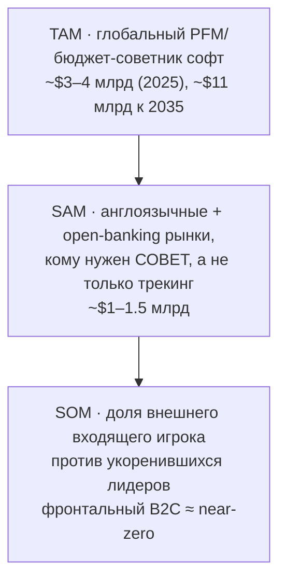
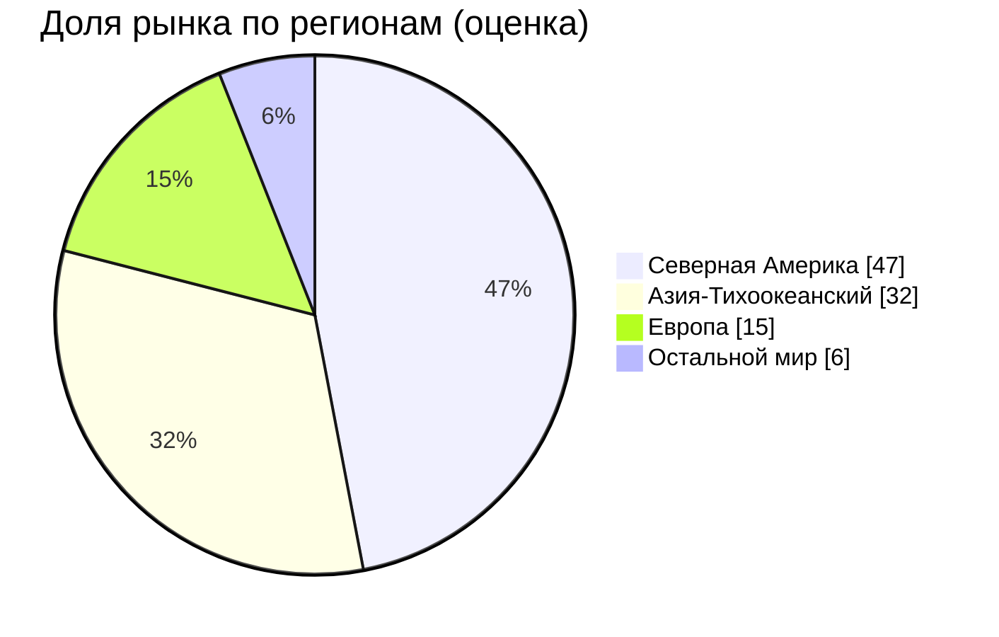
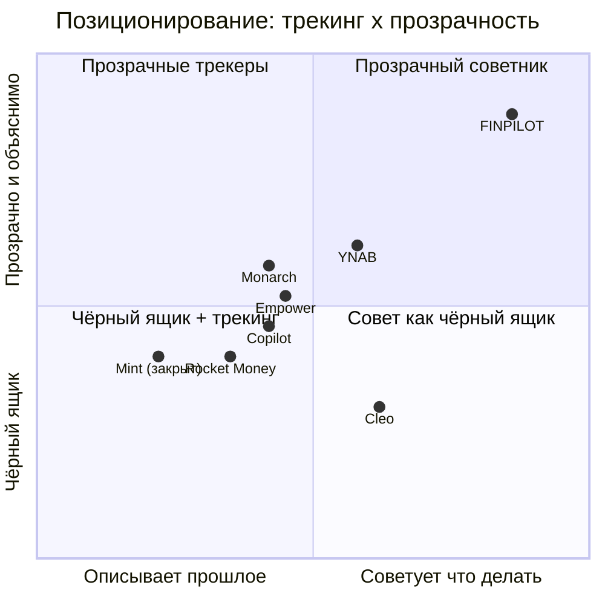

# FINPILOT — анализ международного рынка

> Те же разрезы, что и по российскому рынку (рынок, конкуренты, дифференциатор, экономика, GTM, риски), но для глобального рынка. Объективно, без украшений. Данные — из открытых источников 2025–2026 (отчёты рынка, обзоры, сторы); все суммы в USD, оценки — порядок величины.

---

## 0. Вердикт сразу

1. **Рынок огромный и быстрорастущий** — но именно поэтому **очень тесный и хорошо профинансированный**. После закрытия Mint (март 2024) нишу мгновенно заняли Monarch, Rocket Money, YNAB, Copilot, Empower, Cleo и Credit Karma.
2. **Твой дифференциатор (прозрачный прескриптивный советник) на международном рынке — уже,** чем в России. AI-советы там — тренд №1, а Cleo уже даёт прескриптивные рекомендации по долгам. Но **именно «прозрачная объяснимая математика + холистическая оптимизация долг/резерв/цели + прогноз» всё ещё относительно свободна** — это твой реальный, но более узкий клин.
3. **Главный барьер аброад — open banking.** В США/ЕС авто-синк с банком (Plaid, PSD2) — это норма, у всех конкурентов он есть. Твой ручной web-ввод там выглядит устаревшим. Этот разрыв за рубежом критичнее, чем в РФ.
4. **Объективный путь: НЕ фронтальная B2C-атака на США/ЕС.** Реалистично — либо доказать в РФ и СНГ сначала, либо заходить через B2B/инфраструктуру (объяснимость как преимущество для регуляторики), либо в недонасыщенные рынки (СНГ, MENA, LatAm, SEA; APAC — самый быстрый).

---

## 1. Размер рынка: TAM / SAM / SOM (глобально)

Важная оговорка: оценки сильно разнятся в зависимости от **определения**. «Personal finance software» (тип Quicken/YNAB) считают узко; «personal finance apps» — широко, включая необанки и инвест-сервисы.

| Что считают | Размер (2024–25) | Прогноз | CAGR | Источник |
|---|---|---|---|---|
| Personal finance **software** (узко) | ~$1.3–1.4 млрд | ~$2.4–2.6 млрд к 2033 | ~6–8% | Fortune BI, IMARC, Straits |
| Personal financial **management tool** | ~$3.4 млрд (2025) | ~$11 млрд к 2035 | ~12.5% | Business Research Insights |
| Personal finance **apps** (широко, с необанками) | ~$25–32 млрд (2025) | ~$170–200 млрд к 2035 | ~20–21% | MRFR, Research Nester |

Для FINPILOT (бюджетно-советующее приложение) сопоставима **средняя строка** — глобальный PFM-tool рынок ≈ **$3–4 млрд, растёт ~12%**. Широкий «app»-рынок ($30 млрд+) — внешняя граница, но он включает соседние категории.

**Гео-структура:** Северная Америка доминирует (~45–50% рынка), Азия-Тихоокеанский регион — самый быстрорастущий (~30–34%), Европа следом. В США, по данным CFPB, цифровым PFM-инструментом пользуются 45+ млн взрослых.

---

## 2. Структура рынка и тренды

| Тренд | Что значит для тебя |
|---|---|
| **AI-советы — тренд №1** | «Финансовый советник в кармане» — то, к чему все идут. Твоя идея совпадает с трендом, но и конкуренция за неё максимальная. |
| **Open banking = норма** | Plaid (США), PSD2 (ЕС/UK) — авто-синк с банком есть у всех. Ручной ввод = устаревший UX. **Главный барьер для тебя.** |
| **Консолидация после Mint** | Mint закрыт Intuit 23 марта 2024 → пользователи ушли к Credit Karma, Monarch, Rocket Money. Ниша уже поделена. |
| **Wealth/investing — крупнейший сегмент** | Наибольшая доля и рост — в автоинвестировании (робо-эдвайзеры). Чистый «бюджет» — лишь часть рынка. |

---

## 3. Конкурентная карта (после Mint)

| Игрок | Модель / цена | Позиционирование | Тип |
|---|---|---|---|
| **Monarch** | ~$99/год | Холистичный, кастомизируемый; основан экс-PM Mint; «преемник Mint» | трекер + планирование |
| **Rocket Money** | freemium + премиум | Отмена подписок, торг по счетам; владелец — Rocket Companies | трекер + экономия |
| **YNAB** | $14.99/мес или $109/год | Zero-based budgeting; меняет поведение; крутая кривая обучения | метод-бюджет (прескриптивный) |
| **Copilot** | $99/год (iOS/Mac) | Дизайн + AI-инсайты; красивый | трекер + AI |
| **Quicken Simplifi** | ~$2–4/мес | Автоматизация, простота | трекер |
| **Empower (Personal Capital)** | бесплатный дашборд | Монетизация через живых финсоветников | трекер + advisory |
| **Cleo** | $5.99–14.99/мес | AI-чатбот, дерзкий тон; «Debt Reset» — приоритизация долгов + план; кэш-авансы | **AI-советник (чёрный ящик)** |
| **Credit Karma (Intuit)** | бесплатно | Кредитный скоринг + рекомендации продуктов | скоринг |

### Карта позиционирования

Две оси: *описывает прошлое ↔ советует что делать* и *чёрный ящик ↔ прозрачно/объяснимо*. Где свободно — верх-право.

**Честное чтение карты:** верх-право не пустой — рядом YNAB (прозрачный метод, но ручной) и Cleo (советует, но чёрный ящик). Но **связки «прескриптивная холистическая оптимизация (долг+резерв+цели) + показанная математика + прогноз»** на этой карте никто не закрывает полностью. Это твой клин — реальный, но более узкий, чем в России.

---

## 4. Проверка дифференциатора за рубежом

| Твой элемент | Закрыт ли конкурентами? |
|---|---|
| Трекинг расходов | ✅ закрыт всеми, давно |
| «Smart suggestions» / AI-нудж | ✅ почти у всех (Copilot, Rocket, Cleo) |
| Прескриптивный совет по долгам | 🟡 частично — Cleo «Debt Reset» уже делает приоритизацию + план |
| **Прозрачная объяснимая математика («покажи как посчитано»)** | 🟢 **относительно свободно** — у AI-апсов это чёрный ящик |
| **Холистическая оптимизация долг/резерв/цели одним движком + прогноз** | 🟢 **относительно свободно** — никто не делает целостно и прозрачно |

Вывод: на международном рынке выживает **не «ещё один советник», а именно угол прозрачности + объяснимости + целостной оптимизации.** Это надо подавать как ядро, иначе сольёшься с Cleo и Monarch.

---

## 5. Активы FINPILOT против международной планки

| Сильное | Слабое (барьеры аброад) |
|---|---|
| Работающий движок (SAW, Avalanche, Монте-Карло) | **Нет open-banking синка** — за рубежом это норма, не опция |
| Прозрачность = плюс для регуляторики (объяснимость) | Нет бренда и дистрибуции против Intuit/Rocket/Monarch |
| Объяснимость — то, чего нет у AI-чёрных ящиков | Ручной web-ввод = устаревший UX по меркам США/ЕС |
| — | Движок построен под рубль/РФ-реалии → нужна локализация (валюта, налоги, кредитные системы) |
| — | Соло-фаундер против профинансированных команд |

---

## 6. Бизнес-модель и цены (международные нормы)

- **Норма цены премиума:** ~$99–109/год (≈ $8–9/мес). YNAB $109/год, Monarch ~$99/год, Copilot $99/год, Cleo $5.99–14.99/мес.
- **Freemium** распространён (Rocket Money, Empower — бесплатный дашборд, монетизация через advisory).
- **Готовность платить выше**, чем в РФ — но и **CAC жёстче**, а у инкумбентов — встроенная дистрибуция.
- Если бы FINPILOT заходил: позиционируй платный движок (совет + прогноз) на уровне ~$7–9/мес, freemium-трекинг бесплатно. Но это фронтальная B2C — см. §9, почему это плохая идея «в лоб».

---

## 7. Юнит-экономика за рубежом

| Параметр | РФ | Международно |
|---|---|---|
| ARPU/подписка | ~250 ₽/мес | ~$8–9/мес (выше) |
| CAC | высокий | **очень высокий** (финтех — самый дорогой; + конкуренция за трафик) |
| Дистрибуция | можно органикой | у инкумбентов встроена (Intuit, Rocket Companies) |
| Вывод | lifestyle на органике | **фронтальный B2C почти нерентабелен для внешнего входящего** |

Выше чек не спасает: против Monarch/Rocket/Intuit стоимость привлечения платящего съест маржу. LTV/CAC ≥ 3 на чужом насыщенном рынке без бренда — практически недостижим органикой.

---

## 8. Регуляторика и данные

| Область | Что учитывать |
|---|---|
| **Open banking** | США — Plaid/агрегаторы; ЕС/UK — PSD2/Open Banking. Без интеграции UX неконкурентен. |
| **Данные** | ЕС — GDPR; США — CCPA/штатные законы. Строже и дороже комплаенс, чем 152-ФЗ. |
| **Финсовет** | Бюджет/долги — обычно НЕ лицензируемый инвестсовет. Но инвестрекомендации → RIA/фидуциар (США), FCA (UK). Объяснимость здесь — твой плюс перед регулятором. |
| **Локализация** | Валюты, налоги, кредитные системы, язык — отдельная стоимость на каждый рынок. |

*Не юрсовет — направления для проверки с юристом перед любым входом.*

---

## 9. Стратегии входа (объективно)

| Вариант | Суть | Оценка |
|---|---|---|
| **A. Сначала РФ/СНГ** | Доказать модель дома (домашнее преимущество, меньше конкуренции, движок уже под рубль), потом думать о загранице | ✅ **рекомендуемый старт** |
| **B. B2B / инфраструктура за рубежом** | Лицензировать прозрачный движок финтехам/банкам/советникам, у кого нет прескриптивного слоя; объяснимость = аргумент для комплаенса | 🟢 реалистичный клин (потолок выше, без войны за конечника) |
| **C. Недонасыщенные рынки** | СНГ, MENA, LatAm, SEA — растущая проникаемость смартфонов, слабее инкумбенты; APAC — самый быстрый | 🟡 возможно, но нужна локализация |
| **D. Фронтальный B2C в США/ЕС** | Конкурировать с Monarch/Rocket/Intuit за конечника | 🔴 **избегать** — дорого, тесно, без бренда и синка |

**Рекомендация:** не лезь в лоб на Запад. Сначала докажи в РФ/СНГ (вариант A). Если за рубеж — через **B2B/инфраструктуру** (B), где прозрачность и объяснимость — реальное преимущество, а не через B2C-витрину против инкумбентов.

---

## 10. Итог

- **Международный B2C-рынок** для FINPILOT как внешнего входящего — это **тесный, дорогой, хорошо профинансированный океан**. Фронтальный вход в США/ЕС объективно нерационален.
- **Дифференциатор работает, но он уже:** прозрачная объяснимая оптимизация — реальный клин, который нельзя размывать; «ещё один AI-советник» там не выживет.
- **Реальная международная возможность — B2B/инфраструктура и/или недонасыщенные рынки,** а не подписка против Monarch. И только после доказательства модели дома.
- Главный технический барьер для любого международного B2C — **отсутствие open-banking синка**; без него UX неконкурентен по западным меркам.

**Одной строкой:** глобально продукт-идея в тренде, но рынок поделён и богат на деньги — поэтому за рубежом твой путь не «подписка для всех», а «движок/инфраструктура для тех, у кого нет прозрачного советника», и не раньше, чем модель докажет себя в РФ.

---

## Приложение: источники и допущения

**Источники (2025–2026):** Verified Market Research, Fortune Business Insights, IMARC, Straits Research, The Business Research Company, Market Research Future, Research Nester, Business Research Insights (размеры рынка и CAGR); CNBC Select, Engadget, MyBankTracker, Rob Berger, WallStreetSurvivor, Finny (карта конкурентов, закрытие Mint); Bankrate, FinanceBuzz, App Store / Google Play (Cleo, AI-апсы); CFPB (45+ млн пользователей PFM в США).

**Допущения:** размеры рынка — порядок величины, диапазоны из-за разных определений категории. TAM взят по сопоставимой нише (PFM/бюджет-советник софт), а не по широкому «app»-рынку с необанками. SAM/SOM — обоснованные оценки, не точные расчёты; SOM для внешнего входящего намеренно консервативен. Цены конкурентов актуальны на момент обзора и меняются.
