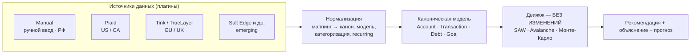
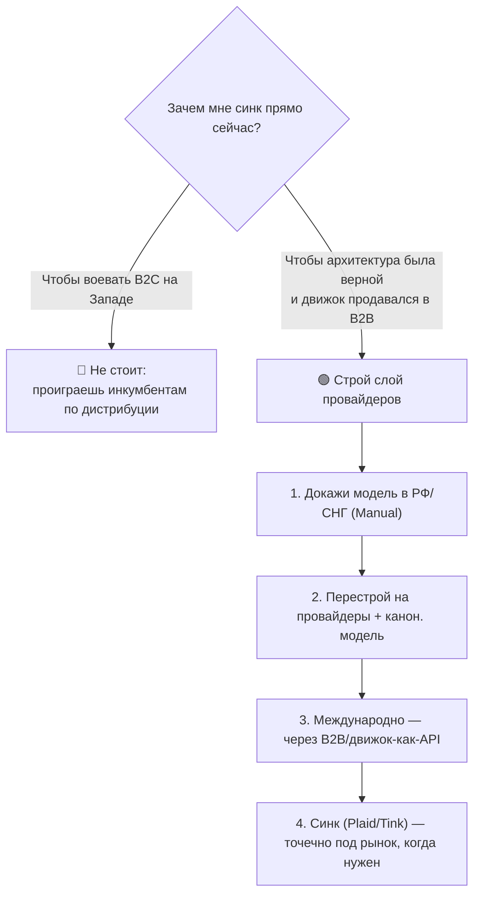

# FINPILOT — как выйти на международный уровень: логика решения

> Разбор твоих вопросов: есть ли у тебя преимущества, нужен ли опрос, решит ли проблему авто-синк с банками, что добавить в продукт и **как это технически сделать так, чтобы легко масштабировалось** (и на новые страны, и на B2B). Технику — скелетом кода под твой стек; рядом — человеческими словами.

---

## 0. Короткий честный ответ на твои три вопроса

1. **Преимущества есть, но узкие.** Твой козырь — не «лучшее приложение», а **движок + прозрачность**. Это реально, но это не делает тебя автоматически конкурентом Monarch/Cleo на их поле.
2. **Авто-синк — НЕ пьедестал.** Это входной билет, а не победа. Без него на Западе UX неконкурентен, но и с ним ты лишь встаёшь на старт — бренд, дистрибуция и удержание решают больше.
3. **Опрос — не первый шаг.** «Важна ли прозрачность» лучше проверять **поведением**, а не анкетой (люди в опросах врут — твой же РФ-опрос завысил готовность платить с 5% реальных до 54%).

Дальше по каждому подробно.

---

## 1. Есть ли у тебя преимущества против них?

Да — но честно очерчу границы.

| Преимущество | Реально? | Оговорка |
|---|---|---|
| **Прозрачная объяснимая математика** («покажи как посчитано») | 🟢 да | у AI-апсов (Cleo) это чёрный ящик — здесь ты отличаешься |
| **Холистическая оптимизация долг/резерв/цели одним движком + прогноз** | 🟢 да | целостно и прозрачно это не делает почти никто |
| **Сам движок как технология** | 🟢 да | его можно лицензировать (B2B) — это и есть твой международный клин |
| Лучше как потребительское приложение | 🔴 нет | у них синк, бренд, дистрибуция, мобайл — ты пока позади |

**Вывод:** твоё преимущество — в **ядре (движок) и угле (прозрачность)**, а не в том, что ты сегодня удобнее как app. Поэтому международная игра — про «движок/инфраструктуру для тех, у кого нет прозрачного советника», а не про подписку против инкумбентов.

---

## 2. Решит ли проблему авто-синк? (необходимо ≠ достаточно)

**Необходимо:** на Западе авто-синк (Plaid, PSD2) — норма. Ручной ввод там = устаревший UX, дисквалификатор.

**Но недостаточно:** синк убирает минус, но не создаёт плюс. Добавив его, ты **встаёшь на старт, а не на подиум**. Победа всё равно зависит от бренда, дистрибуции, удержания и твоего дифференциатора.

| Что даёт синк | Чего синк НЕ даёт |
|---|---|
| снимает трение ввода → лучше activation/retention | бренд и доверие |
| паритет UX с конкурентами | дистрибуцию и дешёвый CAC |
| данные для движка автоматически | сам по себе — причину выбрать тебя |

**Ключевой технический инсайт (и хорошая новость):** за рубежом синк — это **одна интеграция, а не сотня**. Ты подключаешь один агрегатор (Plaid и т.п.) — и получаешь доступ к тысячам банков сразу. В России так нельзя (нет единого open banking, банки фрагментированы) — поэтому твой ручной ввод дома оправдан. Это разворачивает логику: **синк строим не ради фронтального B2C на Западе (там всё равно проиграешь инкумбентам), а ради правильной архитектуры, B2B и будущих рынков.**

---

## 3. Нужен ли опрос про «важна ли прозрачность и доверие к ИИ»?

Гипотеза правильная, но **анкета — слабый способ её проверить**. Люди говорят «да, важна прозрачность», а платят за удобство. Проверяй **поведением**:

| Вместо опроса | Что делать |
|---|---|
| 🟢 Лендинг с углом прозрачности | сделай страницу «прозрачный финсоветник, видно как посчитано» + waitlist. Смотри: записываются ли. Это голос деньгами/действием. |
| 🟢 5–10 интервью | поговори с реальными зарубежными пользователями/советниками: где у них боль с «чёрным ящиком». |
| 🟢 B2B-разговоры | для финтехов/банков объяснимость = аргумент комплаенса. Там прозрачность проверяется конкретно. |
| 🟡 Опрос — только в дополнение | как фон, не как решение. И помни смещение: твой РФ-опрос уже показал, что прозрачности доверяют больше, чем чёрному ящику (32% vs 22%) — это направление, а не гарантия оплаты. |

---

## 4. Что добавить в продукт, чтобы выйти на международный уровень

По приоритету:

1. **Авто-синк через агрегатор** — табличная ставка для любого серьёзного B2C (см. §5 как).
2. **Прозрачность как фича первого экрана** — твой дифференциатор не прячь: вид «почему так посчитано» должен быть на виду, не в глубине меню.
3. **Мультивалюта + локаль** — валюта (ISO-4217), форматы чисел/дат, язык (сначала EN).
4. **Локализуемые бенчмарки движка** — сама математика валюто-нейтральна, но пороги (норма сбережений, пороговая ставка Avalanche `r_bench`, нормы ликвидности) различаются по странам → вынеси их в конфиг по локали.
5. **Мобайл-first** — Telegram-бот/PWA, нативка позже.
6. **Комплаенс и данные** — GDPR (ЕС), CCPA (США), шифрование, согласия. Финданные + подключение банков = высокая планка.
7. **Движок-как-API** — продуктизируй ядро для B2B. Это твой реальный международный клин.

---

## 5. Как это реализовать (архитектура, которая масштабируется)

Главная идея проектирования — **отвязать движок от источника данных**. Движок не должен знать, откуда пришли цифры: из ручного ввода, из Plaid, из банковского API. Между ними — слой провайдеров и единая «каноническая» модель.



### Что конкретно меняешь в реализации

**Шаг 1. Каноническая модель** (провайдеро-независимая, Pydantic):

```python
# domain/models.py
from __future__ import annotations
from datetime import date
from decimal import Decimal
from enum import Enum
from pydantic import BaseModel

class TxnType(str, Enum):
    income = "income"
    expense = "expense"

class Transaction(BaseModel):
    amount: Decimal
    currency: str            # ISO-4217: "USD", "EUR", "RUB"
    booked_at: date
    type: TxnType
    category: str | None = None
    is_recurring: bool = False

class Account(BaseModel):
    external_id: str
    name: str
    balance: Decimal
    currency: str

class Debt(BaseModel):
    name: str
    balance: Decimal
    rate: Decimal            # годовая, напр. 0.085
    payment: Decimal
    term_months: int

class Goal(BaseModel):
    name: str
    target: Decimal
    saved: Decimal
    deadline: date | None
    category: str            # income_growth | safety | material | emotional

class FinancialSnapshot(BaseModel):
    base_currency: str
    accounts: list[Account]
    transactions: list[Transaction]
    debts: list[Debt]
    goals: list[Goal]
```

**Шаг 2. Контракт провайдера** — один интерфейс, много реализаций:

```python
# providers/base.py
from abc import ABC, abstractmethod
from domain.models import FinancialSnapshot

class AccountProvider(ABC):
    """Одна реализация на источник данных. Движок не знает, какая именно."""

    @abstractmethod
    def fetch_snapshot(self, user_id: str) -> FinancialSnapshot:
        ...
```

**Шаг 3. Реализации провайдеров** — ручной (работает везде, в т.ч. РФ) и агрегатор (одна интеграция → тысячи банков):

```python
# providers/manual.py
class ManualProvider(AccountProvider):
    def __init__(self, repo: UserInputRepository) -> None:
        self._repo = repo

    def fetch_snapshot(self, user_id: str) -> FinancialSnapshot:
        return self._repo.load_snapshot(user_id)   # то, что ввели в боте/форме


# providers/plaid.py
class PlaidProvider(AccountProvider):
    def __init__(self, client: PlaidClient) -> None:
        self._client = client                       # ключи — из .env, НЕ в коде

    def fetch_snapshot(self, user_id: str) -> FinancialSnapshot:
        raw = self._client.transactions_get(user_id)   # один API → тысячи банков
        return self._normalize(raw)

    def _normalize(self, raw: dict) -> FinancialSnapshot:
        ...   # маппинг raw → каноническая модель + категоризация + recurring
```

**Шаг 4. Движок остаётся чистой функцией модели** — его не трогаешь:

```python
# engine/core.py  (УЖЕ существует — меняется только вход)
def analyze(snapshot: FinancialSnapshot, profile: RiskProfile) -> Recommendation:
    ...   # SAW + Avalanche + Монте-Карло — источнику-агностично
```

**Шаг 5. Сборка в FastAPI** — реестр выбирает провайдера по региону/пользователю:

```python
# app: один эндпоинт, любой источник
def get_provider(user: User) -> AccountProvider:
    return REGISTRY[user.region]        # "RU" -> Manual, "US" -> Plaid, ...

@router.post("/v1/analyze")
def analyze_endpoint(user: User, profile: RiskProfile) -> Recommendation:
    snapshot = get_provider(user).fetch_snapshot(user.id)
    return analyze(snapshot, profile)
```

**Агрегаторы по регионам** (что оценивать, не рекомендация): США/Канада — Plaid, MX, Finicity; ЕС/UK — Tink, TrueLayer, GoCardless, Yapily; глобально/emerging — Salt Edge; LatAm — Belvo; Африка — Mono. Подключаешь по мере выхода на рынок.

**Безопасность:** токены доступа — шифровать, хранить отдельно; ключи агрегатора — в `.env` через `python-dotenv`, никогда в коде; не хранить банковские пароли (за аутентификацию отвечает агрегатор); минимум PII.

---

## 6. Почему такая архитектура легко масштабируется

| Сценарий роста | Что делаешь |
|---|---|
| **Новая страна** | пишешь один новый `Provider` (напр. `TinkProvider`). Движок и модель — без изменений. |
| **B2B / лицензия движка** | партнёр шлёт данные в твою каноническую модель (или ты ингестишь через его провайдера) → тот же `analyze()`. Движок уже продукт. |
| **Рынок без open banking (РФ)** | `ManualProvider` остаётся как fallback — ничего не ломается. |
| **Смена/добавление агрегатора** | меняешь одну реализацию, остальное не трогаешь. |

Суть: **движок изолирован, источники — сменные плагины, модель — единый контракт.** Это и есть «легко масштабировать» — и по гео, и в B2B.

---

## 7. Человеческими словами

**Аналогия про синк и архитектуру.** Представь, что твой движок — это ноутбук. Розетки в разных странах разные (US, EU, РФ-банки). Ты не переделываешь ноутбук под каждую розетку — ты делаешь **универсальный переходник** (слой провайдеров). Ноутбук (движок) всегда получает одинаковый ток (каноническую модель), а переходник прячет разницу между странами. Добавить новую страну = добавить новую «вилку», а не переделать ноутбук.

**Про «выйду ли я на их пьедестал, если добавлю синк».** Нет — синк это как купить билет на турнир. Без билета не пускают (на Западе без синка ты вне игры), но билет не делает тебя чемпионом. Чемпиона делают бренд, удержание и то, чем ты реально отличаешься — прозрачность. Поэтому синк строй **не чтобы воевать с Monarch за конечника** (там проиграешь), а чтобы (а) иметь правильную архитектуру, (б) суметь продать движок в B2B, (в) быть готовым к новым рынкам.

**Про опрос.** Анкета спросит «ценишь ли прозрачность» — все скажут «да». Это ничего не доказывает. Сделай лендинг с этим углом и waitlist — и смотри, **записываются ли люди реально**. Действие весит больше слов.

**Что в итоге делать по-человечески:**
1. Не кидайся строить синк ради западного B2C — там тебя всё равно задавят дистрибуцией.
2. **Сначала докажи модель дома** (РФ/СНГ), где ручной ввод оправдан и конкуренция слабее.
3. Параллельно **перестрой архитектуру на слой провайдеров** — это и для B2B полезно, и под будущие рынки.
4. Международно заходи через **B2B/движок-как-API** (прозрачность = аргумент для комплаенса), а синк добавляй точечно под конкретный рынок, когда он реально нужен.

---

## 8. Порядок действий (что сначала)



**Одной строкой:** преимущество у тебя в движке и прозрачности, а не в удобстве; синк — входной билет, а не победа; гипотезу проверяй поведением, не анкетой; а технически — отвяжи движок от источника данных через слой провайдеров, и тогда и новые страны, и B2B подключаются без переделки ядра.
