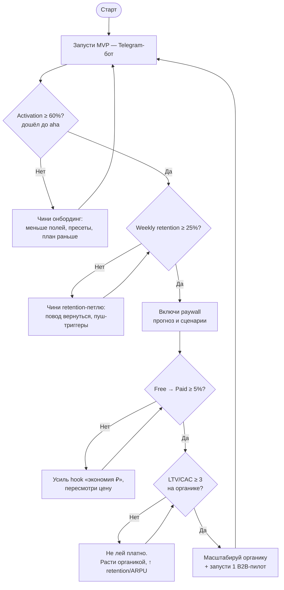
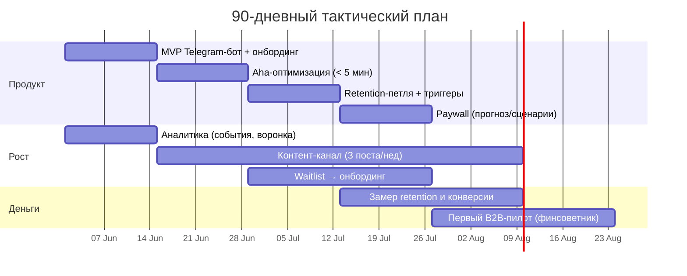
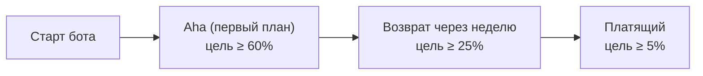

# FINPILOT — тактика развития

> Стратегия отвечает «куда и почему» (B2C-витрина → B2B-деньги, гибрид C→B). **Тактика отвечает «что делать в ближайшие 90 дней и в каком порядке».** Здесь — алгоритм решений, план действий по спринтам, что инструментировать в аналитике и по каким порогам действовать.

---

## Тактический принцип

Сейчас у тебя **одна цель**, и всё ей подчинено: **довести живого пользователя до aha-момента и удержать его**. Не масштаб, не выручка, не новые фичи. Пока нет удержания — всё остальное бессмысленно.

Из этого три правила:
1. **Retention — главная метрика.** Пока weekly retention < 25%, трафик не льём и фичи не пилим.
2. **Сначала ценность, потом полнота.** Покажи магию на минимуме данных, дозапрашивай по мере вовлечения.
3. **Действие бьёт анализ.** Каждый спринт = одна проверенная гипотеза на живых людях, а не ещё одна таблица.

---

## Главный алгоритм развития

Это контур, по которому ты принимаешь решения. Не двигаешься на следующий шаг, пока не пройден предыдущий гейт.

Читается так: **дошёл до aha → удержал → начал брать деньги → проверил экономику → масштабируешь.** На каждом «Нет» — конкретная починка, и возврат на гейт.

---

## План действий — 90 дней (по 2-недельным спринтам)

| Спринт | Недели | Фокус | Конкретные задачи | Гейт на выходе |
|---|---|---|---|---|
| **1** | 1–2 | MVP + аналитика | Telegram-бот; прогрессивный онбординг (доход, 1 расход, 1 долг, 1 цель); первый план + экономия в ₽; инструментировать события | бот работает, события пишутся |
| **2** | 3–4 | Aha | Снизить time-to-aha < 5 мин; пресеты/шаблоны; черновой план на неполных данных; запустить контент-канал | activation ≥ 60% |
| **3** | 5–6 | Удержание | Месячный цикл «обнови → новый план»; пуш-триггеры (ставки, дедлайн цели); waitlist → онбординг | начать мерить weekly retention |
| **4** | 7–8 | Монетизация | Если retention ≥ 25% → paywall на прогноз/сценарии; A/B на hook «экономия ₽» | retention ≥ 25% |
| **5** | 9–10 | Конверсия + B2B-щуп | Оптимизация free→paid и цены; первый тёплый контакт с финсоветником, демо по скрипту | free→paid ≥ 5% |
| **6** | 11–12 | Масштаб/ревизия | Если LTV/CAC ≥ 3 → масштаб органики; запуск B2B-пилота; ревизия метрик, план на Q2 | решение go/no-go по гейтам |

Принцип: **продукт, рост и деньги идут параллельными дорожками**, но деньги (paywall, B2B) включаются только после гейтов удержания.

---

## Аналитика: что инструментировать

Без этого ты летишь вслепую. Заведи логирование событий с первого дня (ты на Python — пиши события в Postgres, дашборд собери в Metabase/Grafana или простой агрегацией).

**События воронки (минимальный набор):**

1. `onboarding_started` — нажал /start
2. `field_entered` — ввёл данные (с указанием шага)
3. `first_plan_shown` — **aha-момент** (получил план + экономию в ₽)
4. `explanation_viewed` — открыл «почему»
5. `returned` — вернулся (с меткой дня: D1/D7)
6. `paywall_shown` / `subscribed` / `churned`
7. `plan_shared` — поделился планом (виральность)

**Воронка, которую смотришь каждую неделю:**

**Опережающие vs запаздывающие:**
- *Опережающие* (видишь сразу, чинишь быстро): activation, time-to-aha, D1.
- *Запаздывающие* (итог): weekly retention, free→paid, LTV/CAC.

**Приватность:** храни минимум персональных данных, агрегируй. Финансовые данные = 152-ФЗ, не собирай лишнего.

---

## Метрики-дашборд (с порогами и триггерами)

Это твой операционный пульт. Каждая метрика связана с действием: если ниже порога — делаешь конкретную вещь, а не «думаешь».

| Метрика | Цель | Если ниже порога → действие |
|---|---|---|
| **Activation** (дошёл до aha) | ≥ 60% | убрать поля, дать пресеты, показать план раньше |
| **Time-to-aha** | < 5 мин | сократить шаги онбординга, черновой план на неполных данных |
| **D1 retention** | ≥ 40% | усилить первый «повод вернуться» (пуш на след. день) |
| **Weekly retention** | ≥ 25–30% | **НЕ лить трафик**; чинить retention-петлю и триггеры |
| **Free → Paid** | ≥ 5% | усилить hook «экономия X ₽», пересмотреть цену/состав paywall |
| **Органический CAC** | ≪ 1000 ₽ | сменить канал, усилить виральность («поделись планом») |
| **LTV / CAC** | ≥ 3 | пока < 3 — платную рекламу не масштабировать |

---

## Операционный ритм

| Частота | Что делаешь |
|---|---|
| **Каждый день** | пульс: новые пользователи, DAU, логи бота (не сломалось ли) |
| **Каждую неделю** (пн) | обзор воронки и weekly retention; 1 гипотеза на спринт; 3 поста в канал |
| **Раз в 2 недели** | ретро спринта; go/no-go по гейтам алгоритма |
| **Каждый месяц** | дайджест обновлений в канал; ревизия метрик; решение по B2B-пилоту |

---

## Триггеры масштабирования и разворота

Заранее реши, при каких сигналах ты меняешь поведение — чтобы не решать на эмоциях в моменте.

| Триггер | Условие | Действие |
|---|---|---|
| 🟢 **Масштабировать органику** | weekly retention ≥ 25–30% И LTV/CAC ≥ 3, три недели подряд | вкладывайся в каналы роста |
| 🟢 **Запустить B2B-пилот** | есть работающий продукт + 1 доказанный кейс ценности | не жди PMF — щупай B2B параллельно |
| 🔴 **Выключить платную рекламу** | платный CAC не даёт LTV/CAC ≥ 2 за 4 недели | стоп-кран, обратно на органику |
| ⚠️ **Сигнал к пивоту** | после 2 циклов починки онбординга activation < 30% И retention < 15% | проблема не в исполнении, а в ценности/сегменте → пересмотри сегмент или JTBD |

---

## Тактика по двум фронтам (кратко)

- **B2C сейчас (строишь сам):** бот → aha → retention → paywall. Детальная воронка и онбординг — в плейбуке (`FINPILOT_playbook`).
- **B2B щупаешь рано (1 пилот):** 1 тёплый финсоветник → демо 15 мин → бесплатный пилот → кейс. Скрипт и экономика лицензии — там же.

**Суть тактики в одной строке:** запусти бот → меряй retention → не двигайся дальше, пока не пройдёшь гейт → масштабируй только то, что уже работает.
