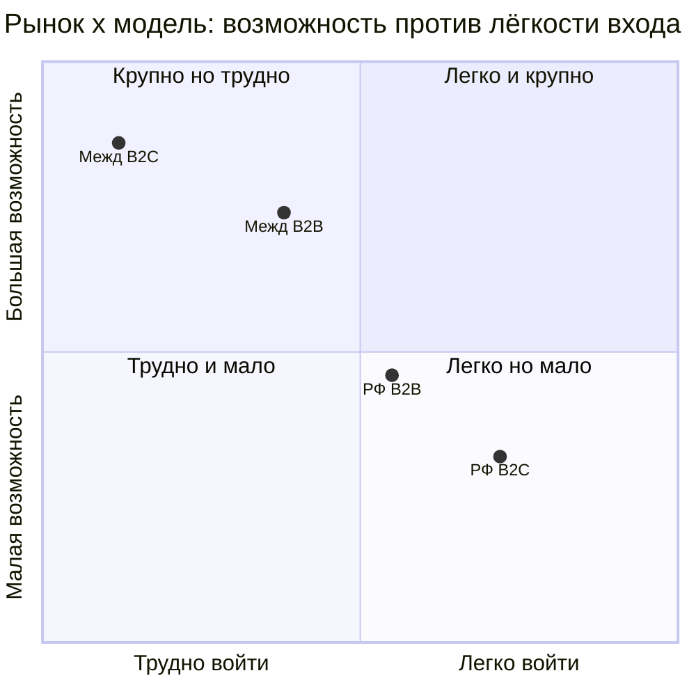
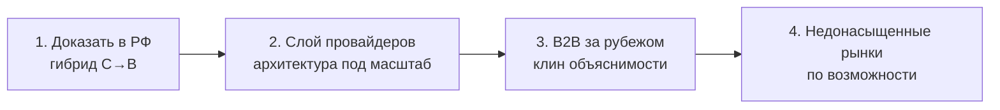

# FINPILOT — РФ-рынок vs международный: конкретное сравнение

> Свожу два анализа (РФ и международный) бок о бок: с цифрами, расчётами SOM по моделям, плюсами/минусами и тем, что из этого следует. Конверсии — по курсу ~90 ₽/$ (приблизительно, для масштаба).

---

## 0. Снимок (dashboard-scorecard)

| Аспект | РФ | Международно | Кто выигрывает |
|---|---|---|---|
| Размер рынка (TAM) | ~$1.8 млрд | $25–32 млрд (широкий) | 🟢 межд. (×15–18) |
| Конкуренция | слабее, мало денег | плотная, профинансирована | 🟢 РФ (легче) |
| Готовность платить | ~250 ₽/мес (~$2.8) | ~$8–9/мес | 🟢 межд. (выше чек) |
| Стоимость привлечения (CAC) | умеренная | очень высокая | 🟢 РФ |
| Open banking (синк) | нет (сложно) | норма (Plaid/PSD2) | 🟢 межд. (если решишь) |
| Дифференциатор (прозрачность) | широкий зазор | узкий зазор | 🟢 РФ |
| Регуляторика | 152-ФЗ | GDPR/CCPA/PSD2 + лицензии | 🟢 РФ (проще) |
| Локализация | не нужна | на каждый рынок | 🟢 РФ |
| Дистрибуция/доверие | домашнее преимущество | внешний игрок | 🟢 РФ |
| Движок уже готов | да (под рубль) | нужна адаптация | 🟢 РФ |
| Потолок B2C | lifestyle | ≈ 0 фронтально | 🟡 оба ограничены |
| Потолок B2B | средний | высокий | 🟢 межд. |

**Читается так:** международный рынок крупнее и богаче, но почти по всем «входным» факторам РФ легче. Преимущество загранки — только в размере и в B2B-потолке.

---

## 1. Размеры рынка (с цифрами)

| Слой | РФ | Международно |
|---|---|---|
| **TAM** | ~80 млн польз. / ~160 млрд ₽ (**~$1.8 млрд**) | $25–32 млрд (широкий) · $3–4 млрд (ниша PFM-советников) |
| **SAM** | ~8 млн / ~10–13 млрд ₽ (**~$110–145 млн**) | ~$1–1.5 млрд |
| **SOM** (реалистично) | B2C ~5–30 млн ₽ (**~$55–330K/год**) | через B2B ~$0.5–5 млн/год |

**Главное различие — масштаб:** международный TAM больше российского примерно **в 15–18 раз**, ниша — в несколько раз. Но «большой рынок» ≠ «твои деньги»: см. расчёты SOM ниже.

---

## 2. Юнит-экономика (расчёты)

```
РФ:
  ARPPU      = 250 ₽/мес  (~$2.8)
  LTV        = 250 × 12   = 3 000 ₽  (~$33)
  CAC орг.   ≈ 1 000 ₽    (~$11)   → LTV/CAC = 3.0  ✅
  CAC платно ≈ 3 000 ₽    (~$33)   → LTV/CAC = 1.0  ❌
  Вывод: сходится ТОЛЬКО на органике.

Международно (B2C, развитые рынки):
  Цена       ≈ $99/год    (~$8.25/мес)
  LTV        ≈ $100–200    (при удержании 1–2 года)
  CAC платно ≈ $150–300+   за платящего (финтех — самый дорогой трафик)
  LTV/CAC    ≈ 0.5–1.0     ❌  (теряешь деньги)
  Органика против Intuit/Rocket/Monarch без бренда — почти невозможна.
```

**Контраст:** в РФ органика даёт LTV/CAC = 3 (рабочая lifestyle-экономика). На Западе фронтальный B2C даёт LTV/CAC ≤ 1 — то есть **убыток на каждом платящем**.

---

## 3. SOM по моделям — расчёты (ядро)

### РФ · B2C
```
100 000 установок (органика, 2–3 года, оптимистично)
× 5% free→paid          = 5 000 платящих
× 250 ₽/мес × 12        = 15 000 000 ₽/год  (~$165K)
При 200K установок      ≈ 30 000 000 ₽/год  (~$330K)
→ SOM РФ B2C ≈ 15–30 млн ₽/год (~$165–330K). Lifestyle.
```

### РФ · B2B
```
10 клиентов (советники/сервисы) × 100 000 ₽/мес × 12 = 12 000 000 ₽/год (~$130K)
+ пара крупнее → 10–50 млн ₽/год (~$110–550K).
→ Потолок выше B2C, но рынок B2B в РФ узкий.
```

### Международно · B2C (фронтально)
```
Даже 10 000 платящих × $99 = $990K выручки,
НО привлечение 10 000 × $150 CAC = $1 500 000 → минус $510K,
и 10K органически против инкумбентов ты не получишь.
→ SOM ≈ $0 / в минус. НЕ ДЕЛАТЬ.
```

### Международно · B2B / инфраструктура
```
Per-seat:     5 фирм × 20 мест × $100/мес × 12   = $120K/год
Per-MAU:      3 финтеха × 50K MAU × $0.30 × 12    = $540K/год
White-label:  1–2 банка × $300K–1M               = $300K–2M/год
→ Блендед SOM 3–5 лет ≈ $0.5–5 млн/год. Реальная возможность.
```

### Сводка SOM

| Рынок × модель | Реалистичный SOM/год | Оценка |
|---|---|---|
| РФ · B2C | 15–30 млн ₽ (~$165–330K) | 🟡 lifestyle |
| РФ · B2B | 10–50 млн ₽ (~$110–550K) | 🟢 выше потолок |
| Межд. · B2C фронтально | ≈ $0 / минус | 🔴 не делать |
| Межд. · B2B / инфраструктура | $0.5–5 млн | 🟢 реальная возможность |

---

## 4. Конкуренция

| | РФ | Международно |
|---|---|---|
| Кто | банковский PFM (беспл.), трекеры (CoinKeeper, Дзен-мани), Excel | Monarch, Rocket Money, YNAB, Copilot, Cleo, Empower, Intuit/Credit Karma |
| Деньги/дистрибуция | мало | много, встроенная |
| Прескриптивный советник | нет | частично (Cleo — чёрный ящик) |
| Вывод | 🟢 ниша свободнее | 🔴 тесно и профинансировано |

---

## 5. Дифференциатор: где он сильнее

| | РФ | Международно |
|---|---|---|
| Доверие прозрачности | 32% vs 22% к чёрному ящику | тот же тренд, но AI-советы повсюду |
| Прескриптив занят? | нет | частично (Cleo) |
| Прозрачный + целостный + прогноз | свободно | относительно свободно (уже) |
| Итог | 🟢 широкий зазор | 🟡 узкий, но реальный клин |

---

## 6. Прочие различия

| Фактор | РФ | Международно |
|---|---|---|
| Open banking | нет → ручной ввод оправдан | норма → синк = одна интеграция (Plaid/Tink) |
| Регуляторика | 152-ФЗ | GDPR, CCPA, PSD2 + лицензии на совет |
| Локализация | не нужна | валюта, налоги, язык — на каждый рынок |
| Готовность платить | ниже | выше (но CAC съедает) |
| Дистрибуция | домашнее преимущество | внешний игрок без бренда |

---

## 7. Плюсы и минусы для FINPILOT

**РФ**
- 🟢 движок уже готов под рубль; конкуренции меньше; дёшево стартовать; язык/доверие/сеть дома; органика даёт LTV/CAC = 3.
- 🔴 рынок ограничен; B2C-потолок lifestyle; B2B-рынок узкий; локальные риски.

**Международно**
- 🟢 рынок ×15–18; выше чек; B2B-потолок высокий; объяснимость = аргумент для комплаенса.
- 🔴 тесно и профинансировано; фронтальный B2C убыточен; нет синка/бренда; дорогая локализация и комплаенс; внешний игрок.

---

## 8. Возможность против лёгкости входа



Никто не в зоне «легко и крупно». Тактика: взять **лёгкое-но-малое (РФ)** как доказательство, и затем идти в **крупное-но-трудное (межд. B2B)**, осознанно вкладываясь.

---

## 9. Что вижу (вывод)

- **РФ — это «дом»:** дешевле, движок готов, конкуренции меньше, органика работает. Но B2C-потолок — lifestyle.
- **Международный рынок огромен, но для тебя фронтальный B2C ≈ 0** (инкумбенты + CAC). Реальная международная возможность — **B2B/инфраструктура** ($0.5–5M).
- **Лучшая модель по рынкам:** РФ — гибрид C→B (B2C-витрина → B2B); международно — сразу B2B/инфраструктура.
- **Дифференциатор сильнее дома**, но и за рубежом «прозрачный + целостный + прогноз» — реальный (хоть и узкий) клин.

**Рекомендуемая последовательность:**



**Одной строкой:** РФ — где доказываешь и зарабатываешь на жизнь; международный — где потолок, но только через B2B и только после того, как модель доказана дома.

---

*Оговорка: все суммы — порядок величины; SOM для до-PMF продукта — ориентир, не прогноз. Курс ~90 ₽/$ приблизителен.*
