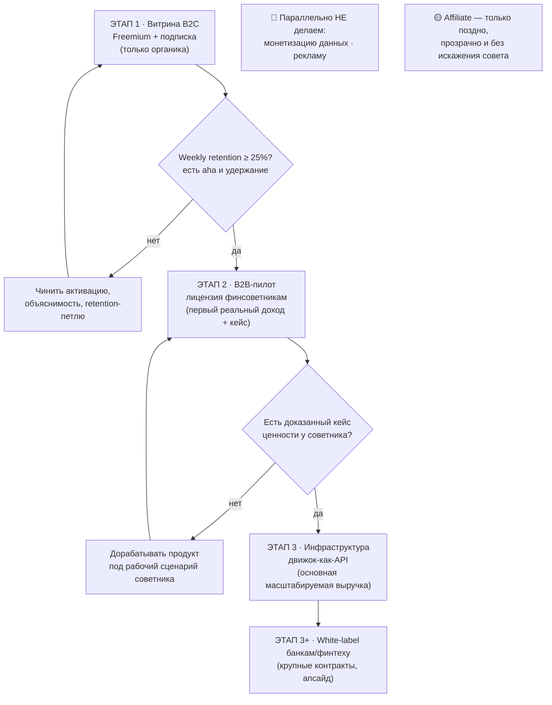

# FINPILOT — оценка бизнес-моделей: что каждая даёт проекту

> Прикладной разбор. Берём каждую бизнес-модель из общего руководства и оцениваем, что конкретно она даёт FINPILOT: выручку, стратегическую ценность, риски, на каком этапе включать. Зафиксированная стратегия (гибрид C→B, ров на прозрачности) — рамка, а не предмет пересмотра. Цель файла — сделать эту стратегию операциональной через линзу моделей и честно подсветить конфликты.

---

## 0. Рамка оценки

Что про FINPILOT считаем установленным (из стратегии и рыночных разборов):

- **Продукт:** прескриптивная СППР по личным финансам — говорит, что делать со свободным ресурсом (долг/резерв/цели), и **объясняет почему** через прозрачную математику (SAW + Avalanche + Монте-Карло).
- **Дифференциатор и ров:** прозрачная объяснимая оптимизация. Узкий, но реальный клин. Это **драйвер доверия** в B2C и **аргумент комплаенса** в B2B.
- **Зафиксированный путь:** гибрид **C→B**. B2C-витрина даёт proof / воронку / данные → B2B-пилот с независимыми финсоветниками → **B2B-инфраструктура (движок) как основная выручка**.
- **Жёсткие факты экономики:** B2C на платном трафике даёт **LTV/CAC ≈ 1** — работает только органика. Опрос 385 респондентов показал **разрыв намерения и поведения**: ~54% «готовы платить» на словах против ~5% реально. Готовность платить за рубежом выше, но CAC и инкумбенты съедают.
- **Международно:** не лобовой B2C против Monarch/Cleo, а B2B/движок-как-API после доказательства модели в РФ/СНГ.

### Критерии и шкала

Каждую модель оцениваю по пяти осям:

| Ось | Что оцениваем |
|---|---|
| **Выручка сейчас** | сколько реальных денег даёт в ближайшей перспективе |
| **Стратегическая ценность** | proof / данные / ров / дистрибуция — вклад в долгую игру |
| **Риск для рва и доверия** | не ломает ли модель главный актив (прозрачность, доверие) |
| **Сложность / стоимость** | насколько тяжело запустить силами соло-фаундера |
| **Этап** | когда включать по последовательности C→B |

Вердикт: 🟢 брать · 🟡 осторожно/вторично · 🔴 не брать.

---

## 1. B2C-подписка (на прогноз и сценарии)

- **Что даёт FINPILOT:** ранняя, но **скромная** выручка. Главная ценность не в деньгах, а в **доказательстве, что люди платят за совет**, в воронке и в поведенческих данных, которые кормят движок и кейсы для B2B.
- **Плюсы:** рекуррентность; валидация ценности на реальных деньгах; ARPU как метрика для B2B-разговоров.
- **Где проигрывает:** твои же цифры — **LTV/CAC ≈ 1** на платном трафике; разрыв 54% → 5% между словами и оплатой; «подписочная усталость» в финтехе; против веб-инкумбентов ты слаб без бренда и синка.
- **Риск:** соблазн **жить с этого** = lifestyle-потолок и слабый ров. Это тупик для венчурной линзы.
- **Вердикт:** 🟡 **Инструмент proof и воронки, а не источник выручки.** Только органический трафик. Цену держи как у западной нормы по смыслу, но не строй на ней бизнес.
- **Этап:** 1 (витрина).

---

## 2. Freemium B2C

- **Что даёт FINPILOT:** дешёвую дистрибуцию, верх воронки, данные и активацию. Это **механика входа** под подписку, а не отдельные деньги.
- **Плюсы:** низкий барьер («покажи магию на минимуме данных» — ровно твой тактический принцип); виральность через «поделись планом».
- **Где проигрывает:** конверсия free→paid 2–5%; бесплатные пользователи — издержки; нужен объём верха воронки, которого у соло-проекта поначалу нет.
- **Риск:** топ воронки **без удержания** = жжём ресурс впустую. Твой собственный гейт «не лить трафик, пока weekly retention < 25%» — правильная защита от этой ловушки.
- **Вердикт:** 🟢 **Как воронка/онбординг под подписку**, с жёстким гейтом по retention.
- **Этап:** 1 (витрина).

---

## 3. B2B-лицензия независимым финсоветникам

- **Что даёт FINPILOT:** **первый реальный B2B-доход** и, что важнее, **доказанный кейс ценности**. ARPU здесь на порядок выше B2C — это рабочий инструмент, а не приложение «для себя».
- **Плюсы:** твоя прозрачность становится **их** аргументом перед клиентом («вот почему я советую такой план — видно расчёт»); советники приводят **своих** клиентов (чужая дистрибуция); у профи **выше готовность платить** за инструмент, который экономит им время и повышает доверие клиента.
- **Где проигрывает:** длиннее цикл продаж; нужен B2B-онбординг и базовый SLA; вероятна кастомизация; на старте — concentration на немногих советниках.
- **Риск:** запускать **до** работающего продукта — рано. Но **щупать рано** (1 тёплый контакт, демо, бесплатный пилот) — правильно, это не требует PMF.
- **Вердикт:** 🟢 **Ключевой мост C→B.** Именно здесь гибрид начинает приносить деньги и ров.
- **Этап:** 2 (пилот), параллельный ранний щуп.

---

## 4. B2B-инфраструктура / движок-как-API

- **Что даёт FINPILOT:** **основную, масштабируемую выручку** и главный ров. Это твой международный клин и конечная цель стратегии.
- **Плюсы:** usage-based **масштабируется вместе с ценностью** клиента (NRR > 100%); глубокий **switching cost** (встроили движок — не уйдут); прозрачность = аргумент для комплаенса финтехов/банков; чужая дистрибуция; работает поверх **провайдер-слоя**, который отвязывает движок от источника данных (ровно та архитектура, что в твоём разборе «как выйти на международный уровень»).
- **Где проигрывает:** нужен сильный **DX** (документация, SDK, надёжность), uptime/SLA; долгий выход на объём; высокая инженерная планка — тяжело тянуть соло.
- **Риск:** строить инфраструктуру **до** доказанной ценности = преждевременная сложность. И надёжность уровня инфраструктуры в одиночку — реальное ограничение по капасити.
- **Вердикт:** 🟢🟢 **Конечная цель и главная выручка.** Архитектурно готовить **уже сейчас** (провайдер-слой, движок как чистый изолированный модуль), монетизировать — после кейсов с советниками.
- **Этап:** 3 (инфраструктура).

---

## 5. White-label банкам и финтеху

- **Что даёт FINPILOT:** крупные контракты, чужой бренд + дистрибуция; твой прозрачный прескриптивный слой как продукт для тех, у кого его нет.
- **Плюсы:** высокая маржа; стабильные контракты; прозрачность = комплаенс-аргумент перед регулятором.
- **Где проигрывает:** **очень длинный** enterprise-цикл; тяжёлая интеграция и требования по безопасности; concentration; ты невидим под чужим брендом.
- **Риск:** неподъёмно для соло на ранней стадии; крупный игрок может построить своё.
- **Вердикт:** 🟡 **Апсайд этапа 3+**, после доказанного B2B с советниками. Не сейчас — но держать в виду как естественное продолжение движка-как-API.
- **Этап:** 3+.

---

## 6. Партнёрская / Lead-gen (referral на вклады, карты, кредиты)

- **Что даёт FINPILOT:** естественный для PFM денежный поток **без собственной платной фичи**. Так зарабатывают Credit Karma, Сравни, banki.ru. Монетизация даже бесплатных пользователей.
- **Плюсы:** высокая маржа на лид; деньги без paywall.
- **Где проигрывает — и это главное:** прямой **конфликт с твоим ядром**. Твоё позиционирование — «**советник, а не трекер**» + прозрачность + доверие. Affiliate создаёт стимул рекомендовать то, что **платит тебе**, а не то, что оптимально пользователю. Это бьёт ровно в твой **moat** — в доверие к нейтральности совета.
- **Риск:** репутационный (в финансах особенно болезненно) + регуляторный (раскрытие связей, риск мисселинга); подрыв доверия = смерть дифференциатора.
- **Вердикт:** 🟡→🔴 **Возможен ТОЛЬКО как вторичный, прозрачно помеченный канал — и только когда рекомендация совпадает с тем, что движок и так считает оптимальным.** Пример допустимого: движок говорит «положи в накопительный под X%» → ты честно показываешь несколько вариантов, помечая партнёрские. Любое отклонение совета ради комиссии = 🔴, потому что ломает то единственное, чем ты отличаешься.
- **Этап:** не на старте, не как основа. Только после устойчивого доверия и с явным раскрытием.

---

## 7. Монетизация данных

- **Что даёт FINPILOT:** дополнительный поток с собираемых финансовых данных.
- **Где проигрывает / риск:** 152-ФЗ и GDPR; **репутационная катастрофа** при любом намёке на торговлю финансовыми данными; прямой удар по доверию — твоему активу №1.
- **Вердикт:** 🔴 **Нет.** Доверие в финтехе — это то, на чём держится весь продукт. Продавать данные = поджечь фундамент ради краткосрочного потока.
- **Этап:** —.

---

## 8. B2G (программы финансовой грамотности, вузы, госструктуры)

- **Что даёт FINPILOT:** потенциально крупные контракты и легитимность; связано с твоим академическим контекстом (ВКР, МИСиС, возможная публикация). Прозрачность и объяснимость — плюс для образовательного и регуляторного применения.
- **Где проигрывает:** очень длинный цикл и бюрократия; не масштабируется быстро; не дело соло-фаундера на ранней стадии.
- **Вердикт:** 🟡 **Спекулятивный апсайд, не приоритет.** Возможен как побочный канал через академические связи — особенно если ВКР/публикация дадут вход.
- **Этап:** оппортунистически, не в основном плане.

---

## 9. Реклама

- **Что даёт FINPILOT:** монетизацию внимания на бесплатной аудитории.
- **Где проигрывает / риск:** нужен масштаб, которого нет; подрыв доверия и UX; конфликт интересов; противоречит духу «нейтрального советника, которому можно доверять».
- **Вердикт:** 🔴 **Нет.** Для доверительного финансового советника реклама разрушительна — тот же механизм, что и с affiliate, только грубее.
- **Этап:** —.

---

## 10. Разовая продажа / вечная лицензия

- **Что даёт FINPILOT:** разовые деньги без рекуррентности.
- **Где проигрывает:** продукт требует постоянного сервиса (пересчёт планов, обновление данных, прогноз) — разовая продажа здесь неестественна и оставляет тебя без MRR.
- **Вердикт:** 🔴 **Мимо** для SaaS/инфраструктурного продукта. (Исключение — разовая продажа enterprise-лицензии в рамках white-label, но это уже п.5.)
- **Этап:** —.

---

## 11. Сводная матрица

| Модель | Выручка сейчас | Стратег. ценность | Риск для рва/доверия | Сложность (соло) | Этап | Вердикт |
|---|---|---|---|---|---|---|
| B2C-подписка | низкая | **высокая** (proof) | низкий | низкая | 1 | 🟡 воронка, не выручка |
| Freemium | нет | **высокая** (воронка) | низкий | низкая | 1 | 🟢 с гейтом retention |
| Лицензия финсоветникам | **средняя** | **высокая** (кейс+деньги) | низкий | средняя | 2 | 🟢 мост C→B |
| Движок-как-API | высокая (позже) | **очень высокая** (ров) | низкий | высокая | 3 | 🟢🟢 главная цель |
| White-label банкам | высокая (позже) | высокая | низкий | очень высокая | 3+ | 🟡 апсайд, не сейчас |
| Affiliate / lead-gen | средняя | низкая | **высокий** | низкая | поздно | 🟡→🔴 ломает moat |
| Монетизация данных | средняя | низкая | **критический** | средняя | — | 🔴 нет |
| B2G | низкая (позже) | средняя | низкий | высокая | оппортун. | 🟡 не приоритет |
| Реклама | низкая | низкая | **высокий** | средняя | — | 🔴 нет |
| Разовая продажа | средняя | низкая | низкий | низкая | — | 🔴 мимо |

---

## 12. Последовательность: какая модель на каком этапе

**Что готовить заранее, ещё на этапе 1:** провайдер-слой и изоляцию движка в отдельный модуль. Это не приносит денег сразу, но без этого этап 3 (движок-как-API) превращается в переписывание ядра. Архитектура под B2B закладывается до того, как B2B начнётся.

---

## 13. Честные развязки и конфликты

Три места, где легко ошибиться:

1. **Affiliate против рва (главный конфликт).** Lead-gen — самый очевидный способ заработать в PFM, и именно поэтому соблазнительный. Но твой единственный дифференциатор — **доверие к нейтральности совета**. Как только пользователь заподозрит, что движок советует ради комиссии, прозрачность перестаёт быть преимуществом. Правило: партнёрские варианты допустимы, только когда они **совпадают** с уже оптимальным советом и **явно помечены**. Иначе это размен главного актива на краткосрочный поток.

2. **Преждевременный B2B.** Твоя же тактика запрещает лить трафик до retention ≥ 25%. Тот же принцип — для B2B: **не строить инфраструктуру и не гнаться за white-label до доказанной ценности**. Щупать советников рано — да; строить полноценный API-продукт до кейсов — нет.

3. **Соблазн данных.** Финансовые данные кажутся монетизируемым активом. В финтехе это мина: один намёк на торговлю данными — и доверие, на котором стоит весь продукт, обнуляется. Держись подальше.

И одно ограничение реальности: **white-label и инфраструктура требуют надёжности и DX уровня, который соло-фаундеру тяжело держать.** Это не «никогда», это «не раньше, чем появятся ресурсы/команда под SLA».

---

> **Одной строкой:** подписка и freemium для FINPILOT — это не выручка, а доказательство и воронка; реальные деньги и ров — в B2B (сначала лицензия советникам, потом движок-как-API); affiliate — соблазн, который ломает твой главный актив (доверие), поэтому максимум вторично и прозрачно; данные и реклама — твёрдое нет.
