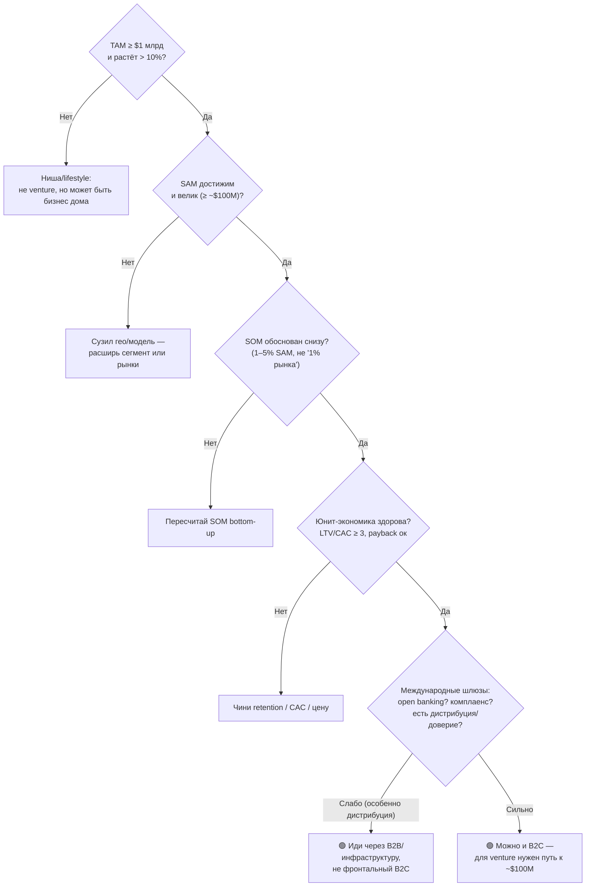

# Руководство: бенчмарки анализа международного рынка

> Как понять, «хорошие» ли у тебя TAM/SAM/SOM и метрики, стоит ли идея вложений — с конкретными порогами, и чем международная оценка отличается от российской.

---

## 0. Главное: цифры без порогов бессмысленны

«$5 млн SOM» — это много или мало? Зависит от **линзы**:

- **Венчурная** (привлекаешь инвестиции на быстрый рост): нужен путь к большому. Здесь пороги жёсткие.
- **Bootstrapped / lifestyle** (живёшь с прибыли): достаточно, чтобы бизнес был устойчиво прибыльным. Пороги мягче.

Один и тот же SOM может быть «отличным» для lifestyle и «неинтересным» для VC. Дальше — пороги для обеих.

---

## 1. TAM — бенчмарки

| Значение TAM | Оценка |
|---|---|
| **≥ $10 млрд** | 🟢 отлично для venture |
| **$1–10 млрд** | 🟢 минимально достаточно для venture-интереса |
| **$100M–1 млрд** | 🟡 ниша; редко venture, но может быть хороший бизнес |
| **< $100M** | 🔴 слишком мало для масштабной истории |

Правила: считай **bottom-up** (пользователи × конверсия × чек) — это защищаемо; top-down (из отчётов) — только для сверки. TAM должен **расти** (см. §4).

---

## 2. SAM — бенчмарки

SAM = реалистично обслуживаемая часть TAM (твоё гео + модель + сегмент).

- Для venture-кейса ориентир **SAM ≥ ~$100M** (чтобы твоя целевая доля давала настоящий бизнес).
- Если **SAM мал относительно TAM** — ты слишком сузил гео/модель; подумай о расширении рынков или сегментов.
- SAM должен быть **достижим твоими каналами** — иначе это фантазия.

---

## 3. SOM — бенчмарки (самое важное и самое привираемое)

SOM = что реально захватишь за 1–3 (до 5) лет.

| Доля SOM от SAM (ранние годы) | Оценка |
|---|---|
| **1–5%** | 🟢 реалистично при нормальном исполнении |
| **5–10%** | 🟡 только при сильном преимуществе/дистрибуции |
| **> 10%** | 🔴 обычно нереалистично для новичка |
| **внешний игрок на насыщенном рынке** | ближе к **0–1%** |

**Главная ошибка («1% огромного рынка»):** «рынок $50 млрд, возьмём всего 1% = $500M» — это не SOM, это самообман. **Считай снизу:** сколько клиентов реально привлечёшь × чек × удержание.

**SOM должен покрывать бизнес:**
- venture — путь к **~$100M выручки за ~7–10 лет** (иначе фонды не интересуются);
- lifestyle — устойчивая прибыль, которой хватает.

---

## 4. Рост рынка (CAGR) — бенчмарки

| CAGR | Оценка |
|---|---|
| **< 5%** | 🔴 зрелый/медленный — тяжело расти |
| **5–10%** | 🟡 умеренно |
| **10–20%** | 🟢 привлекательно |
| **> 20%** | 🟢 горячо (но больше конкуренции и хайпа) |

---

## 5. Юнит-экономика — бенчмарки

| Метрика | 🟢 Хорошо | 🔴 Плохо |
|---|---|---|
| **LTV / CAC** | ≥ 3 (3–5 — здорово) | ≤ 1 |
| **Payback CAC** | B2C < 12 мес · B2B < 18 мес | > 24 мес |
| **Gross margin** (SaaS) | 70–85%+ | < 50% |
| **Weekly retention** (B2C) | ≥ 25–30% | < 15% |
| **DAU/MAU** (липкость) | > 20% | < 10% |
| **Churn** | B2B годовой < 10% · B2C мес. 3–5% | B2C мес. > 7% |
| **NRR** (B2B, рост на текущих) | > 100% (топ > 120%) | < 90% |

---

## 6. Защищённость и тайминг

Большой рынок без рва — приманка для конкурентов. Спроси:
- **Ров:** сетевой эффект, switching costs, бренд, уникальная технология/ресурс, регуляторное преимущество? (Хотя бы один.)
- **Why now:** почему именно сейчас окно — новый тренд, регуляция, технология?

Нет рва и нет «почему сейчас» → даже хорошие цифры рискованны.

---

## 7. Скоринг: стоит ли это вложений

| Критерий | 🟢 Да | 🟡 Осторожно | 🔴 Нет |
|---|---|---|---|
| TAM | ≥ $1 млрд | $100M–1 млрд | < $100M |
| Рост рынка | > 15% | 5–15% | < 5% |
| SAM достижим | да, ≥ $100M | мал/узок | недостижим |
| SOM/SAM (обоснован снизу) | 1–5% | < 1% | «1% рынка» сверху |
| LTV/CAC | ≥ 3 | 2–3 | ≤ 1 |
| Payback | < 12–18 мес | до 24 | > 24 |
| Retention | weekly ≥ 25% | 15–25% | < 15% |
| Ров | явный | слабый | нет |
| Why now | сильный | средний | нет |

Правило чтения: **2–3 красных в верхних строках (TAM/SOM/экономика) — идея в текущем виде не для venture.** Это не «плохо вообще» — может быть отличный lifestyle-бизнес, но цель и ожидания другие.

---

## 8. Чем международная оценка отличается от российской

Это ядро документа. Те же метрики — **но пороги и реалии смещаются**.

| Фактор | Россия | Международно | Как меняет «хорошие» цифры |
|---|---|---|---|
| **TAM** | ограничен (ниша — десятки-сотни млн ₽) | миллиарды $ | TAM проще «набрать», но и **venture-планка выше** |
| **Конкуренция** | слабее | плотная, профинансированная (Intuit, Rocket, Monarch) | **SOM ниже, CAC выше** для новичка |
| **Готовность платить** | ниже (~250 ₽/мес) | выше (~$8–9/мес) | выручка/юзер выше — но CAC съедает |
| **Open banking** | нет (синк сложен) | норма (Plaid, PSD2) | **продуктовая планка выше** (ручной ввод неконкурентен) |
| **Регуляторика** | 152-ФЗ | GDPR, CCPA, PSD2 + лицензирование совета | выше стоимость комплаенса |
| **Локализация** | один рынок/язык | на каждый рынок (валюта, налоги, язык) | дополнительная стоимость входа |
| **Дистрибуция/доверие** | домашнее преимущество | внешний игрок без бренда | **B2B предпочтительнее B2C** |
| **Валюта/выплаты/сторы** | рубль, локальные рельсы | FX, разные платёжные/сторовые правила | операционная сложность |

**Ключевой сдвиг порогов:** «хороший» SOM в РФ ($-млн как lifestyle) — это **погрешность округления** на рынке PFM в США. При этом **фронтальный B2C-бар на Западе почти недостижим** для новичка без бренда → benchmark «хорошей» международной возможности смещается **к B2B/инфраструктуре или к недонасыщенным рынкам** (СНГ, MENA, LatAm, SEA), а не к подписке против инкумбентов.

---

## 9. Решение: входить ли на международный рынок

---

## 10. Применительно к FINPILOT

| Критерий | Статус |
|---|---|
| TAM глобально ($3–4 млрд ниша PFM-софт / $25 млрд+ широкий) | 🟢 достаточно |
| Рост рынка (~12% ниша / ~20% широкий) | 🟢 хороший |
| SOM через **фронтальный B2C** (США/ЕС) | 🔴 ≈ 0 (инкумбенты + CAC) |
| SOM через **B2B/инфраструктуру** | 🟢 реалистичнее, с upside по сделкам |
| Ров | 🟡 движок + прозрачность (узкий, но реальный) |
| Why now | 🟢 пост-Mint вакуум + тренд на AI-советы + open banking |

**Вердикт:** по TAM и росту идея проходит. Но «хорошесть» зависит от модели: **venture-смысл на международном рынке появляется только в B2B/инфраструктуре**, не в B2C-подписке. Конкретные цифры SOM по моделям — в сопроводительном разборе.

---

## Источники и оговорки

Пороги выше — отраслевые rules of thumb венчура и SaaS/консумер-метрик (TAM $1 млрд+ и путь к ~$100M выручки для venture; LTV/CAC ≥ 3; NRR > 100%; gross margin 70%+ для SaaS; консумер-retention бенчмарки). Это ориентиры, а не законы — конкретный фонд/рынок может отличаться. Размеры рынков PFM — из обзоров 2025–2026 (см. файл анализа международного рынка). Все оценки — порядок величины.
