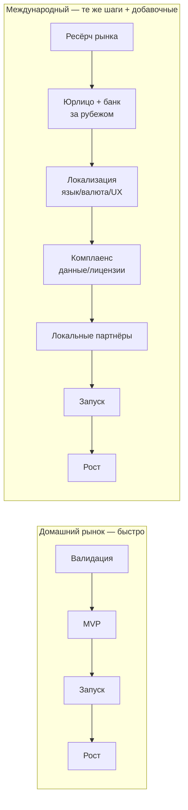
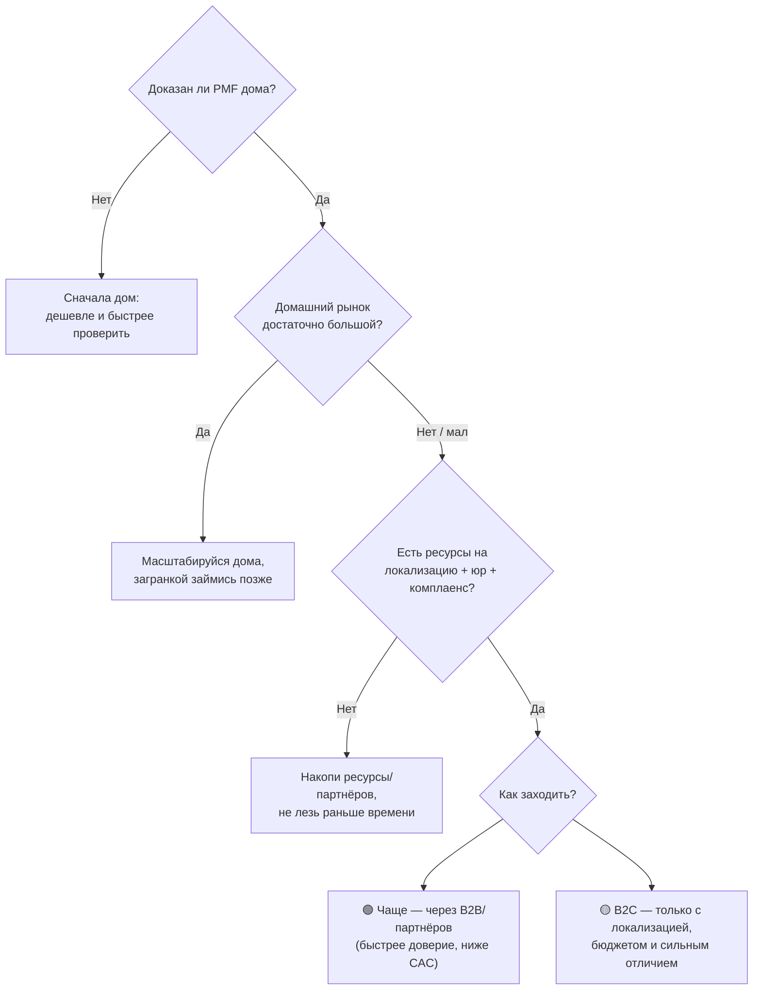
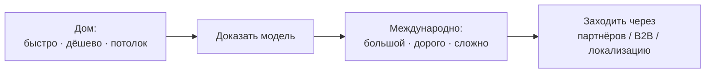

# Фундаментально: выход на международный рынок vs рынок РФ

> Не про конкретный продукт — про сами различия выхода на **домашний (РФ)** и **международный** рынок: скорость, возможности, проблемы, боли, трудности, юриспруденция и документы. Это карта факторов, которую можно приложить к любому продукту.

---

## 0. Снимок (dashboard)

| Аспект | Домашний рынок (РФ) | Международный рынок | Где тяжелее |
|---|---|---|---|
| Скорость входа | быстро | в 1.5–3× дольше | 🔴 межд. |
| Стоимость старта | низкая | высокая | 🔴 межд. |
| Размер возможности | ограничен | большой | 🟢 межд. |
| Знание контекста | есть | учишь с нуля | 🔴 межд. |
| Язык/культура | свой | барьер | 🔴 межд. |
| Доверие/бренд | домашнее | строишь с нуля | 🔴 межд. |
| Конкуренция | как повезёт | часто плотнее/богаче | 🔴 чаще межд. |
| Юриспруденция | один свод законов | по каждой стране | 🔴 межд. |
| Платежи/банкинг | локальные рельсы | FX, репатриация, KYC | 🔴 межд. |
| Доступ к капиталу | локальные фонды | глобальные фонды | 🟢 межд. |
| Готовность платить | ниже (часто) | выше (в развитых) | 🟢 межд. |
| Риски | концентрация на 1 рынке | + валютные/полит./санкц. | 🔴 межд. |

**Фундаментальная закономерность:** домашний рынок — **быстрее, дешевле, понятнее, но с потолком**; международный — **больше, но дороже, медленнее и тяжелее** почти по всем входным факторам.

---

## 1. Скорость и time-to-market

Дома ты проходишь стандартный путь. За рубежом к нему **добавляются целые этапы**, и каждый замедляет старт.

| Этап | Дома | Международно |
|---|---|---|
| Понять рынок | уже знаешь | недели–месяцы ресёрча |
| Юрлицо/банк | есть | месяцы (особенно счёт за рубежом) |
| Локализация | не нужна | недели–месяцы на рынок |
| Комплаенс | знаком | месяцы (данные, лицензии) |
| Итого до запуска | быстро | **в 1.5–3 раза дольше** |

---

## 2. Возможности (что даёт каждый)

**Домашний рынок:**
- быстрый и дешёвый старт; знание контекста, языка, привычек;
- готовая сеть контактов и дистрибуция;
- доверие «свой» по умолчанию;
- быстрые циклы обратной связи.

**Международный рынок:**
- кратно больший рынок и потолок выручки;
- выше готовность платить (в развитых странах);
- диверсификация (не зависишь от одной экономики/регуляции);
- доступ к глобальному капиталу и более высоким оценкам;
- престиж и валютная выручка.

---

## 3. Проблемы, боли, трудности

**Домашний рынок:**
- ограниченный размер → потолок роста;
- концентрация риска на одной экономике/регуляции;
- возможные валютные ограничения и узкий доступ к глобальному капиталу.

**Международный рынок (главные боли):**
- **Конкуренция плотнее** и лучше профинансирована (особенно в развитых рынках).
- **«Скидка на иностранца»** — к внешнему игроку меньше доверия; бренд строишь с нуля.
- **Локализация** — это не перевод: язык, культура, UX, цена, продуктовый фит под рынок.
- **Часовые пояса и поддержка** на разных языках.
- **Дороже всё** — юр, маркетинг, команда, поездки.
- **Платёжные рельсы и репатриация** денег; FX-риск.
- **Санкционный/комплаенс-фактор** (особенно для основателя из РФ): доступ к Stripe/Visa/Mastercard, выплаты из App Store/Google Play, открытие счетов — банки могут отказывать, повышенный KYC. Это реальный, а не теоретический барьер.

---

## 4. Юриспруденция и документы (детально)

Здесь главная разница: дома — **один знакомый свод**; за рубежом — **по каждой стране свой**, и это самостоятельный проект.

| Область | Домашний рынок | Международный рынок |
|---|---|---|
| **Юрлицо / регистрация** | одно, знакомая процедура | выбор юрисдикции инкорпорации (US/Delaware, UK Ltd, Эстония e-Residency, ОАЭ, Кипр…), нерезидентность, **банковский счёт за рубежом** (сложно для резидентов РФ) |
| **Налоги** | один режим | налоговое резидентство, соглашения об избежании двойного налогообложения (DTT), **VAT/GST по странам**, трансфертное ценообразование |
| **Защита данных** | 152-ФЗ | **GDPR** (ЕС), **CCPA** и штатные (США), локализация данных (где хранить) |
| **Отраслевые лицензии** | по сектору РФ | финтех: платёжные/советные лицензии (RIA/фидуциар США, FCA UK, EMI/PI в ЕС), **AML/KYC**; медицина и др. — свои |
| **Интеллектуальная собственность** | регистрация в РФ | товарные знаки/патенты **по странам** (или Madrid/PCT), защита кода/коммерческой тайны |
| **Контракты** | на русском, право РФ | язык, **применимое право и юрисдикция споров**, арбитраж (LCIA/ICC), исполнимость решения за рубежом |
| **Трудовое право** | локальный найм | найм за рубежом через **EOR/PEO**, классификация подрядчиков, локальные нормы |
| **Санкции / экспортный контроль** | — | критично для основателя из РФ: доступ к платёжным системам, сторам, банкам; санкционные/KYC-флаги |
| **Потребзащита** | нормы РФ | строгие правила рекламы, возвратов, **авто-продления подписок** (US/EU) |

**Мини-чеклист «что оформить» при международном входе:** юрисдикция и юрлицо → банковский счёт → налоговая постановка (+ DTT, VAT) → политика данных под GDPR/CCPA → отраслевые лицензии/AML-KYC (если регулируемый сектор) → регистрация товарного знака → шаблоны контрактов под местное право → модель найма (EOR) → проверка санкций/платёжных рельсов.

---

## 5. Капитал и стоимость

| Статья | Дома | Международно |
|---|---|---|
| Юр/регистрация/комплаенс | низкая | высокая (на каждую юрисдикцию) |
| Локализация | — | существенная |
| Маркетинг/CAC | умеренный | выше (дорогой трафик) |
| Команда/поддержка | локальная | распределённая, дороже |
| Поездки/представительство | — | заметная |
| **Итого** | **дешевле** | **кратно дороже** |

---

## 6. Дистрибуция, партнёры, доверие

- **Дома:** свои каналы, сарафан, знакомая экосистема; доверие быстрее.
- **Международно:** часто нужны **локальные партнёры/реселлеры**, дольше строить доверие, выше роль репутации и кейсов. Поэтому **B2B/партнёрский вход за рубежом обычно реалистичнее фронтального B2C**.

---

## 7. Талант и операции

| | Дома | Международно |
|---|---|---|
| Команда | локальная, один язык/культура | распределённая, кросс-культурный менеджмент |
| Поддержка | один язык/часовой пояс | мультиязычная, 24/7 по поясам |
| Инфраструктура | локальные провайдеры | глобальные облака, требования к данным |

---

## 8. Риски

| Тип риска | Дома | Международно |
|---|---|---|
| Рыночный | концентрация на 1 рынке | распределён, но новый/незнакомый |
| Валютный (FX) | низкий | значимый |
| Политический/регуляторный | локальный | по каждой стране |
| Санкционный | — | существенный для РФ-основателя |
| Исполнительский | ниже (знаешь среду) | выше (учишься на ходу) |

---

## 9. Когда что выбирать (фреймворк)

**Правило по умолчанию:** **сначала докажи дома, потом выходи международно осознанно.** Исключения — когда домашний рынок изначально слишком мал, или продукт по природе глобальный/англоязычный с первого дня.

---

## 10. Итог

Фундаментально: **домашний рынок выигрывает по скорости, цене и понятности, но упирается в потолок; международный выигрывает по размеру, но проигрывает по скорости, стоимости, юридической и операционной тяжести и трению «иностранца».**

Для большинства правильная траектория одна: **доказать модель дома → выходить за рубеж осознанно, чаще через партнёров/B2B, чем фронтально.** Международный рынок — это не «следующая кнопка», а отдельный проект со своей юриспруденцией, экономикой и рисками.

