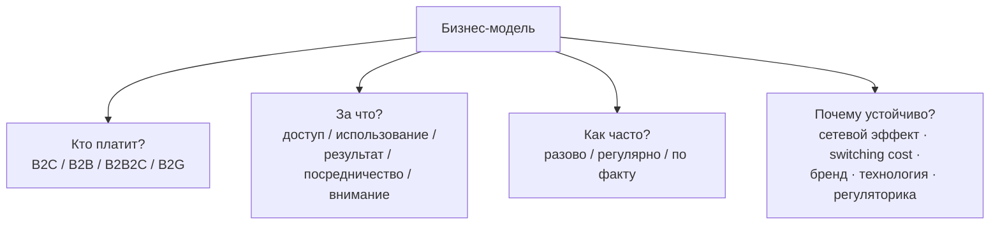
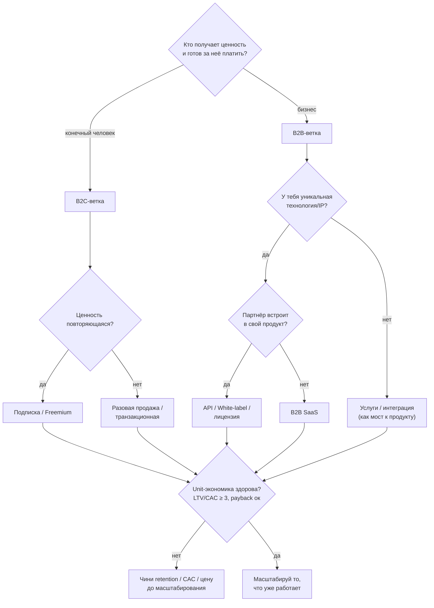

# Руководство по бизнес-моделям: типы, экономика, риски, выбор

> Справочник. Что такое бизнес-модель, какие бывают типы монетизации, в чём сила и слабость каждого, какие риски, когда брать и когда нет. Без привязки к конкретному проекту — чистая база для принятия решений. Цифры-ориентиры (конверсии, маржа) — отраслевые rules of thumb, а не законы.

---

## 0. Как читать это руководство

Бизнес-модель — это **не «как мы берём деньги»**, а ответ на четыре вопроса сразу:

1. **Кто платит?** (конечный пользователь / бизнес / государство / рекламодатель)
2. **За что платит?** (за доступ / за использование / за результат / за посредничество / за внимание)
3. **Как часто?** (разово / регулярно / по факту)
4. **Почему это устойчиво?** (что мешает клиенту перестать платить или уйти к конкуренту)

Четвёртый вопрос — про **ров (moat)**. Модель без рва даёт выручку, но не даёт защиты: как только ты докажешь, что ниша денежная, придут те, у кого больше денег и дистрибуции.

**Линза оценки.** Одна и та же модель «хороша» или «плоха» в зависимости от цели:

- **Венчурная линза** (привлекаешь инвестиции на быстрый рост) — нужна модель с путём к большой выручке и сильным рвом. Пороги жёсткие.
- **Bootstrapped / lifestyle линза** (живёшь с прибыли) — достаточно, чтобы бизнес был устойчиво прибыльным. Пороги мягче.

Дальше каждая модель оценивается по обеим линзам.

---

## 1. Базовые оси классификации

Любую модель можно разложить по трём осям. Это полезнее, чем заучивать «12 типов», потому что реальные модели — комбинации.

### 1.1. Кто платит (тип клиента)

| Тип | Кто платит | Особенность |
|---|---|---|
| **B2C** | конечный потребитель | много мелких чеков, высокий CAC относительно чека, эмоциональные решения, высокий churn |
| **B2B** | другой бизнес | мало крупных чеков, длинный цикл продаж, рациональные решения, низкий churn, выше LTV |
| **B2B2C** | бизнес платит, но ради своих конечников | ты продаёшь компании, а ценность получает её клиент (white-label, инфраструктура) |
| **B2G** | государство / госструктуры | очень длинный цикл, бюрократия, крупные стабильные контракты, легитимность |

### 1.2. За что платят (природа ценности)

- **За доступ** — подписка, лицензия (платишь за право пользоваться).
- **За использование** — usage-based (платишь за объём).
- **За результат / транзакцию** — комиссия, take rate (платишь за совершённое действие).
- **За посредничество** — маркетплейс сводит стороны.
- **За внимание / данные** — реклама, монетизация данных (платит не тот, кто пользуется).

### 1.3. Как часто (ритм выручки)

- **Разовая** — заплатил один раз. Просто, но каждый месяц начинаешь с нуля.
- **Рекуррентная** — платит регулярно. Предсказуемо, compounding, но нужен постоянный повод платить.
- **По факту** — платит при использовании. Масштабируется с ценностью, но волатильно.

---

## 2. Сквозная экономика: метрики, без которых модель не оценить

Эти показатели применимы почти к любой модели. Без них «хорошая идея» — это просто идея.

| Метрика | Что значит | Здоровый ориентир |
|---|---|---|
| **CAC** (Customer Acquisition Cost) | стоимость привлечения одного платящего клиента | чем ниже, тем лучше; органический CAC ≪ платного |
| **LTV** (Lifetime Value) | сколько денег приносит клиент за всё время | — |
| **LTV / CAC** | окупаемость привлечения | **≥ 3** здорово; ≤ 1 — убыточно |
| **Payback period** | за сколько окупается CAC | B2C < 12 мес · B2B < 18 мес |
| **Gross margin** | валовая маржа (выручка − прямые издержки) | SaaS 70–85%+; услуги/железо ниже |
| **Churn** | отток клиентов за период | B2C мес. 3–5%; B2B годовой < 10% |
| **NRR** (Net Revenue Retention) | рост выручки на текущей базе (с учётом апсейла) | **> 100%** хорошо, > 120% топ |
| **ARPU** | средняя выручка на пользователя | контекстно |
| **Take rate** | % комиссии от оборота (маркетплейс) | обычно 5–30% |
| **DAU/MAU** | липкость (доля дневной аудитории в месячной) | > 20% хорошо |

**Главный принцип unit-экономики:** если **LTV/CAC < 1**, ты теряешь деньги на каждом клиенте — масштабирование только ускоряет банкротство. Сначала чинишь экономику, потом льёшь трафик.

---

## 3. Каталог бизнес-моделей

Для каждой модели — единый формат: суть, механика, плюсы, проигрыш, риски, когда брать, метрики, примеры.

---

### 3.1. Подписка (Subscription / SaaS)

- **Суть:** платишь регулярно за продолжающийся доступ к продукту или сервису.
- **Механика выручки:** MRR/ARR — рекуррентный платёж (месяц/год), выручка накапливается с ростом базы.
- **Плюсы:** предсказуемая выручка; высокий LTV; инвесторы любят (оценка по мультипликаторам ARR); compounding-рост (новые клиенты добавляются к удержанным).
- **Где проигрывает:** нужен **постоянный** повод платить — если ценность разовая, клиент отпишется; churn съедает прирост («дырявое ведро»); долгая окупаемость CAC; в B2C — высокая ценовая чувствительность и «подписочная усталость».
- **Риски:** churn > прироста → стагнация при растущих затратах; зависимость от непрерывного удержания.
- **Когда брать:** продукт даёт **повторяющуюся** ценность и есть retention. B2B SaaS особенно силён (низкий churn, NRR>100%, рациональный покупатель).
- **Когда нет:** разовая/эпизодическая ценность; нет удержания.
- **Метрики:** MRR/ARR, churn, NRR, LTV/CAC, payback, ARPU.
- **Примеры:** Netflix, Notion, Salesforce, YNAB.

---

### 3.2. Freemium

- **Суть:** базовый продукт бесплатно, деньги — за премиум-уровень.
- **Механика выручки:** бесплатный tier работает как воронка → конверсия части пользователей в платный.
- **Плюсы:** дешёвая дистрибуция и виральность; низкий барьер входа (попробовать ничего не стоит); сбор данных и обратной связи на масштабе.
- **Где проигрывает:** конверсия free→paid обычно **2–5%** (часто ниже); бесплатные пользователи — чистые издержки (хостинг, поддержка); чтобы получить заметную выручку, нужен **огромный** верх воронки.
- **Риски:** «вечно бесплатные», которые не конвертятся; каннибализация (если бесплатного слишком много — некому платить); издержки на не-платящих в кризис.
- **Когда брать:** низкая предельная стоимость обслуживания пользователя; есть виральность/сетевой эффект; чёткая, ощутимая граница между free и paid.
- **Когда нет:** дорого обслуживать каждого; нет виральности; размытая граница ценности.
- **Метрики:** free→paid конверсия, activation, виральный коэффициент, органический CAC.
- **Примеры:** Spotify, Dropbox, Canva, Cleo.

---

### 3.3. Транзакционная / Usage-based (pay-per-use)

- **Суть:** платишь за объём фактического использования.
- **Механика выручки:** цена × объём (запросы, гигабайты, транзакции, минуты).
- **Плюсы:** выручка **масштабируется вместе с ценностью** клиента (NRR естественно > 100%); низкий барьер старта («плати сколько используешь»); честно — клиент платит ровно за пользу.
- **Где проигрывает:** непредсказуемость выручки; сложный биллинг и учёт потребления; в кризис клиент сокращает использование → твоя выручка падает синхронно.
- **Риски:** волатильность дохода; клиент оптимизирует расход → платит меньше; требуется точная метрия.
- **Когда брать:** ценность напрямую коррелирует с объёмом (API, инфраструктура, платежи, облако).
- **Когда нет:** ценность не привязана к объёму; клиент хочет предсказуемый бюджет.
- **Метрики:** usage, NRR, gross margin на единицу, revenue per account.
- **Примеры:** AWS, Stripe, Twilio, OpenAI API.

---

### 3.4. Маркетплейс / Платформа (take rate)

- **Суть:** сводишь две стороны (спрос и предложение) и берёшь комиссию с транзакций между ними.
- **Механика выручки:** take rate — процент от GMV (оборота на платформе).
- **Плюсы:** сильный **сетевой эффект** = естественный ров (чем больше сторон, тем ценнее платформа); не держишь инвентарь; хорошо масштабируется.
- **Где проигрывает:** «проблема курицы и яйца» — нужно одновременно набрать обе стороны; **дизинтермедиация** (стороны договариваются мимо платформы); долгий и дорогой разгон до ликвидности.
- **Риски:** одна сторона доминирует и диктует условия; уход сторон; регуляторика; слишком тонкий take rate не покрывает издержки.
- **Когда брать:** фрагментированные стороны (много мелких продавцов/покупателей), повторяющиеся транзакции, доверие/удобство оправдывают комиссию.
- **Когда нет:** стороны легко находят друг друга сами; разовые сделки; узкий рынок.
- **Метрики:** GMV, take rate, liquidity (match rate), плотность сети.
- **Примеры:** Airbnb, Uber, Etsy, маркетплейсы.

---

### 3.5. Реклама

- **Суть:** продукт бесплатен для пользователя; платят рекламодатели за его внимание и данные.
- **Механика выручки:** CPM/CPC — монетизация внимания и показов.
- **Плюсы:** ноль барьера для пользователя (бесплатно = максимальный охват); на большой аудитории даёт большие деньги.
- **Где проигрывает:** нужен **огромный** трафик и вовлечённость, иначе ARPU копеечный; встроенный **конфликт интересов** (интерес пользователя vs рекламодателя); деградация UX; зависимость от рекламных платформ.
- **Риски:** приватность и регуляторика (GDPR, CCPA); подрыв доверия; обвал при изменении правил платформ.
- **Когда брать:** массовый продукт с высокой вовлечённостью и ценными данными/вниманием.
- **Когда нет:** нишевый продукт; продукт, построенный на доверии; малая аудитория.
- **Метрики:** DAU/MAU, ARPU, eCPM, время в продукте.
- **Примеры:** Google, Meta, медиа, бесплатные мобильные приложения.

---

### 3.6. Лицензирование / White-label

- **Суть:** продаёшь право использовать твою технологию/продукт другим компаниям, часто под их брендом.
- **Механика выручки:** лицензионный платёж (фиксированный / годовой / per-seat) или white-label контракт.
- **Плюсы:** **чужая дистрибуция и бренд** работают на тебя; высокая маржа; B2B-контракты крупные и стабильные; не воюешь за конечного пользователя.
- **Где проигрывает:** длинный цикл продаж; зависимость от немногих крупных клиентов (**concentration risk**); кастомизация под каждого; ты «невидим» — бренд строит партнёр, не ты.
- **Риски:** клиент уходит или строит своё in-house; переговорная сила у крупного партнёра; интеграционная нагрузка.
- **Когда брать:** у тебя есть технология/IP, которой нет у тех, у кого уже есть дистрибуция и клиенты.
- **Когда нет:** нет уникальной технологии; рынок легко повторяет твоё решение.
- **Метрики:** число контрактов, ACV (средний чек контракта), renewal rate, concentration.
- **Примеры:** лицензии игровых движков (Unreal), Banking-as-a-Service, white-label финтех.

---

### 3.7. API-as-a-product (инфраструктура)

- **Суть:** твой продукт — это API/инфраструктура, которую разработчики и компании встраивают в свои продукты.
- **Механика выручки:** обычно usage-based + тарифные тиры; иногда подписка на доступ.
- **Плюсы:** глубокий **switching cost** (встроились в код — не уйдут просто так); хорошо масштабируется; NRR>100% (растут вместе с клиентом); developer-led рост (документация и DX приводят клиентов).
- **Где проигрывает:** нужен сильный **DX** (документация, SDK, надёжность); долгий выход на объём; высокая планка uptime/SLA — падение бьёт по чужим продуктам.
- **Риски:** зависимость от роста клиентов; конкуренция инфраструктурных игроков; репутация при сбоях.
- **Когда брать:** ты решаешь узкую техническую задачу лучше/проще, чем строить её внутри.
- **Когда нет:** задача легко решается своими силами; нет ресурсов на надёжность и DX.
- **Метрики:** usage, NRR, число интеграций, retention, gross margin.
- **Примеры:** Stripe, Plaid, Twilio, Algolia.

---

### 3.8. Партнёрская / Affiliate / Lead-generation (комиссия)

- **Суть:** рекомендуешь сторонние продукты, получаешь комиссию за переход / покупку / переданный лид.
- **Механика выручки:** CPA / CPL / revenue share с партнёром.
- **Плюсы:** монетизация **без собственной платной фичи**; естественно для контентных и сравнивающих продуктов; высокая маржа на лид.
- **Где проигрывает:** встроенный **конфликт интересов** — выгоднее рекомендовать то, что платит, а не то, что лучше пользователю → подрыв доверия; зависимость от партнёрских программ; качество и конверсия лида не в твоих руках.
- **Риски:** репутационный (особенно в финансах и здоровье); регуляторный (раскрытие связей, мисселинг); волатильность партнёрских ставок.
- **Когда брать:** продукт помогает **выбирать** продукты (сравнения, маркетплейсы) И ты можешь сохранить доверие через прозрачность раскрытия.
- **Когда нет:** продукт построен на доверии/нейтральности, которое affiliate разрушит.
- **Метрики:** лиды, конверсия лида, revenue per lead, EPC (earnings per click).
- **Примеры:** Credit Karma, NerdWallet, banki.ru/Сравни.

---

### 3.9. Монетизация данных

- **Суть:** продаёшь агрегированные/обезличенные данные или инсайты третьим сторонам.
- **Механика выручки:** продажа датасетов, доступа к данным или аналитики.
- **Плюсы:** дополнительный поток с уже собираемых данных; высокая маржа.
- **Где проигрывает:** жёсткая регуляторика (GDPR, 152-ФЗ); риск доверия (особенно финансовые и медицинские данные); этические вопросы; нужен масштаб данных, чтобы они стоили денег.
- **Риски:** репутационная катастрофа при утечке или недовольстве; регуляторные штрафы; необходимость явных согласий.
- **Когда брать:** данные действительно уникальны и ценны И есть законный, прозрачный путь монетизации.
- **Когда нет:** продукт строится на доверии; данные чувствительные; нет масштаба.
- **Метрики:** объём и уникальность данных, спрос покупателей.
- **Примеры:** кредитные бюро, рыночная аналитика (везде — с высокой осторожностью).

---

### 3.10. Разовая продажа / Вечная лицензия

- **Суть:** платишь один раз — владеешь продуктом навсегда.
- **Механика выручки:** единоразовый платёж за продукт или бессрочную лицензию.
- **Плюсы:** просто; нет «подписочной усталости»; деньги сразу.
- **Где проигрывает:** **нет рекуррентной выручки** — каждый период начинаешь с нуля; нужно постоянно привлекать новых покупателей; давление на платные апгрейды/новые версии.
- **Риски:** плато выручки; полная зависимость от потока новых покупателей.
- **Когда брать:** продукт даёт разовую/инструментальную ценность и дёшево обслуживается.
- **Когда нет:** продукт требует постоянного сервиса/обновлений (тогда подписка честнее).
- **Метрики:** продажи за период, ARPU, upgrade rate.
- **Примеры:** классический коробочный софт, игры без сервиса, плагины.

---

### 3.11. Open-core (open source + commercial)

- **Суть:** ядро открыто и бесплатно, деньги — за enterprise-фичи, managed-хостинг или поддержку.
- **Механика выручки:** бесплатный OSS как воронка → платный enterprise/cloud-уровень.
- **Плюсы:** огромная **органическая дистрибуция** через сообщество разработчиков; доверие (код открыт); низкий CAC.
- **Где проигрывает:** тонкая грань — что открыть, что закрыть; конкуренты (включая облачных гигантов) могут форкнуть или хостить твой OSS и забрать выручку; монетизация запаздывает за ростом популярности.
- **Риски:** hyperscaler хостит твой проект как сервис; сложная монетизация комьюнити; лицензионные войны.
- **Когда брать:** инфраструктура/dev-tools с сильным потенциалом сообщества.
- **Когда нет:** продукт не для разработчиков; нет ресурсов вести комьюнити.
- **Метрики:** звёзды/контрибьюторы, конверсия в enterprise, доля self-host vs cloud.
- **Примеры:** GitLab, HashiCorp, Elastic, MongoDB.

---

### 3.12. Услуги / Консалтинг (services-led)

- **Суть:** продаёшь экспертизу и работу людьми — внедрение, кастомная разработка, консалтинг.
- **Механика выручки:** почасовая / проектная / ретейнер.
- **Плюсы:** деньги сразу; низкий стартовый риск; глубокое понимание клиента (можно потом продуктизировать наработки).
- **Где проигрывает:** **не масштабируется** (выручка = люди × часы); низкая маржа против софта; не венчурная история; отвлекает от продукта.
- **Риски:** зависимость от ключевых людей; плато по марже; «застреваешь» в услугах вместо продукта.
- **Когда брать:** ранняя стадия (финансировать продукт услугами); сложные внедрения; как мост к продукту.
- **Когда нет:** цель — масштабируемый продукт и быстрый рост.
- **Метрики:** utilization, billable rate, маржа проекта.
- **Примеры:** агентства, системные интеграторы, консалтинговые бутики.

---

## 4. Гибриды и продуктовые стратегии

Реальные компании редко используют одну чистую модель. Самые частые комбинации:

| Стратегия | Суть | Зачем |
|---|---|---|
| **Product-Led Growth (PLG)** | продукт сам себя продаёт через free/freemium и виральность; продажи подключаются позже | низкий CAC, быстрый верх воронки |
| **Land-and-expand** (B2B) | заходишь маленьким контрактом, потом расширяешь внутри клиента | двигатель NRR > 100% |
| **Loss-leader** | одна часть продукта убыточна/бесплатна, чтобы продать прибыльную | захват аудитории под монетизацию в другом месте |
| **Гибрид C→B** | потребительский продукт как воронка/витрина/доказательство для B2B-выручки | B2C даёт данные и кейсы, B2B даёт деньги и ров |
| **Bundling** | несколько продуктов в одном пакете | рост ARPU, снижение churn |

**Про гибрид C→B отдельно:** частый и сильный паттерн для технологичных продуктов. Потребительская витрина доказывает ценность и собирает данные/кейсы, но **деньги и защита** приходят из B2B (лицензия, инфраструктура). Опасность — спутать витрину с источником выручки и пытаться выжить с B2C, у которого нет ни рва, ни экономики.

---

## 5. Матрица сравнения моделей

Грубая, но рабочая карта. «Сила рва по умолчанию» — насколько модель сама по себе создаёт защиту (без учёта конкретного продукта).

| Модель | Маржа | Масштабируемость | Предсказуемость выручки | Сила рва по умолчанию | Время до денег | Кто обычно платит |
|---|---|---|---|---|---|---|
| Подписка SaaS | высокая | высокая | высокая | средняя | среднее | B2C/B2B |
| Freemium | средняя | высокая | средняя | низкая | долгое | B2C |
| Usage-based | высокая | высокая | низкая | средняя | среднее | B2B |
| Маркетплейс | средняя | высокая | средняя | **высокая** (сеть) | долгое | обе стороны |
| Реклама | высокая | высокая | средняя | низкая | долгое | рекламодатель |
| Лицензия/White-label | **высокая** | средняя | высокая | средняя | долгое | B2B |
| API/инфраструктура | высокая | высокая | средняя | **высокая** (switching cost) | долгое | B2B |
| Affiliate/lead-gen | высокая | средняя | низкая | низкая | быстрое | партнёр |
| Монетизация данных | высокая | средняя | средняя | низкая | среднее | третья сторона |
| Разовая продажа | средняя | средняя | низкая | низкая | быстрое | обе |
| Open-core | высокая | высокая | средняя | средняя | долгое | B2B |
| Услуги/консалтинг | низкая | **низкая** | средняя | низкая | **быстрое** | B2B |

Читается так: **быстрые деньги** (услуги, разовая продажа, affiliate) обычно идут в обмен на **слабый ров или плохую масштабируемость**. **Сильный ров** (маркетплейс, инфраструктура) обычно требует **долгого и дорогого разгона**. Это фундаментальный размен, который нужно осознанно выбирать.

---

## 6. Как выбрать модель

Не «какая модель самая прибыльная вообще» (такой нет), а «какая подходит твоему продукту, рынку и цели».

**Порядок вопросов при выборе:**

1. **Кто платит** и совпадает ли это с тем, кто получает ценность? (Если нет — это рекламная/посредническая модель со своими рисками.)
2. **Повторяется ли ценность?** Да → рекуррентная модель. Нет → разовая/транзакционная.
3. **Есть ли уникальная технология?** Да → её можно лицензировать/продавать как инфраструктуру (выше маржа, чужая дистрибуция).
4. **Где ров?** Если модель не создаёт защиты — продумай её отдельно (бренд, сеть, switching cost, данные).
5. **Какая линза** — венчур или lifestyle? От этого зависят пороги «достаточно ли это».

---

## 7. Типичные ловушки

| Ловушка | В чём она | Как не попасть |
|---|---|---|
| **«1% огромного рынка»** | «рынок $50 млрд, возьмём 1% = $500M» — это фантазия, а не план | считай выручку **снизу**: клиенты × чек × удержание |
| **Преждевременная монетизация** | включаешь платёж до того, как удержал пользователя | сначала retention, потом paywall |
| **Дырявое ведро (leaky bucket)** | льёшь трафик в продукт с высоким churn | сначала чини удержание, потом привлечение |
| **Неправильный плательщик** | тот, кто получает ценность ≠ тот, кто платит, и связь не выстроена | проверь, что монетизация совпадает с источником ценности |
| **Масштаб без рва** | растёшь, доказывая нишу денежной — приходят сильные конкуренты | строй защиту до масштабирования |
| **Спираль скидок** | скидки ради роста убивают unit-экономику | защищай маржу; рост не любой ценой |
| **Concentration risk** | весь B2B-доход на одном-двух клиентах | диверсифицируй клиентскую базу |
| **Вечно бесплатные** | freemium-база не конвертится в платных | чёткая граница ценности free/paid |

---

## 8. Чек-лист: здорова ли модель

Прогоняй идею по этим вопросам. Каждый «нет» — повод доработать модель, а не продукт.

1. Понятно, **кто** платит и **за что** конкретно?
2. Плательщик = получатель ценности (или связь явно выстроена)?
3. **LTV/CAC ≥ 3** (хотя бы на органике)?
4. **Payback** укладывается в норму (B2C < 12 мес, B2B < 18 мес)?
5. Выручка **рекуррентная** или есть надёжный поток новых сделок?
6. Есть **ров** — что мешает скопировать тебя, когда докажешь, что ниша денежная?
7. Модель **масштабируется** без линейного роста издержек/людей?
8. Маржа достаточна для выбранной линзы (венчур требует SaaS-маржи 70%+)?
9. Нет встроенного **конфликта интересов**, разрушающего доверие?
10. Регуляторика и данные учтены (особенно в финансах/здоровье)?

---

## 9. Глоссарий

| Термин | Расшифровка |
|---|---|
| **ARR / MRR** | Annual / Monthly Recurring Revenue — годовая/месячная рекуррентная выручка |
| **CAC** | Customer Acquisition Cost — стоимость привлечения клиента |
| **LTV** | Lifetime Value — пожизненная ценность клиента |
| **Payback** | срок окупаемости CAC |
| **Churn** | отток клиентов за период |
| **NRR** | Net Revenue Retention — удержание выручки с учётом апсейла на текущей базе |
| **ARPU** | Average Revenue Per User — средняя выручка на пользователя |
| **GMV** | Gross Merchandise Value — оборот на платформе |
| **Take rate** | доля комиссии платформы от оборота |
| **ACV** | Annual Contract Value — годовая стоимость контракта (B2B) |
| **Gross margin** | валовая маржа |
| **DAU/MAU** | Daily/Monthly Active Users — мера липкости |
| **CPA / CPL** | Cost Per Action / Lead — оплата за действие/лид (affiliate) |
| **EPC** | Earnings Per Click — заработок на клик |
| **PLG** | Product-Led Growth — рост за счёт самого продукта |
| **DX** | Developer Experience — опыт разработчика (для API-продуктов) |
| **Switching cost** | издержки перехода клиента к конкуренту |

---

> **Одной строкой:** бизнес-модель — это не «как берём деньги», а связка «кто платит, за что, как часто и почему это устойчиво»; быстрые деньги обычно платят слабым рвом, сильный ров — долгим разгоном, и единственный универсальный закон здесь — unit-экономика: при LTV/CAC < 1 масштаб только ускоряет провал.
