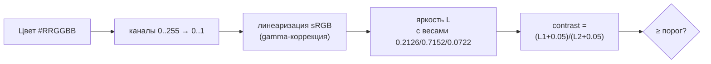

# Цвет, контраст и доступность интерфейса: руководство

> **Что это и для кого.** Руководство для разработчика, который сам делает или правит UI, но не специалист по дизайну/доступности. Цель — понять область достаточно, чтобы принимать верные решения: какой цвет «проходит», какой порог целить, как чинить контраст и как не дать ему уехать обратно. Жанр — руководство (понять + решать), с объяснением «почему» и операционным чек-листом. Примеры — из FINPILOT, но принципы общие. Версия 1.0 · 2026-06-24.

---

## 0. Навигация

- §1. Главный принцип (зачем это вообще)
- §2. Карта темы: свет, яркость, контраст-коэффициент
- §3. WCAG: уровни A / AA / AAA и пороги
- §4. Какой уровень целить (AA vs AAA) — решение
- §5. Цвет в продукте: токены, иерархия текста, темы
- §6. Главная ловушка: общий токен и две темы
- §7. Прозрачность и композитинг (worst-case фон)
- §8. Как считать и чинить контраст на практике
- §9. Регрессионный гард: чтобы контраст не уехал
- §10. За пределами контраста: что ещё входит в доступность
- §11. Рабочий чек-лист правки палитры
- §12. Типичные ошибки и ловушки
- §13. Инструменты
- §14. Глоссарий
- Резюме одной строкой
- Приложение A. Готовый код (контраст + минимальный фикс + гард)

---

## 1. Главный принцип

> **Ты не видишь проблему контраста на своём интерфейсе — нужен объективный измеритель.**

Глаз привыкает к собственному дизайну за минуты. Светло-серый текст на тёмном фоне кажется автору «стильным и читаемым», потому что автор знает, что там написано, смотрит на хорошем мониторе при хорошем свете и видит молодыми глазами. Реальный пользователь может быть на телефоне под солнцем, с дешёвой матрицей, в 55 лет, или с пониженным зрением. Контраст — это не «нравится / не нравится», это измеримое физическое отношение яркостей. Поэтому правильный рабочий цикл — не «подвигать ползунки на глаз», а **посчитать число и сравнить с порогом**.

Зачем вообще держать порог:

1. **Реальные пользователи.** Низкий контраст отсекает часть аудитории — пожилых, слабовидящих, всех при плохих условиях. Для FINPILOT с персоной «56 лет» это прямой удар по конверсии.
2. **Закон и площадки.** Доступность по стандарту WCAG уровня AA — это требование законов (США — ADA и Section 508, ЕС — EN 301 549) и условие прохождения ревью в App Store / Google Play и корпоративных закупках.
3. **Качество как у больших.** Т-Банк/Сбер/Альфа держат AA. Если цель — продукт их уровня, это базовая гигиена, а не опция.

---

## 2. Карта темы: свет, яркость, контраст-коэффициент

Три понятия, на которых держится всё остальное. Идём от аналогии к формуле.

### 2.1. Яркость — это не «насколько светлый цвет»

**Аналогия.** Представь, что каждый цвет светит как лампочка. Вопрос контраста — не «какого цвета лампочка», а «насколько сильно она светит по сравнению с фоном». Жёлтая лампочка светит ярко, синяя той же «насыщенности» — тускло, хотя обе «яркие на вид».

**Концепция.** Глаз по-разному чувствителен к разным каналам: сильнее всего к зелёному, слабее к красному, совсем слабо к синему. Поэтому «воспринимаемая яркость» (в стандарте — *relative luminance*, относительная светимость) считается с весами:

```
L = 0.2126·R + 0.7152·G + 0.0722·B
```

где R, G, B — линеаризованные значения каналов (см. §8). Зелёный весит в ~3 раза больше красного и в ~10 раз больше синего. Практическое следствие: насыщенный синий текст почти всегда «темнее», чем кажется, и проваливает контраст; жёлтый — наоборот.

### 2.2. Контраст-коэффициент

**Концепция.** Контраст двух цветов — это отношение их яркостей, с маленькой добавкой, чтобы не делить на ноль:

```
contrast = (L_светлый + 0.05) / (L_тёмный + 0.05)
```

Значения лежат в диапазоне:

| Контраст | Что это |
|---|---|
| 1:1 | два одинаковых цвета (текст не виден) |
| 4.5:1 | граница AA для обычного текста |
| 7:1 | граница AAA для обычного текста |
| 21:1 | чёрный на белом (максимум) |

> **Принцип:** контраст всегда про **пару** «цвет на фоне», а не про один цвет. «Этот серый плохой» — бессмысленно без фона. `#788aa3` на чёрном — прекрасно; он же на белом — провал.

---

## 3. WCAG: уровни A / AA / AAA и пороги

**WCAG** (Web Content Accessibility Guidelines) — международный стандарт доступности. У него три уровня соответствия, по нарастанию строгости: **A → AA → AAA**. Контраст текста описан критериями 1.4.3 (AA) и 1.4.6 (AAA).

Пороги (это и есть «цифры с порогами» — без них числа бессмысленны):

| Что | AA (обязательный минимум индустрии) | AAA (усиленный) |
|---|---|---|
| Обычный текст | **4.5:1** | **7:1** |
| Крупный текст (≥18pt, или ≥14pt жирный) | **3:1** | **4.5:1** |
| Не-текст: иконки, границы контролов, индикатор фокуса (крит. 1.4.11) | **3:1** | — |
| Чисто декоративные / отключённые (disabled) элементы | без требований | без требований |

Что значит «крупный текст»: примерно 24px обычного или 18.7px жирного и больше. Логика порога: крупные буквы читаются легче, поэтому им разрешён меньший контраст.

> **Decision rule:** правишь цвет текста обычного размера → целься в 4.5:1. Крупный заголовок → 3:1. Иконка, рамка инпута, кольцо фокуса → 3:1. Если не уверен в размере — бери строгий 4.5:1, ошибка будет в безопасную сторону.

Уровень **A** контраст почти не трогает (там более грубые вещи), поэтому на практике для цвета говорят про **AA** как про норму и **AAA** как про «максимум».

---

## 4. Какой уровень целить (AA vs AAA) — решение

Самый частый вопрос новичка: «раз AAA строже, может, сразу делать AAA — будет надёжнее?». Ответ: **нет, целься в AA.** Разберём честно, с плюсами и минусами.

### AA — рабочий стандарт

- **Плюсы:** это то, на что ссылаются законы и площадки; то, что держат серьёзные продукты; достижимо без жертв дизайном.
- **Минусы:** не «максимум» — кому-то с сильным нарушением зрения может быть мало.
- **Когда брать:** по умолчанию. Всегда. Это база.

### AAA — усиленный, для узких случаев

- **Плюсы:** выше читаемость для людей с серьёзными нарушениями зрения.
- **Минусы:** часто **физически недостижим без разрушения дизайна**. Сам стандарт WCAG прямым текстом пишет: *не рекомендуется требовать AAA со всего сайта как общую политику* — для части контента его невозможно выдержать.
- **Когда брать:** точечно, для контента, специально адресованного слабовидящим; не как общий гейт.

**Конкретный контрпример (почему AAA ломает дизайн).** В FINPILOT тёмная тема имеет трёхступенчатую иерархию текста: основной → вторичный (`text2`) → вспомогательный (`text3`). Чтобы дотянуть `text3` до AAA, его пришлось бы осветлить до `#96a4b8` — а это **ровно цвет `text2` (`#94a3b8`)**. Третий уровень схлопнулся бы во второй: иерархия, которую дизайнер строил намеренно, умерла бы. AA (`#788aa3`) оставляет `text3` различимо приглушённым и при этом читаемым. Вывод: AAA здесь не «лучше», а **хуже выглядит** ради порога, который AA уже закрывает.

> **Принцип:** AA — гейт (обязательно для всего). AAA — бонус там, где он дёшев и не вредит (например, основной тёмный текст и так проходит 7:1). Не гейтить по AAA.

---

## 5. Цвет в продукте: токены, иерархия текста, темы

### 5.1. Почему цвета держат в токенах (переменных)

**Токен** — это именованная переменная цвета (`--c-text3`, `--c-accent`), заданная один раз и используемая во всём UI через `var(...)`. Не хардкодят `#475569` в сотне мест, а ссылаются на один токен.

Зачем: одна правка токена меняет цвет везде. Это же даёт ключевой диагностический вывод при разборе контраста:

> **Принцип:** провал контраста на «сотнях узлов» почти всегда — это **горстка общих токенов**, размноженных по страницам, а не сотни разных проблем.

В FINPILOT аудит показал ~429 «провальных узлов плоского серого». Корень оказался в **двух токенах** (`text3` и `accent`). Чинишь токены — чинишь все узлы разом. Поэтому первый шаг разбора — не идти по узлам, а собрать палитру токенов и проверить каждый токен против фонов.

### 5.2. Иерархия текста

Обычная система — три уровня «приглушённости», каждый своим токеном:

| Токен | Роль | Контраст |
|---|---|---|
| `text` (primary) | основной текст, заголовки | высокий, проходит с запасом |
| `text2` (secondary) | вторичный текст, подписи | средний, обычно ещё проходит AA |
| `text3` (tertiary) | хинты, плейсхолдеры, мелкие подписи | **самый рискованный — чаще всего проваливает** |

Самый частый виновник «плоского серого» — `text3`: дизайнер делает его максимально тихим, и он уезжает ниже 4.5:1. Чинить нужно так, чтобы он стал читаемым, **но остался тише `text2`** — иначе теряется иерархия (см. §4).

### 5.3. Темы

**Тема** — это альтернативный набор значений тех же токенов. Светлая тема переопределяет `--c-bg`, `--c-text` и т.д. под светлый фон. Включается обычно атрибутом на корне (`<html data-theme="light">`) и переключателем в UI, состояние хранится в `localStorage`.

Критично понимать: **тема переопределяет не все токены, а только перечисленные в её блоке. Остальные она наследует из базового `:root`.** Отсюда растёт главная ловушка — следующий раздел.

---

## 6. Главная ловушка: общий токен и две темы

Это самый дорогой урок по теме, и его легко не заметить. Реальный случай из FINPILOT v4.16.15.

**Что произошло.** Чинили контраст тёмной темы. Среди прочего осветлили `--c-accent` с `#6366f1` до `#797bf3`, чтобы он проходил AA на тёмном фоне. Тесты тёмной темы — зелёные. Но:

1. Светлая тема **не переопределяла** `--c-accent` — она наследовала его из `:root`.
2. Значит после правки светлая тема стала использовать осветлённый `#797bf3`.
3. На **светлом** фоне светлый индиго даёт контраст 2.90:1 — **провал**.

Итог: фикс одной темы **тихо сломал** другую через общий токен. И сломал бы незаметно, если бы проверяли только ту тему, которую правили.

**Два вывода-принципа:**

> **Принцип 1:** правку палитры всегда проверяй **во всех темах**, а не только в той, что правишь. Общий (ненаследованный) токен связывает темы — двигая его для одной, двигаешь для всех.

> **Принцип 2:** направление фикса в темах **противоположное**. На тёмном фоне текст светлый → чтобы поднять контраст, токен **осветляют**. На светлом фоне текст тёмный → чтобы поднять контраст, токен **затемняют**. Один и тот же токен не может быть оптимальным для обеих тем — если он общий и проваливает одну, дай теме **собственный** override.

Как чинили: светлой теме добавили свой `--c-accent: #5053ef` (тёмный индиго, проходит на светлом фоне), а `text3` в светлой теме затемнили `#8a97a8 → #5d6a7d`. Теперь у каждой темы свой акцент, и они не тянут один токен в разные стороны.

---

## 7. Прозрачность и композитинг (worst-case фон)

Ещё одна вещь, которую легко пропустить: **полупрозрачные поверхности**.

Карточки часто делают полупрозрачными: `--c-surface: rgba(17,24,39,.72)`. Это значит, что реальный фон под текстом — не номинальный цвет карточки и не цвет страницы, а **их смесь** (композит). Полупрозрачный слой поверх фона даёт цвет:

```
result = alpha·foreground + (1 − alpha)·background
```

Почему это важно: текст на тёмной теме обычно сидит на карточках, которые композитятся чуть **светлее** базового фона страницы. А чем светлее фон под светлым текстом, тем **ниже** контраст. Если мерить только против чёрного фона страницы, получишь оптимистичное число, а на реальной карточке текст провалит порог.

> **Принцип:** считай контраст против **worst-case фона** — того из всех фонов, на которых текст реально появляется, что даёт **наименьший** контраст. Для тёмной темы это самый светлый из фонов (включая композиты surface), для светлой — самый тёмный. Универсально: посчитай контраст против всех кандидатов-фонов и возьми минимум.

В FINPILOT worst-case фон оказался не `#0a0e1a` (страница), а `#192233` (карточка `surface-up`, скомпозиченная поверх `bg2`). Значения токенов поднимали ровно до AA против него — тогда на всех более тёмных фонах запас только больше.

---

## 8. Как считать и чинить контраст на практике

### 8.1. Пайплайн расчёта контраста



Пошагово (формулы — в Приложении A, готовый код):

1. **Распарси цвет** в R, G, B (0–255). Для `rgba(...)` отдельно достань alpha.
2. **Нормируй** каждый канал делением на 255 → диапазон 0..1.
3. **Линеаризуй** (убери гамму sRGB): для канала `c` — `c/12.92` если `c ≤ 0.03928`, иначе `((c+0.055)/1.055)^2.4`. Это превращает «значение пикселя» в физическую интенсивность света.
4. **Посчитай яркость** L по весам зелёный/красный/синий.
5. **Контраст** = `(L_светлый+0.05)/(L_тёмный+0.05)`.
6. **Сравни с порогом** (§3). Для полупрозрачных фонов сначала **скомпозить** (§7) и считать против результата.

> Сноска про точность: часть реализаций использует порог `0.04045` вместо `0.03928` в шаге 3. Разница исчезающе мала и на «проходит/не проходит» не влияет. Бери любой, главное — последовательно.

### 8.2. Минимальный фикс (не ломая дизайн)

Когда токен провалил порог, не подбирай новый цвет наугад. Есть детерминированный приём:

1. Переведи цвет в **HSL** (hue–saturation–lightness): оттенок, насыщенность, светлота.
2. **Зафиксируй оттенок (H) и насыщенность (S)** — это сохраняет «характер» цвета (тот же серо-синий, тот же индиго).
3. **Двигай только светлоту (L)** в нужную сторону (вверх на тёмном фоне, вниз на светлом), пока контраст не достигнет порога.
4. Остановись на **минимальном** сдвиге, который даёт порог — так визуально цвет ближе всего к исходному.

- **Плюсы:** минимально меняет вид, сохраняет иерархию и бренд, считается автоматически.
- **Минусы:** не «творческий» подбор — если дизайнер хочет иную палитру, это отдельная задача.
- **Когда брать:** почти всегда для приведения существующей палитры к AA. Это «консервативный авто-фикс».

Альтернатива — **ручной разбор каждой провальной пары**. Брать стоит, только если провалов мало и каждый требует осмысленного арт-решения; для «горстки общих токенов» это оверкилл.

---

## 9. Регрессионный гард: чтобы контраст не уехал

Починить контраст один раз мало — через месяц кто-то (или ты сам в другом аккаунте) подправит палитру и тихо вернёт провал. Ровно так дыра в светлой теме и появилась. Поэтому контраст **фиксируют автотестом**.

**Идея гарда:** тест сам читает токены из CSS, резолвит наследование тем, композитит полупрозрачные поверхности и требует AA для каждого текстового токена против worst-case фона — **в каждой теме**. Любая будущая правка, утащившая токен ниже 4.5:1, валит CI.

- **Плюсы:** ловит регресс навсегда и бесплатно; масштабируется; не зависит от ручной бдительности.
- **Минусы / границы:** проверяет только **вычислимый** контраст токенов. НЕ ловит: реальное поведение скринридера; различимость для дальтоников; текст поверх картинки/градиента; видимость фокуса; антиалиасинг на конкретной матрице.
- **Когда брать:** всегда, как только привёл палитру к AA. Дёшево написать, дорого не иметь.

> **Принцип:** автотест держит **порог**, но не заменяет глаза и скринридер. После авто-зелёного всё равно: (1) глазами в обеих темах, (2) хотя бы раз — реальным скринридером (NVDA на Windows, VoiceOver на Mac).

Готовый, проектно-независимый код такого гарда — в Приложении A.

---

## 10. За пределами контраста: что ещё входит в доступность

Контраст — самая частая и самая измеримая часть, но доступность шире. Чтобы картина была общей, вот остальные оси (каждая — отдельный повод для внимания):

| Ось | Суть | Что делать |
|---|---|---|
| **Цвет как единственный носитель смысла** | ~8% мужчин — дальтоники; «зелёное = ок, красное = ошибка» они не различат | дублируй цвет иконкой/подписью/паттерном, а не только оттенком |
| **Видимый фокус** | навигация с клавиатуры требует видеть, где курсор | не убирай `:focus`-обводку; держи её контраст ≥3:1 |
| **Семантика и скринридеры** | незрячие «слушают» страницу | правильные теги, один `<h1>`, `<label>` у полей, `alt` у картинок, `aria-*` у контролов |
| **Движение** | анимация может вызывать тошноту/приступы | уважай `prefers-reduced-motion`, убирай авто-движение |
| **Размер целей** | мелкие кнопки трудно нажать (моторика, тач) | минимальная область нажатия ~44×44px |
| **Только-hover** | на тач-экране нет наведения | не прячь важное за hover без альтернативы |

> Многое из семантической части в FINPILOT уже закрыто механическим a11y-проходом v4.16.14 (метки, `<h1>`, фокус модалок) — это та же доступность, просто не про цвет.

---

## 11. Рабочий чек-лист правки палитры

Операциональный порядок, когда правишь цвета:

1. **Собери токены**, а не узлы. Найди единственный CSS с палитрой, выпиши `:root` и каждую тему.
2. **Определи фоны каждой темы**, включая композиты полупрозрачных surface (§7).
3. **Посчитай контраст** каждого текстового токена против worst-case фона его темы (§8.1).
4. **Найди провалы.** Помни: корень — горстка токенов, не сотни узлов.
5. **Целься в AA** (4.5:1 обычный / 3:1 крупный и не-текст), не в AAA (§4).
6. **Чини минимальным сдвигом светлоты** (§8.2), сохраняя оттенок, насыщенность и иерархию.
7. **Проверь ВСЕ темы.** Если правишь общий токен — убедись, что не сломал другую тему; при конфликте дай теме собственный override (§6).
8. **Поставь регрессионный гард** на обе темы (§9).
9. **Прогони тесты по-настоящему** (red → green), не «на глаз».
10. **Глазами + скринридер** — финальная проверка, которую автотест не заменяет.

---

## 12. Типичные ошибки и ловушки

| Ошибка | В чём она | Как не попасть |
|---|---|---|
| **«Подвину на глаз»** | автор не видит проблему на своём дизайне | считай число, сравнивай с порогом |
| **Целить AAA «на всякий случай»** | ломает иерархию и бренд, часто недостижимо | гейт — AA; AAA только точечно |
| **Чинить узлы, а не токены** | сотни мелких правок вместо двух | правь общий токен — чинятся все узлы |
| **Проверить только одну тему** | фикс одной темы ломает другую через общий токен | проверяй ВСЕ темы; см. §6 |
| **Мерить против номинального фона** | полупрозрачные карточки светлее/темнее | композить и брать worst-case фон |
| **Забыть про не-текст** | иконки и фокус тоже имеют порог (3:1) | проверяй контролы и индикатор фокуса |
| **Смысл только цветом** | дальтоники не различат статус | дублируй иконкой/подписью |
| **Починил и забыл** | через месяц регресс | поставь автотест-гард |
| **Доверять только автотесту** | он не «видит» и не «слышит» | глаза + скринридер обязательны |

---

## 13. Инструменты

| Инструмент | Что делает | Когда брать |
|---|---|---|
| **WebAIM Contrast Checker** | вбиваешь два цвета — даёт коэффициент и AA/AAA | быстрая ручная проверка пары |
| **Browser DevTools** (контраст в инспекторе) | подсвечивает контраст элемента прямо на странице | точечная отладка на живом UI |
| **axe DevTools / axe-core** | сканирует страницу на нарушения a11y, включая контраст | аудит целой страницы; основа автотестов |
| **Lighthouse** (в Chrome) | общий аудит, в т.ч. доступность | быстрый общий скор |
| **NVDA** (Windows) / **VoiceOver** (Mac) | реальный скринридер | ручная проверка семантики и озвучки |
| **Stark / плагины Figma** | проверка контраста и симуляция дальтонизма на макетах | на этапе дизайна, до кода |
| **Собственный гард** (Приложение A) | держит контраст токенов от регресса в CI | постоянно, после приведения к AA |

> Принцип сочетания: **axe/Lighthouse** — найти проблемы; **WebAIM/DevTools** — посчитать конкретную пару; **собственный гард** — не дать вернуться; **скринридер** — проверить то, что числами не измерить.

---

## 14. Глоссарий

| Термин | Расшифровка |
|---|---|
| **WCAG** | Web Content Accessibility Guidelines — стандарт доступности веб-контента |
| **A / AA / AAA** | уровни соответствия WCAG по нарастанию строгости; AA — рабочая норма |
| **Контраст-коэффициент** | отношение яркостей двух цветов, от 1:1 до 21:1 |
| **Relative luminance (яркость)** | воспринимаемая светимость цвета с весами каналов (зелёный весит больше всего) |
| **sRGB / линеаризация** | гамма-коррекция: перевод значения пикселя в физическую интенсивность света |
| **Токен** | именованная переменная цвета (`--c-text3`), используемая через `var(...)` по всему UI |
| **Тема** | альтернативный набор значений токенов (тёмная/светлая); неперечисленные токены наследуются |
| **Наследование токена** | тема использует значение из `:root`, если сама его не переопределила |
| **Композитинг** | смешение полупрозрачного слоя с фоном: `alpha·fg + (1−alpha)·bg` |
| **Worst-case фон** | фон, дающий наименьший контраст из всех, на которых текст появляется |
| **HSL** | модель цвета hue/saturation/lightness; светлоту можно двигать, сохраняя оттенок |
| **Минимальный сдвиг** | приведение цвета к порогу движением только светлоты на минимально нужную величину |
| **Регрессионный гард** | автотест, не дающий метрике (здесь — контрасту) тихо уехать ниже порога |
| **Не-текст контраст** (крит. 1.4.11) | требование 3:1 к иконкам, границам контролов, индикатору фокуса |
| **Крупный текст** | ≥18pt обычного или ≥14pt жирного; порог AA для него — 3:1 |

---

> **Резюме одной строкой.** Контраст — это измеримое отношение яркостей пары «текст на фоне», а не вкусовщина: целься в WCAG AA (4.5:1 обычный текст, 3:1 крупный и не-текст), а не в AAA (он ломает иерархию и часто недостижим); чини провалы на уровне общих токенов минимальным сдвигом светлоты, обязательно проверяя ВСЕ темы (общий токен связывает их, и фикс одной тихо ломает другую) и считая против worst-case фона с учётом полупрозрачности; затем фиксируй результат автотестом-гардом на обе темы, а глазами и скринридером проверяй то, что числами не измерить.

---

## Приложение A. Готовый код (контраст + минимальный фикс + гард)

Проектно-независимые функции на Python (stdlib `colorsys`/`re`, без зависимостей). Бери и переноси.

### A.1. Расчёт контраста и минимальный фикс

```python
import colorsys

RGB = tuple[int, int, int]


def hex_to_rgb(value: str) -> RGB:
    value = value.lstrip("#")
    return tuple(int(value[i:i + 2], 16) for i in (0, 2, 4))


def composite(fg: RGB, alpha: float, bg: RGB) -> RGB:
    return tuple(round(alpha * f + (1 - alpha) * b) for f, b in zip(fg, bg))


def _channel(c: int) -> float:
    s = c / 255
    return s / 12.92 if s <= 0.03928 else ((s + 0.055) / 1.055) ** 2.4


def luminance(rgb: RGB) -> float:
    r, g, b = rgb
    return 0.2126 * _channel(r) + 0.7152 * _channel(g) + 0.0722 * _channel(b)


def contrast(fg: RGB, bg: RGB) -> float:
    a, b = luminance(fg), luminance(bg)
    hi, lo = max(a, b), min(a, b)
    return (hi + 0.05) / (lo + 0.05)


def fix_to_threshold(fg_hex: str, bg: RGB, target: float, lighten: bool) -> str:
    r, g, b = (c / 255 for c in hex_to_rgb(fg_hex))
    h, _, s = colorsys.rgb_to_hls(r, g, b)
    steps = range(0, 1001) if lighten else range(1000, -1, -1)
    for i in steps:
        rr, gg, bb = colorsys.hls_to_rgb(h, i / 1000, s)
        candidate = (round(rr * 255), round(gg * 255), round(bb * 255))
        if contrast(candidate, bg) >= target:
            return "#%02x%02x%02x" % candidate
    raise ValueError("target unreachable with this hue/saturation")
```

Использование:

```python
bg = hex_to_rgb("#0a0e1a")
print(contrast(hex_to_rgb("#475569"), bg))          # 2.5 — провал
print(fix_to_threshold("#475569", bg, 4.5, lighten=True))  # -> #788aa3
```

### A.2. Регрессионный гард (pytest, обе темы)

Парсит токены из CSS, резолвит наследование светлой темой, требует AA против worst-case фона каждой темы. Меняешь только пути/имена токенов под свой проект.

```python
import re
from pathlib import Path

import pytest

CSS_PATH = Path(__file__).resolve().parents[1] / "frontend" / "static" / "css" / "styles.css"
AA_NORMAL = 4.5
TEXT_TOKENS = ["--c-text", "--c-text2", "--c-text3", "--c-accent"]
THEMES = ["dark", "light"]


def _parse(block: str) -> dict[str, str]:
    return {name: val.strip() for name, val in re.findall(r"(--c-[\w-]+)\s*:\s*([^;]+);", block)}


def _block(css: str, pattern: str) -> str:
    match = re.search(pattern, css, re.DOTALL)
    assert match, f"block not found: {pattern!r}"
    return match.group(1)


def _themes(css: str) -> dict[str, dict[str, str]]:
    root = _parse(_block(css, r":root\s*\{(.*?)\}"))
    light = _parse(_block(css, r'\[data-theme="light"\]\s*\{(.*?)\}'))
    return {"dark": root, "light": {**root, **light}}


def _rgb(value: str):
    value = value.split("/*", 1)[0].strip()
    if (m := re.fullmatch(r"#([0-9a-fA-F]{6})", value)):
        h = m.group(1)
        return int(h[0:2], 16), int(h[2:4], 16), int(h[4:6], 16)
    m = re.fullmatch(r"rgba?\(([^)]+)\)", value)
    parts = [p.strip() for p in m.group(1).split(",")]
    return int(parts[0]), int(parts[1]), int(parts[2])


def _alpha(value: str) -> float:
    m = re.fullmatch(r"rgba\(([^)]+)\)", value.split("/*", 1)[0].strip())
    if not m:
        return 1.0
    parts = [p.strip() for p in m.group(1).split(",")]
    return float(parts[3]) if len(parts) == 4 else 1.0


# luminance/contrast/composite — взять из A.1


def _backgrounds(tok: dict[str, str]):
    bg = _rgb(tok["--c-bg"])
    bg2 = _rgb(tok["--c-bg2"])
    surface = composite(_rgb(tok["--c-surface"]), _alpha(tok["--c-surface"]), bg)
    surface_up = composite(_rgb(tok["--c-surface-up"]), _alpha(tok["--c-surface-up"]), surface)
    return [bg, bg2, surface, surface_up]


@pytest.fixture(scope="module")
def themes() -> dict[str, dict[str, str]]:
    return _themes(CSS_PATH.read_text(encoding="utf-8"))


@pytest.mark.parametrize("theme", THEMES)
@pytest.mark.parametrize("token", TEXT_TOKENS)
def test_text_token_meets_aa(themes, theme: str, token: str) -> None:
    tok = themes[theme]
    fg = _rgb(tok[token])
    worst = min(contrast(fg, bg) for bg in _backgrounds(tok))
    assert worst >= AA_NORMAL, f"[{theme}] {token} worst contrast {worst:.2f} < AA {AA_NORMAL}"
```

> Ключевой приём гарда — `min(contrast(fg, bg) for bg in backgrounds)`: он сам берёт worst-case фон и работает одинаково для тёмной и светлой темы, не требуя задавать «светлее/темнее» вручную.
