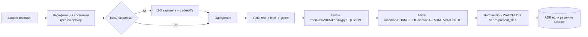

# Процесс разработки FINPILOT — как мы работаем на самом деле

> **Назначение.** Формализовать **конкретный** сквозной процесс, который проект проходит прямо сейчас:
> как планируем, как принимаем архитектурные решения (цикл согласований), как идёт цикл разработки и
> его этапы, как передаём вахту между аккаунтами, как ведём исследования аудитории и как решаем, чем
> трекать задачи. Это НЕ общая теория — общая живёт отдельно:
> - методологии/SDLC/Agile/принципы → `knowledge/guides/dev_methodologies_principles.md`;
> - как мыслит архитектор (trade-off, coupling/cohesion) → `knowledge/guides/architecture_guide.md`
>   (методичка «Подходы к архитектурированию»);
> - как устроена «нормальная» IT-команда (роли, Jira+Confluence, церемонии) →
>   `knowledge/guides/team_roles_process_methodology.md`;
> - методология исследований аудитории → `knowledge/guides/audience_research_guide.md`.
>
> Здесь — «как это устроено у НАС»: **соло-разработчик + несколько аккаунтов Claude как
> инженеры-напарники**, планка топовых финтехов РФ (Т-Банк/Сбер/Альфа), дедлайн — осень 2026.

---

## 1. Кто в процессе (наши роли)

В классической команде функции размазаны по десятку людей (см. `team_roles_process_methodology.md`).
У нас те же процессные функции схлопнуты в двух «сущностей»:

1. **Василий** — владелец продукта + разработчик + ревьюер в одном лице. Задаёт направление,
   принимает решения, одобряет архитектуру, держит планку качества. Его слово — приказ, не запрос.
2. **Claude (4 аккаунта: V, J, M, S)** — инженеры-напарники: production-grade реализация,
   проектирование архитектуры, отлов регрессий. Аккаунты работают по очереди (токены/контекст
   кончаются), поэтому между ними — формальная передача вахты (§5).

**Следствие для процесса.** Раз «команда» — это Василий + сменяющие друг друга инстансы Claude, то
критична **передаваемость контекста**: любой аккаунт должен поднять полную картину с одного архива.
Отсюда вырастает половина наших правил (WATCHLOG, «теория в коде», единый источник истины).

---

## 2. Планирование

1. **Роадмап — карта версий и вех.** `docs/ROADMAP.md` держит вехи (4–9) и внутри них пункты с
   чекбоксами `[ ]/[x]`. Веха — крупный блок (бэкенд, организационное, фронт, деплой); внутри вехи
   работа идёт **батчами** (§4).
2. **Фаза планирования направления завершена** (релиз v4.18.2, docs-only): карта версий, ADR по
   фронт-стеку, вопросы юристу зафиксированы. Дальше — исполнение по роадмапу.
3. **Приоритизация — по планке + дедлайну.** Что приближает продукт к уровню серьёзного финтеха РФ
   (надёжность, 152-ФЗ, безопасность) и укладывается в осень 2026 — вперёд. Спекулятивное (YAGNI) —
   в сторону.

---

## 3. Цикл согласования архитектурных решений (то, что мы проходим прямо сейчас)

Это и есть «цикл согласований», который Василий просил формализовать:

1. **Василий задаёт направление** — приказ/задача («переходим к банкам», «формализуй процесс»).
2. **Claude предлагает варианты.** Для решений с развилкой — **2–3 варианта с trade-offs**
   (что выигрываем / чем платим), а не один готовый ответ. Это прямое требование стиля Василия.
3. **Василий выбирает / одобряет** (или правит направление).
4. **Claude реализует** выбранное — полная реализация, потом короткое объяснение ключевых решений.
5. **Фиксация — ADR**, если решение важное: трудно/дорого откатить, влияет на несколько частей или
   на будущее, осознанно отклоняется от «как обычно». Критерии и шаблон — `docs/reports/adr/adr_template.md`.
   Примеры: ADR-001 (фронт-стек), ADR-002 (datetime), ADR-005 (расположение движка). Мелкие
   локальные решения в ADR не тащим — это шум.

> ADR отвечает на вопрос «почему выбрали именно так» через год, когда никто уже не помнит. Это не
> инцидент (то — постмортем) и не требование (то — SRS), а **выбор из альтернатив**.

---

## 4. Цикл разработки (батч) — этапы

Единица работы — **батч**: законченный кусок, доведённый до конца перед отдачей архива. Реальные
этапы:

1. **Понять запрос.** Что именно нужно и в каком объёме.
2. **Верифицировать состояние — не на веру.** «Уже сделано» в передаче вахты — это **гипотеза**,
   которую проверяют грепом по архиву, а не факт (PIT-004, `docs/pitfalls.md`). Сначала смотрим, что
   реально лежит в коде/доках.
3. **TDD (на любой код, обязательно).** Сначала тест (red) → реализация → прогон до green. Проект
   большой и связный — без тестов теряются регрессии, в том числе математические (`docs/testing_infrastructure.md`).
4. **Прогнать гейты.** Тесты **блокируют**, линтеры информативны. Жёсткое: покрытие ≥ 90%,
   `flake8 .` (весь проект, не только `app/`) = 0, `mypy` = 0, матрица **SQLite + PostgreSQL**
   (SQLite молча глотает нарушения FK — гоняем на обоих). Массовый реформат (`black .`) запрещён —
   ломает диф между аккаунтами (§5).
5. **Обновить мету батча.** Роадмап-чекбоксы `[ ]→[x]` (сразу по закрытию, до сборки архива),
   `CHANGELOG.md` (запись на каждый батч), `APP_VERSION` в `app/config.py`, версия-бейдж в
   `README.md`, `docs/WATCHLOG.md`. **SemVer:** фича = MINOR, фикс = PATCH.
6. **Собрать и отдать.** Чистый `zip` (исключить `.venv/`, `.git/`, `__pycache__`, `*.pyc`, `*.db`,
   `.pytest_cache`, `.hypothesis`, `__screenshots__`, `.DS_Store`). Отдать через `present_files`
   **архив + WATCHLOG отдельным `.md`** (§5).

**Docs-батч** (как этот, как банки, как UX-шаблон) — код и гейты кода не трогаем, но версию,
`CHANGELOG` и `WATCHLOG` всё равно бампаем: батч есть батч.

---

## 5. Передача вахты между аккаунтами (наша специфика)

Токены/контекст кончаются внезапно, вахту принимает другой аккаунт/чат. Чтобы работа не вставала:

1. **Протокол непрерывности** (`docs/session_continuity.md`): собирай рабочий архив **рано и часто**;
   в начале крупной задачи — оценка объёма + **вероятность уложиться** (высокая/средняя/низкая);
   готовое отдавай ДО тяжёлого хвоста; WATCHLOG веди **по ходу**, не в конце.
2. **WATCHLOG** (`docs/WATCHLOG.md`) — точка передачи. §0 — «отсюда продолжаем», §3 — **ровно 10**
   последних версий (добавил новую сверху → удалил старую снизу; полная история — в `CHANGELOG.md` /
   `docs/RELEASES.md`), §4 — грабли «не переоткрывать». Отдаётся в двух экземплярах: внутри архива И
   отдельным `.md` (с версией в имени: `WATCHLOG_finpilot_vX_Y_Z.md`).
3. **Fork/merge** (`knowledge/guides/fork_merge_methodology.md`): два аккаунта периодически мёржатся →
   **никаких массовых правок, ломающих диф**. Точечные изменения, осмысленные коммиты.

---

## 6. Качество и доказательность

1. **Трёхуровневый CI.** Fast (каждый push/PR, SQLite+PG, гейт покрытия 90%) → Full (теги/вручную:
   мультибраузерный E2E, визуальная регрессия, live-a11y, security) → Deep (cron/вручную: стресс,
   property, мутационное). Детали — `docs/testing_infrastructure.md`.
2. **Три уровня доказательства.** Прежде чем назвать причину бага или объявить что-то невозможным —
   исчерпать: прямой вызов API + чтение исходника + перехват в рантайме. Канонический кейс —
   «одинаковые планы для разных риск-профилей» оказались E2E race-condition, а ядро было чистым
   (`docs/reports/incidents/` + `docs/pitfalls.md`).
3. **Не объявляй невозможным, не исчерпав каналы** (§11). Внешние блокеры (cbr.ru 403, рус-OCR в
   песочнице) фиксируем как **расследование** (внешнее ограничение), а не как инцидент продукта.

---

## 7. Исследования аудитории (наш конвейер)

1. **Количественно — опрос.** 385 респондентов; сырьё в `knowledge/survey_auditory/`, разбор —
   `tools/survey_analysis/`. Даёт статистику и гипотезы.
2. **Качественно — UX-тесты/интервью.** Сырой лист (заметки, скрин переписки, расшифровка) →
   **шаблон «сырьё → отчёт»** (`knowledge/guides/templates/usability_test_report_template.md`,
   правила трансформации: классификация находок, severity P0–P3, работа с цитатами) → отчёт `UT-XXX`
   + строка в **реестре** (`knowledge/survey_auditory/usability/usability_testing_registry.md`).
   Claude превращает лист в отчёт; **ничего не выдумываем** — нет данных, пишем «н/д».
3. **Замыкание на продукт.** Находки становятся задачами роадмапа и валидируют ценности
   (`knowledge/business/product_philosophy.md`). Пример: «чёрный ящик» от главбуха = прямое
   подтверждение приоритета объяснимости.

---

## 8. Документация как часть процесса

1. **«Теория живёт в коде».** `docs/` самодостаточен: любой разработчик/аккаунт поднимает картину с
   репозитория, не читая внешних заметок. Канон (мат-модель, практики, ADR) — внутри репо.
2. **Диспетчер отчётов** (`docs/reports/reporting_policy.md`) разводит типы: **ADR** (выбор из
   альтернатив) · **инцидент/постмортем** (что сломалось и почему) · **расследование** (внешнее
   ограничение/поиск) · **требования/SRS**. Не путать.
3. **Инциденты/расследования** отдаются локально через `present_files`; в архив идёт только
   строка-сводка в реестр (`docs/incidents_summary.md`) — чтобы не раздувать репо (§12).
4. **Конвенция имён** — `docs/naming_convention.md` (англ. snake_case, без `FINPILOT_`, по типам).

---

## 9. Управление задачами: текущий подход и кандидаты

Здесь же — разбор вопроса «а не завести ли Confluence» (роадмап §5.4, «опция на подумать»).

**Как сейчас (источник истины — в репо).** Задачи и состояние трекаются двумя Markdown-файлами:
- `docs/ROADMAP.md` — **что делать**: вехи + пункты с чекбоксами `[ ]/[x]`;
- `docs/WATCHLOG.md` — **где стоим и что было**: §0 resume-point, §3 последние 10 версий, §4 грабли.

**Плюсы текущего подхода** (и почему он не случаен):
- единый источник истины, **версионируется вместе с кодом** и диффается;
- **едет с архивом** — любой из 4 аккаунтов поднимает полный контекст задач с одного `zip` (это
  несущая опора нашего мульти-аккаунтного процесса, §5);
- ноль внешних зависимостей и стоимости, работает офлайн;
- **данные не покидают репозиторий** — важно для RU-финтеха (152-ФЗ, дисциплина секретов);
- Claude читает и правит это напрямую как часть батча.

**Минусы:** нет доски со статусами «в работе / ревью / готово» (чекбокс бинарен), нет
меток/фильтров/представлений, нет тредов-обсуждений на задачу, ведётся руками.

**Кандидаты (trade-offs):**

1. **Confluence (+ Jira).** Плюсы: индустриальный стандарт (совпадает с
   `team_roles_process_methodology.md`, плюс к «hireable»-нарративу), богатая доска, статусы,
   комментарии, вики. Минусы: внешний SaaS (стоимость за лимитами free-tier), **состояние уезжает из
   репозитория** — ломается модель «один zip = вся картина», на которой держится передача вахты;
   Claude не читает Confluence как часть архива; для соло-разработчика + AI-напарника — избыточно
   (координировать некого); данные вне репо (152-ФЗ-нюанс).
2. **Notion.** Плюсы: гибкий, приятный UI, базы/доски, есть бесплатный личный тариф. Минусы: те же —
   состояние вне архива, handoff ломается, внешняя зависимость.
3. **GitHub Issues/Projects.** Плюсы: живёт **на той же платформе, что и код** (`vevdokimovm/personal-finance-dss`),
   бесплатно, доска/метки, привязка к коммитам/PR, без второго SaaS. Минусы: всё равно **не внутри
   архива** (передача вахты опирается на WATCHLOG в `zip`, а не на GitHub API — у которого ещё и
   TLS-таймауты из РФ, см. `docs/pitfalls.md`); добавляет второе место рядом с WATCHLOG.

**Рекомендация (решение-кандидат, не принято к внедрению сейчас):**
- **Оставляем ROADMAP + WATCHLOG в репо каноническим источником.** Он несущий для мульти-аккаунтного
  процесса — вся схема предполагает «один архив = полный контекст», а Confluence/Notion это ломают,
  вынося состояние наружу. Боль, которую решает Confluence (визуальная доска, статусы), для соло-пары
  «человек + AI» низкая.
- **Если визуальная доска реально понадобится** — самое лёгкое дополнение — **GitHub Projects** как
  слой-представление поверх кода (та же платформа, бесплатно, без утечки данных), при этом WATCHLOG
  остаётся каноном, а не заменяется.
- **Confluence/Jira** — это ответ на «когда появится живая команда из людей», а не на «сейчас».
  Статус: **кандидат, отложен**; пересмотреть при росте до многолюдной команды.

---

## 10. Одной фразой

Мы работаем батчами по роадмапу: направление → варианты с trade-offs → одобрение → TDD → зелёные
гейты → мета → чистый архив + WATCHLOG; всё состояние живёт в репозитории, чтобы любой из аккаунтов
поднял полную картину с одного `zip`. Планка — серьёзный финтех РФ, а не «студенческий проект».

---

_Методичка описывает процесс на v5.10.0. Процесс эволюционирует — при изменении цикла (новые гейты,
смена трекера задач, деплой-пайплайн) обновлять здесь. Общая теория — в смежных методичках (см. шапку)._
