# Методичка: диаграммы, схемы, нотации и ГОСТы

> Справочник для технической документации, ВКР и проектов.
> Логика построения: **что это → кто делает → что показывает → какой уровень/ГОСТ → пример → чем рисовать.**
> Сквозной пример во многих местах — система **FINPILOT** (СППР по персональным финансам), чтобы куски можно было сразу тащить в ВКР.

---

## Как пользоваться

1. Если не знаешь *что вообще выбрать* — иди в **Часть 0** (карта по специалистам) и **Часть 14** (дерево решений).
2. Если знаешь тип, но забыл нотацию — ищи нужную часть по оглавлению.
3. Для ВКР по специальности 09.03.01 (Информатика и ВТ) ключевое — **Часть 2 (ГОСТ), Часть 7 (алгоритмы), Часть 4 (БД), Часть 12 (требования)** и шпаргалка **Часть 13**.
4. Код примеров (Mermaid / PlantUML) рабочий — копируй в редактор и рендери.

### Оглавление

- [Часть 0. Карта: специалист → диаграммы](#часть-0)
- [Часть 1. Уровни абстракции](#часть-1)
- [Часть 2. ГОСТовские нотации (РФ)](#часть-2)
- [Часть 3. UML (полный набор)](#часть-3)
- [Часть 4. Базы данных](#часть-4)
- [Часть 5. Бизнес-процессы](#часть-5)
- [Часть 6. Архитектура ПО](#часть-6)
- [Часть 7. Алгоритмы](#часть-7)
- [Часть 8. Инфраструктура / инженерные](#часть-8)
- [Часть 9. Прочие диаграммы](#часть-9)
- [Часть 10. Инструменты: код-нотации](#часть-10)
- [Часть 11. Инструменты: приложения](#часть-11)
- [Часть 12. Функциональные и нефункциональные требования](#часть-12)
- [Часть 13. Шпаргалка: что в какой раздел ВКР](#часть-13)
- [Часть 14. Дерево решений](#часть-14)

---

<a name="часть-0"></a>
## Часть 0. Карта: какой специалист → какие диаграммы

| Специалист | Чем занимается | Типовые диаграммы |
|---|---|---|
| **Системный аналитик** | переводит «хотелки бизнеса» в требования | Use Case, BPMN, DFD, IDEF0, контекстная (C4 Context), ER (концептуальная) |
| **Бизнес-аналитик** | процессы и их улучшение | BPMN, EPC, Swimlane, Value Stream Map, mind map |
| **Архитектор ПО** | как система устроена внутри и снаружи | C4 (все уровни), UML Component/Deployment, ArchiMate, Sequence |
| **Backend-разработчик** (это ты) | логика, данные, API | UML Class, Sequence, ER/физическая модель БД, блок-схема алгоритма, State Machine, C4 Component |
| **DBA / data engineer** | хранение и связи данных | ER (Crow's Foot), IDEF1X, физическая схема (DBML/DDL) |
| **DevOps / инфраструктурщик** | развёртывание, сеть | Deployment, network diagram, C4 Container/Deployment |
| **Frontend / UX** | интерфейс и пути пользователя | User flow, wireframe, sitemap, State Machine UI |
| **Проектный менеджер** | сроки и ресурсы | Gantt, дорожная карта, PERT/сетевой график |
| **Инженер (не-IT)** | физические системы | ГОСТ ЕСКД (чертежи), P&ID, электросхемы, кинематические |

**Главный принцип:** диаграмма — это *язык общения* конкретной аудитории. Сначала спроси «**для кого** и **что я хочу донести**», потом выбирай нотацию. Не наоборот.

---

<a name="часть-1"></a>
## Часть 1. Уровни абстракции

Любую систему описывают на нескольких уровнях. От самого «бизнесового» к самому «железному». Это каркас, на который вешаются все остальные диаграммы.

| Уровень | Вопрос, на который отвечает | Кто аудитория | Примеры диаграмм |
|---|---|---|---|
| **Концептуальный** | «Что это вообще и зачем?» | заказчик, менеджмент | контекстная диаграмма, C4 Context, концептуальная ER, mind map |
| **Логический** | «Из каких частей состоит и как связано?» (без привязки к технологиям) | аналитики, архитекторы | логическая ER, DFD, UML Class, BPMN |
| **Физический / технологический** | «Как именно реализовано в конкретном стеке?» | разработчики, DBA, DevOps | физическая схема БД (DDL/DBML), Deployment, C4 Component/Code |

Один и тот же объект (например, «пользователь и его цели» в FINPILOT) рисуется трижды:
- концептуально — «есть пользователь, у него финансовые цели»;
- логически — сущности `User`, `Goal`, `Transaction` и их связи;
- физически — таблицы SQLite с типами, индексами, FK.

Для ВКР это золотая тройка: показал, что мыслишь от абстрактного к конкретному — комиссия довольна.

---

<a name="часть-2"></a>
## Часть 2. ГОСТовские нотации (важно для ВКР в РФ)

В российских вузах и госпроектах диаграммы регламентированы ГОСТами. Для защиты ВКР это критично — научник и нормоконтроль смотрят на соответствие.

### 2.1. Семейства ГОСТов (что где искать)

| Семейство | Расшифровка | О чём | Тебе нужно? |
|---|---|---|---|
| **ЕСПД** (ГОСТ 19.xxx) | Единая система программной документации | документация на ПО, схемы алгоритмов | **Да** — основа для ВКР по ПО |
| **ГОСТ 34.xxx** | Комплекс стандартов на автоматизированные системы (АС) | ТЗ, стадии создания, виды документов | **Да**, если позиционируешь как АС/СППР |
| **ЕСКД** (ГОСТ 2.xxx) | Единая система конструкторской документации | чертежи, схемы изделий | Нет (это для «железа») |
| **ГОСТ Р 50.1.028-2001** | — | методология IDEF0 | По желанию (функц. модель) |

Ключевые документы, которые стоит назвать в ВКР:
- **ГОСТ 19.701-90** «Схемы алгоритмов, программ, данных и систем. Обозначения условные и правила выполнения» (= ISO 5807:1985) — **главный для блок-схем**.
- **ГОСТ 19.402-78** «Описание программы».
- **ГОСТ 34.601-90** «Стадии создания АС».
- **ГОСТ 34.602-89** (и обновлённый **ГОСТ 34.602-2020**) «Техническое задание на создание АС».
- **ГОСТ Р 50.1.028-2001** — IDEF0.

### 2.2. Блок-схема алгоритма по ГОСТ 19.701-90

**Что показывает:** последовательность шагов алгоритма/программы.
**Кто делает:** разработчик, системный аналитик.
**Уровень:** логический/физический.

Основные блоки:

| Фигура | Назначение |
|---|---|
| Овал / скруглённый прямоугольник | начало / конец (терминатор) |
| Прямоугольник | процесс (действие, вычисление) |
| Параллелограмм | ввод / вывод данных |
| Ромб | решение (условие, ветвление) |
| Прямоугольник с двойными боковыми гранями | предопределённый процесс (вызов подпрограммы) |
| Шестиугольник | подготовка (инициализация цикла) |
| Круг | соединитель (переход на другую часть схемы) |

**Пример (FINPILOT — выбор стратегии погашения долгов):**

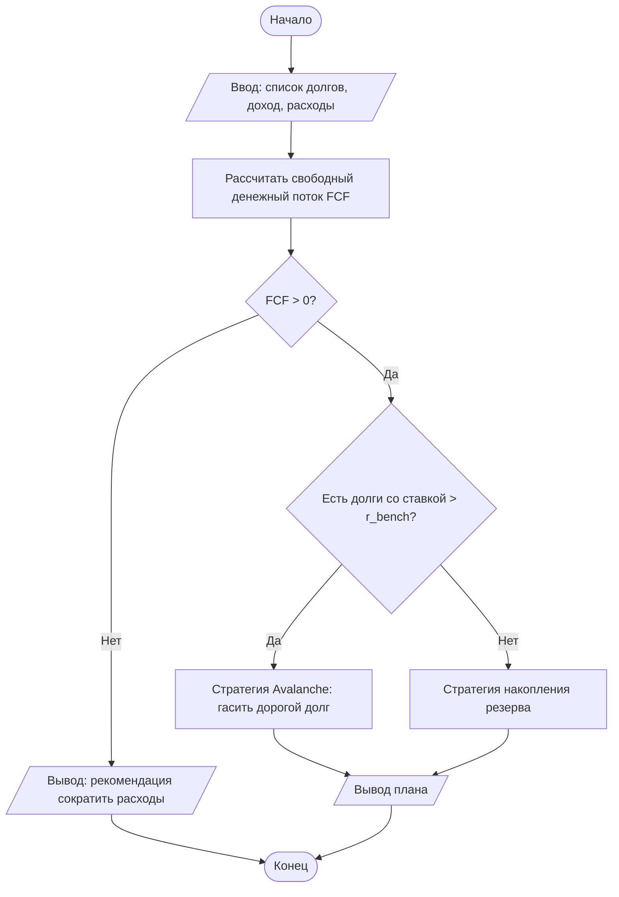

> В ВКР блок-схему чаще оформляют именно по ГОСТ-фигурам в Visio/draw.io, но Mermaid выше — отличный черновик логики, потом перерисовываешь в ГОСТ-вид.

### 2.3. IDEF0 (функциональное моделирование)

**Что показывает:** функции системы и потоки между ними по принципу **ICOM** (Input-Control-Output-Mechanism).
**Кто делает:** системный/бизнес-аналитик.
**Уровень:** концептуальный → логический.
**Стандарт:** ГОСТ Р 50.1.028-2001.

Каждый блок (функция) имеет 4 стороны:
- **слева** — вход (Input): что преобразуется;
- **сверху** — управление (Control): правила, ограничения, ГОСТы;
- **снизу** — механизм (Mechanism): кто/чем выполняет;
- **справа** — выход (Output): результат.

Контекстная диаграмма «A-0» = вся система одним блоком, потом декомпозируется на A0 → A1, A2, A3…

```
                 [Финансовые цели] [Бюджет ЦБ / ставки]
                          │              │
                          ▼              ▼
   [Данные о доходах] ──▶┌─────────────────────────┐──▶ [План распределения средств]
   [Список долгов]   ──▶│  A0: Сформировать          │──▶ [Рекомендации]
                        │  финансовую рекомендацию   │
                        └─────────────────────────┘
                          ▲              ▲
                          │              │
                  [Алгоритм FINPILOT] [Аналитик/СППР]
```

> В РФ-вузах IDEF0 рисуют в **Ramus** или **Business Studio** — см. Часть 11.

### 2.4. IDEF1X — модель данных

**Что показывает:** сущности и связи (аналог ER, но строгая нотация ICAM).
**Кто делает:** проектировщик БД.
**Уровень:** логический.
Используется реже ER Crow's Foot, но в госах встречается. Ключевая фишка — различие идентифицирующих и неидентифицирующих связей (сплошная/пунктирная линия).

### 2.5. IDEF3 — процессы (workflow)

Описание сценариев и последовательности работ. Дополняет IDEF0 (что → как именно по шагам).

### 2.6. DFD — диаграмма потоков данных

**Что показывает:** как данные движутся между процессами, хранилищами и внешними сущностями.
**Кто делает:** системный аналитик.
**Уровень:** логический.
**Нотации:** Йордан-ДеМарко или Гейн-Сарсон.

4 элемента: внешняя сущность (прямоугольник), процесс (круг/скруглённый), хранилище данных (открытый прямоугольник), поток данных (стрелка).

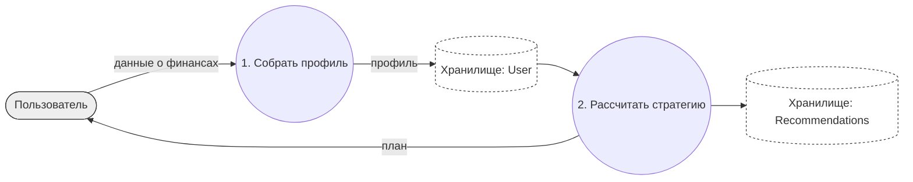

### 2.7. ДРАКОН (бонус для РФ)

Российский визуальный алгоритмический язык (расшифровка: *Дружелюбный Русский Алгоритмический язык, Который Обеспечивает Наглядность*). Разработан для космической программы «Буран». Главная фишка — «шампур» (главный маршрут идёт строго вертикально вниз). Можно упомянуть в обзоре нотаций — выглядит солидно и в тему для ВКР.

---

<a name="часть-3"></a>
## Часть 3. UML (Unified Modeling Language)

**Стандарт:** OMG UML, принят как ISO/IEC 19505.
**Кто делает:** аналитики, архитекторы, разработчики.
14 типов диаграмм делятся на **структурные** (статика) и **поведенческие** (динамика).

### Структурные

| Диаграмма | Что показывает | Кто, когда |
|---|---|---|
| **Class (классов)** | классы, атрибуты, методы, связи | разработчик — проектирование ООП-кода |
| **Object (объектов)** | конкретные экземпляры классов в момент времени | разработчик — отладка/иллюстрация |
| **Component (компонентов)** | программные компоненты и интерфейсы между ними | архитектор |
| **Deployment (развёртывания)** | железо/узлы и что на них крутится | DevOps, архитектор |
| **Package (пакетов)** | группировка по пакетам/модулям | архитектор |
| **Composite Structure** | внутренняя структура класса/компонента | архитектор (редко) |
| **Profile** | расширения самого UML | редко |

### Поведенческие

| Диаграмма | Что показывает | Кто, когда |
|---|---|---|
| **Use Case (вариантов использования)** | акторы и что они могут делать с системой | аналитик — на старте проекта |
| **Activity (деятельности)** | поток работ/логику (UML-аналог блок-схемы) | аналитик, разработчик |
| **Sequence (последовательности)** | обмен сообщениями между объектами во времени | разработчик — проектирование API/взаимодействий |
| **State Machine (состояний)** | состояния объекта и переходы | разработчик — для объектов с явным ЖЦ |
| **Communication** | то же что Sequence, но акцент на связях | редко |
| **Timing** | поведение во времени (тайминги) | embedded/realtime |
| **Interaction Overview** | обзор взаимодействий | редко |

#### Пример 1 — Use Case (FINPILOT)

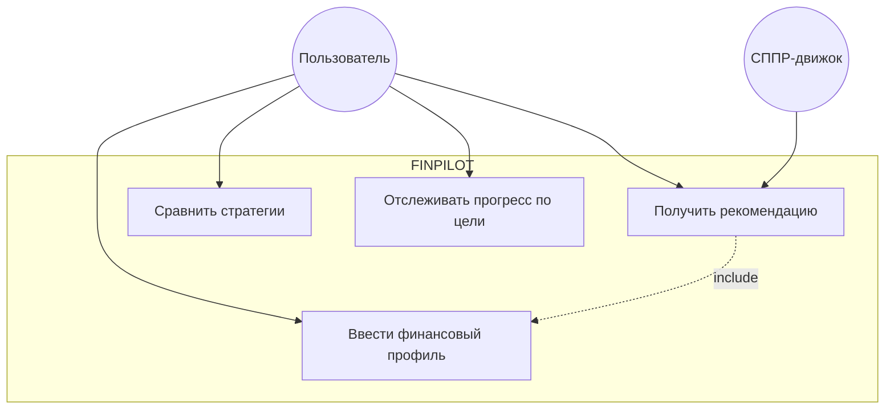

> Чистый UML Use Case лучше делать в PlantUML (есть нативные акторы-«человечки» и связи `<<include>>`/`<<extend>>`). Mermaid рисует приближённо.

#### Пример 2 — Class (FINPILOT, фрагмент)

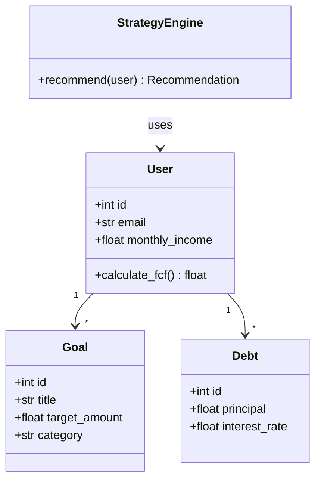

#### Пример 3 — Sequence (запрос рекомендации через FastAPI)

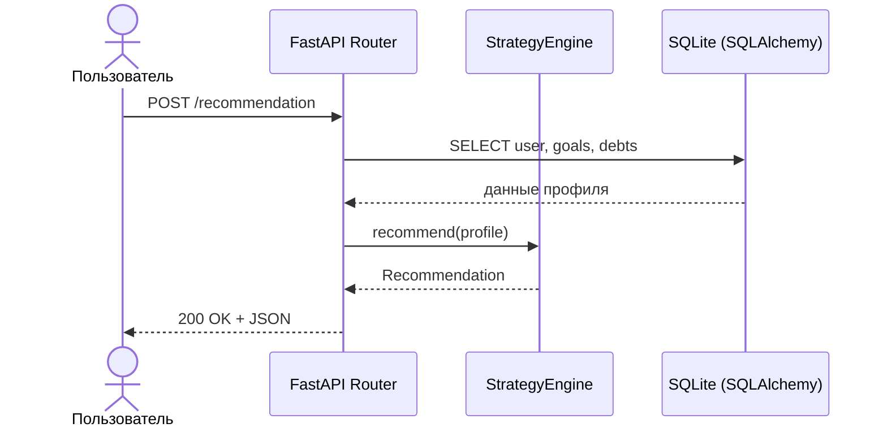

#### Пример 4 — State Machine (жизненный цикл финансовой цели)

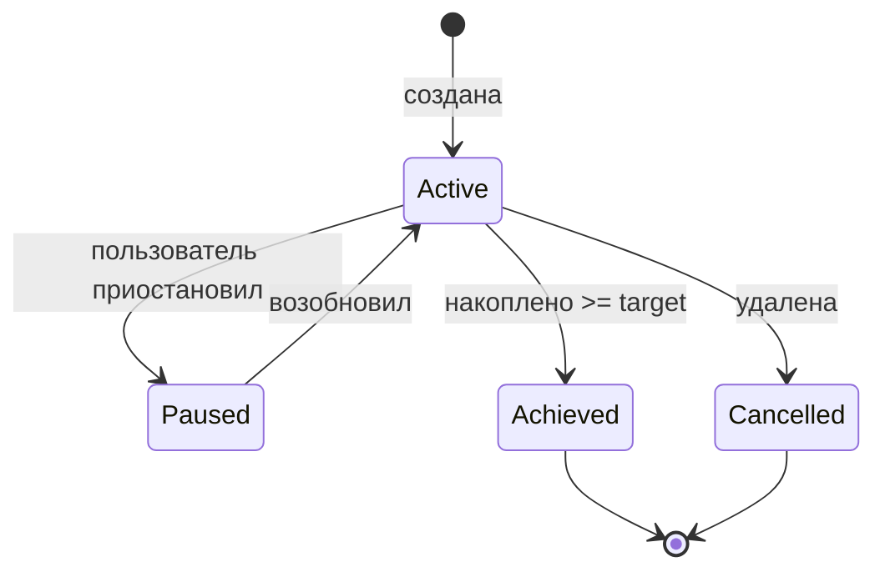

---

<a name="часть-4"></a>
## Часть 4. Базы данных

**Кто делает:** backend-разработчик, DBA, проектировщик данных.

### 4.1. ER-диаграммы (Entity-Relationship)

Главный инструмент моделирования данных. Две популярные нотации:

| Нотация | Особенность | Где встречается |
|---|---|---|
| **Chen** | сущности-прямоугольники, связи-ромбы, атрибуты-овалы | академическая, в учебниках/ВКР |
| **Crow's Foot** (вороньи лапки, она же IE) | компактная, кардинальность «лапками» | индустрия, dbdiagram.io, большинство тулов |

Три модели (= три уровня из Части 1):
- **Концептуальная** — сущности и связи, без атрибутов и типов;
- **Логическая** — + атрибуты, ключи, нормализация, без привязки к СУБД;
- **Физическая** — + типы данных, индексы, FK конкретной СУБД (SQLite/PostgreSQL).

#### Пример — ER (Crow's Foot) для FINPILOT

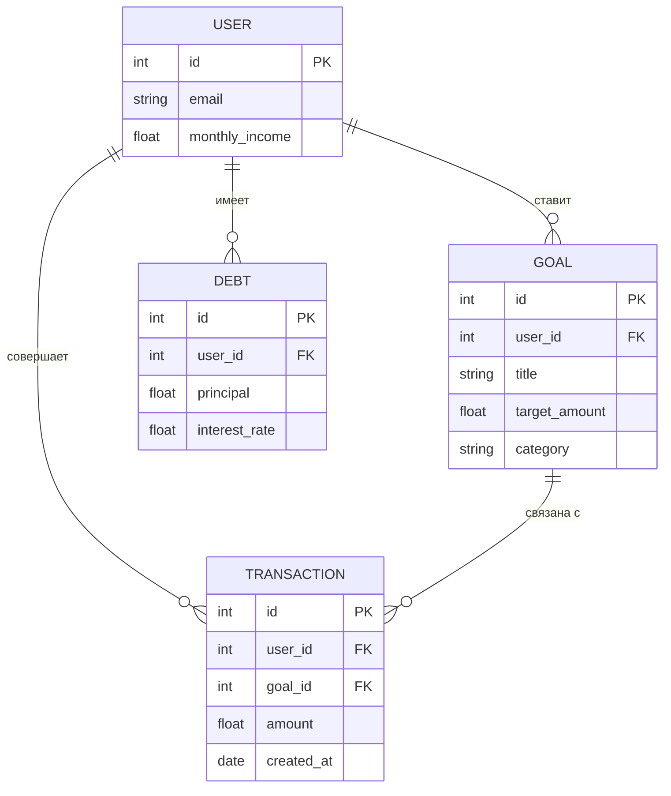

### 4.2. IDEF1X

Строгая ГОСТ-совместимая нотация данных (см. Часть 2.4). Если ВКР под ГОСТ 34 — можешь дать модель данных в IDEF1X.

### 4.3. DBML — текстовая нотация (ты её уже используешь)

DBML (Database Markup Language) от dbdiagram.io — текст → красивая схема. Идеально для версионирования в Git.

```dbml
Table users {
  id integer [primary key]
  email varchar
  monthly_income float
}

Table goals {
  id integer [primary key]
  user_id integer [ref: > users.id]
  title varchar
  target_amount float
  category varchar
}

Table debts {
  id integer [primary key]
  user_id integer [ref: > users.id]
  principal float
  interest_rate float
}
```

> Из DBML генерируется и картинка (dbdiagram.io), и SQL DDL. Для ВКР: одна модель → схема для физического раздела + DDL для приложения.

---

<a name="часть-5"></a>
## Часть 5. Бизнес-процессы

**Кто делает:** бизнес/системный аналитик.
**Уровень:** концептуальный/логический.

### 5.1. BPMN 2.0 (Business Process Model and Notation)

**Стандарт:** OMG, = ISO/IEC 19510. **Главная нотация для процессов в индустрии.**
Основные элементы:
- **События** (Events) — круги: старт (тонкий), промежуточное (двойной), конец (толстый);
- **Задачи** (Tasks/Activities) — скруглённые прямоугольники;
- **Шлюзы** (Gateways) — ромбы: ветвление (X = эксклюзивный, + = параллельный);
- **Потоки** — стрелки (sequence flow);
- **Дорожки** (Pools/Lanes) — кто за что отвечает.

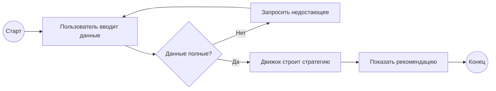

> Настоящий BPMN с пулами и правильными иконками рисуется в **Camunda Modeler**, **bpmn.io**, **Visio**. Mermaid — упрощённо.

### 5.2. EPC (Event-driven Process Chain)

Событийная цепочка процессов из методологии ARIS. Чередование «событие → функция → событие». Распространена в SAP/корпоративном мире РФ.

### 5.3. Swimlane / Cross-functional flowchart

Блок-схема, разбитая на «дорожки» по ролям/отделам. Хорошо показывает «кто за какой шаг отвечает». Проще BPMN, понятна нетехнарям.

### 5.4. Value Stream Mapping (VSM)

Карта потока создания ценности (Lean). Показывает шаги + время + потери. Для оптимизации процессов.

---

<a name="часть-6"></a>
## Часть 6. Архитектура ПО

**Кто делает:** архитектор, ведущий разработчик.

### 6.1. C4 model (рекомендую как основную)

Современный подход (Simon Brown). 4 уровня масштаба, как карты Google (страна → город → улица → дом):

| Уровень | Что показывает | Аудитория |
|---|---|---|
| **C1 — Context** | система + пользователи + внешние системы | все, включая бизнес |
| **C2 — Container** | приложения/сервисы/БД внутри системы | техлид, DevOps |
| **C3 — Component** | компоненты внутри одного контейнера | разработчики |
| **C4 — Code** | классы/код (часто = UML Class) | при необходимости |

#### Пример — C4 Context (FINPILOT)

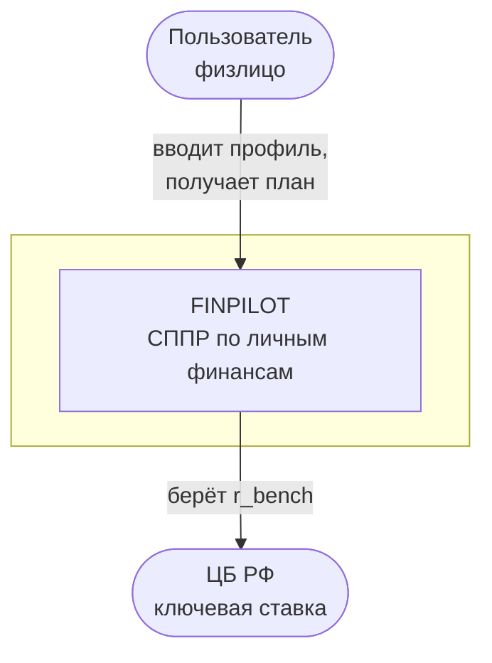

#### Пример — C4 Container (FINPILOT)

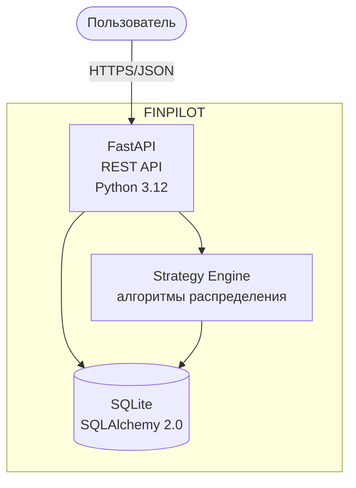

> C4 удобнее всего описывать в **Structurizr DSL** или рисовать в draw.io (есть готовые C4-шейпы). Mermaid тоже умеет (`C4Context`), но синтаксис капризный — выше я дал безопасный flowchart-вариант.

### 6.2. ArchiMate

Язык моделирования архитектуры предприятия (TOGAF). Тяжёлый, для крупного enterprise. Тебе для ВКР не нужен, но знать слово полезно.

### 6.3. UML Component / Deployment

Классика для архитектуры (см. Часть 3). Deployment — что на каком сервере крутится.

---

<a name="часть-7"></a>
## Часть 7. Алгоритмы

**Кто делает:** разработчик.

### 7.1. Блок-схема (flowchart)

Главная для ВКР по ПО. По **ГОСТ 19.701-90** (см. Часть 2.2). Показывает поток управления.

### 7.2. NS-диаграмма (Насси-Шнейдермана)

**Стандарт:** DIN 66261. Структурная схема без стрелок — только вложенные блоки. Каждый блок = последовательность/ветвление/цикл. Невозможно нарисовать «goto», поэтому учит структурному программированию. Выглядит как набор вложенных прямоугольников.

```
┌─────────────────────────────────────┐
│ Прочитать долги                       │
├─────────────────────────────────────┤
│ для каждого долга в списке:           │
│ ┌─────────────────────────────────┐ │
│ │  ставка > r_bench ?              │ │
│ │ ┌──────────┬──────────────────┐ │ │
│ │ │   да     │       нет         │ │ │
│ │ │ в очередь│  отложить         │ │ │
│ │ │ Avalanche│                   │ │ │
│ │ └──────────┴──────────────────┘ │ │
│ └─────────────────────────────────┘ │
└─────────────────────────────────────┘
```

### 7.3. Псевдокод

Не диаграмма, но часто заменяет/дополняет её в ВКР. Язык-независимое описание логики. Хорошо для сложной математики (твои формулы Si, BLR).

```
ALGORITHM RecommendStrategy(user)
  fcf ← user.income − user.expenses
  IF fcf ≤ 0 THEN
      RETURN "сократить расходы"
  END IF
  expensive ← [d FOR d IN user.debts IF d.rate > R_BENCH]
  IF expensive ≠ ∅ THEN
      RETURN AvalanchePlan(expensive, fcf)
  ELSE
      RETURN SavingsPlan(user.goals, fcf)
  END IF
END
```

### 7.4. Activity Diagram (UML)

UML-версия блок-схемы с поддержкой параллелизма (fork/join) и дорожек. См. Часть 3.

---

<a name="часть-8"></a>
## Часть 8. Инфраструктура / инженерные

**Кто делает:** DevOps, сетевой инженер, инженер-проектировщик.

| Диаграмма | Что показывает | Нотация/инструмент |
|---|---|---|
| **Network diagram** | топология сети, узлы, связи | Cisco-шейпы, draw.io |
| **Deployment (UML)** | физ. узлы и артефакты ПО | UML |
| **C4 Deployment** | маппинг контейнеров на инфраструктуру | Structurizr |
| **Cloud architecture** | AWS/Azure/GCP-ресурсы | официальные иконки облаков, draw.io |
| **P&ID** | трубопроводы и КИП (химия, энергетика) | ГОСТ/ISA |
| **Электрические схемы** | принципиальные, монтажные | ГОСТ ЕСКД (2.7xx) |
| **Кинематические** | механические передачи | ГОСТ ЕСКД |

Для backend-проекта типа FINPILOT инженерные нужны редко — максимум простой deployment (Docker-контейнер → хост) если разворачиваешь.

---

<a name="часть-9"></a>
## Часть 9. Прочие полезные диаграммы

| Диаграмма | Что показывает | Кто/когда |
|---|---|---|
| **Gantt** | задачи во времени, сроки | PM — план проекта/ВКР |
| **Mind map** | дерево идей вокруг центра | brainstorm, структура работы |
| **User flow** | путь пользователя по экранам | UX/продукт |
| **Wireframe / mockup** | каркас интерфейса | UX/frontend |
| **Sitemap** | структура страниц сайта | frontend |
| **Sankey** | потоки/объёмы (где сколько утекает) | аналитика (хорошо для финансов!) |
| **PERT / сетевой график** | зависимости задач, критический путь | PM |
| **Sequence для протоколов** | обмен пакетами | сетевики |

#### Пример — Gantt плана подготовки ВКР

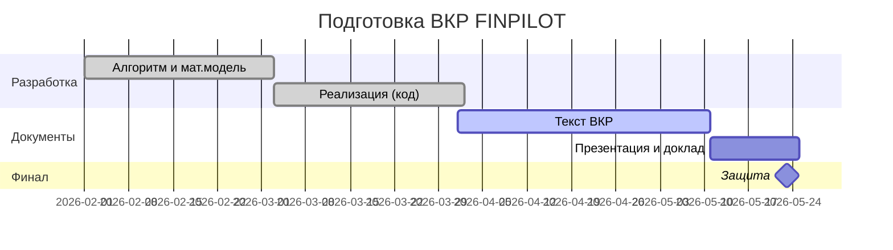

> Sankey, кстати, прям просится в твою тему: показать как доход пользователя «растекается» по категориям расходов и целям.

---

<a name="часть-10"></a>
## Часть 10. Инструменты: код-нотации (diagram-as-code)

Текстом → картинка. Версионируется в Git, не нужно мышкой возить. Для разработчика — топ.

| Инструмент | Сильная сторона | Что умеет | Минусы |
|---|---|---|---|
| **Mermaid** | встроен в GitHub/GitLab/Notion/Obsidian, простой | flowchart, sequence, class, ER, state, gantt, C4 | сложные UML — слабовато, авто-раскладка иногда кривая |
| **PlantUML** | мощнейший по UML | все 14 UML, C4, ER, mind map, gantt, wireframe | нужен Java или онлайн-сервер |
| **Graphviz (DOT)** | идеальные графы/деревья | любые направленные графы, авто-раскладка | только графы, не «бизнес»-схемы |
| **D2** | современный, красивый «из коробки» | архитектура, flow, ER | моложе, экосистема меньше |
| **DBML** | специально под БД | ER → SQL DDL | только БД |
| **Structurizr DSL** | заточен под C4 | все 4 уровня C4 из одной модели | узкоспециализирован |

**Когда что брать (практика для тебя):**
1. Быстрый набросок логики, в README на GitHub → **Mermaid**.
2. Серьёзные UML для ВКР (Use Case с include/extend, Component) → **PlantUML**.
3. Схема БД, которую тащишь и в ВКР, и в SQL → **DBML**.
4. Дерево вызовов/зависимостей → **Graphviz**.
5. Красивая архитектура для презентации → **D2** или draw.io.

#### Один и тот же класс в PlantUML (для сравнения с Mermaid выше)

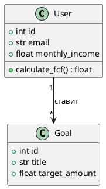

#### Graphviz (граф зависимостей модулей)

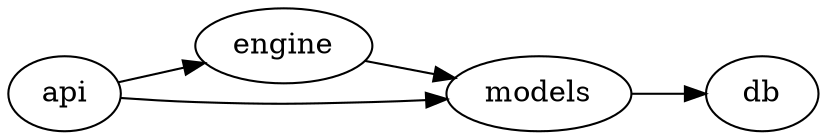

---

<a name="часть-11"></a>
## Часть 11. Инструменты: приложения (GUI)

Когда хочется мышкой и красиво.

### Универсальные (must-have)

| Приложение | Цена | За что любят |
|---|---|---|
| **draw.io / diagrams.net** | бесплатно | универсал: UML, BPMN, ER, C4, сеть, flowchart. Десктоп + веб + плагины. **Рекомендую как основной.** |
| **Lucidchart** | freemium | удобный, командная работа, много шаблонов |
| **Microsoft Visio** | платно | корпоративный стандарт, строгие ГОСТ-шейпы |
| **yEd** | бесплатно | мощная авто-раскладка больших графов |
| **Excalidraw** | бесплатно | «рисунок от руки», наброски, доклады |

### Специализированные

| Приложение | Для чего |
|---|---|
| **dbdiagram.io** | ER/БД из DBML (ты уже юзаешь) |
| **bpmn.io / Camunda Modeler** | настоящий BPMN 2.0 |
| **Structurizr** | C4-архитектура |
| **StarUML / Visual Paradigm** | полноценный UML (VP имеет Community-версию) |
| **Sparx Enterprise Architect** | тяжёлый enterprise UML/SysML |
| **Figma / FigJam** | UI-макеты, user flow, командные борды |
| **Miro** | онлайн-вайтборд, брейнштормы |

### Российские / для ГОСТ-моделирования (важно для ВКР)

| Приложение | Для чего |
|---|---|
| **Ramus** (есть бесплатная Educational) | IDEF0, DFD — **классика российских вузов** |
| **Business Studio** | бизнес-процессы, IDEF, ГОСТ-документация |
| **ARIS** | EPC, корпоративные процессы |

**Практический совет для ВКР:** держи всё, что можно, в **diagram-as-code** (Mermaid/PlantUML/DBML) — править легко, в Git хранится. А финальные «парадные» картинки для текста ВКР и презентации дочищай в **draw.io**. IDEF0/DFD, если требует научник, — **Ramus**.

---

<a name="часть-12"></a>
## Часть 12. Функциональные и нефункциональные требования

Требования — это **что система должна делать** (а диаграммы выше — как это визуализировать). В ВКР обычно идёт раздел «Анализ требований».

### 12.1. Два класса требований

| Тип | Отвечает на вопрос | Примеры (FINPILOT) |
|---|---|---|
| **Функциональные (ФТ)** | ЧТО система делает | «система формирует план погашения долгов по стратегии Avalanche», «пользователь может создать финансовую цель» |
| **Нефункциональные (НФТ)** | КАК хорошо / с какими свойствами | «ответ API < 500 мс», «работает на Python 3.12», «данные хранятся локально (приватность)» |

Категории НФТ (запомни как чек-лист): производительность, надёжность, безопасность, масштабируемость, удобство использования (usability), переносимость, сопровождаемость.

### 12.2. Стандарты на требования

| Стандарт | О чём |
|---|---|
| **IEEE 830** | классическая структура SRS (Software Requirements Specification). Устарел, но термины из него везде |
| **ISO/IEC/IEEE 29148:2018** | актуальная замена IEEE 830, требования к ЖЦ |
| **ГОСТ 34.602-89 / 2020** | Техническое задание на создание АС (российский аналог SRS) — **для ВКР под ГОСТ бери его** |
| **ГОСТ 19.201-78** | Техническое задание (ЕСПД, на программу) |

### 12.3. Форматы записи требований

1. **Текстовый список «система должна…»** — классика ТЗ/SRS.
   - *FR-1: Система должна рассчитывать свободный денежный поток на основе доходов и расходов пользователя.*
2. **User Story** (Agile): `Как <роль>, я хочу <действие>, чтобы <ценность>`.
   - *Как пользователь, я хочу видеть сравнение стратегий погашения, чтобы выбрать выгодную.*
3. **Use Case (текстовый + диаграмма)** — сценарий с шагами, основной и альтернативные потоки. Связан с UML Use Case (Часть 3).
4. **Таблица требований** с ID, приоритетом, источником, статусом — удобно для трассировки.

### 12.4. Как требования связаны с диаграммами

Это и есть суть «алгоритмического обеспечения СППР»:

```
Требования (ЧТО)
   │
   ├─▶ Use Case (кто и что делает)
   │
   ├─▶ BPMN / Activity (как процесс течёт)
   │
   ├─▶ Class / ER (какие данные нужны)
   │
   ├─▶ Sequence (как компоненты взаимодействуют)
   │
   └─▶ Блок-схема алгоритма (как именно считаем)
```

**Трассируемость** (traceability) — каждое требование должно «дойти» до реализации и теста. В ВКР хорошо смотрится матрица: Требование → Диаграмма → Модуль кода → Тест.

#### Пример матрицы трассировки (FINPILOT)

| ID | Требование | Диаграмма | Модуль | Тест |
|---|---|---|---|---|
| FR-1 | Расчёт FCF | блок-схема 2.2 | `user.calculate_fcf()` | `test_fcf` |
| FR-2 | Стратегия Avalanche | блок-схема + псевдокод 7.3 | `StrategyEngine` | `test_avalanche` |
| FR-3 | Хранение целей | ER 4.1 | `Goal` model | `test_goal_crud` |
| NFR-1 | Ответ API < 500 мс | Sequence 3.3 | router | нагрузочный |

---

<a name="часть-13"></a>
## Часть 13. Шпаргалка: что в какой раздел ВКР

Под структуру типичной ВКР по 09.03.01:

| Раздел ВКР | Какие диаграммы кладём |
|---|---|
| **Введение / актуальность** | (обычно без диаграмм; можно mind map предметной области) |
| **Анализ предметной области** | IDEF0 (контекст + декомпозиция), DFD, mind map |
| **Постановка задачи / требования** | Use Case, таблица ФТ/НФТ, матрица трассировки |
| **Проектирование — архитектура** | C4 (Context, Container), UML Component, Deployment |
| **Проектирование — данные** | ER (концептуальная → логическая → физическая), DBML/DDL |
| **Проектирование — поведение** | Sequence, Activity, State Machine, BPMN |
| **Алгоритмическое обеспечение** (твоё ядро!) | **блок-схемы по ГОСТ 19.701-90**, NS-диаграммы, псевдокод, мат. формулы |
| **Реализация** | UML Class, фрагменты структуры пакетов |
| **Тестирование** | (таблицы тест-кейсов; иногда Sequence сценариев) |
| **Заключение** | — |

**Под твою тему («алгоритмическое обеспечение СППР»)** центр тяжести — раздел алгоритмов: блок-схемы по ГОСТ для каждого ключевого алгоритма (расчёт FCF, Avalanche+OCR, взвешенная Si, BLR-индикатор) + псевдокод/формулы. Это то, на что комиссия будет смотреть в первую очередь.

---

<a name="часть-14"></a>
## Часть 14. Дерево решений «какую диаграмму взять»

```
Что хочу показать?
│
├─ Кто и зачем пользуется системой? ──────────▶ Use Case
│
├─ Как течёт бизнес-процесс? ─────────────────▶ BPMN (индустрия) / IDEF0 (ГОСТ) / Swimlane (просто)
│
├─ Как движутся данные? ──────────────────────▶ DFD
│
├─ Какие данные хранятся и как связаны? ──────▶ ER (Crow's Foot) / IDEF1X (ГОСТ) / DBML
│
├─ Из каких частей состоит система? ──────────▶ C4 (Container/Component) / UML Component
│
├─ Что на каком сервере крутится? ────────────▶ Deployment / C4 Deployment
│
├─ Как устроен код (классы)? ─────────────────▶ UML Class
│
├─ Как объекты обмениваются во времени? ──────▶ Sequence
│
├─ Какие состояния у объекта? ────────────────▶ State Machine
│
├─ Как работает алгоритм? ────────────────────▶ Блок-схема (ГОСТ 19.701-90) / NS / псевдокод
│
├─ Что система должна делать? ────────────────▶ не диаграмма → ФТ/НФТ, ТЗ (ГОСТ 34.602)
│
├─ Сроки и задачи проекта? ───────────────────▶ Gantt / сетевой график
│
└─ Куда утекают деньги/ресурсы (потоки)? ─────▶ Sankey
```

---

## Мини-FAQ

**Mermaid или PlantUML для ВКР?**
Mermaid — для черновиков и README. Для финальных UML в текст ВКР — PlantUML (богаче) или дочистка в draw.io. Блок-схемы алгоритмов — всё равно перерисовывать в ГОСТ-вид (draw.io/Visio).

**Обязательно ли IDEF0 в ВКР?**
Зависит от научника и кафедры. Если требуют «функциональную модель» — да, делай в Ramus. Если нет — C4 + UML современнее и понятнее.

**Сколько диаграмм надо?**
Не количество, а покрытие: предметка → требования → архитектура → данные → алгоритмы → поведение. По 1-2 ключевых на каждый аспект. У тебя по handover уже 19 встроенных — это с запасом.

**Чем рисовать ГОСТ-блок-схемы быстро?**
draw.io (есть flowchart-шейпы, совпадают с ГОСТ-фигурами) → экспорт в PNG/SVG → в Word.
