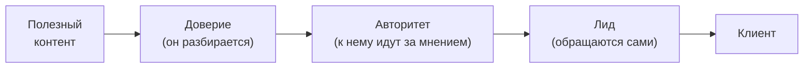
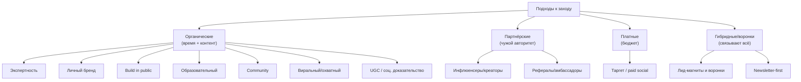
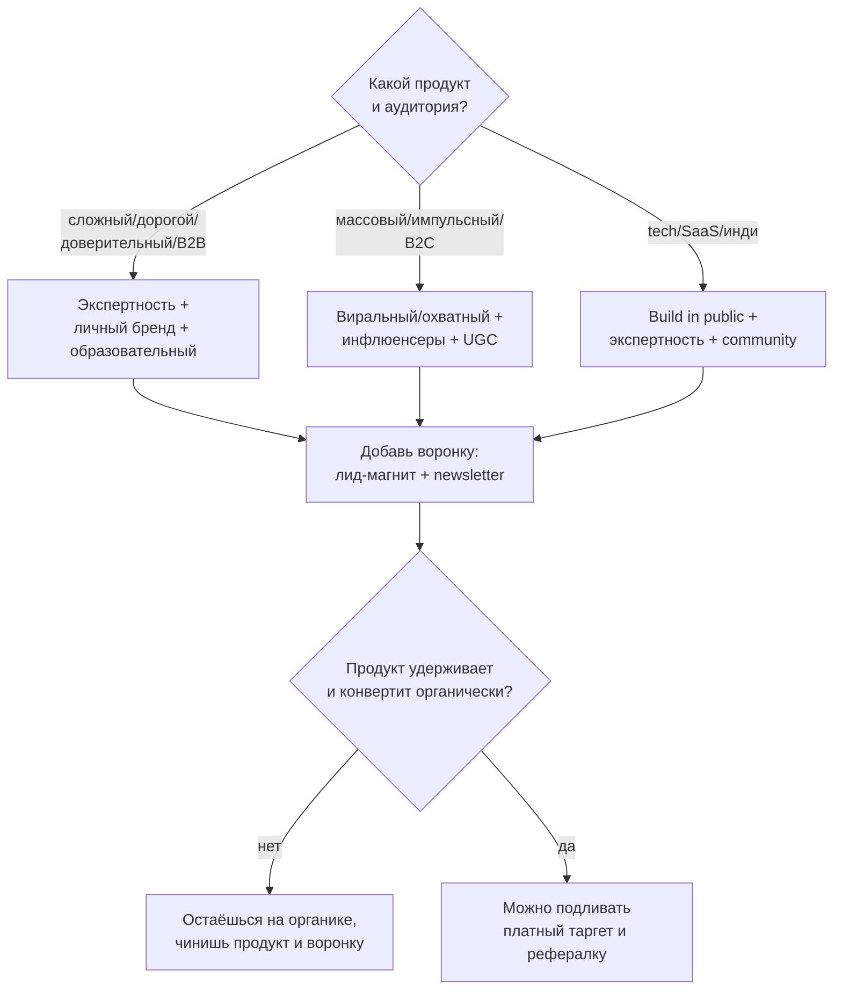
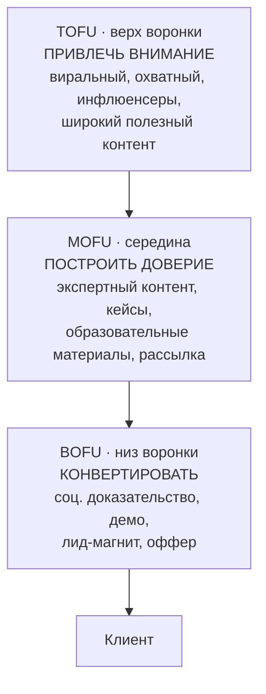

# Методичка: заход через экспертность и подходы к продвижению в соцсетях

> Справочник. Что такое «заход через экспертность», какие вообще есть способы привлекать и продвигать продукт в соцсетях, в чём сила и слабость каждого подхода, когда брать и когда нет. Чистое руководство — без привязки к конкретному проекту. Названия подходов даны с англоязычными терминами, как их называют в индустрии.

---

## 0. Как читать эту методичку

«Заход» (go-to-market через контент и соцсети) — это **способ, которым ты привлекаешь внимание и зарабатываешь доверие** аудитории, прежде чем что-то продать. Подход к заходу определяется тем, **чем именно** ты цепляешь:

- **экспертизой** — доказываешь, что глубоко разбираешься;
- **личностью** — людям интересен ты и твой путь;
- **сообществом** — люди приходят за принадлежностью и общением;
- **охватом** — ловишь массу через тренды и виральность;
- **чужим авторитетом** — заходишь через лидеров мнений;
- **деньгами** — покупаешь внимание через рекламу.

Большинство сильных стратегий — **комбинация** нескольких. Но почти всегда есть один ведущий подход. Дальше разбираем каждый.

**Ключевой принцип всех заходов:** внимание ≠ доверие ≠ продажа. Лайки и охваты сами по себе не приносят денег — между вниманием и клиентом всегда стоит **воронка** (см. §7). Подход, который даёт охват, но не строит доверие, — это половина работы.

---

## 1. Что такое «заход через экспертность»

**Суть.** Ты привлекаешь аудиторию не рекламой и не продажей в лоб, а **демонстрацией глубокой компетентности**. Делишься реально полезным — разборами, методами, ошибками, кейсами — и этим доказываешь, что разбираешься в теме. Доверие, которое возникает, со временем конвертируется в клиентов. Это направление называют по-разному: **thought leadership**, **expertise-led growth**, **authority marketing**, **expert-led content**.

**Логика работает по цепочке:**

**Почему это работает.** Люди покупают у тех, кому доверяют. Если ты раз за разом бесплатно показываешь компетентность, в момент покупки тебе уже не нужно убеждать — доверие построено заранее. Особенно сильно это для:

- **сложных и дорогих продуктов** (где решение требует понимания);
- **B2B** (где покупают рационально и проверяют экспертизу);
- **доверительных ниш** (финансы, здоровье, право, образование) — там компетентность продавца критична;
- **нишевых тем** с узкой, но платёжеспособной аудиторией.

**Кому подходит хуже.** Простым импульсным товарам массового спроса (там быстрее работает охват/реклама); продуктам, где у фаундера нет реальной экспертизы для демонстрации; ситуациям, где деньги нужны «вчера» (экспертный заход — небыстрый).

**Чем отличается от обычного контент-маркетинга.** Контент-маркетинг шире (любой полезный/развлекательный контент ради привлечения). Заход через экспертность — это его разновидность, где **акцент именно на демонстрации компетентности конкретного человека или бренда** как причины доверять и покупать.

### Плюсы

- **Высокое качество доверия** — приходят «прогретые», конверсия в клиента выше.
- **Дёшево по деньгам** — основная валюта здесь время и знания, а не рекламный бюджет (низкий CAC).
- **Долгосрочный актив** — хороший экспертный контент работает годами, накапливается.
- **Ценовая премия** — эксперту платят больше, чем безымянному продавцу.
- **Естественный ров** — личную репутацию и накопленный контент трудно скопировать.

### Минусы

- **Медленно** — авторитет строится месяцами и годами, не за неделю.
- **Требует реальной экспертизы** — фальшь в нише с профессионалами видна сразу.
- **Зависимость от человека** — если завязано на личность, бизнес сложно отделить от фаундера и продать/масштабировать.
- **Трудозатратно и постоянно** — нужно регулярно производить качественный контент; бросил — авторитет тускнеет.
- **Не гарантирует охват** — экспертность ≠ виральность; глубокий контент часто менее «вирусный», чем развлекательный.

### Метрики

Подписчики из целевой аудитории, вовлечённость по существу (осмысленные комментарии, сохранения, репосты), входящие обращения (inbound), упоминания/цитирование как эксперта, конверсия подписчик → лид → клиент.

---

## 2. Подходы к заходу и продвижению в соцсетях

Каждый подход — по единому формату: **суть · как работает · форматы · плюсы · минусы · когда брать · метрики**.

Условно их можно сгруппировать так:

---

### 2.1. Экспертный контент / Thought leadership

*(подробно разобран в §1 — здесь кратко как пункт каталога)*

- **Суть:** заход через демонстрацию компетентности.
- **Форматы:** разборы и аналитика, «как устроено», ошибки и уроки, кейсы, ответы на сложные вопросы, мнения по трендам отрасли.
- **Плюсы:** качественное доверие, низкий CAC, долгосрочный актив, ценовая премия.
- **Минусы:** медленно, нужна реальная экспертиза, завязка на человека.
- **Когда брать:** сложные/дорогие/доверительные продукты, B2B, нишевые темы.

---

### 2.2. Личный бренд основателя (Founder-led / Personal brand)

- **Суть:** продукт продвигается через **личность** основателя — его взгляды, путь, ценности, характер. Люди подписываются на человека, а покупают у его компании.
- **Как работает:** аудитория привязывается к личности → переносит доверие на продукт. Человеку сопереживают, за ним «следят».
- **Форматы:** личные истории, мнения, закулисье жизни/работы, ценности и принципы, рефлексия, общение с аудиторией.
- **Плюсы:** сильная эмоциональная связь и лояльность; человек заметнее и «теплее» бренда; быстрый отклик аудитории; органический охват (личное вовлекает лучше корпоративного).
- **Минусы:** **полная завязка на человека** — риск выгорания, репутационных рисков, невозможности «выйти» из бизнеса; личный бренд тяжело передать/продать; размывание границ личного и рабочего; уязвимость к хейту.
- **Когда брать:** фаундер готов быть публичным лицом; продукт выигрывает от «человеческого» доверия; ранняя стадия, когда у компании ещё нет своего бренда.
- **Метрики:** рост и вовлечённость личного аккаунта, охваты, переходы на продукт, доля «пришёл за фаундером».

> Часто **сочетается с экспертностью**: личный бренд эксперта — самая сильная связка для доверительных ниш (ты и компетентен, и тебе сопереживают).

---

### 2.3. Build in public (открытая разработка)

- **Суть:** ты **открыто показываешь процесс создания** продукта — решения, метрики, выручку, провалы, инсайты — в реальном времени.
- **Как работает:** прозрачность и честность вызывают доверие и вовлечение; люди «болеют» за твой путь и становятся ранними пользователями/адвокатами.
- **Форматы:** апдейты прогресса, разбор метрик и экспериментов, честные посты про провалы, «месяц в цифрах», вопросы к аудитории по продуктовым решениям.
- **Плюсы:** высокое доверие через прозрачность; бесплатная обратная связь и идеи; ранняя аудитория, готовая к запуску; отстройка (мало кто решается); особенно любимо tech/стартап-аудиторией.
- **Минусы:** **публичная уязвимость** — провалы видны всем; раскрытие может помочь конкурентам; давление «показывать рост»; работает в основном в tech/инди-нише, в массовых нишах слабее; легко скатиться в нарциссизм метрик.
- **Когда брать:** tech/SaaS/инди-продукты; уверенность в честной коммуникации; аудитория — фаундеры, разработчики, ранние последователи.
- **Метрики:** рост аудитории, вовлечённость в апдейты, waitlist/ранние регистрации, упоминания.

---

### 2.4. Образовательный контент-маркетинг (Educational content)

- **Суть:** привлекаешь через **обучение** — гайды, туториалы, инструкции, разъяснения, которые решают конкретные проблемы аудитории.
- **Как работает:** человек ищет решение проблемы → находит твой полезный материал → начинает доверять → узнаёт, что у тебя есть продукт под эту проблему.
- **Форматы:** пошаговые гайды, «как сделать X», объяснения сложного простым языком, чек-листы, шаблоны, обучающие видео/серии.
- **Плюсы:** широкая применимость; хорошо находится в поиске (SEO-эффект на статьях/видео); накапливается как актив; естественно ведёт к продукту («вот инструмент, который это делает за тебя»); масштабируется лучше, чем личный бренд.
- **Минусы:** трудозатратно производить качество; результат отложенный; конкуренция за внимание в популярных темах высока; полезный контент могут потреблять, но не покупать (если связь с продуктом слабая).
- **Когда брать:** продукт решает понятную проблему, которую люди гуглят/изучают; есть экспертиза, чтобы учить; среднесрочный/долгосрочный горизонт.
- **Метрики:** охват/просмотры обучающего контента, время потребления, сохранения, переходы в продукт, органический трафик.

---

### 2.5. Community-led (заход через сообщество)

- **Суть:** строишь **сообщество** вокруг темы/продукта — место, куда люди приходят за общением, поддержкой и принадлежностью, а не только за контентом.
- **Как работает:** участники вовлекаются друг с другом и с тобой → возникает лояльность и сетевой эффект → сообщество само привлекает новых и удерживает существующих.
- **Форматы:** чаты/группы (Telegram, Discord), обсуждения, совместные активности, прямые эфиры, поддержка участников, со-творчество.
- **Плюсы:** очень высокая лояльность и удержание; **сетевой эффект** (ценность растёт с числом участников) = сильный ров; участники сами создают контент и приводят новых; глубокая обратная связь.
- **Минусы:** **медленный и трудоёмкий** старт («проблема пустой комнаты» — мало кто хочет в пустое сообщество); требует постоянной модерации и энергии; тяжело монетизировать напрямую; токсичность/конфликты нужно гасить.
- **Когда брать:** тема, вокруг которой людям хочется объединяться; готовность вкладываться в модерацию долго; продукт, который выигрывает от лояльной базы.
- **Метрики:** активные участники, доля вовлечённых, удержание, контент от участников, рост через приглашения.

---

### 2.6. Виральный / охватный контент (Viral / reach-driven)

- **Суть:** заход через **массовый охват** — цепляющий, развлекательный, трендовый контент, который активно репостят и который ловит алгоритмы.
- **Как работает:** контент попадает в тренды/рекомендации → огромные охваты → часть аудитории конвертируется.
- **Форматы:** короткие видео (Reels/Shorts/TikTok), мемы, тренды и челленджи, эмоциональные/неожиданные форматы, «хуки» в первых секундах.
- **Плюсы:** потенциально **взрывной рост** и узнаваемость дёшево по деньгам; быстро (виральный пост может выстрелить за дни); расширяет верх воронки максимально широко.
- **Минусы:** **непредсказуемо** (виральность не гарантируешь и плохо повторяешь); охват ≠ целевая аудитория ≠ продажи (много «пустого» внимания); низкое качество доверия; зависимость от алгоритмов; легко получить лайки и ноль клиентов.
- **Когда брать:** массовый/импульсный продукт; B2C с широкой аудиторией; задача — узнаваемость и верх воронки.
- **Метрики:** охваты, виральный коэффициент (репосты), прирост подписчиков, **но обязательно** — конверсия охвата в целевое действие.

---

### 2.7. Социальное доказательство и UGC (Social proof / User-generated content)

- **Суть:** продвижение через **контент и отзывы самих пользователей** — кейсы, результаты, отзывы, обзоры, упоминания.
- **Как работает:** люди доверяют другим людям больше, чем бренду; чужой положительный опыт снимает сомнения и подталкивает к покупке.
- **Форматы:** отзывы и кейсы, результаты «до/после», обзоры от пользователей, репосты пользовательского контента, рейтинги.
- **Плюсы:** **высокое доверие** (независимый голос убедительнее самопохвалы); дёшево (контент создают пользователи); хорошо конвертирует тех, кто уже сомневается; масштабируется с ростом базы.
- **Минусы:** нужен **уже существующий** довольный пользователь (на старте брать неоткуда); качество и тональность не полностью контролируешь; негативные отзывы тоже публичны; накрутка/фейки убивают доверие мгновенно.
- **Когда брать:** есть пользователи и реальные результаты; продукт даёт измеримую/демонстрируемую пользу; стадия, когда нужно снимать возражения на покупке.
- **Метрики:** объём и качество UGC, конверсия на страницах с соц. доказательством, упоминания, NPS.

---

### 2.8. Коллаборации с лидерами мнений (Influencer / Creator marketing)

- **Суть:** заход через **чужую** аудиторию и авторитет — блогеров, экспертов, креаторов в твоей нише.
- **Как работает:** инфлюенсер рекомендует/показывает продукт → переносит часть своего доверия и охвата на тебя.
- **Форматы:** обзоры, интеграции, совместный контент, амбассадорство, гостевые эфиры/подкасты.
- **Плюсы:** **быстрый доступ** к готовой целевой аудитории; заимствованное доверие; масштабируемо (много инфлюенсеров); хорошо для запусков.
- **Минусы:** может быть **дорого** (особенно крупные блогеры); эффект разовый, если не системно; риск несовпадения аудитории/ценностей; сложно измерять отдачу; зависимость от чужой репутации (его скандал бьёт по тебе).
- **Когда брать:** есть бюджет или продукт для бартера; в нише есть релевантные креаторы с твоей аудиторией; нужен быстрый охват целевой публики.
- **Метрики:** охват и переходы с интеграций, промокоды/UTM-конверсия, CAC по каналу, совпадение аудитории.

---

### 2.9. Реферальные и амбассадорские программы (Referral / Ambassador)

- **Суть:** существующие пользователи **приводят новых** — за вознаграждение или из лояльности.
- **Как работает:** довольный пользователь рекомендует знакомым → рекомендация от «своего» конвертит лучше рекламы → встроенный механизм роста.
- **Форматы:** реферальные ссылки и бонусы, программы «приведи друга», амбассадорские статусы, партнёрские проценты.
- **Плюсы:** низкий CAC; высокое доверие (рекомендация от знакомого); **виральная петля** роста; приводит похожую (целевую) аудиторию.
- **Минусы:** работает только при **реально хорошем продукте** (плохой не рекомендуют); требует продуманной механики/вознаграждения; риск накруток и «охотников за бонусами»; на старте нет базы для рекомендаций.
- **Когда брать:** есть лояльная база и продукт, которым делятся; продукт с понятной выгодой от приглашения; стадия масштабирования.
- **Метрики:** доля привлечённых по реферальной программе, виральный коэффициент, CAC реферала, активация приглашённых.

---

### 2.10. Платное продвижение (Paid social / таргет)

- **Суть:** **покупаешь** внимание — таргетированная реклама в соцсетях.
- **Как работает:** платишь за показы/клики целевой аудитории → быстрый управляемый трафик.
- **Форматы:** таргет по интересам/аудиториям, продвижение постов, ретаргетинг, lookalike-аудитории.
- **Плюсы:** **быстро и предсказуемо**; полностью управляемый объём (включил — пошёл трафик); точное таргетирование; легко тестировать гипотезы и масштабировать то, что работает.
- **Минусы:** **стоит денег постоянно** (выключил бюджет — пропал трафик, в отличие от органики); CAC может превысить LTV → убыточность; «рекламная слепота»; зависимость от платформ и их правил; **опасно лить в продукт без удержания** (платный трафик в дырявое ведро = сжигание денег).
- **Когда брать:** unit-экономика уже здорова (LTV/CAC ≥ 3); нужен быстрый управляемый рост; есть что масштабировать (работающая воронка).
- **Метрики:** CAC, ROAS (возврат на рекламу), CTR, конверсия, payback, LTV/CAC по каналу.

> **Правило:** платный трафик **усиливает** работающую воронку, но не создаёт её. Сначала органически докажи, что продукт удерживает и конвертит, потом подливай платно.

---

### 2.11. Newsletter-first (заход через рассылку)

- **Суть:** ядро аудитории строишь в **email-рассылке** (или близком формате), а соцсети используешь как воронку в неё.
- **Как работает:** соцсети дают охват → ведёшь в рассылку → там глубокий контент и прямой контакт без алгоритмов-посредников.
- **Форматы:** регулярный дайджест, экспертные письма, разборы, эксклюзив для подписчиков.
- **Плюсы:** **владеешь каналом** (база подписчиков твоя, не зависишь от алгоритмов соцсети); высокая вовлечённость (письмо приходит лично); хорошо конвертирует; долгосрочный актив.
- **Минусы:** медленный рост базы; нужна дисциплина регулярности; доставляемость и отписки; «соцсети → почта» — лишний шаг, часть аудитории теряется.
- **Когда брать:** контент-ориентированный заход (экспертный/образовательный); хочешь независимость от платформ; длинный горизонт.
- **Метрики:** рост базы, open rate, click rate, конверсия подписчик → клиент, отписки.

---

### 2.12. Лид-магниты и контент-воронки (Lead magnets / funnels)

- **Суть:** не отдельный «заход», а **связующий механизм** — обмен полезного бесплатного материала на контакт/подписку, и дальнейшее «прогревание» до покупки.
- **Как работает:** ценный бесплатный материал (гайд, шаблон, мини-курс) → человек оставляет контакт → серия касаний прогревает → продажа.
- **Форматы:** бесплатные гайды/чек-листы/шаблоны за подписку, вебинары, мини-курсы, демо.
- **Плюсы:** превращает анонимный охват в **управляемый контакт**; систематизирует путь к продаже; хорошо измеряется; усиливает любой контентный заход.
- **Минусы:** нужен реально ценный лид-магнит (плохой не сработает); требует выстроенной воронки/прогрева; «халявщики», которые берут бесплатное и не покупают.
- **Когда брать:** почти всегда как **дополнение** к экспертному/образовательному/виральному заходу — чтобы охват не утекал впустую.
- **Метрики:** конверсия в лид, стоимость лида, конверсия лид → клиент, качество лида.

---

## 3. Форматы и площадки

Где какой заход обычно сильнее (ориентир, не догма):

| Площадка | Сильные форматы | Под какой заход |
|---|---|---|
| **Telegram** | каналы, чаты, лонгриды, сообщества | экспертность, community, личный бренд, newsletter |
| **YouTube** | длинные видео, туториалы, разборы | образовательный, экспертность, личный бренд |
| **X / Twitter** | короткие мысли, треды, метрики | build in public, экспертность, tech-личный бренд |
| **LinkedIn** | профессиональные посты, кейсы | B2B-экспертность, thought leadership, личный бренд |
| **Instagram** | визуал, Reels, сторис | личный бренд, виральный, UGC, B2C |
| **TikTok / Shorts** | короткие видео, тренды | виральный/охватный, массовый B2C |
| **VC.ru / Habr** *(RU tech/бизнес)* | статьи, кейсы, разборы | экспертность, образовательный, build in public |

**Принцип:** не распыляйся на все площадки сразу. Выбери **1–2**, где живёт твоя аудитория и где твой формат силён, и веди их системно. Лучше один канал хорошо, чем пять плохо.

---

## 4. Сравнительная матрица подходов

| Подход | Скорость результата | Стоимость (деньги) | Долгосрочность/актив | Качество доверия | Сложность |
|---|---|---|---|---|---|
| Экспертность | медленно | низкая | **высокая** | **высокое** | средняя |
| Личный бренд | средне | низкая | средняя* | высокое | средняя |
| Build in public | средне | низкая | средняя | высокое | средняя |
| Образовательный | медленно | низкая | **высокая** | высокое | средняя |
| Community | **медленно** | низкая | **высокая** (сеть) | **высокое** | **высокая** |
| Виральный/охват | **быстро** | низкая | низкая | низкое | средняя |
| UGC/соц. доказательство | средне | низкая | средняя | **высокое** | низкая** |
| Инфлюенсеры | быстро | **высокая** | низкая | средне-высокое | средняя |
| Рефералы | средне | низкая | средняя | высокое | средняя |
| Платный таргет | **быстро** | **высокая** | низкая (выключил — пропал) | низкое | средняя |
| Newsletter | медленно | низкая | **высокая** (свой канал) | высокое | средняя |
| Лид-магниты/воронки | средне | низкая | средняя | — (усилитель) | средняя |

\* зависит от того, отделён ли бренд от личности.
\*\* низкая сложность производства, но нужна готовая база пользователей.

Читается так: **быстрые заходы** (виральный, инфлюенсеры, платный) обычно дают **слабое доверие и не накапливаются**; **медленные органические** (экспертность, образовательный, community) дают **сильное доверие и долгосрочный актив**. Это тот же фундаментальный размен «скорость против устойчивости».

---

## 5. Как выбрать подход

**Принципы выбора:**

1. **Иди туда, где доверие важнее охвата → экспертные/контентные заходы.** Где важнее охват → виральные/платные.
2. **На старте — органика.** Платное и инфлюенсеров подключай, когда продукт доказал, что удерживает.
3. **Один ведущий подход + воронка.** Выбери главный заход, обязательно дострой к нему лид-магнит/воронку, чтобы охват не утекал.
4. **1–2 площадки, системно.** Регулярность бьёт разовые вспышки.
5. **Комбинируй осознанно.** Экспертность + личный бренд + воронка — классическая сильная связка для доверительных ниш.

---

## 6. Типичные ошибки

| Ошибка | В чём она | Как не попасть |
|---|---|---|
| **Экспертность → самолюбование** | контент про «какой я молодец», а не про пользу аудитории | каждый пост отвечает: что человек отсюда унесёт? |
| **Продажа в лоб без доверия** | давишь «купи» до того, как построил доверие | сначала польза и доверие, продажа — следствие |
| **Непостоянство** | начал, выгорел, бросил через месяц | реалистичный ритм, который выдержишь долго |
| **Охват ради охвата** | гонишься за лайками, забыв про конверсию | меряй не охват, а лиды/клиентов из него |
| **Один канал/один инфлюенсер** | весь рост на одной площадке или одном блогере | диверсификация источников |
| **Контент без воронки** | лайки есть, контактов и продаж нет | дострой лид-магнит и путь к продукту |
| **Платный трафик в дырявое ведро** | льёшь рекламу в продукт без удержания | сначала retention, потом платный трафик |
| **Имитация экспертизы** | учишь тому, в чём сам не разбираешься | в нишах с профи фальшь видна — учи только реальному |
| **Распыление на все площадки** | пять каналов по чуть-чуть, везде слабо | 1–2 канала, но хорошо |

---

## 7. Воронка контента: как заход превращается в клиента

Любой заход работает только если выстроен путь от внимания к покупке. Классическая модель — три уровня:

- **TOFU (Top of Funnel)** — задача привлечь максимум целевого внимания. Здесь сильны охватные и виральные заходы.
- **MOFU (Middle)** — задача превратить внимание в доверие. Здесь работает экспертность и образовательный контент.
- **BOFU (Bottom)** — задача снять последние сомнения и довести до покупки. Здесь — соц. доказательство, кейсы, лид-магнит, оффер.

**Вывод:** разные заходы закрывают разные этапы воронки. Экспертность сильна в середине (доверие), виральность — наверху (охват), соц. доказательство — внизу (конверсия). Сильная стратегия осознанно собирает воронку из подходящих заходов, а не делает один и ждёт продаж.

---

## 8. Чек-лист запуска экспертного захода

1. Определил **узкую тему/нишу**, в которой реально компетентен?
2. Знаешь свою **целевую аудиторию** и её боли?
3. Выбрал **1–2 площадки**, где эта аудитория живёт?
4. Каждый материал отвечает: **что аудитория отсюда унесёт**?
5. Есть **реалистичный ритм** публикаций, который выдержишь месяцами?
6. Построен **лид-магнит** (полезное в обмен на контакт)?
7. Выстроена **воронка** от контента к продукту?
8. Меряешь не лайки, а **подписчик → лид → клиент**?
9. Контент демонстрирует **компетентность**, а не самолюбование?
10. Готов к тому, что **первые результаты — через месяцы**, не недели?

---

## 9. Глоссарий

| Термин | Расшифровка |
|---|---|
| **Thought leadership** | заход через демонстрацию экспертности и формирование мнения в отрасли |
| **Founder-led marketing** | продвижение через личность основателя |
| **Build in public** | открытая разработка — публичный показ процесса, метрик, провалов |
| **Content marketing** | привлечение через полезный/ценный контент |
| **Community-led growth** | рост через построение сообщества |
| **UGC** (User-Generated Content) | контент, созданный самими пользователями |
| **Social proof** | социальное доказательство — отзывы, кейсы, рейтинги |
| **Influencer marketing** | продвижение через лидеров мнений |
| **Lead magnet** | бесплатный полезный материал в обмен на контакт |
| **Funnel** (воронка) | путь аудитории от внимания к покупке |
| **TOFU / MOFU / BOFU** | верх / середина / низ воронки |
| **CAC** | стоимость привлечения клиента |
| **LTV** | пожизненная ценность клиента |
| **ROAS** | возврат на рекламные расходы |
| **CTR** | кликабельность (доля кликов к показам) |
| **Inbound** | входящие обращения (когда клиент приходит сам) |
| **Виральный коэффициент** | сколько новых людей приводит один пользователь через репосты/приглашения |

---

> **Одной строкой:** «заход через экспертность» — это привлечение через доказанную компетентность вместо рекламы: медленно, но даёт самое качественное доверие, низкий CAC и долгосрочный актив; остальные заходы (виральный, инфлюенсеры, платный) быстрее, но дают слабое доверие и не накапливаются — поэтому сильная стратегия выбирает один ведущий заход под свой тип продукта и обязательно достраивает к нему воронку, иначе внимание утекает впустую.
