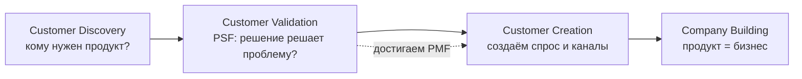
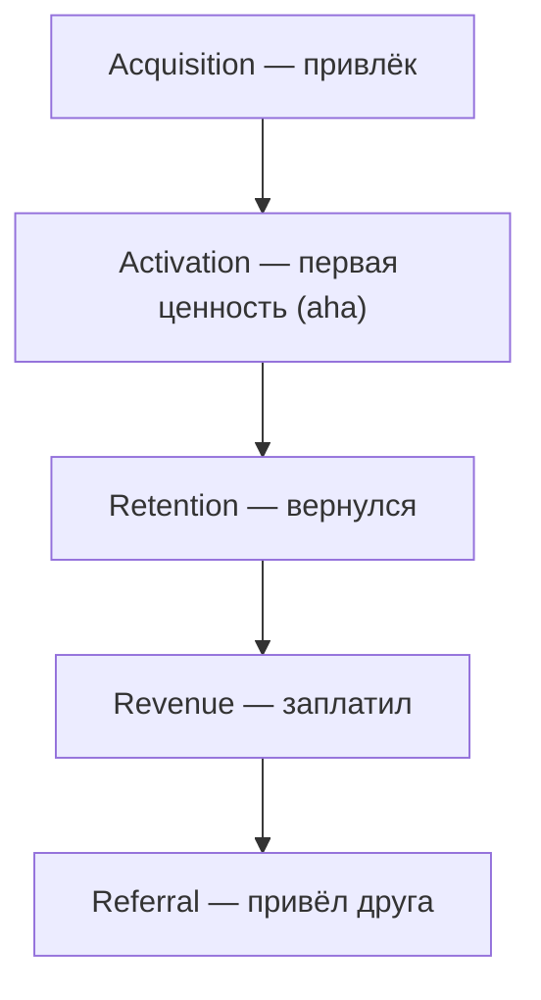

# Справочник: анализ для стартапов и бизнеса

> Карта всей территории — что анализируют стартапы, начинающие бизнесы и корпорации, на каждой стадии. Для каждого инструмента: **что это · когда применять · что даёт**. В конце — связка с тем, что мы реально сделали по FINPILOT, и список книг для углубления.

---

## Как этим пользоваться (3 принципа)

1. **Три главных вопроса.** Любой анализ отвечает на один из трёх:
   - **Desirability** — это хотят? (проблема реальна, решение нужно, вернутся и заплатят)
   - **Viability** — это выгодно? (рынок, экономика, каналы)
   - **Feasibility** — мы это можем? (продукт, команда, юр, деньги)
2. **Сначала самое рискованное.** Не анализируй всё подряд. Найди допущение, на котором держится всё, и проверь его первым. Падает оно — падает бизнес.
3. **Анализ ≠ запуск.** Часть вопросов (вернутся ли, заплатят ли реально) **нельзя посчитать за столом — только проверить запуском.** Анализ — чтобы не строить ненужное; но переанализ = ловушка. Анализируй до решения, дальше — действуй.

---

## Жизненный цикл стартапа (спина всего)



| Стадия | Главный вопрос | Ключевая веха |
|---|---|---|
| Customer Discovery | Кому и зачем нужен продукт? | Problem-Solution Fit (PSF) |
| Customer Validation | Решение реально решает проблему, платят? | **Product-Market Fit (PMF)** |
| Customer Creation | Как создать спрос и масштабировать каналы? | Повторяемый рост |
| Company Building | Как превратить в устойчивый бизнес? | Прибыльность / масштаб |

Источник модели: Steve Blank, *The Four Steps to the Epiphany* / Customer Development.

---

## Часть 1. Клиент и проблема (ранняя стадия, Desirability)

Сначала проверяют не продукт, а **проблему**. Самая частая причина смерти — «нет спроса» (35% по CB Insights). Поэтому:

| Инструмент | Что это | Когда / что даёт |
|---|---|---|
| **Customer Development (CustDev)** | Глубинные интервью с потенциальными клиентами до разработки | Понять реальные боли; снизить риск построить ненужное |
| **The Mom Test** | Техника интервью без наводящих вопросов (спрашивай про прошлое поведение, не про «нравится ли идея») | Получить честные данные, а не вежливое «да» |
| **JTBD (Jobs To Be Done)** | Продукт «нанимают» на работу: какую задачу клиент решает | Сформулировать ценность через работу, а не через фичи |
| **Persona / ICP** | Портрет идеального клиента (Ideal Customer Profile) | Кому продавать в первую очередь; фокус |
| **Value Proposition Canvas** | Сопоставление «боли/выгоды клиента» ↔ «обезболивающие/выгоды продукта» | Проверить, что продукт реально бьёт в боль |
| **Problem-Solution Fit (PSF)** | Подтверждение, что твоё решение решает выявленную проблему | Зелёный свет на MVP |

Источники: Steve Blank, Rob Fitzpatrick (*The Mom Test*), Clayton Christensen / Tony Ulwick (JTBD), Alexander Osterwalder (*Value Proposition Design*).

---

## Часть 2. Анализ рынка (Viability)

Отвечает: достаточно ли большой рынок, чтобы вообще стоило.

### Размер рынка — TAM / SAM / SOM

| Слой | Что | Как считать |
|---|---|---|
| **TAM** (Total Addressable) | весь рынок, если охватить 100% | кол-во клиентов × средний годовой чек |
| **SAM** (Serviceable Available) | часть TAM, доступная твоей модели/гео | TAM × % охвата × % готовых платить |
| **SOM** (Serviceable Obtainable) | реально достижимая доля | SAM × целевая доля (1–15%) |

Два метода сайзинга:
- **Top-down** — от большого рынка вниз (отчёты, статистика). Быстро, но грубо.
- **Bottom-up** — снизу: пользователи × конверсия × чек. Честнее, защищаемее. **Предпочтительный.**
- **Value theory** — от ценности, которую создаёшь (сколько клиент готов платить за выгоду).

### Остальные инструменты рынка

| Инструмент | Что даёт |
|---|---|
| **CAGR** (Compound Annual Growth Rate) | темп роста рынка — растёт ли он |
| **Сегментация рынка** | деление на группы по нуждам/гео/поведению |
| **Beachhead / плацдарм** | узкий первый сегмент, где побеждаешь, потом расширяешься (Geoffrey Moore, *Crossing the Chasm*) |
| **PESTEL** | макро-факторы: Political, Economic, Social, Technological, Environmental, Legal |
| **Анализ трендов** | куда движется рынок, окна возможностей |

---

## Часть 3. Конкуренция и защищённость

| Инструмент | Что это | Что даёт |
|---|---|---|
| **Карта конкурентов** | прямые / косвенные / субституты | кто ещё делает «работу» клиента |
| **Матрица фич** | сравнение по ключевым параметрам | где ты сильнее/слабее |
| **Карта позиционирования** | 2 оси (напр. цена × качество), точки игроков | где свободное место |
| **JTBD «найм/увольнение»** | почему наймут тебя и уволят конкурента | дифференциатор глазами клиента |
| **Porter's Five Forces** | 5 сил: конкуренты, новые игроки, субституты, власть поставщиков, власть покупателей | привлекательность отрасли |
| **Moats / 7 Powers** | источники защищённости: эффект масштаба, сетевой эффект, counter-positioning, switching costs, бренд, уникальный ресурс, процессная сила | есть ли ров и какой |
| **SWOT** | Strengths/Weaknesses/Opportunities/Threats | свод сильных/слабых сторон и угроз |

Источники: Michael Porter (Five Forces), Hamilton Helmer (*7 Powers*).

---

## Часть 4. Продукт и развитие

| Инструмент | Что это | Когда / что даёт |
|---|---|---|
| **MVP** (Minimum Viable Product) | минимальная версия, отражающая ядро ценности, которую можно отдать пользователям | проверить гипотезу дёшево (Eric Ries, *The Lean Startup*) |
| **Build-Measure-Learn** | цикл: собрал → измерил → сделал вывод | итеративное развитие на данных |
| **CJM** (Customer Journey Map) | путь пользователя по шагам (касания, эмоции, барьеры) | найти, где отваливаются |
| **PMF** (Product-Market Fit) | продукт удовлетворяет рынок, люди активно юзают и платят | главная веха раннего стартапа |
| **Sean Ellis Test** | опрос: «насколько расстроишься, если продукт исчезнет?» — **≥ 40% «очень»** = есть PMF | измеримый сигнал PMF |
| **North Star Metric** | одна метрика, отражающая ценность для пользователя | фокус всей команды |


### Приоритизация фич (что делать первым)

| Метод | Суть |
|---|---|
| **RICE** | Reach × Impact × Confidence ÷ Effort — балл приоритета |
| **MoSCoW** | Must / Should / Could / Won't have |
| **Kano** | базовые / линейные / «вау»-фичи — что реально радует |
| **Value vs Effort** | матрица 2×2: быстрые победы vs большие ставки |

---

## Часть 5. Бизнес-модель и монетизация

| Инструмент | Что это |
|---|---|
| **Business Model Canvas** | 9 блоков: сегменты, ценность, каналы, отношения, потоки доходов, ресурсы, активности, партнёры, издержки (Osterwalder) |
| **Lean Canvas** | версия BMC для стартапов: проблема, решение, метрики, нечестное преимущество (Ash Maurya, *Running Lean*) |
| **Revenue models** | подписка, freemium, транзакции, маркетплейс (комиссия), реклама, лицензия, usage-based; B2C / B2B / B2B2C |

### Ценообразование

| Подход | Суть |
|---|---|
| Cost-plus | себестоимость + наценка |
| Value-based | от ценности для клиента (лучший для софта) |
| Competitor-based | от цен конкурентов |
| **Van Westendorp** | опрос о ценовой чувствительности (4 вопроса) → коридор приемлемых цен |

---

## Часть 6. Юнит-экономика и финансы

Сердце Viability. Проверяет: зарабатываешь ли ты на одном клиенте больше, чем тратишь на него.

### Базовые формулы

```
CAC   = маркетинговые расходы / число привлечённых клиентов
ARPPU = средняя выручка на 1 платящего клиента (за период)
COGS  = переменные расходы на обслуживание клиента
CL    = средний срок жизни клиента  (= 1 / churn rate)
LTV   = ARPPU × CL

Вердикт:
  LTV < (CAC + COGS)  → нет смысла (тратишь больше, чем зарабатываешь)
  LTV = (CAC + COGS)  → работа ради работы
  LTV > (CAC + COGS)  → экономика положительная, можно масштабировать
Здоровый ориентир: LTV / CAC ≥ 3,  payback CAC < 12 мес.
```

### Метрики и инструменты

| Инструмент | Что даёт |
|---|---|
| **AARRR (pirate metrics)** | воронка: Acquisition → Activation → Retention → Revenue → Referral (Dave McClure) |
| **Cohort analysis** | поведение групп по времени регистрации — реальный retention |
| **Retention / churn curve** | сколько остаётся со временем; плато = есть стержневая ценность |
| **Contribution margin** | маржа после переменных затрат на единицу |
| **Burn rate / runway** | сколько жжёшь в мес / на сколько хватит денег |
| **Break-even** | точка безубыточности |
| **MRR / ARR** | месячная / годовая повторяющаяся выручка (для подписки) |
| **NRR** (Net Revenue Retention) | рост выручки на существующих клиентах (>100% = здорово) |
| **Финмодель / P&L** | прогноз доходов/расходов/прибыли |



---

## Часть 7. Go-to-market и рост

| Инструмент | Что это / что даёт |
|---|---|
| **GTM-стратегия** | как выходишь на рынок: сегмент, оффер, каналы, цена |
| **Bullseye / 19 каналов** | перебор каналов трекшена, фокус на 1–2 рабочих (Weinberg & Mares, *Traction*) |
| **CAC по каналам** | какой канал даёт клиента дешевле |
| **Воронка vs growth loop** | линейная воронка против самоподдерживающейся петли (контент/виральность/реферал) |
| **k-factor** | сколько новых юзеров приводит один (виральность) |
| **PLG vs Sales-led** | рост через продукт (self-serve) vs через продажи (B2B-пайплайн) |
| **Позиционирование / messaging** | как объяснить, чем ты лучше и для кого (April Dunford, *Obviously Awesome*) |

---

## Часть 8. Валидация и эксперименты

Дешёвые способы проверить гипотезу до полной разработки:

| Метод | Что это |
|---|---|
| **Hypothesis-driven** | формулируешь гипотезу + метрику успеха, проверяешь самую рискованную первой |
| **A/B-тест** | две версии, сравниваешь конверсию |
| **Smoke / fake-door test** | кнопка/лендинг «продукта», которого ещё нет — мерим спрос |
| **Landing page test** | страница + форма/предзаказ до продукта |
| **Concierge MVP** | делаешь работу руками для первых клиентов (без автоматизации) |
| **Wizard of Oz** | пользователь думает, что это автомат, а внутри человек |
| **Leading vs lagging** | опережающие (поведение сейчас) vs запаздывающие (выручка потом) индикаторы |

---

## Часть 9. Риск, юр, команда (скучное — но именно оно убивает)

| Область | Что проверяют |
|---|---|
| **Юр / регуляторка** | лицензии, соответствие; в РФ для финданных — **152-ФЗ** (персональные данные); грань с финсоветами/инвестрекомендациями |
| **Данные / безопасность** | хранение, шифрование, утечки, согласия |
| **Risk register** | список рисков × вероятность × влияние × митигация |
| **Команда / орг** | кто, роли, пробелы в компетенциях (частая причина смерти — «не та команда») |
| **Деньги / фандрейзинг** | гранты (напр. «Студенческий стартап»), инвестиции, runway |
| **IP** | интеллектуальная собственность, кто владеет кодом |

---

## Часть 10. Стратегические фреймворки (что регулярно делают большие компании)

Те же базовые (SWOT, PESTEL, Five Forces) + корпоративный арсенал:

| Фреймворк | Для чего |
|---|---|
| **BCG-матрица** | портфель продуктов: звёзды / дойные коровы / трудные дети / собаки |
| **Ansoff-матрица** | рост: проникновение / развитие рынка / развитие продукта / диверсификация |
| **Value Chain (Porter)** | анализ цепочки создания стоимости, где маржа и где резать |
| **VRIO** | ресурс ценный/редкий/неповторимый/организованный = устойчивое преимущество |
| **OKR** | Objectives & Key Results — цели и измеримые результаты (Andy Grove / John Doerr) |
| **Blue Ocean** | уйти от конкуренции, создав новый рынок (Kim & Mauborgne) |
| **Balanced Scorecard** | метрики по 4 перспективам: финансы, клиенты, процессы, обучение |
| **Scenario planning** | проигрывание нескольких вариантов будущего |
| **Benchmarking** | сравнение с лучшими в отрасли |

---

## Часть 11. Что мы реально сделали по FINPILOT (связка)

| Анализ | Статус |
|---|---|
| Рынок TAM / SAM / SOM | ✅ (bottom-up) |
| Юнит-экономика (LTV/CAC/COGS) | ✅ |
| JTBD / конкуренты / найм-увольнение | ✅ |
| Позиционирование (советник, не трекер) | ✅ |
| Бизнес-модели B2C / B2B / гибрид + оценка | ✅ |
| GTM-плейбук + воронка + retention-дизайн | ✅ |
| MVP (продукт v2.0.2) | ✅ существует |
| Валидация спросом (опрос 385 чел) | ✅ направленно |
| **PMF-тест на живых юзерах** | 🔴 только запуском |
| **Юр / 152-ФЗ / данные** | 🔴 не проверяли |
| **Деньги / гранты** | 🔴 не смотрели |
| **Живые эксперименты (smoke/A-B/retention)** | 🔴 впереди |

Вывод: **аналитический контур закрыт почти полностью.** Красное — это не «доанализировать», а «проверить запуском» и «закрыть скучное (юр/деньги)».

---

## Быстрый чеклист: что когда применять

| Стадия | Применяй |
|---|---|
| Есть идея, нет валидации | CustDev, The Mom Test, JTBD, Persona, PSF |
| Оцениваешь рынок | TAM/SAM/SOM, PESTEL, beachhead, CAGR |
| Изучаешь конкурентов | карта конкурентов, Five Forces, 7 Powers, позиционирование |
| Строишь продукт | MVP, Build-Measure-Learn, CJM, приоритизация (RICE/Kano) |
| Проектируешь бизнес | Lean Canvas, BMC, revenue model, pricing |
| Считаешь деньги | юнит-экономика, AARRR, cohort, runway, финмодель |
| Выходишь на рынок | GTM, каналы (Bullseye), позиционирование |
| Проверяешь дёшево | smoke-test, A/B, concierge/Wizard-of-Oz MVP |
| Масштабируешься | OKR, growth loops, NRR, BCG/Ansoff |

---

## Книги для углубления

- Eric Ries — *The Lean Startup* (MVP, Build-Measure-Learn)
- Steve Blank — *The Four Steps to the Epiphany* (Customer Development)
- Ash Maurya — *Running Lean* (Lean Canvas)
- Alexander Osterwalder — *Business Model Generation*, *Value Proposition Design*
- Rob Fitzpatrick — *The Mom Test* (интервью)
- Bill Aulet — *Disciplined Entrepreneurship* (24 шага, MIT-подход)
- Geoffrey Moore — *Crossing the Chasm* (плацдарм, выход на массовый рынок)
- Gabriel Weinberg & Justin Mares — *Traction* (каналы роста)
- Hamilton Helmer — *7 Powers* (защищённость)
- April Dunford — *Obviously Awesome* (позиционирование)
- Michael Porter — *Competitive Strategy* (Five Forces, value chain)
- John Doerr — *Measure What Matters* (OKR)

---

*Это карта, а не учебник. Глубину бери из книг по нужному инструменту. Но помни принцип №3: в какой-то момент анализ заканчивается, и начинается запуск — именно там лежит правда, которую ни одна таблица не покажет.*
