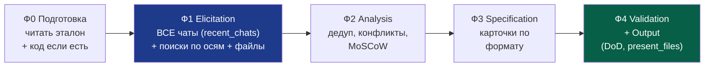

# ⚙️ SOP — Сборка реестра требований FINPILOT (под новую версию)

> **Назначение.** Операционный регламент для Claude: как механически собрать полный реестр требований для очередной версии FINPILOT — без уточняющих диалогов. Кидаешь промпт-триггер (раздел 9) → Claude проходит весь алгоритм сам.
>
> **Это инструкция для исполнителя (Claude), а не теория.** Теория формата — в `SRS_Requirements_Specification_Guide.md`. Эталон результата — в `FINPILOT_Requirements_v-next.md` (делать в точности как там).
>
> **Принцип.** Рутина, а не обсуждение. Все решения уже приняты и зашиты ниже. Вопросы пользователю — только если данных физически нет (см. раздел 8).

---

## 0. Когда применять

Пользователь просит собрать / обновить требования (ТЗ, реестр, спецификацию, список «что менять») для новой версии FINPILOT. Триггерные слова: «реестр требований», «ТЗ на версию», «что менять в v…», «собери требования».

---

## 1. Вход и зашитые дефолты (НЕ спрашивать)

**Вход от пользователя:** номер целевой версии (например `v2.1.0` или `v-next`). Опционально — фокус («только баги», «только explainability») или дополнения.

**Дефолты — применять молча, без переспроса:**

| Параметр | Зашитое значение |
|----------|------------------|
| **Scope чатов** | Все чаты **внутри проекта FINPILOT** |
| **Окно по времени** | За всё время проекта |
| **Глубина** | Максимальная: полные карточки + предлагаемая реализация для технических пунктов |
| **Источник истины** | Код (`app/core/`, `app/services/`) + `Математическая_модель_v2_0_2.md`. Текст ВКР — вторичен, расхождения идут в DOC-требования |
| **Формат вывода** | `.md` в `/mnt/user-data/outputs/`, затем `present_files` |
| **Язык** | Русский текст, английские технические термины/ID |
| **Статус результата** | Черновой baseline (проход 1) под ревью пользователя |

> Если пользователь в промпте переопределил что-то из этого — его значение приоритетнее. Иначе — молча берёшь дефолт.

---

## 2. Артефакты-опоры (прочитать перед стартом)

1. **`FINPILOT_Requirements_v-next.md`** — эталон формата и глубины. Структура нового реестра = его структура. Если доступен в проекте/контексте — открыть и копировать стиль карточек, разделов, матрицы.
2. **`SRS_Requirements_Specification_Guide.md`** — методичка (карточка требования, EARS, MoSCoW, KEEP/REFACTOR). Опора по правилам оформления.
3. **Код проекта** (если приложен `.zip` или есть в контексте) — для проверки «что уже реализовано» и актуального состояния. Если кода нет — опираться на `v2.0.2` + предыдущий реестр.

---

## 3. Алгоритм (5 фаз)



### Фаза 0 — Подготовка
- Открыть эталон `FINPILOT_Requirements_v-next.md` (формат).
- Если приложен код — распаковать, бегло свериться с состоянием модулей `core/`, `services/`, `database/`, `requirements.txt`, `main.py`.

### Фаза 1 — ELICITATION (максимальный охват)

Сбор ведётся в три прохода: сначала перечисляются **все** чаты проекта, затем по каждой оси прогоняется поиск, затем добираются файлы. Цель — верхняя граница охвата, доступная инструментами.

**Шаг 1.1 — Перечислить ВСЕ чаты проекта (`recent_chats`, пагинация).**
Пройти всю историю проекта окно за окном: `recent_chats` с `n=20`, листать через `before=<самый ранний updated_at из прошлой пачки>`, до исчерпания истории (ориентир — до ~5 вызовов; если не хватило, отметить, что охват неполный). Получить полный перечень чатов проекта как факт их существования. Из выдержек уже выцепить очевидные темы для прицельных поисков на шаге 1.2.

> ⚠️ **Честная граница инструмента (не обещать большего).** `recent_chats` и `conversation_search` возвращают **выдержки/фрагменты**, а не дословный транскрипт каждого чата от первого до последнего сообщения. Полное пословное прочтение возможно **только для файлов** проекта. Поэтому: чаты — максимально широкий обход поиском; гарантия пословной полноты — только по файлам; страховка от пропусков — проход 2 (раздел 13). В финальном сообщении это указать прямо, не выдавать «обошёл всё» за «прочитал всё дословно».

**Шаг 1.2 — Прицельные поиски по фиксированным осям (`conversation_search`).**
Прогнать **все** оси, даже если по некоторым пусто. Запросы-заготовки:

| Ось | `conversation_search` запрос |
|-----|------------------------------|
| Объяснимость/XAI | `explainability XAI объяснимость рекомендации plain language черный ящик` |
| Баги | `BUG баги дубликат удаление сбережений восстановление дохода расхода` |
| Расхождения код/ВКР | `расхождения код ВКР Rt формула Monte Carlo доверительный интервал веса профилей` |
| Профили/эталоны | `профили эталоны рассинхрон 6 портретов с вычислениями stale демо-данные` |
| Терминология | `терминология Lt BLR ликвидность словарь определения` |
| Продуктовые фичи | `рекомендации доработка продукта опрос WTP готовность платить фичи онбординг` |
| Стратегия/тактика | `90 дней план activation retention paywall B2B метрики аналитика` |
| Инженерный стек | `архитектура стек тесты Docker миграции Alembic auth безопасность CI` |
| UI/UX/интерфейс | `интерфейс UI UX навигация экран перегружен непонятно начать раздражает дашборд формы` |

Плюс для UI/UX-оси: открыть визуальные источники — скрины продукта и скрины/заметки юзабилити-сессий (в файлах проекта), пройти их на предмет проблем навигации, состояний экранов (пусто/загрузка/ошибка), консистентности, доступности, формульной нотации в UI.

Плюс: для каждого чата из шага 1.1, чьё название/выдержка намекает на тему вне этих осей, — добавить отдельный прицельный запрос. Плюс любые ключевые слова, явно переданные пользователем в промпте.

**Шаг 1.3 — Файлы проекта (`project_knowledge_search`) + приложенный код.**
По доменам: `требования функциональные нефункциональные`, `математическая модель параметры веса`, `версионирование тесты QA баг-репорт`, `пользовательские профили цели категории`. Если приложен код — свериться с ним напрямую. Файлы дают пословную полноту — опираться на них как на твёрдый источник.

**Правило полноты:** пройдены шаги 1.1–1.3, все оси, плюс дополнительные оси по темам найденных чатов. Если контекст уже содержит свежий код/доки — использовать напрямую, поиски дополняют, а не заменяют.

### Фаза 2 — ANALYSIS (обработка)
- **Дедуп:** одинаковые находки из разных чатов свести в одно требование.
- **Конфликты:** при противоречии источников — приоритет коду + v2.0.2; расхождение с ВКР оформить как DOC-требование.
- **Категоризация:** разнести по 10 категориям (раздел 4).
- **Приоритизация:** проставить MoSCoW (раздел 6).
- **Связи:** проставить зависимости между ID.

### Фаза 3 — SPECIFICATION (оформление)
- Каждую находку оформить карточкой по формату (раздел 5).
- Сгруппировать по категориям в порядке: FR → UX → NFR → CONSTR → BUG → INFRA → DATA → DOC → KEEP → REFACTOR.
- Собрать: сводку (счётчики), дорожную карту (Mermaid Must→Should→Could), трассировочную матрицу, раздел «что дальше (проход 2)».

### Фаза 4 — VALIDATION + OUTPUT
- Прогнать Definition of Done (раздел 7).
- Проверить целостность markdown (парность ограждений код-блоков, закрытость mermaid).
- Сохранить `.md` в `/mnt/user-data/outputs/`, вызвать `present_files`.
- Завершить кратко: что собрано (счётчики) + напомнить, что это проход 1 под ревью. Без воды.

---

## 4. Девять категорий (что куда)

| Код | Категория | Что собирать в FINPILOT |
|-----|-----------|--------------------------|
| **FR** | Функциональные | Новое поведение/фичи: explainability, экраны, сценарии, алерты, онбординг, экспорт |
| **UX** | UI/UX-требования | Информационная архитектура, навигация, состояния экранов (пусто/загрузка/ошибка), консистентность, доступность (55+/low-literacy), упрощение ввода, формулы-из-UI, обратная связь |
| **NFR** | Нефункциональные | Качество по ISO/IEC 25010: объяснимость, детерминированность, производительность, безопасность, устойчивость, сопровождаемость, переносимость, safety |
| **CONSTR** | Ограничения | Регуляторные (ПДН ≤ 40% ЦБ РФ), доменные, стек, секреты в `.env` |
| **BUG** | Дефекты | По BUG-конвенции `BUG-vX.Y.Z-NN-описание.md`; из юзабилити-сессий |
| **INFRA** | Инженерные | Тесты, Docker, Alembic, PostgreSQL, CI/CD, auth, логи, прод-сервер, аналитика событий |
| **DATA** | Данные/БД | Эталоны профилей, демо-данные, схема, миграции, модель User |
| **DOC** | Документация | Рассинхрон профилей, термины Lt/BLR, расхождения код↔ВКР, README, глоссарий |
| **KEEP** | Инварианты | Что НЕ трогать: Avalanche+OCR, прозрачность, методы ядра (SAW/SES/MC/stars-and-bars), ПДН, веса целей Becker |
| **REFACTOR** | Переписать-не-убрать | NLG-слой, UI-экраны: контракт сохранить, реализацию переписать |

---

## 5. Формат карточки (точный шаблон)

Обычное требование:

```markdown
### [ID] Заголовок
- **Категория:** FR / NFR / CONSTR / BUG / INFRA / DATA / DOC
- **Описание:** <EARS: When/While/If <триггер>, система ДОЛЖНА <реакция>>
- **Rationale:** <какую проблему решаем>
- **Приоритет:** Must / Should / Could / Won't
- **Критерий приёмки:** <как проверим, что сделано — тестируемо>
- **Источник:** <чат (название) / файл / сессия>
- **Зависимости:** <другие ID или —>
- **Статус:** новое / обсуждалось / решено / частично
```

KEEP / REFACTOR — особая форма:

```markdown
### [KEEP-XX] Что защищаем
- **Почему критично:** <ценность>
- **Риск при удалении:** <что сломается>
- **Допустимо менять:** <что можно>
- **Недопустимо:** <что нельзя>
- **Источник:** <файл/чат>

### [REFACTOR-XX] Что переписываем
- **Текущая проблема:** <что не так>
- **Контракт (сохранить):** <что неизменно>
- **Свобода (менять):** <что переписать>
- **Связь:** <какие FR реализует>
- **Источник:** <файл/чат>
```

**Нумерация ID:** `<КАТЕГОРИЯ>-NN`, сквозная по категории (`FR-01`, `FR-02`, … `BUG-01` …). Порядок присвоения — по приоритету (сначала Must).

---

## 6. Правила оформления

1. **EARS обязателен** в поле «Описание»: `When/While/If <триггер>, система ДОЛЖНА <реакция>` или `The system shall <реакция>`. Не «надо улучшить», а наблюдаемое поведение.
2. **MoSCoW** для приоритета: Must / Should / Could / Won't(this time). Won't = осознанно отложено (не удалено).
3. **Критерий приёмки — тестируемый.** Если нельзя написать тест/проверку — переформулировать.
4. **Источник обязателен** у каждой карточки (трассируемость). Указывать название чата или файл.
5. **Версия:** в шапке оценить по SemVer — обратно-несовместимое (auth+user_id, калибровка весов, слом схемы) → MAJOR; новые фичи → MINOR; только багфиксы → PATCH. Финальное решение оставить пользователю.
6. **Обязательные секции документа:** шапка (что/источник истины/статус/версия) → сводка (счётчики + MoSCoW) → дорожная карта (Mermaid) → карточки по категориям → трассировочная матрица → «что дальше (проход 2)» с тремя линзами (ВКР / hireable / MVP).

---

## 7. Definition of Done (чеклист перед выдачей)

- [ ] Выполнен `recent_chats`-проход по всей истории проекта (все чаты перечислены).
- [ ] Пройдены **все** оси Elicitation (раздел 3, Фаза 1) + доп. оси по темам найденных чатов.
- [ ] Покрыты **все 10 категорий** (хотя бы проверены, даже если пусто).
- [ ] Для UI/UX-оси открыты визуальные источники (скрины продукта, заметки юзабилити-сессий); UX-проблемы вынесены в категорию UX.
- [ ] У каждой карточки есть: ID, EARS-описание, rationale, MoSCoW, критерий приёмки, источник, статус.
- [ ] Проставлены зависимости между связанными ID.
- [ ] Есть сводка, дорожная карта, трассировочная матрица, раздел «проход 2».
- [ ] KEEP и REFACTOR заполнены (защита от регресса не забыта).
- [ ] Расхождения код↔ВКР вынесены в DOC.
- [ ] Markdown целостен (ограждения код-блоков парные, mermaid закрыты).
- [ ] Файл в `/mnt/user-data/outputs/`, вызван `present_files`.
- [ ] Финальное сообщение краткое, помечено как проход 1.

---

## 8. Чего НЕ делать (анти-паттерны)

1. **Не уходить в диалог.** Не задавать вопросы про scope/окно/глубину — они зашиты (раздел 1). Единственное исключение: если пользователь сослался на данные, которых физически нет в проекте (например «учти, что мы решили на созвоне X») — тогда один уточняющий вопрос.
2. **Не пропускать оси.** Даже если кажется, что «там пусто» — поиск всё равно прогнать.
3. **Не дублировать методичку.** Не переписывать теорию SRS в реестр — реестр это данные, а не учебник.
4. **Не выдумывать источники.** Если требование не подтверждено чатом/файлом — пометить статус «новое» и указать, что это предложение Claude, а не из истории.
5. **Не финализировать самовольно.** Результат всегда черновой baseline (проход 1). Заморозку делает пользователь.
6. **Не раздувать карточки водой.** Плотно, по делу. Глубина = полнота полей, а не многословие.

---

## 9. 🎯 ПРОМПТ-ТРИГГЕР (копируй, подставь версию)

Скопируй это, замени `<ВЕРСИЯ>`, при желании добавь фокус — и отправь. Больше ничего не нужно.

```
Собери реестр требований FINPILOT для версии <ВЕРСИЯ> по регламенту
FINPILOT_Requirements_SOP. Действуй механически, без уточняющих вопросов:
scope — все чаты проекта FINPILOT, окно — всё время, глубина — максимальная,
источник истины — код + v2.0.2. Пройди все оси elicitation, покрой все 9
категорий, оформи карточками по формату (EARS + MoSCoW + критерий приёмки +
источник), добавь сводку, дорожную карту, трассировочную матрицу и раздел
"проход 2". Выдай один .md в outputs. Это черновой baseline под моё ревью.
```

**Короткая версия** (если SOP уже в контексте проекта):

```
Собери реестр требований FINPILOT v<ВЕРСИЯ> по SOP. Механически, без вопросов.
```

**С фокусом** (пример — только инженерная часть):

```
Собери реестр требований FINPILOT v<ВЕРСИЯ> по SOP, но только категории
INFRA, DATA, BUG (пропусти FR/NFR/фичи). Механически, без вопросов.
```

---

> **Итог одной строкой:** получил промпт-триггер → прочитал эталон → прогнал все оси поиска → свёл в карточки по 10 категориям → проверил по DoD → выдал `.md` как проход 1. Ноль диалога, полная рутина.
