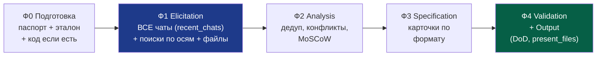

# ⚙️ SOP — Сборка реестра требований (универсальный, под любой проект)

> **Назначение.** Переносимый операционный регламент для Claude: как механически собрать реестр требований к новой версии **любого** проекта — без уточняющих диалогов. Заполняешь плейсхолдеры в промпт-триггере (раздел 9) → Claude проходит алгоритм сам.
>
> **Это инструкция для исполнителя (Claude).** Теория формата — в методичке по SRS. Принцип — рутина, а не обсуждение: решения зашиты, вопросы только при физическом отсутствии данных (раздел 8).
>
> **Как использовать:** один раз заполнить «паспорт проекта» (раздел 1) под свой продукт — дальше запускать промптом, меняя только версию.

---

## 0. Когда применять

Пользователь просит собрать/обновить требования (ТЗ, реестр, спецификацию, «что менять») к новой версии любого проекта. Триггеры: «реестр требований», «ТЗ на версию», «собери требования к v…».

---

## 1. Паспорт проекта (заполнить один раз) + дефолты

Перед первым запуском подставить значения. Дальше Claude берёт их молча.

| Плейсхолдер | Что вписать | Пример |
|-------------|-------------|--------|
| `{PROJECT}` | название проекта | FINPILOT |
| `{SOURCE_OF_TRUTH}` | что считается истиной при конфликтах | «код + спека v2.0.2» |
| `{CHAT_SCOPE}` | где искать обсуждения | «чаты проекта X» / «все чаты» |
| `{TIME_WINDOW}` | окно по времени | «всё время» / «с DD.MM.YYYY» |
| `{NAMING_CONVENTION}` | формат ID багов/артефактов | `BUG-vX.Y.Z-NN-desc.md` |
| `{TECH_STACK}` | стек (для INFRA-осей) | FastAPI/SQLAlchemy/… |
| `{INVARIANTS}` | что нельзя трогать (для KEEP) | ключевые алгоритмы/фичи |
| `{REFERENCE_EXAMPLE}` | эталон-результат, если есть | предыдущий реестр `.md` |

**Зашитые дефолты (не переспрашивать):**

| Параметр | Значение по умолчанию |
|----------|------------------------|
| Глубина | Максимальная: полные карточки + предлагаемая реализация для технических пунктов |
| Формат | `.md` в `/mnt/user-data/outputs/` → `present_files` |
| Язык | язык пользователя для текста, английский для ID/терминов |
| Статус результата | черновой baseline (проход 1) под ревью |
| Приоритизация | MoSCoW |
| Нотация требований | EARS |

> Значение из промпта всегда приоритетнее дефолта.

---

## 2. Артефакты-опоры

1. **`{REFERENCE_EXAMPLE}`** (если есть) — эталон формата/глубины; копировать его структуру.
2. **Методичка по SRS** (если есть в проекте) — правила карточки, EARS, MoSCoW, KEEP/REFACTOR.
3. **Код/исходники проекта** (если приложены) — для проверки «что уже реализовано». Если нет — опора на `{SOURCE_OF_TRUTH}` и предыдущий реестр.

---

## 3. Алгоритм (5 фаз)



### Фаза 0 — Подготовка
- Прочитать паспорт проекта (раздел 1) и `{REFERENCE_EXAMPLE}` если есть.
- Если приложен код — бегло свериться с актуальным состоянием.

### Фаза 1 — ELICITATION (максимальный охват)

Сбор из трёх источников в три шага: перечислить все чаты → прицельные поиски по осям → файлы и код.

**Шаг 1.1 — Перечислить ВСЕ чаты в рамках `{CHAT_SCOPE}` (`recent_chats`, пагинация).**
Пройти всю историю за `{TIME_WINDOW}` окно за окном: `recent_chats` с `n=20`, листать через `before=<ранний updated_at прошлой пачки>`, до исчерпания (ориентир — до ~5 вызовов; если не хватило — отметить неполноту). Получить полный перечень чатов и выцепить из выдержек темы для шага 1.2.

> ⚠️ **Честная граница инструмента.** `recent_chats` / `conversation_search` дают **выдержки**, а не дословный транскрипт каждого чата целиком. Пословная полнота — только по **файлам**. Поэтому: чаты — широкий обход поиском; гарантия слово-в-слово — файлы; страховка от пропусков — проход 2. В финале указать прямо, не выдавать «обошёл» за «прочитал дословно».

**Шаг 1.2 — Прицельные поиски по 9 осям (`conversation_search`).**
Под каждую ось — запрос из **содержательных ключевых слов** проекта (существительные предметной области, имена модулей/фич), не мета-слов («обсуждали», «вчера»). Плюс отдельные запросы по темам чатов из шага 1.1 и ключевые слова из промпта. Универсальные оси:

| Ось | Что искать (адаптировать под проект) |
|-----|--------------------------------------|
| Функциональность/фичи | новые возможности, запросы пользователей, фидбек |
| Качество/NFR | производительность, безопасность, надёжность, юзабилити |
| Ограничения | регуляторные, доменные, технологические рамки |
| Дефекты/баги | известные ошибки, проблемы из тестов/использования |
| Инженерия/инфра | тесты, контейнеризация, CI, миграции, auth, мониторинг (под `{TECH_STACK}`) |
| Данные/БД | схема, миграции, эталонные данные |
| Документация | расхождения, термины, консистентность |
| Инварианты (KEEP) | что является ядром ценности, что нельзя ломать (`{INVARIANTS}`) |
| Рефакторинг | что плохо реализовано, но нужно сохранить по смыслу |
| UI/UX/интерфейс | навигация, состояния экранов, консистентность, доступность, перегруз, формы — открыть скрины/записи юзабилити-сессий |

**Шаг 1.3 — Файлы (`project_knowledge_search`) + приложенный код.**
Файлы дают пословную полноту — опираться как на твёрдый источник.

**Правило полноты:** пройдены шаги 1.1–1.3, все оси, плюс доп. оси по темам найденных чатов. Если контекст уже содержит свежий код/доки — использовать напрямую, поиски дополняют.

### Фаза 2 — ANALYSIS
- Дедуп находок из разных источников.
- Конфликты → приоритет `{SOURCE_OF_TRUTH}`; расхождение с прочей докой → DOC-требование.
- Разнести по 10 категориям (раздел 4).
- Проставить MoSCoW и зависимости.

### Фаза 3 — SPECIFICATION
- Оформить карточки по формату (раздел 5).
- Порядок: FR → UX → NFR → CONSTR → BUG → INFRA → DATA → DOC → KEEP → REFACTOR.
- Собрать: сводку, дорожную карту (Mermaid), трассировочную матрицу, «что дальше (проход 2)».

### Фаза 4 — VALIDATION + OUTPUT
- Прогнать Definition of Done (раздел 7).
- Проверить целостность markdown.
- `.md` → `/mnt/user-data/outputs/` → `present_files`.
- Краткое финальное сообщение, помеченное как проход 1.

---

## 4. Десять категорий (универсальные)

| Код | Категория | Содержание |
|-----|-----------|------------|
| **FR** | Функциональные | Что система делает: новое поведение, фичи |
| **UX** | UI/UX-требования | Информационная архитектура, навигация, состояния экранов, консистентность, доступность, упрощение ввода, обратная связь |
| **NFR** | Нефункциональные | Насколько хорошо: оси ISO/IEC 25010 (performance, security, reliability, interaction capability, maintainability, flexibility, safety, functional suitability) |
| **CONSTR** | Ограничения | Внешние рамки: регуляторные, доменные, технологические |
| **BUG** | Дефекты | Ошибки к исправлению (формат ID — `{NAMING_CONVENTION}`) |
| **INFRA** | Инженерные | Тесты, контейнеризация, CI/CD, миграции, auth, наблюдаемость (под `{TECH_STACK}`) |
| **DATA** | Данные/БД | Схема, миграции, эталонные/демо-данные |
| **DOC** | Документация | Консистентность, термины, расхождения, README |
| **KEEP** | Инварианты | `{INVARIANTS}` — что нельзя убирать/менять по смыслу |
| **REFACTOR** | Переписать-не-убрать | Контракт сохранить, реализацию переписать |

---

## 5. Формат карточки (точный шаблон)

```markdown
### [ID] Заголовок
- **Категория:** FR / NFR / CONSTR / BUG / INFRA / DATA / DOC
- **Описание:** <EARS: When/While/If <триггер>, система ДОЛЖНА <реакция>>
- **Rationale:** <какую проблему решаем>
- **Приоритет:** Must / Should / Could / Won't
- **Критерий приёмки:** <тестируемая проверка>
- **Источник:** <чат / файл / тест>
- **Зависимости:** <ID или —>
- **Статус:** новое / обсуждалось / решено / частично
```

KEEP / REFACTOR:

```markdown
### [KEEP-XX] Что защищаем
- **Почему критично:** <ценность>
- **Риск при удалении:** <что сломается>
- **Допустимо менять:** <что можно>
- **Недопустимо:** <что нельзя>
- **Источник:** <…>

### [REFACTOR-XX] Что переписываем
- **Текущая проблема:** <что не так>
- **Контракт (сохранить):** <что неизменно>
- **Свобода (менять):** <что переписать>
- **Связь:** <какие FR реализует>
- **Источник:** <…>
```

**Нумерация:** `<КАТЕГОРИЯ>-NN`, сквозная по категории, порядок — по приоритету.

---

## 6. Правила оформления

1. **EARS** в «Описании» — наблюдаемое поведение при триггере, не «желание».
2. **MoSCoW** для приоритета; Won't = осознанно отложено.
3. **Критерий приёмки тестируемый** — иначе переформулировать.
4. **Источник обязателен** у каждой карточки.
5. **Версия** по SemVer: ломающее совместимость → MAJOR; фичи → MINOR; багфиксы → PATCH. Решение — за пользователем.
6. **Секции документа:** шапка → сводка (счётчики + MoSCoW) → дорожная карта (Mermaid) → карточки → трассировочная матрица → «проход 2».

---

## 7. Definition of Done

- [ ] Выполнен `recent_chats`-проход по всей истории в рамках `{CHAT_SCOPE}` / `{TIME_WINDOW}` (все чаты перечислены).
- [ ] Пройдены все 10 осей elicitation + доп. оси по темам найденных чатов.
- [ ] Покрыты все 10 категорий (проверены, даже если пусто).
- [ ] Каждая карточка: ID, EARS, rationale, MoSCoW, критерий приёмки, источник, статус.
- [ ] Проставлены зависимости.
- [ ] Есть сводка, дорожная карта, трассировочная матрица, «проход 2».
- [ ] KEEP/REFACTOR заполнены.
- [ ] Расхождения с источником истины вынесены в DOC.
- [ ] Markdown целостен (ограждения код-блоков парные, mermaid закрыты).
- [ ] Файл в outputs, вызван `present_files`.
- [ ] Финальное сообщение краткое, помечено как проход 1.

---

## 8. Чего НЕ делать

1. **Не уходить в диалог** — scope/окно/глубина зашиты в паспорте/дефолтах. Исключение: пользователь сослался на данные, физически отсутствующие в проекте → один уточняющий вопрос.
2. **Не пропускать оси** — поиск прогнать даже при ожидании «пусто».
3. **Не дублировать теорию** — реестр это данные, не учебник.
4. **Не выдумывать источники** — неподтверждённое помечать «новое (предложение Claude)».
5. **Не финализировать самовольно** — всегда проход 1, заморозка за пользователем.
6. **Не лить воду** — глубина = полнота полей, не многословие.

---

## 9. 🎯 ПРОМПТ-ТРИГГЕР (заполни плейсхолдеры)

**Полная версия** — заполнить один раз под проект, дальше менять только версию:

```
Собери реестр требований проекта {PROJECT} для версии <ВЕРСИЯ> по
универсальному регламенту Requirements_SOP. Действуй механически, без
уточняющих вопросов.

Паспорт проекта:
- Источник истины: {SOURCE_OF_TRUTH}
- Scope чатов: {CHAT_SCOPE}
- Окно: {TIME_WINDOW}
- Стек (для INFRA): {TECH_STACK}
- Инварианты (KEEP): {INVARIANTS}
- Конвенция багов: {NAMING_CONVENTION}
- Эталон формата: {REFERENCE_EXAMPLE}

Глубина максимальная. Пройди все 10 осей elicitation, покрой все 10 категорий,
оформи карточками (EARS + MoSCoW + критерий приёмки + источник), добавь сводку,
дорожную карту, трассировочную матрицу и раздел "проход 2". Один .md в outputs.
Черновой baseline под моё ревью.
```

**Короткая версия** (паспорт уже в контексте проекта):

```
Собери реестр требований {PROJECT} v<ВЕРСИЯ> по универсальному SOP.
Механически, без вопросов, глубина максимальная.
```

**С фокусом:**

```
Собери реестр требований {PROJECT} v<ВЕРСИЯ> по SOP, только категории
<СПИСОК>. Механически, без вопросов.
```

---

> **Итог одной строкой:** заполнил паспорт → получил промпт → прогнал 10 осей по чатам/файлам/коду → свёл в карточки по 10 категориям → проверил по DoD → выдал `.md` как проход 1. Переносится на любой проект сменой паспорта.
