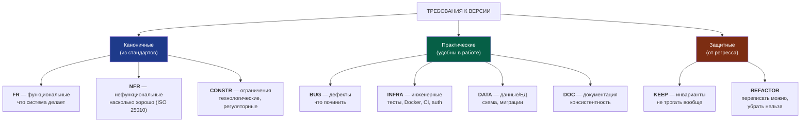
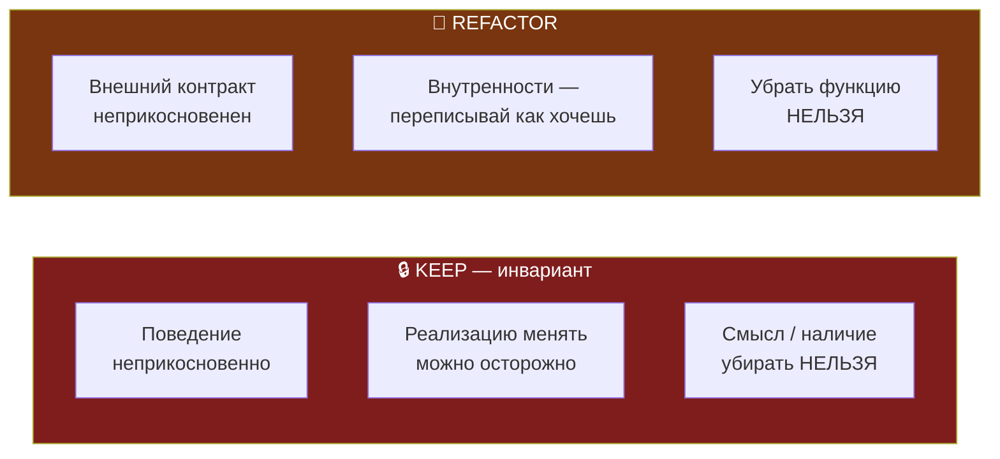
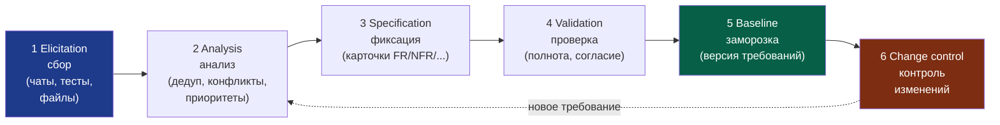
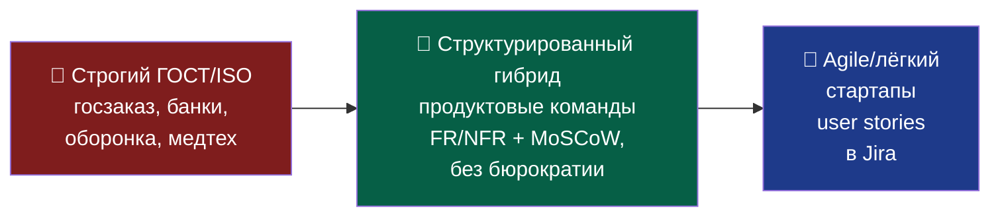

# 📋 SRS — Software Requirements Specification: гайд по артефакту

> **Что это.** Методичка по одному из ключевых артефактов разработки — **спецификации требований (SRS)**. Что это за документ, зачем он, какими стандартами регулируется, из чего состоит, как формулировать и приоритизировать требования.
>
> **Как читать.** Сначала теория артефакта (что/зачем/стандарты), потом практика (анатомия требования, нотации, процесс). Примеры — из FINPILOT, чтобы методология была сразу применимой к переходу `v2.0.2 → v-next`.
>
> **Кому.** Разработчику, который собирает требования к новой версии продукта и хочет делать это по стандарту, а не на коленке.

---

## 1. Что такое SRS и зачем он нужен

**SRS (Software Requirements Specification)** — документ, который фиксирует, **что система должна делать** и **насколько хорошо**, до того как начнётся (или продолжится) разработка. Это контракт между «что мы хотим» и «что мы строим».

**Аналогия.** SRS для софта — как архитектурный проект для дома. Можно строить и без чертежа, «по наитию», но тогда: строители поймут задачу каждый по-своему, заказчик получит не то, что представлял, а переделка несущей стены на этапе крыши стоит в разы дороже, чем правка линии на бумаге. SRS — это чертёж: один источник правды, на который ссылаются все.

**Что он решает (проблемы разработки без него):**

1. **Двусмысленность.** «Сделать объяснения понятнее» каждый поймёт по-своему. SRS заставляет писать проверяемо: «система показывает причину рекомендации текстом без формул».
2. **Забывчивость и потери.** Обсудили фичу в чате месяц назад → потеряли. SRS с трассировкой к источнику не даёт выпасть.
3. **Расползание объёма (scope creep).** Без зафиксированного и приоритизированного списка проект пухнет бесконечно. SRS проводит границу: это делаем сейчас, это — потом.
4. **Регресс.** При доработке случайно ломают то, что работало. SRS фиксирует, что трогать нельзя (см. §9).
5. **Невозможность проверить готовность.** Без критериев приёмки нельзя сказать «сделано». SRS даёт измеримое определение готовности.

> **Ключевая мысль.** SRS — это не бюрократия ради бюрократии. Это инструмент против пяти конкретных способов провалить проект. Объём формальности подбирается под риск (см. §11).

---

## 2. Стандарты, регулирующие SRS

Документ требований — не самодеятельность: его форму и содержание описывают международные и национальные стандарты. Знать их полезно и для качества, и для защиты ВКР (преемственность стандартов).

### Международная линия (ISO / IEEE)

| Стандарт | О чём | Статус |
|----------|-------|--------|
| **ISO/IEC/IEEE 29148:2018** | Главный стандарт инженерии требований. Определяет три вида спецификаций: **SRS** (Software), **SyRS** (System), **StRS** (Stakeholder). Задаёт, что такое «хорошее требование» | Действует (2-я редакция, 2018). Заменил **IEEE 830-1998** |
| **ISO/IEC 25010:2023** | Модель качества продукта — источник **нефункциональных** требований (девять характеристик качества) | Действует (2-я редакция, ноябрь 2023). Заменила версию 2011 |
| **IEEE 830-1998** | Историческая «Recommended Practice for SRS» | Устарел, поглощён 29148. Встречается в старых учебниках |

> ⚠️ **Нюанс по 25010.** Версия 2023 технически переработана: добавлена **Safety** как отдельная характеристика, **Usability** переименована в **Interaction capability**, **Portability** — в **Flexibility**, добавлена **Scalability**. Российский ГОСТ Р ИСО/МЭК 25010-2015 — это адаптация старой редакции 2011. Для защиты в РФ цитировать ГОСТ-2015 нормально; знать про обновление — для точности.

### Российская линия (ГОСТ)

| Стандарт | О чём |
|----------|-------|
| **ГОСТ 34.602-2020** | «Техническое задание на создание автоматизированной системы». Действует с 1 января 2022 (заменил 34.602-89). Требует **9 обязательных разделов** + «Термины и определения». Это канонический формат ТЗ для систем |
| **ГОСТ 19.201-78 (ЕСПД)** | «Техническое задание. Требования к содержанию и оформлению» — для программных средств. На него ссылается 34.602 |

Серия **ГОСТ 34.xxx** — на автоматизированные системы (АС). **ЕСПД (ГОСТ 19.xxx)** — Единая система программной документации. В РФ для госзаказа/банков/оборонки ТЗ по ГОСТ 34.602 — юридическая необходимость.

### Гибкие практики (не ISO, но индустриальный де-факто)

| Практика | Откуда | Для чего |
|----------|--------|----------|
| **MoSCoW** | DSDM (Agile) | Приоритизация требований (§7) |
| **EARS** | Инженеры Rolls-Royce (2009) | Шаблоны формулировок без двусмысленности (§6) |
| **User Stories** | Agile/Scrum | Лёгкая альтернатива формальному SRS в стартапах |

---

## 3. Виды требований (классификация)

Требования делятся на типы. Первые три — каноничные (из стандартов), остальные — практические категории, которые удобно вести в реальном проекте.



### 3.1. FR — функциональные требования

**Что система делает.** Конкретное поведение: фичи, реакции на действия, правила обработки.

> *Пример FINPILOT:* «Когда алгоритм выбрал альтернативу, система показывает причину выбора plain-language текстом без формульной нотации (Rt, Lt)».

### 3.2. NFR — нефункциональные требования

**Насколько хорошо система работает.** Берутся по характеристикам качества **ISO/IEC 25010**. Девять осей (в редакции 2023):

| Характеристика | Про что | Пример NFR для FINPILOT |
|----------------|---------|--------------------------|
| Functional suitability | полнота/корректность функций | расчёт U(a) детерминирован |
| Performance efficiency | скорость, ресурсы | рекомендация за < 200 мс |
| Compatibility | совместимость | экспорт в CSV/PDF/XLSX |
| Interaction capability* | юзабилити, доступность | объяснение понятно non-expert |
| Reliability | надёжность, отказоустойчивость | fail-loud при некорректных данных |
| Security | безопасность | данные привязаны к user_id, JWT |
| Maintainability | сопровождаемость | покрытие тестами core/ |
| Flexibility* | переносимость, масштабируемость | переход SQLite→PostgreSQL без правок логики |
| Safety* | безопасность последствий | предупреждение при нереалистичных вводах |

> *\* в редакции 2023: Interaction capability (бывш. Usability), Flexibility (бывш. Portability), Safety — новая.*

### 3.3. CONSTR — ограничения

**Рамки, в которых нельзя выходить.** Не «что делать», а «чего нельзя» по объективным причинам.

> *Пример FINPILOT:* «ПДН не выше 40% — регуляторный потолок ЦБ РФ (Указание № 4892-У)». Это ограничение, а не фича — оно задано извне.

### 3.4. Практические категории (BUG / INFRA / DATA / DOC)

Не из стандартов, но реальный проект без них неполон:
- **BUG** — дефекты к исправлению (у тебя уже есть BUG-конвенция в гайдлайнах);
- **INFRA** — инженерные задачи (тесты, Docker, Alembic, CI/CD, auth);
- **DATA** — изменения схемы БД, миграции;
- **DOC** — консистентность документации (ресинхронизация профилей, унификация терминологии).

### 3.5. KEEP / REFACTOR — см. §9

Эти две категории — твоё расширение под защиту от регресса. Разбор отдельным разделом ниже, потому что это самое неочевидное и самое ценное.

---

## 4. Структура документа SRS

### Типовой скелет (по ISO/IEC/IEEE 29148)

```
1. Введение
   1.1 Назначение документа
   1.2 Область применения (что входит / не входит)
   1.3 Термины, акронимы, сокращения
   1.4 Ссылки на другие документы
2. Общее описание
   2.1 Контекст продукта
   2.2 Пользователи и их характеристики
   2.3 Допущения и ограничения
3. Требования
   3.1 Внешние интерфейсы (UI, API, интеграции)
   3.2 Функциональные требования (FR)
   3.3 Требования к качеству (NFR по 25010)
   3.4 Ограничения реализации (CONSTR)
4. Верификация (как проверяем каждое требование)
5. Приложения
```

### Сравнение с ГОСТ 34.602-2020

ГОСТ устроен похоже по логике, но разделы свои (всего 9 + термины): назначение и цели создания АС, характеристика объекта автоматизации, требования к системе (к функциям, к видам обеспечения — техническому, программному, информационному), состав и содержание работ, порядок контроля и приёмки, требования к документированию, стадии создания.

> **Вывод:** один и тот же реестр требований можно подать в **двух обёртках** — лёгкой (29148-style для репозитория) и формальной (ГОСТ 34.602 для приложения к диплому). Содержание то же, меняется только структура разделов.

---

## 5. Анатомия одного требования (карточка)

Каждое требование — **атомарное** (одно требование = одна мысль), **трассируемое** (видно откуда взялось) и **проверяемое** (понятно, когда выполнено). Формат карточки:

| Поле | Назначение |
|------|------------|
| **ID** | Уникальный идентификатор: `FR-03`, `NFR-02`, `BUG-01`, `KEEP-01` (категория + номер) |
| **Заголовок** | Краткая суть в одну строку |
| **Описание** | Что меняем — одно конкретное проверяемое поведение (по EARS, §6) |
| **Rationale** | Зачем это нужно — какую проблему решаем |
| **Приоритет** | Must / Should / Could / Won't (MoSCoW, §7) |
| **Критерий приёмки** | Как поймём, что сделано (тестируемая формулировка) |
| **Источник** | Откуда взято: чат+дата / файл / результат юзабилити-теста |
| **Зависимости** | Другие ID, которые должны быть сделаны раньше |
| **Статус** | новое / обсуждалось / решено / в работе / готово |

**Три несущих поля** (без них требование бесполезно):

1. **Критерий приёмки.** «Улучшить объяснимость» — непроверяемо. «Пользователь видит причину рекомендации без формул» — проверяемо.
2. **Источник.** Страховка от потерь: пробежишь реестр и сразу увидишь, если знакомого пункта нет.
3. **Приоритет.** Держит scope от раздувания (особенно категория Won't — «сознательно не в этой версии»).

### Пример карточки (FINPILOT)

```
ID:               FR-03
Заголовок:        Plain-language объяснение рекомендации
Описание:         When алгоритм выбрал альтернативу a*, система ДОЛЖНА
                  показать причину выбора текстом на обычном языке,
                  без формульной нотации (Rt, Lt, «по форм. 8»)
Rationale:        Юзабилити-тест с бухгалтером показал — текущая нотация
                  воспринимается как чёрный ящик; это блокер активации
Приоритет:        Must
Критерий приёмки: Non-expert пользователь в тесте верно объясняет своими
                  словами, почему система дала рекомендацию (≥4 из 5)
Источник:         Юзабилити-тест UT-F-v2.0.2-R01; чат от <дата>
Зависимости:      REFACTOR-01 (переписать NLG-слой)
Статус:           обсуждалось
```

---

## 6. Как формулировать — EARS-нотация

**EARS** (Easy Approach to Requirements Syntax) — пять шаблонов, которые убивают двусмысленность. Вместо «надо сделать понятнее» — строгая конструкция «триггер → реакция».

| Паттерн | Шаблон | Когда |
|---------|--------|-------|
| **Ubiquitous** | The system shall `<реакция>` | всегда, без условий |
| **Event-driven** | When `<событие>`, the system shall `<реакция>` | реакция на событие |
| **State-driven** | While `<состояние>`, the system shall `<реакция>` | пока длится состояние |
| **Unwanted** | If `<условие>`, then the system shall `<реакция>` | обработка нежелательного случая |
| **Optional** | Where `<фича включена>`, the system shall `<реакция>` | для опциональной функции |

### Примеры (FINPILOT)

- **Ubiquitous:** «Система всегда хранит секреты в `.env`, а не в коде».
- **Event-driven:** «When пользователь добавил первый доход, система НЕ создаёт дубликат записи» (это твой BUG как требование).
- **State-driven:** «While доход равен нулю, система блокирует расчёт DTI и показывает валидационное сообщение».
- **Unwanted:** «If введена нереалистичная процентная ставка (> 200%), then система отклоняет ввод со статусом 422».

> **Правило:** плохое требование описывает *желание* («хочу удобнее»). Хорошее — *наблюдаемое поведение* при конкретном триггере. EARS заставляет писать второе.

---

## 7. Приоритизация — MoSCoW

Метод расстановки приоритетов. Лучше, чем P1/P2/P3, потому что в нём есть явная категория «не сейчас».

| Категория | Смысл | Для версии |
|-----------|-------|------------|
| **Must** | без этого релиз не имеет смысла | критический минимум |
| **Should** | важно, но релиз выживет без этого | сильно желательно |
| **Could** | приятно иметь, если останется время | по возможности |
| **Won't** (this time) | сознательно откладываем | **фиксируем, что НЕ делаем сейчас** |

**Почему `Won't` важен.** Это не «отказ навсегда», а «не в этой версии». Категория защищает от scope creep: всё, что хочется, но не влезает, складывается сюда явно — а не висит размытым «может потом». На ревью видно границу релиза.

> *Пример FINPILOT:* explainability-слой = **Must** (блокер). Docker = **Must** (для hireable). Реальные банк-API = **Won't this time** (мок работает, отложено осознанно).

---

## 8. Свойства хорошего требования

Чек-лист — по нему прогоняется каждая карточка (критерии из 29148):

- [ ] **Атомарное** — одна мысль. «Добавить экспорт в PDF и XLSX» — это два требования.
- [ ] **Проверяемое** — есть способ убедиться, что выполнено (тест, замер, демонстрация).
- [ ] **Недвусмысленное** — понимается всеми одинаково (EARS помогает).
- [ ] **Реализуемое** — технически и в срок выполнимо.
- [ ] **Необходимое** — решает реальную проблему (есть rationale).
- [ ] **Трассируемое** — есть ID и источник, можно отследить вперёд (к тесту) и назад (к причине).
- [ ] **Непротиворечивое** — не конфликтует с другими требованиями.

> **Тест на проверяемость:** если не можешь придумать, как написать на это требование тест-кейс или критерий приёмки — формулировка плохая, переписывай.

---

## 9. KEEP и REFACTOR — защита от регресса

Это самая неочевидная и самая ценная часть. Большинство SRS описывают только «что добавить» — и из-за этого при доработке случайно ломают то, что работало. Эти две категории закрывают дыру через **разделение контракта и реализации**.



**KEEP** говорит: «это поведение трогать нельзя».
**REFACTOR** говорит: «внешний контракт нельзя, внутренности — свобода».

### Карточка KEEP (пример FINPILOT)

```
KEEP-01:            Avalanche-фильтр с OCR (r_bench)
Почему критично:    дифференциация продукта — обоснованный отказ от
                    досрочки невыгодного долга. Ядро ценности
Риск при удалении:  теряется главное отличие от трекеров
Допустимо менять:   способ снижения платежа (пропорц. ↔ аннуитет)
Недопустимо:        убирать сам фильтр или менять его смысл
```

### Карточка REFACTOR (пример FINPILOT)

```
REFACTOR-01:        NLG-слой объяснений (recommendation.py)
Текущая проблема:   выдаёт формульную нотацию — чёрный ящик для юзера
Контракт (сохранить): объяснение детерминированное, привязано к цифрам,
                    всегда корректное
Свобода (менять):   весь способ генерации текста — хоть полностью
                    переписать шаблоны на plain-language
```

> **Зачем это в SRS.** Когда начнётся доработка, KEEP и REFACTOR — стоп-краны. Они не дают в порыве «улучшить» снести то, что составляет ценность продукта или просто работает. В классическом SRS этих категорий нет — это расширение под управление изменениями (regression safety).

---

## 10. Процесс создания SRS

SRS не пишется за один присест — это цикл. Канонические этапы инженерии требований:



1. **Elicitation (сбор)** — выгрести требования из всех источников: обсуждения, юзабилити-тесты, баг-репорты, файлы проекта.
2. **Analysis (анализ)** — убрать дубли, выявить конфликты, расставить приоритеты MoSCoW.
3. **Specification (фиксация)** — оформить как атомарные трассируемые карточки.
4. **Validation (проверка)** — убедиться, что полно, непротиворечиво, проверяемо; согласовать.
5. **Baseline (заморозка)** — зафиксировать версию требований (как SemVer для кода).
6. **Change control** — новые требования не вписываются хаотично, а проходят цикл заново.

> **Практика для соло-проекта:** работай в **два прохода**. Сначала широкий черновой реестр (быстро, можно с дублями) → потом ревью: режешь лишнее, дополняешь, приоритизируешь → финальный baseline. Так ничего не выпадет и не раздуется мусором.

---

## 11. Спектр формальности — сколько SRS нужно

Не «всегда по максимуму». Объём формальности подбирается под риск и контекст.



1. **Строгий** — где SRS юридически обязателен (госконтракт по ГОСТ 34.602). Полная формальная структура, подписи, прослеживаемость.
2. **Структурированный гибрид** — большинство нормальных команд. Скелет требований есть, но без бюрократии. **Золотая середина.**
3. **Лёгкий/Agile** — стартапы. Вместо SRS — user stories + acceptance criteria. Принципы те же (атомарность, проверяемость, приоритет), форма минимальна.

> **Для FINPILOT:** двойная игра. Для **ВКР/защиты** — обёртка по ГОСТ 34.602 + ссылки на ISO 25010 (преемственность стандартов, комиссия это ценит). Для **разработки** — структурированный гибрид. Один реестр, две обёртки.

---

## 12. Связь с другими артефактами

SRS не живёт в вакууме — он сцеплен с остальным жизненным циклом. В твоём проекте эти связки уже частично есть (SemVer, Conventional Commits в гайдлайнах):

| Артефакт | Связь с SRS |
|----------|-------------|
| **SemVer** (версии) | baseline требований привязан к целевой версии (`v-next`). Must-требования, ломающие совместимость → MAJOR; новые фичи → MINOR; багфиксы → PATCH |
| **Conventional Commits** | каждый коммит ссылается на ID требования: `feat(core): FR-03 plain-language explanations` |
| **Тесты (pytest)** | критерий приёмки требования → тест-кейс. Трассировка: требование ↔ тест |
| **Баг-репорты** | каждый BUG из реестра = карточка требования категории BUG |
| **Git-теги** | релиз версии = закрытие набора Must-требований из baseline |

> **Трассируемость в обе стороны** — признак зрелого процесса: от требования вперёд к тесту и коммиту, и назад к источнику (чат/тест/файл). По цепочке `источник → требование → тест → коммит → тег` видно жизнь каждого изменения.

---

## 13. Готовый шаблон требования

Копируй и заполняй:

```markdown
### [ID] Заголовок

- **Категория:** FR / NFR / CONSTR / BUG / INFRA / DATA / DOC / KEEP / REFACTOR
- **Описание:** When/While/If <триггер>, система должна <реакция>
- **Rationale:** <какую проблему решаем>
- **Приоритет:** Must / Should / Could / Won't
- **Критерий приёмки:** <как проверим, что сделано>
- **Источник:** <чат+дата / файл / тест>
- **Зависимости:** <другие ID>
- **Статус:** новое / обсуждалось / решено / в работе / готово
```

Для **KEEP** / **REFACTOR** — отдельная форма:

```markdown
### [KEEP-XX] Что защищаем
- **Почему критично:** <ценность для продукта>
- **Риск при удалении:** <что сломается/потеряется>
- **Допустимо менять:** <что можно трогать>
- **Недопустимо:** <что нельзя>

### [REFACTOR-XX] Что переписываем
- **Текущая проблема:** <что не так сейчас>
- **Контракт (сохранить):** <что должно остаться неизменным>
- **Свобода (менять):** <что можно переписать полностью>
```

---

## 📚 Источники

| Стандарт / практика | Роль |
|---------------------|------|
| **ISO/IEC/IEEE 29148:2018** | Базовый стандарт инженерии требований (SRS/SyRS/StRS); заменил IEEE 830-1998 |
| **ISO/IEC 25010:2023** | Модель качества продукта — оси нефункциональных требований |
| **ГОСТ 34.602-2020** | ТЗ на создание автоматизированной системы (РФ); действует с 01.01.2022 |
| **ГОСТ 19.201-78 (ЕСПД)** | ТЗ на программные средства (РФ) |
| **IEEE 830-1998** | Историческая практика SRS (устарела, поглощена 29148) |
| **MoSCoW** (DSDM) | Метод приоритизации |
| **EARS** (Mavin et al., 2009) | Нотация формулировки требований |

---

> **Итого одной строкой:** SRS — это контракт «что строим и насколько хорошо», состоящий из атомарных проверяемых требований (FR/NFR/CONSTR + практические BUG/INFRA/DATA/DOC + защитные KEEP/REFACTOR), сформулированных по EARS, приоритизированных по MoSCoW, прослеживаемых от источника до теста. Объём формальности — под риск проекта.
