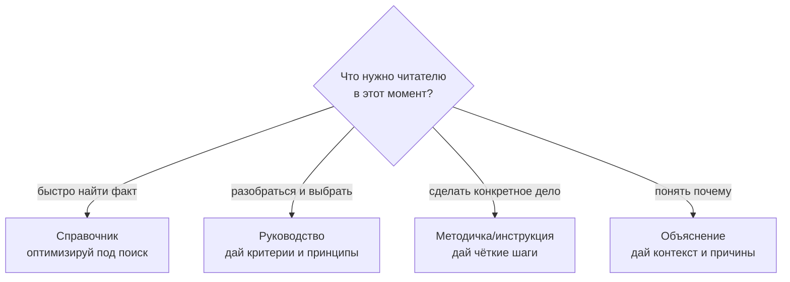
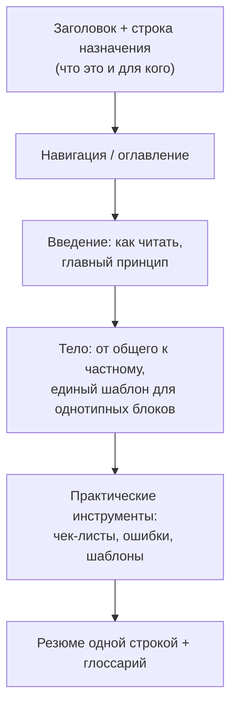

# Как писать методички, руководства и справочники

> Руководство о том, как создавать понятные, фундаментальные и практичные документы — справочники, руководства и методички. Покрывает выбор жанра, подготовку, принципы содержания, структуру, стиль, визуальные инструменты, проверку качества и готовые шаблоны-скелеты. Этот документ написан по тем же правилам, которые описывает, — это и есть лучшая проверка методички.

---

## 0. Как читать это руководство

Хороший документ **экономит время читателя и снижает число ошибок**. Плохой — создаёт иллюзию понимания: его прочитали, кивнули, но применить не смогли.

Главный принцип, на котором держится всё остальное:

> **Документ существует ради читателя и его задачи, а не ради автора и его знаний.**

Всё дальнейшее — следствие этого принципа. Каждый раздел, абзац и таблица должны отвечать на вопрос читателя «**что мне с этим делать?**». Если раздел на него не отвечает — он лишний.

---

## 1. Главное решение: выбери жанр

Самая частая ошибка плохих документов — **смешать в одном тексте разные жанры**: пошаговую инструкцию с теорией, справочник с обучением. Это путает читателя, потому что у разных жанров **разная задача и разный режим чтения**.

Есть четыре базовых жанра. Они различаются по тому, **что нужно читателю в момент обращения к документу**:

| Жанр | Задача читателя | Как читают | Структура | Пример |
|---|---|---|---|---|
| **Справочник** (reference) | быстро найти факт | не подряд, точечный поиск | таблицы, списки, алфавит, индекс | глоссарий, таблица параметров, API-доки |
| **Руководство** (guide) | научиться ориентироваться и принимать решения | и подряд, и выборочно | от общего к частному, критерии, схемы выбора | «как выбрать X», бенчмарки, разбор подходов |
| **Методичка / инструкция** (how-to / SOP) | достичь конкретного результата | подряд, по шагам | нумерованные шаги, чёткий старт и финиш | «как настроить Y», регламент, пошаговый процесс |
| **Объяснение** (explanation) | понять, как и почему что-то устроено | подряд, вдумчиво | концептуально, с контекстом и причинами | «почему модель работает так», теория |



**Правило:** один документ — один ведущий жанр. Можно включать элементы других (в руководство добавить справочную таблицу, в методичку — короткое объяснение «почему»), но **ведущая задача должна быть одна**. Если чувствуешь, что документ тянет в две стороны, — это два документа.

---

## 2. Подготовка: до того как писать

Хороший документ на 50% делается **до** первой строки. Ответь на четыре вопроса:

1. **Кто читатель?** Уровень (новичок / средний / эксперт), контекст, что он уже знает, на каком языке думает. Документ для новичка и для профи — разные документы.
2. **Какую ОДНУ задачу решает документ?** Сформулируй в одном предложении. Если задач несколько и они разные — это несколько документов.
3. **Что НЕ входит?** Явные границы (scope). Это так же важно, как то, что входит, — границы спасают от расползания и от ложных ожиданий читателя.
4. **Что у читателя на выходе?** Что он сможет сделать/узнать/найти после. Это критерий, по которому потом проверяешь готовый текст.

**Запиши эти четыре ответа** — они станут твоим компасом и фактически готовой строкой назначения вверху документа.

---

## 3. Принципы содержания: фундаментальность + практичность

Это ядро руководства. Что делает **содержание** хорошим, а не просто структуру.

### 3.1. Практичность — каждый кусок применим

Не знание ради знания, а знание ради действия. Тест каждого раздела: «**что читатель с этим сделает?**». Если ответа нет — раздел декоративный, режь или переписывай.

### 3.2. Фундаментальность — давай принцип, а не только рецепт

Рецепт работает в одной ситуации; принцип позволяет читателю **адаптироваться к новой**. Объясняй логику и причину, а не только «делай так». Хорошая формула:

> Дай человеку **правило**, по которому он сам примет решение в ситуации, которую ты не предусмотрел.

«Нажми кнопку Б» — рецепт. «Кнопка Б сбрасывает кэш, поэтому жми её, когда видишь устаревшие данные» — принцип: теперь читатель знает, **когда** жать в любой новой ситуации.

### 3.3. Цифры без порогов бессмысленны

«5 миллионов — это много или мало?» Зависит от контекста. Любой количественный ориентир давай **с порогами и критериями оценки**: что считается хорошо, что плохо, от чего зависит. Голая цифра без шкалы не помогает принять решение.

### 3.4. Для любого метода — плюсы, минусы и «когда брать»

Не только «что это», но и «**где проигрывает**» и «**когда применять**». Честный размен. Документ, который продаёт один подход как универсальный, врёт читателю — у всего есть цена и границы применимости.

### 3.5. Примеры и контрпримеры

Конкретика заземляет абстракцию. После каждого принципа — короткий пример. Контрпример (как НЕ надо) часто учит сильнее, чем пример.

### 3.6. Честность про ограничения

«Это ориентиры, а не законы»; «работает при таких-то условиях»; «здесь возможны исключения». Честные границы повышают доверие к документу больше, чем фальшивая универсальность.

---

## 4. Структура и архитектура документа

| Элемент | Зачем | Где |
|---|---|---|
| **Заголовок + строка назначения** | читатель за 5 секунд понимает, что это и для кого | самый верх |
| **Оглавление/навигация** | прыжок в нужный раздел (для длинных документов) | после строки назначения |
| **Прогрессия общее → частное** | читатель сначала видит карту, потом детали | весь документ |
| **Единый шаблон повторяющихся блоков** | консистентность = скорость чтения | разделы-каталоги |
| **Самодостаточные разделы** | можно прыгнуть в нужный, не читая всё | весь документ |
| **Резюме «одной строкой»** | суть, которую унесут, даже если забудут детали | конец |

**Самый мощный приём — единый шаблон.** Если документ описывает несколько однотипных вещей (методы, инструменты, модели), задай **один шаблон** и применяй к каждой: например «суть / механика / плюсы / минусы / когда брать / метрики». Тогда читатель, разобравшись с первой, мгновенно ориентируется во всех — он знает, где что искать. Непоследовательная структура заставляет перечитывать.



---

## 5. Стиль изложения: как писать текст

- **Ясность важнее красоты.** Цель — чтобы поняли с первого раза, а не чтобы восхитились слогом.
- **Простыми словами о сложном.** Если можешь сказать проще без потери смысла — скажи проще.
- **Активный залог, короткие предложения.** «Система валидирует ввод» лучше, чем «Ввод подвергается процедуре валидации со стороны системы».
- **Один абзац — одна мысль.** Длинный абзац с пятью идеями читатель не удержит.
- **Жаргон — только нужный, и с расшифровкой.** Термин экономит слова, но незнакомый термин без объяснения = стена. Веди глоссарий.
- **Пиши термины полно, не сокращай без нужды.** Сокращения и сленг экономят твоё время, но стоят читателю понимания. «Досрочное погашение», а не «досрочка», если документ для широкой аудитории.
- **Объясняй «почему», а не только «что» и «как».** Сильная обучающая последовательность: **аналогия → концепция → реализация**. Сначала на что это похоже, потом что это, потом как делать.
- **Аналогии для сложного.** Привязка нового к знакомому — самый быстрый способ объяснить.

---

## 6. Визуальные инструменты и форматирование

Форматирование служит **навигации и пониманию**, а не украшению. Каждый визуальный элемент должен экономить читателю усилие.

| Инструмент | Когда использовать | Когда НЕ использовать |
|---|---|---|
| **Таблица** | сравнение по нескольким осям, параметры, «X vs Y» | связное рассуждение (это проза) |
| **Нумерованный список** | последовательность шагов, приоритеты | несвязанные пункты без порядка |
| **Маркированный список** | перечисление равнозначных пунктов | то, что естественно читается прозой |
| **Блок-схема (flowchart)** | процесс, дерево решений «если X → Y» | статичные данные (это таблица) |
| **Матрица/диаграмма сравнения** | позиционирование вариантов по осям | один-два объекта (хватит таблицы) |
| **Выделение (жирный)** | якоря для взгляда, ключевые термины | везде — тогда не выделяет ничего |
| **Чек-лист** | операциональная проверка перед действием | концептуальное объяснение |
| **Цитата/выноска** | главный принцип, который нельзя пропустить | обычный текст |

**Правило умеренности:** если выделено всё — не выделено ничего. Жирным — только то, за что должен зацепиться взгляд при беглом просмотре. Списками — только то, что list по природе. Остальное — нормальная проза.

---

## 7. Что превращает теоретический док в рабочий

Разница между «прочитал и забыл» и «открыл и сделал» — в **операциональных инструментах**. Хорошая практичная методичка содержит хотя бы часть из:

- **Чек-листы** — последовательность проверяемых действий.
- **Пороги и критерии решений** — «если показатель ниже X → делай Y». Decision rules, а не размышления.
- **Деревья решений** — блок-схема, проводящая читателя от его ситуации к рекомендации.
- **Шаблоны и заготовки** — то, что можно скопировать и заполнить, а не делать с нуля.
- **Раздел «типичные ошибки/ловушки»** — чужие грабли дешевле своих.
- **Метрики результата** — как читатель поймёт, что у него получилось.

Эти элементы — то, что отличает руководство, по которому **работают**, от статьи, которую **читают**.

---

## 8. Проверка качества

Готовый документ прогони по тестам, специфичным для его жанра:

- **Справочник:** найдёт ли читатель нужный факт **за 30 секунд**? Понятна ли навигация без чтения подряд?
- **Руководство:** сможет ли читатель применить принцип в **новой ситуации**, которой нет в тексте?
- **Методичка:** сможет ли читатель, следуя шагам, **получить результат** без обращения за помощью?
- **Объяснение:** сможет ли читатель **пересказать своими словами**, как и почему это работает?

**Самый честный тест — отдай реальному читателю** из целевой аудитории и смотри, где он спотыкается. Места, где он застрял или переспросил, — это дефекты документа, а не читателя.

---

## 9. Типичные ошибки авторов

| Ошибка | В чём она | Как не попасть |
|---|---|---|
| **Смешение жанров** | инструкция + теория + справочник в одном | один ведущий жанр на документ |
| **Знание ради знания** | пишешь, что знаешь, а не что нужно читателю | тест «что он с этим сделает?» |
| **Стена текста** | нет структуры, всё сплошняком | заголовки, списки, таблицы, прогрессия |
| **Жаргон без расшифровки** | термины, понятные только тебе | глоссарий + полные формулировки |
| **Только «что», без «почему» и «когда»** | рецепты без принципов | объясняй логику и границы применения |
| **Цифры без порогов** | голые числа без шкалы оценки | давай критерии «хорошо/плохо/зависит» |
| **Нет границ scope** | документ расползается, ожидания обмануты | явно укажи, что НЕ входит |
| **Украшательство** | форматирование ради красоты | форматирование ради навигации |
| **Пишешь для себя** | удобно автору, не читателю | держи в голове конкретного читателя |
| **Документ устаревает молча** | факты протухли, версии нет | версионируй и датируй (см. §10) |

---

## 10. Рабочий процесс создания (по шагам)

1. **Определи читателя** и его задачу (§2).
2. **Выбери жанр** — справочник / руководство / методичка / объяснение (§1).
3. **Очерти scope** — что входит и что НЕ входит.
4. **Собери скелет** — только заголовки, без текста. Проверь логику прогрессии.
5. **Задай единый шаблон** для повторяющихся блоков, если они есть.
6. **Наполни содержанием** — принцип + практика + пример для каждого раздела (§3).
7. **Добавь операциональные инструменты** — навигацию, визуалы, чек-листы, «ошибки» (§6, §7).
8. **Напиши резюме одной строкой** — суть, которую унесут.
9. **Проверь** по чек-листу (§12) и, если можно, на реальном читателе (§8).
10. **Версионируй и поддерживай** — дата, номер версии, обновление при изменении фактов. Документ без поддержки тихо устаревает и начинает врать.

---

## 11. Готовые шаблоны-скелеты

Каркасы, которые можно копировать и заполнять. Замени плейсверы своим содержанием.

### 11.1. Скелет справочника

```
# [Название]: справочник по [теме]
> Одна строка: что это, для кого, как пользоваться.

## 0. Как пользоваться (навигация)
## 1. [Категория А]   — таблица фактов/параметров
## 2. [Категория Б]   — таблица фактов/параметров
## 3. Сводная таблица  — всё в одном месте для быстрого поиска
## 4. Глоссарий
```

### 11.2. Скелет руководства

```
# [Название]: руководство по [теме]
> Одна строка: что это, для кого, какой результат у читателя.

## 0. Как читать / главный принцип
## 1. Базовые понятия и оси (карта темы)
## 2. Каталог [методов/вариантов] — ЕДИНЫЙ ШАБЛОН на каждый:
       суть · механика · плюсы · минусы · когда брать · метрики
## 3. Сравнительная матрица [вариантов]
## 4. Как выбрать (критерии + дерево решений)
## 5. Типичные ошибки
## 6. Чек-лист
## 7. Глоссарий
## Резюме одной строкой
```

### 11.3. Скелет методички/инструкции

```
# [Название]: как [достичь результата]
> Одна строка: что получит читатель и при каких условиях.

## 0. Что нужно на старте (предусловия, что НЕ входит)
## 1. Шаг 1 — [действие] (что делаем, почему, как проверить)
## 2. Шаг 2 — [действие]
## 3. Шаг 3 — [действие]
## 4. Как понять, что получилось (результат, метрики)
## 5. Частые проблемы и их решения (troubleshooting)
## 6. Чек-лист перед финишем
```

---

## 12. Чек-лист перед публикацией

1. Строка назначения вверху: понятно **что это и для кого**?
2. Жанр **один** ведущий, не смешан?
3. **Scope** очерчен — указано, что НЕ входит?
4. Каждый раздел отвечает «**что читатель с этим сделает**»?
5. Даны **принципы**, а не только рецепты?
6. Количественные ориентиры — **с порогами**?
7. Для методов есть **плюсы, минусы и «когда брать»**?
8. Есть **примеры** под абстракции?
9. Однотипные блоки — по **единому шаблону**?
10. **Навигация** позволяет прыгнуть в нужный раздел?
11. Жаргон расшифрован, **глоссарий** есть?
12. Форматирование служит навигации, не украшению?
13. Есть **операциональные инструменты** (чек-лист / дерево решений / шаблон)?
14. Есть **резюме одной строкой**?
15. Проставлены **дата/версия**, продуман порядок поддержки?

---

## 13. Глоссарий

| Термин | Расшифровка |
|---|---|
| **Справочник** (reference) | документ для быстрого поиска фактов, не для чтения подряд |
| **Руководство** (guide) | документ, обучающий ориентироваться и принимать решения в области |
| **Методичка / инструкция** (how-to, SOP) | пошаговый документ для достижения конкретного результата |
| **Объяснение** (explanation) | концептуальный документ о том, как и почему что-то устроено |
| **Scope** | границы документа: что входит и что не входит |
| **Строка назначения** | краткое описание вверху: что это, для кого, какой результат |
| **Единый шаблон** | одинаковая структура для всех однотипных блоков документа |
| **Decision rule** | правило вида «если X → делай Y» для принятия решения |
| **Дерево решений** | блок-схема, ведущая от ситуации читателя к рекомендации |
| **Резюме одной строкой** | сжатая суть документа, которую читатель унесёт, забыв детали |
| **Прогрессия** | порядок подачи от общего к частному, от простого к сложному |
| **TOFU/MOFU/BOFU** *(если применимо)* | верх/середина/низ воронки — для контентных документов |

---

> **Одной строкой:** хорошая методичка пишется ради задачи читателя, а не ради знаний автора; первое и главное решение — выбрать один жанр (справочник для поиска, руководство для выбора, инструкция для действия, объяснение для понимания); дальше — давать принципы а не только рецепты, цифры с порогами, плюсы и минусы у каждого метода, единый шаблон для однотипных блоков и операциональные инструменты (чек-листы, деревья решений, шаблоны), а форматирование подчинять навигации, а не украшению.
